---
tags:
# Delete to leave only relevant tags
    - Advanced
    - Teaching
    - Ultra
    - Panopto
    - Xerte
    - Padlet
---

# Embedding Content WORK IN PROGRESS

!!! Summary

    Ultra allows video to be embedded from YouTube. Content from external sources such as Panopto/Replay, Padlet and Xerte can be added to your site using HTML. 

## Quick Start Guide

### Video Steps

Below is an embedded video detailing how to DO THE THING. Alternatively, you can [open the video in a new browser tab](VIDEO URL).

<!-- PASTE YOUTUBE EMBED (should look like this:) -->
<iframe width="560" height="315" src="VIDEO EMBED URL" title="YouTube video VIDEO TITLE" frameborder="0" allow="accelerometer; autoplay; clipboard-write; encrypted-media; gyroscope; picture-in-picture" allowfullscreen></iframe>

### Text Steps

<!-- Clear and concise: Click **Submit**, not Click on the **Submit button** -->
<!-- Use **bold** to highight key tasks and features -->

#### Padlet

To embed a Padlet on your Ultra site:

1. Open the Padlet in your web browser, then click the **Share** icon in the right hand menu.
2. Click **Embed in your blog or your website**.
3. Click **Copy**.
4. Navigate to the Document in your Ultra site where you want to embed the Padlet, then click the plus icon. 
5. Click **Add HTML**.
6. Press Ctrl + V to paste the embed code into the HTML editor.
7. Click **Save**.

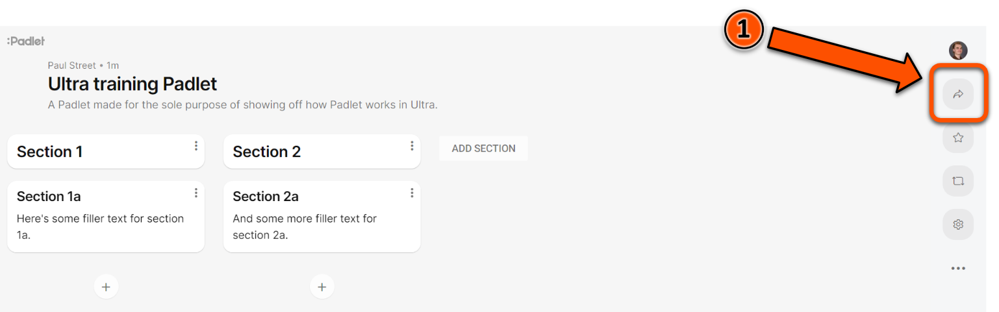
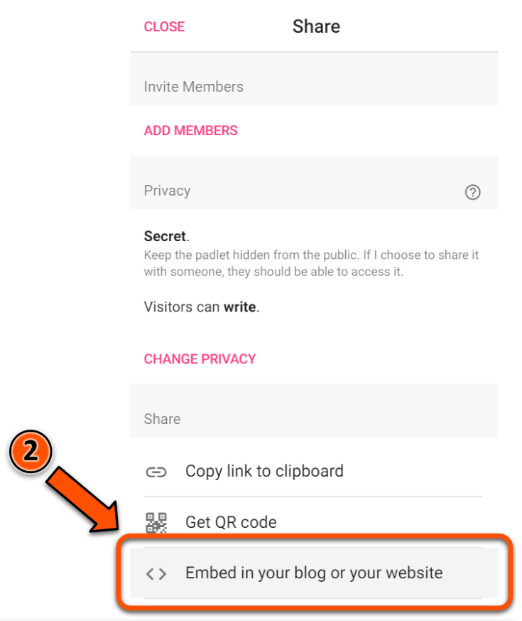
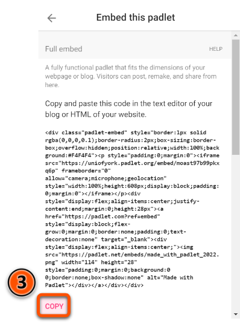
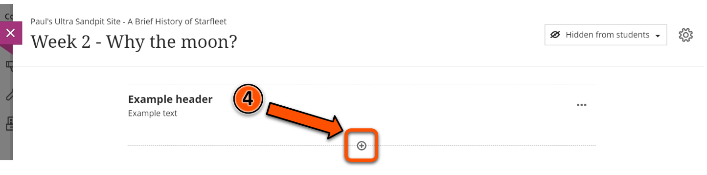

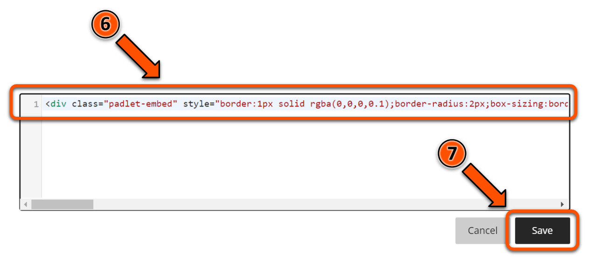

#### Xerte

To embed a Xerte object on your Ultra site:

1. Copy the embed code for your Xerte object from the **Project Details** section of the Xerte homepage.
2. Navigate to the Document in your Ultra site where you want to embed the Xerte object, then click the plus icon.
3. Click **Add HTML**.
4. Press Ctrl + V to paste the embed code into the HTML editor.
5. Click **Save**.

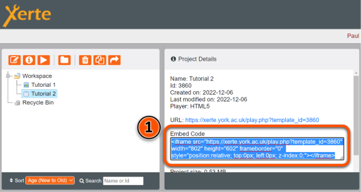

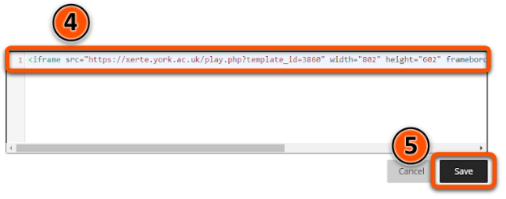

#### Panopto/Replay

To embed a Panopto/Replay video on your Ultra site:

1. Open the desired Panopto video in your web browser, then click the **Share** icon in the menu at the top of the screen.
2. Click **Embed**.
3. Click **Copy Embed Code**.
4. Navigate to the Document in your Ultra site where you want to embed the Panopto video, then click the plus icon.
5. Click **Add HTML**.
6. Press Ctrl + V to paste the embed code into the HTML editor.
7. Click **Save**.

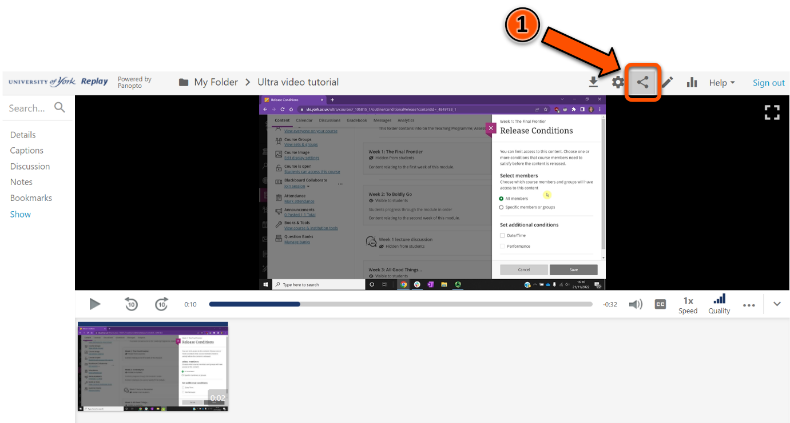

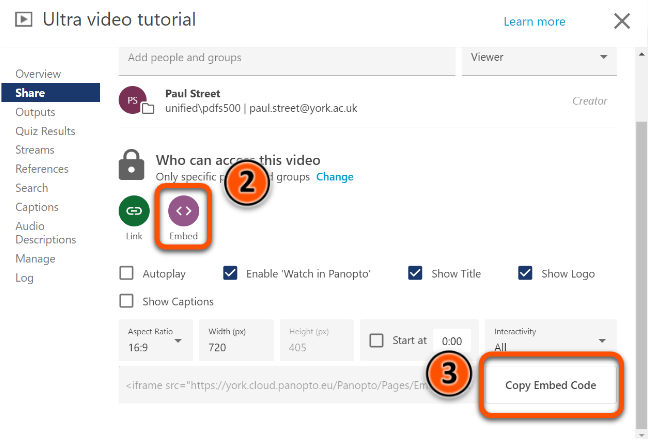

#### YouTube video

To add a YouTube video to your Ultra site:

1. Open a Document in your Ultra site, then click **Add Content**.
2. Click the plus icon (**Insert Content**) button in the text editor.
3. Click **YouTube video**.
4. Type your search terms into the box labelled **Search for a video**, then click **Search**.
5. Click **Select** next to the video you would like to embed.
6. Add **Alternative Text** that describes the video.
7. Click **Insert**.

!!! Tip

    If you already know the URL for the YouTube video you want to embed, you can paste this URL into the search box at step 4 below.

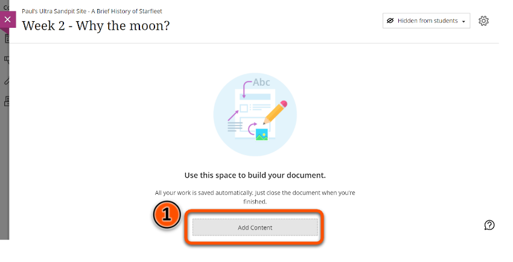
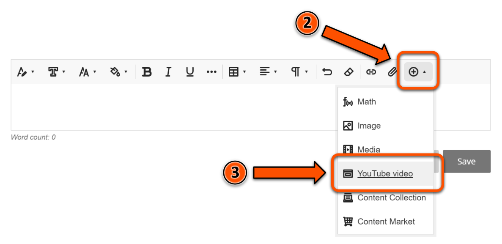
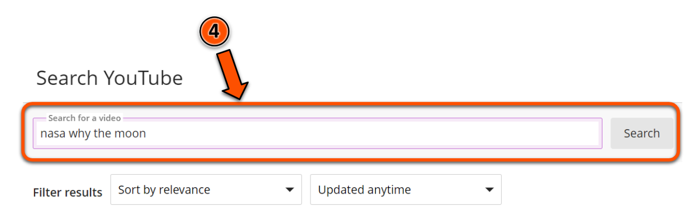
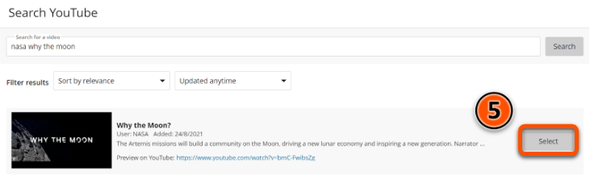
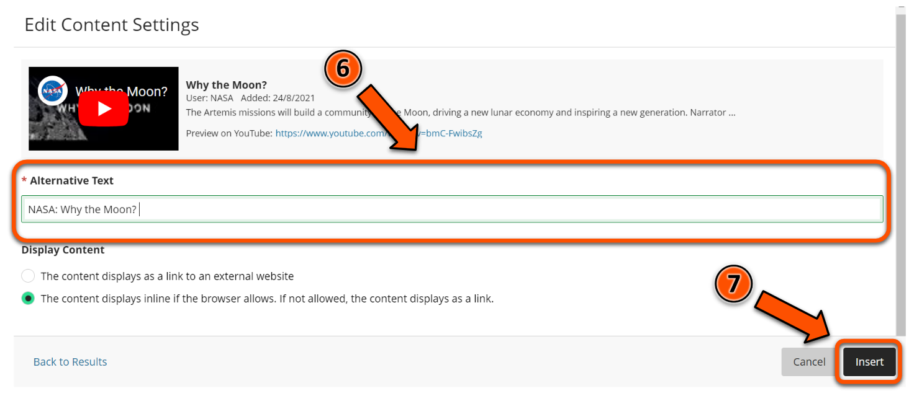