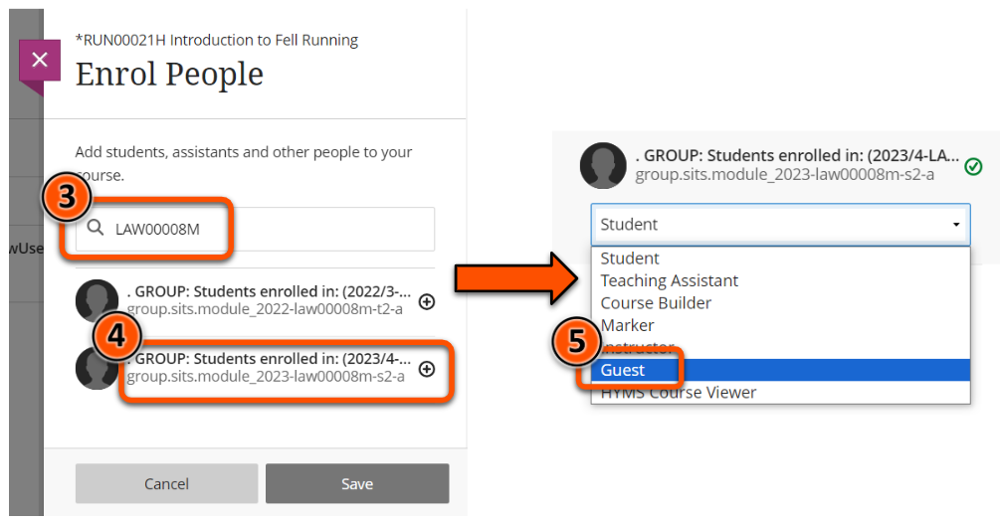
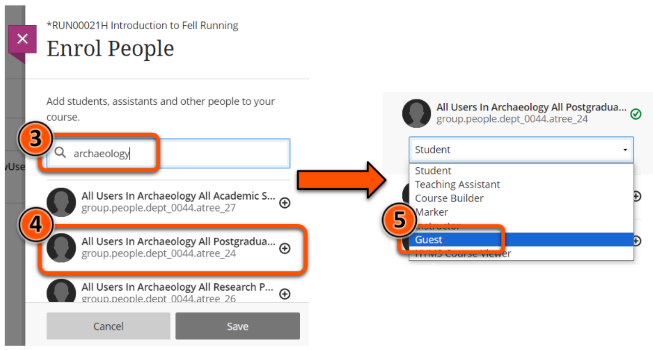
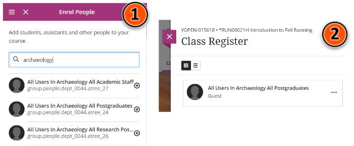

---
tags:
   - Key guide - admin
   - Ultra 
---

# Enrol a cohort/group

!!! Summary
 
    Cohorts can be automatically enrolled on a Learn Ultra site based on SITS module enrolment or a larger student or staff cohort grouping (eg. All Yr 1 UGs in Dept X). 

## Background

### Group Users
On Learn Ultra sites, student enrolments and larger staff group enrolments are automatically managed through “group users” based on SITS module enrolments (SITS group users) or larger cohort groupings (People Group Users).

Numerous group users can be enrolled on the same VLE site (eg. for sites shared by multiple modules), and one group user can be used on multiple sites.

!!! Tip

    All users enrolled through a group user are given the **Student role** in the site.

### Data synchronisation
**Enrolments vis user groups are not immediate**. Every morning (around 9am), a datafeed synchronises Learn Ultra site enrolments with SITS module enrolments and staff records:

* Students enrolled on modules in SITS or users matching a People Group User are automatically added to or maintain access to associated Learn Ultra sites.
* Students unenrolled on a module in SITS (eg. gone on Leave of Absence) or users removed from a People Group in the last 24 hours will have their access removed.

This synchronisation is automatic, but the group users themselves must be manually enrolled on the relevant sites by an Instructor or a DET team member.

Remember: [a site must be open to students](site-availability.md) for them to be able to access it once enrolled.

## Enrol students via module code ("SITS Group User")

To enrol a SITS group user inside the relevant Learn Ultra site:

1. Under **Details & Actions** on the left, select **Class register/View everyone on your course**. 

2. Click the **plus icon** in the top right. 

3. Type the module code to enrol (eg. LAW00008M, IPC00014M). 
4. Carefully select the correct group - check for year, level, semester and occurrance as needed (shown in the group username: module_2023-law00008m-s2-a). Click the **plus icon** next to the correct group.
5. **Important**: Use the dropdown to change role from Student to **Guest**.
6. Click **Save**.

Students enrolled on the module in SITS will be added to the site at the data synchronisation at around 9am the next morning.

## Enrol users via larger grouping ("People Group User")

There are various people group users available for each department, including:

=== "Student group users"

    - all staff and students
    - all students
    - all postgraduates
    - taught postgraduates
    - research postgradates
    - all undergraduates
    - undergraduates by year (eg. Year 1)

    **Note**: There are no group users by programme or route.

=== "Staff group users"

    - all staff and students
    - all staff
    - academic staff
    - teaching staff
    - support staff
    - research staff

    **Note**: Staff enrolled via a people group user will be given the Student role.

To enrol a people group user inside the relevant Learn Ultra site:

1. Under **Details & Actions** on the left, select **Class register/View everyone on your course**. 

2. Click the **plus icon** in the top right. 

3. Type a cohort keyword like *postgraduate* or *archaeology* to see all the groups available.
4. Carefully select the correct group (Group names are truncated - see tips below) and click the **plus icon** next to the correct group.
5. **Important**: Use the dropdown to change role from Student to **Guest**.
6. Click **Save**.

### Tips for finding the correct group
Group names are truncated by the Learn system which can make it hard to identify the one you need. To help find the correct group, you can:

1. **Use a narrow browser window**: this may show all/more of the group name.
2. **Check in the Class Register**: select the group(s) that you think is correct, save and check the group name(s) in the Class Register. If it isn't the correct group, click three dots icon > Member information > dustbin icon to [unenrol the group](unenrol-user.md) and try again.
3. **Search in an Original site**: On any Original site (2022/23 or earlier) that you have Instructor access to, click> Users and Groups > Users > Enrol User > Find Users to Enrol > Browse. 
  In the pop-up, choose Last Name, Contains, and type the cohort keyword. Copy the username for the correct group (something like ‘group.people.dept_00##.atree_##’) and then paste this in at step 3 above.

