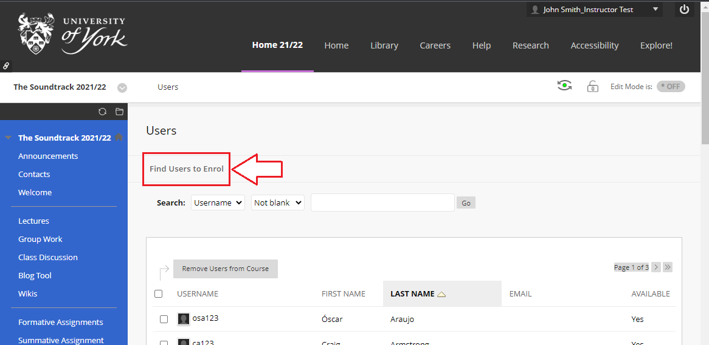
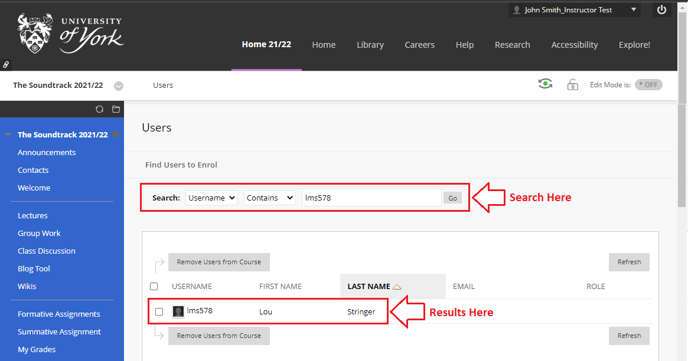

---
tags:
  - Ultra 
  - Advanced
  - Administration
---

# Enrolling a user on your Learn Ultra course or organisation UPDATE FOR ULTRA

!!! Summary

    You can manually grant a user (staff or student) access to your Learn Ultra course or organisation by enrolling them on it. 
    
    You can control how the user can see, interact with, or modify on your course by choosing which course role to give them.
    

## Quick Start Guide

### Video Steps

Below is an embedded video demonstrating how to enrol a user on your Learn Ultra course or organisation. Alternatively, you can [open the video in a new browser tab](https://youtu.be/uswRGaGMGEo).

<iframe width="560" height="315" src="https://www.youtube.com/embed/uswRGaGMGEo" title="YouTube video player" frameborder="0" allow="accelerometer; autoplay; clipboard-write; encrypted-media; gyroscope; picture-in-picture" allowfullscreen></iframe>

### Text Steps

1. **Enter** your Learn Ultra **course or organisation** as normal.
2. Locate the **Control Panel** area of the left hand menu (it’s below your course content).
3. Within the Control Panel, click on **Users and Groups**, then **Users**.
4. The Users page is now on screen. Please note: The search box and filter options towards the top of the page are for sorting/filtering users that are already enrolled on your course/organisation. They cannot be be used to enrol new users

4. Click **“Find Users to Enrol” button** toward the top left of the screen.

    

5. Enter the user's **username **(eg. abc123 - [findable via the York Directory](https://directory.york.ac.uk/)) in the **Username field**, ignoring and not using the “Browse” button.

6. To enrol more than one user, enter all the usernames in the Username field separated by commas (eg. abc123, def456, ghi789)

7. **Change the Role drop down** to the desired role:
    1. “Instructor” (courses) or “Leader” (organisations) will grant the same access as yourself
    1. “Student” (courses) or “Participant” (organisations) will grant the same access as your students, and so cannot see content hidden from students, nor the course’s Control Panel
    1. Other course roles are available - see separate article

8. **Press **the **Submit button** in the bottom right of the screen to save your changes.

The user will be able to see and access your course **straight away** from [their Learn Ultra homepage](https://vle.york.ac.uk/).

## More Details and Troubleshooting 

Error “**User is already enrolled: _username_**” appearing on screen indicates one of two things:

1. The user is already enrolled on your course / organisation and able to access it. 

    To check if this is the case search for them on your course’s Users Page using the drop downs and filter at the top of the page.

    

2. Alternatively, the user may have been enrolled on the course in the past but then been removed; this blocks them from being re-enrolled, please contact us at [vle-support@york.ac.uk](mailto:vle-support@york.ac.uk) and we can re-enrol them for you.