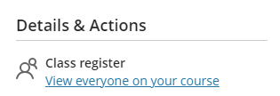
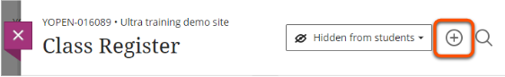
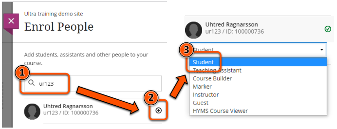

---
 tags:
   - Ultra 
   - Advanced
   - Administration
---

# Enrol a user

!!! Summary
 
    Instructors can manually enrol a user (staff or student) on a Learn Ultra course or organisation.

## Quick Start Guide

<!-- ### Video Steps

Below is an embedded video demonstrating how to enrol a user on your Learn Ultra course or organisation. Alternatively, you can [open the video in a new browser tab](https://youtu.be/uswRGaGMGEo).

<iframe width="560" height="315" src="https://www.youtube.com/embed/uswRGaGMGEo" title="YouTube video player" frameborder="0" allow="accelerometer; autoplay; clipboard-write; encrypted-media; gyroscope; picture-in-picture" allowfullscreen></iframe> -->

### Text Steps

1. Under the **Details & Actions** menu, select **Class register/View everyone on your course**. 

2. Click the **plus icon** in the top right. 

3. **Search** for the user to enrol, using their username (abc123), email, first name or last name. 
4. Click the **small plus icon** next to their name.
5. The default **role** is Student. If you'd like to give the user a different role, select it from the drop-down list. 

5. Click **Save**.

The user will be able to see and access your course straight away from [their Learn Ultra homepage](https://vle.york.ac.uk/).

!!! Tip
    Students are enrolled on sites automatically through the SITS module code, so you are unlikley to need to enrol students manually.

## More Details and Troubleshooting 

Error "**No results found. Check the spelling and try again.**" can mean a few things:

1. There's an error in the search term; check and try again.
2. The user is already enrolled on your site and able to access it. Check by searching for them in the class register.
3. The user may have been enrolled on the course in the past but then been removed; this blocks them from being re-enrolled, please contact us at [vle-support@york.ac.uk](mailto:vle-support@york.ac.uk) and we can re-enrol them for you.