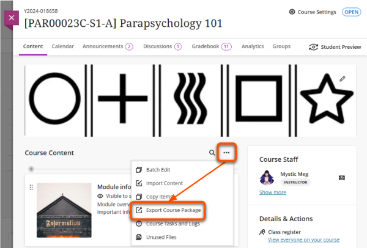
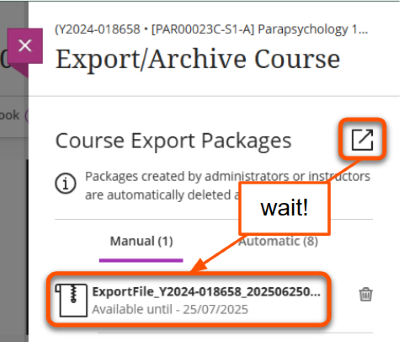
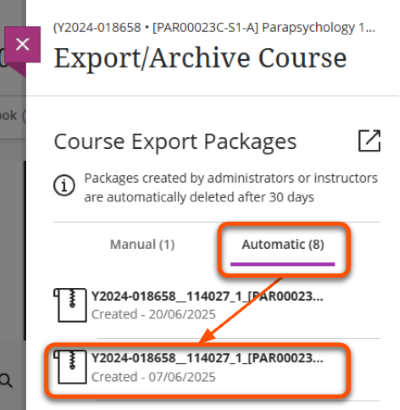
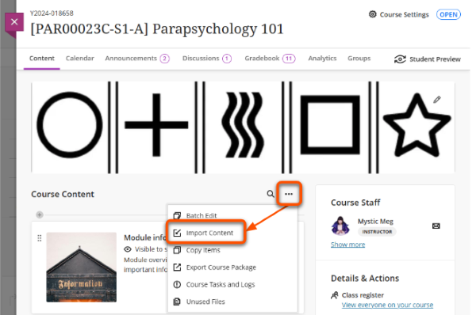
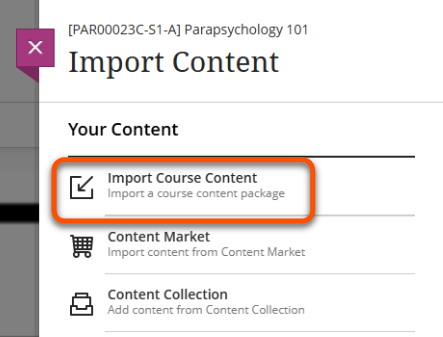

# Export course package (site backup)

!!! Summary

    The Export Course Package tool generates a downloadable .zip file backup of the site.

!!! Tip

    The export .zip file is a specific format that can only be used to restore a complete VLE site. To copy specific content between sites, use the [Copy Content tool](../ultra/copy-content.md) instead.

## Manual backup

You can manually generate a backup, for example if a site is scheduled to be deleted during the annual site purge process.

1. Click the **three dots icon** in the top right of the Course Content area and select **Export Course Package**.
 
2. On the *Export/Archive Course* panel, click the **box and arrow export icon** to manually create a downloadable export package.
3. On the pop up *Include Student Activity Data in Your Export?* panel, in most cases you should select **No** to backup the site content only.
4. Once processing is complete, the backup file will appear under the *Manual* tab. How long this takes depends on the amount and complexity of course content.
5. Click the **ExportFile** name to download the .zip file. Manually generated backup files are available to download for for 30 days.
 

## Automatic backups

The system periodically creates automatic backups, which may be useful if you need to revert to a previous version of your site. 

1. Click the **three dots icon** in the top right of the Course Content area and select **Export Course Package**.
2. Click the **Automatic** tab and select the backup file from an appropriate date to download the .zip file.
 

## Import a backup

Once you have exported a course package .zip file, you can import it into the same or another site. Note that the Ultra system is updated each month, so older backup files may not be completely compatible with the current functionality.

1. Open the site to add the content to. Click the **three dots icon** in the top right of the Course Content area and select **Import Content**.
 
2. On the *Import Content* menu, select **Import Course Content**.
 
3. In your computer's file browser, select the course package to upload and click **Open**.
4. Wait for the upload to complete and then the content to import. How long this takes depends on the amount and complexity of course content. Once completed, click the **OK** button.