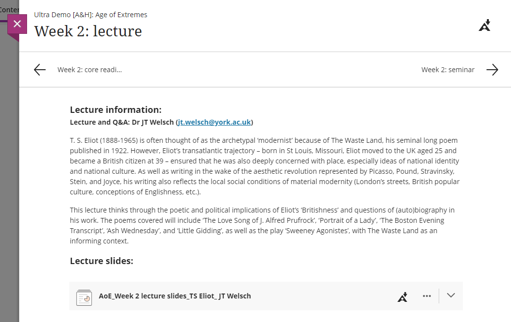
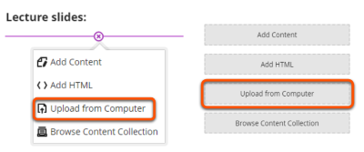
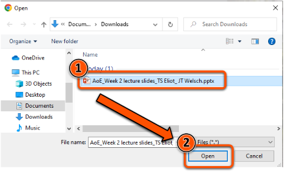
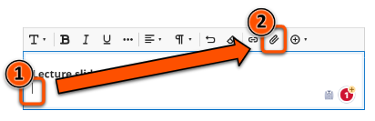

---
tags:
    - Foundation
    - Teaching
    - Ultra
---

# Adding files

!!! Summary

    Files can be uploaded into Documents or directly to the Course Content area.
    
    Most common file types can be viewed within the site without needing to be downloaded.

!!! principle "Relevant [VLE site design principles](https://vle-support.york.ac.uk/ultra/site-design-principles)"

    - 3.1 Essential: Organise module materials in sections that support student progress through the module.
    - 3.4 Essential: Site and materials content is accessible.
    - 3.6 Essential: Links and materials titles describe the destination or content.
    - 5.1 Recommended: Ensure that students can see and access module materials and content.

## Uploading Files into a Document

This method is recommended for presenting module materials (eg. lecture slides) and other files in context.

### Video steps

<iframe width="560" height="315" src="https://www.youtube.com/embed/nUcweeCfcvU" title="YouTube video player" frameborder="0" allow="accelerometer; autoplay; clipboard-write; encrypted-media; gyroscope; picture-in-picture; web-share" allowfullscreen></iframe>

Video: [Adding files in Ultra](https://youtu.be/nUcweeCfcvU).

### Text steps: Upload from computer

1. If your Document already has content, first click the **plus icon** in the location to add the file.
2. Select **Upload from Computer**. 

3. Select the item to upload and click **Open**. 

4. Input a descriptive file display name (eg. "Week 4 Seminar Materials"), set the file options as **View and Download**, then click **Save**. 

5. Click the **chevron icon** to the right of the file name to preview the file in the Document (if "view" was selected in file options). 

### Text steps: Attach using the text editor

1. In the text editor, put your cursor in the location to add the file and click the **paperclip/Attachment icon**. 

2. Select the item to upload and click **Open**. 

3. Input a descriptive file display name (eg. "Week 4 Seminar Materials"), set the file options as **View and Download**, then click **Save**. 

4. Click **Save** under the text editor.
5. Click the **chevron icon** to the right of the file name to view the file in the Document (if "view" was selected in file options). 

## Uploading Files into the Course Content area

This method is recommended for standalone or reference materials that don't require context, as it's not possible to add explanatory text with the file.

1. Click the **plus icon** in the location to add the file and select **Upload**.
2. Select the item to upload and click **Open**. 

3. Input a descriptive file display name (eg. "Week 4 Seminar Materials"), set the file options as **View and Download**, then click **Save**. 

4. Make the file visible to students.
5. Click the file to view in a separate pane in the site (if "view" was selected in file options).

!!! Warning
    Files uploaded to Learn VLE sites (eg. PDF or Word documents) are technically accessible to all site users, even if it is hidden from students in the Course Content area.
    
    When **uploading assessment-related files** (eg. assessment briefs or test materials), view and apply [our guidance on Strict File Access Control for Sensitive Files](https://docs.google.com/document/d/1j6g1k2W0Ont1kA8DfSq7VuLYwgIhbDI7vzwd0-tQAaM/edit).