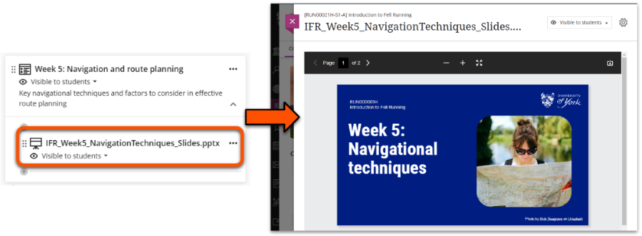
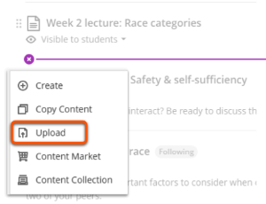
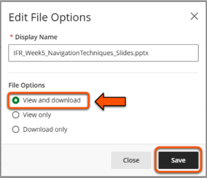
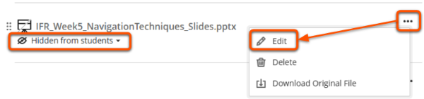
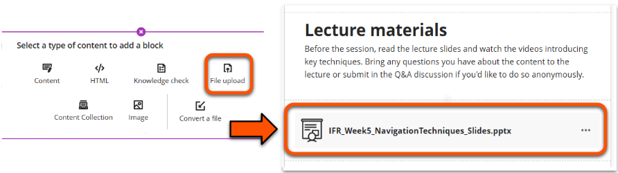

---
tags:
    - Key guide - teaching
    - Ultra
---

# Upload files

!!! Summary

    Files can be uploaded as standalone content items or within Documents. Most common file types can be previewed directly within the site.

!!! principle "Relevant [VLE site design principles](../ultra/site-design-principles.md)"

    - 3.1 Essential: Organise module materials in sections that support student progress through the module.
    - 3.4 Essential: Site and materials content is accessible.
    - 3.6 Essential: Links and materials titles describe the destination or content.

!!! Warning

    **Do not upload reading items** such as journal papers or books etc., as this likely violates accessibility and copyright legislation. Instead, provide all readings via your module [Reading List](../other-tools/reading-list.md).

There are two methods to upload files to your site. Choose the most appropriate method for how you intend the file to be used, and make sure that it is organised in your site structure.

## Standalone content item

Files can be uploaded directly into the Course Content area as a standalone item. This method is especially useful for reference materials that don't require context.

To upload a file as a standalone content item:

1. Click the **plus icon** in the location to add the file and select **Upload**.
 
2. Select the item to upload and click **Open**.
3. In the *File Options panel*, enter a **Display name** (title) that meaningfully describes the contents without having to open the file. Ensure *File Options* is set to **View and download**, then click **Save**.
 
4. To add a **Description** to display under the file title, click the **three dots icon** and select **Edit**. Enter your description and click **Save**.
5. Make the file [visible to students](../ultra/content-visibility.md).
 
6. Users can now click the item to preview the file within the VLE site.

## Upload within a Document

You can also upload a file within a Document to include contextual text and/or integrate it with other materials. Use the [Document File Upload Block](../ultra/documents.md#block-file-upload) to do this. 