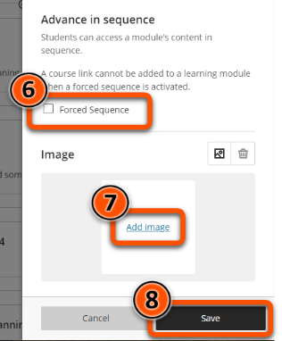

---
tags:
    - Key guide - teaching
    - Ultra
---

# Learning Modules & Folders 

!!! Summary

    Learning Modules and Folders are containers for organising course content.

!!! principle "Relevant [VLE site design principles](../ultra/site-design-principles.md)"

    - 3.1 Essential: Organise module materials in sections that support student progress through the module.
    - 3.4 Essential: Site and materials content is accessible.

## Overview: content container types

Learning Modules and Folders are the containers available to ortganise your content. They function largely the same for staff, but students navigate the content items within the two container types differently. This means that there are some situations where either a Learning Module or a Folder may be more suitable.

=== "Learning Module"

    **Learning Modules** make it easy for students to move between items, so are most appropriate for providing module materials.
    
    

    - Used throughout the Ultra template structure
    - Can contain sub-folders (nested folders function like Learning Modules)
    - Default Learning Module icon, can [change to a personalised image](#learning-module-images)
    - Students can access items in any order, or you can use **Forced sequence** to make them work through items in order
    - Students can navigate between items without closing them (but staff can’t)
    
    

=== "Folder"

    **Folders** are best used for reference items where students are likely to need only a specific item.
    
    
    
    - Generally not included in the Ultra template structure, but you can add Folders to your site if needed
    - Can contain sub-folders (nested folders function like Folders)
    - Default Folder icon, can't be personalised
    - Students can always access items in any order
    - Students must close an item before selecting another

    

This video also gives an overview of how to differentiate Folders vs Learning Modules: 

<iframe width="560" height="315" src="https://www.youtube.com/embed/aFUico3YEBc" title="YouTube video Folders vs Learning Modules" frameborder="0" allow="accelerometer; autoplay; clipboard-write; encrypted-media; gyroscope; picture-in-picture" allowfullscreen></iframe>
[Folders vs Learning Modules [YouTube]](https://www.youtube.com/watch?v=aFUico3YEBc)

## Create a Learning Module or Folder

Where the same applies for both Learning Modules and Folders, we'll use "container" for simplicity.

Containers can be created within the Course Content area (your template will have pre-built containers for your content). Folders can also be created inside another container for supporting multi-level structures. A Folder within a Folder navigates like a Folder, but a Folder within a Learning Module navigates like a Learning Module. Learning Modules cannot be directly created inside another container.

1. Hover where the container should appear. Click the **plus icon** then **Create**.
  
2. Under **Course Content Items**, select **Learning Module** or **Document**.
  
3. Enter a descriptive title for the container (eg. *Week 3: equipment & safety*).
4. Set the [item visibility](../ultra/content-visibility.md) (you an also set this later).
5. Add a brief **description** that will display in the Course Content area.
  
6. [Learning Modules only] If you want students to access content items in order, click **Forced Sequence**.
7. [Learning Modules only] You can add a custom image to display on the Course Content page. See the Learning Module images(#learning-module-images) section below for details.
8. Click **Save**.
 

Watch a demonstration of the basics of creating a Learning Module:
<iframe width="560" height="315" src="https://www.youtube.com/embed/Uzpx_sCkVwc" title="YouTube video Create Learning Modules in the Ultra Course View" frameborder="0" allow="accelerometer; autoplay; clipboard-write; encrypted-media; gyroscope; picture-in-picture" allowfullscreen></iframe>
[Blackboard's guide to Create Learning Modules in Ultra Course View [YouTube]](https://www.youtube.com/watch?v=Uzpx_sCkVwc)

## Learning Module images

Learning Modules can display a small image on the Course Content page. This can be used to reflect the topic of weekly content.

The image will appear on the left of the module on the Course Content area, helping to make the site more visually appealing and aid navigation. You can't change the size or shape of the image shown.

!!! Note

    Some departmental templates include pre-populated Learning Module images. Refer to your departmental guidance on whether these should be changed.

### Add or update an image

1. Create a new Learning Module or click the three dots icon to edit an existing Learning Module. 
2. In the Image section, click the **image icon** or **Add Image** and upload an image. JPEG and PNG formats are supported.   

3. Preview the image: click **Next** to continue, or click the **bin icon** to delete and upload another.   

4. Select the area of the image to appear on the Learning Module. You can adjust the zoom of the image using the slider. Click **Save** to continue.   

5. Click **Save**. 

You can also watch a demonstration of adding a Learning Module image:
<iframe width="560" height="315" src="https://www.youtube.com/embed/3Wmyfp5i_Tw" title="How To Add Learning Module Icon Images To VLE Ultra" frameborder="0" allow="accelerometer; autoplay; clipboard-write; encrypted-media; gyroscope; picture-in-picture; web-share" allowfullscreen></iframe>
[How To Add Learning Module Icon Images To VLE Ultra [YouTube]](https://youtu.be/3Wmyfp5i_Tw)

### Accessibility

The learning module image is automatically marked as decorative, which hides the banner for students using assistive technologies. If the content of the image is important, uncheck **Mark the image as decorative** and enter a description of the image in the **Alternative text** field. 

### Sourcing images

!!! Warning

    You must not use copyrighted material for site images.

Images should be high quality: use the [University’s photo library](https://brand.york.ac.uk/account/dashboard/) or [Unsplash.com](https://unsplash.com/) to source copyright-free images.

Download images at a resolution that meets the minimum requirements for Ultra. The **Web Image gallery** size on the University's photo library meets these requirements.

### Creating icons

[Guides on image manipulation to create an icon](https://subjectguides.york.ac.uk/media/images)

[Images for number or letter icons](https://docs.google.com/presentation/d/19ey3zq2l-GP7PAQocRhXfbK1Ua3Fy8mV/edit?usp=sharing&ouid=101199476229048788013&rtpof=true&sd=true)