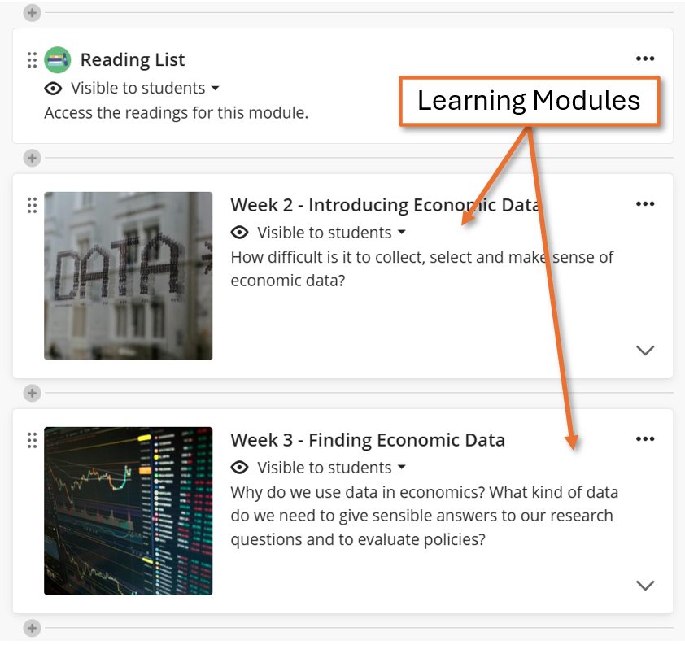
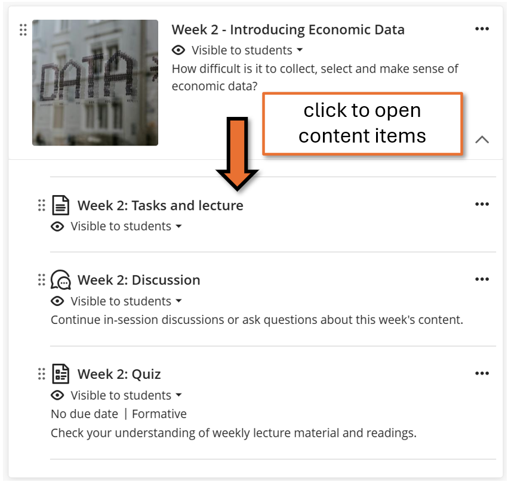
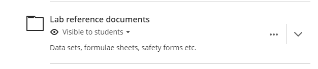
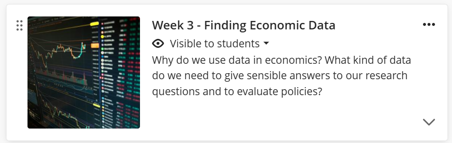
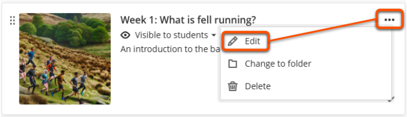
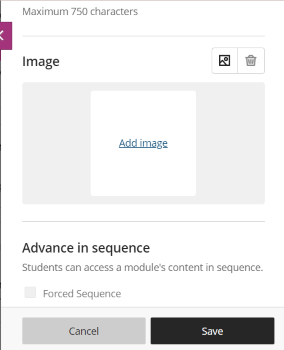
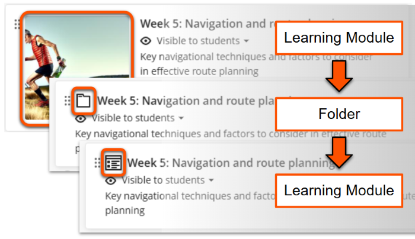
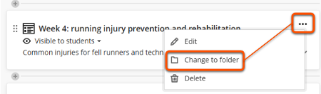
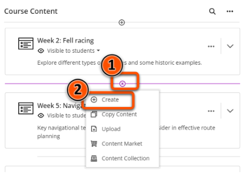
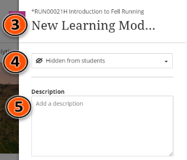

---
tags:
    - Key guide - teaching
    - Ultra
---

# Learning Modules & Folders: content containers 

!!! Summary

    Learning Modules and Folders are containers for organising course content.

!!! principle "Relevant [VLE site design principles](../ultra/site-design-principles.md)"

    - 3.1 Essential: Organise module materials in sections that support student progress through the module.
    - 3.4 Essential: Site and materials content is accessible.

## Overview

!!! Tip
    
    Learning Modules and Folders are very similar; where the same guidance applies to both, *container* is used here for simplicity.

Learning Modules and Folders are containers for other site content, helping to organise your site and make it easier for users to find what they need. Module site templates contain pre-built Learning Modules for key site content.

In the Course Content area, click the container to show its content items then click a specific item to open it.

To add content to a container, drag in an existing item or hover where you want to add it, click the plus icon then select the relevant item type.

<figure markdown>

<figcaption>Learning Modules in Course Content area</figcaption>
</figure>
<figure markdown>

<figcaption>Weekly materials within a Learning Module</figcaption>
</figure>

## Folder features

**Folders** are best used for reference and standalone items. 

- *Template*: generally not included in Ultra templates, but you can add Folders to your site if needed.
- *Nesting*: can contain sub-folders, but avoid unnecessary nesting. Nested folders function like Folders.
- *Icon*: not personalisable; always has the default Folder icon.
- *Navigation*: click an item within the Folder to open it. To move between items, close the current item, go back to the folder and select the next item.

## Learning Module features

**Learning Modules** allow easy navigation between items, so should be used in most instances.

- *Template*: used throughout Ultra templates, and you can add more to your site if needed.
- *Nesting*: can contain sub-folders, but avoid unnecessary nesting. There is no option to add sub-learning modules, but nested folders function like Learning Modules.
- *Icon*: personalisable; use the default Learning Module icon or [add a custom image](#learning-module-images)
- *Navigation*: click an item within the Learning Module to open it. To move between items, use the table of contents or the previous/next buttons. Can apply **Forced sequence** to make students access items in order. See below for more details of [Learning Module navigation](#navigation--table-of-contents).

### Navigation & Table of Contents

inc. forced sequence

### Learning Module images

!!! Tip

    Some departmental templates include pre-populated Learning Module images and icons. Refer to your departmental guidance on whether these should be changed.

Learning Modules can display a small image on the Course Content page to make the site more visually appealing and aid navigation. You can't manually change the size or shape of the image shown, but they resize based on the display size..

To add or change an image:

1. Create a new Learning Module or click the **three dots icon** then **Edit** for an existing Learning Module.
 
2. In the settings panel, scroll down to the *Image section*. Click the **image icon** or **Add Image**.
 
3. Upload, source from Unsplash or use AI to generate an image. The method is described in the [guide to the Documents images block](../ultra/documents.md#block-image)

A demonstration of adding a Learning Module image:
<iframe width="560" height="315" src="https://www.youtube.com/embed/3Wmyfp5i_Tw" title="How To Add Learning Module Icon Images To VLE Ultra" frameborder="0" allow="accelerometer; autoplay; clipboard-write; encrypted-media; gyroscope; picture-in-picture; web-share" allowfullscreen></iframe>
[How To Add Learning Module Icon Images To VLE Ultra [YouTube]](https://youtu.be/3Wmyfp5i_Tw)

You can also create icons to upload:

- [Guides on image manipulation to create an icon](https://subjectguides.york.ac.uk/media/images)
- [Create icons: template for number or letter icons](https://docs.google.com/presentation/d/19ey3zq2l-GP7PAQocRhXfbK1Ua3Fy8mV/edit?usp=sharing&ouid=101199476229048788013&rtpof=true&sd=true)

### Generate Learning Modules & images with AI

!!! ai "Using AI tools effectively"

    AI-generated content is a **starting point** for your own content development rather than a finished product. You must always **carefully check** that output is accurate and appropriate for your intended use and adapt as needed.

    See our [general guide to Artificial Intelligence tools](../other-tools/ai.md) for more details on using AI responsibly.

    
The [AI Design Assistant Tool](../ultra/ai-da.md) can auto-generate Learning Modules with descriptions and images based on your site content.

1. In a relevant location in the Course Content Area, click the **plus icon**, then **Auto-Generate Modules**. In an empty site, just click Auto-Generate Modules.
2. Define the Learning Modules:
    - Provide module information in the **Description** box (eg. description copy/pasted from Module Catalogue) and/or Select course items (eg. a Module Overview page).
    - Choose a **Complexity level** and adapt other settings to your needs.
3. Click **Generate**
4. Review the generated content and select which Learning Modules to keep (you can edit them later).
5. Click **Add to Course**.
6. Check content for appropriacy and edit or adapt as needed.

??? Abstract "Learning Modules: interface and examples of generated content"

    **Description:** Topics to include: history, fell racing, training, navigation

    **Select course items**: none selected

    **Title prefix:** Week

    **Include images**: Yes

    **Complexity:** level 7/10

    **Number of Learning Modules**: 4 (maximum 20)

    **Content generated:**

    - *Week 1: Introduction to Fell Running History*. Discover the rich history of fell running, from its origins in the Lake District to the establishment of iconic fell races. Explore key moments and figures that have shaped the sport over the years.
    - *Week 2: Exploring Fell Racing Events*. Dive into the thrilling world of fell racing, where athletes tackle rugged terrain and towering peaks. Learn about the different race formats, challenges faced, and the spirit of competition in fell running.
    - *Week 3: Fell Running Training Fundamentals*. Master the essential training techniques for fell running, including strength, endurance, and hill skills. Understand how to develop a training plan tailored to the demands of fell running courses.
    - *Week 4: Navigating in Fell Running*. Develop crucial navigation skills for fell running adventures. Learn to read maps, use compasses, and navigate challenging terrains with confidence. Enhance your ability to stay on course in any fell running event.

    Each Learning Module also has a generated decorative image relevant to the content.

## Manage containers

### Edit existing containers

1. Click the **three dots icon** then **Edit** for an existing Learning Module.
 
2. Update the Title, Description (information that shows on the Course Content page) and other settings as needed.
3. Click **Save**.

### Convert container type

Folders and Learning Modules can be converted to the other container type after creation. This does not affect the content inside the container.

If a Learning Module is converted to a Folder, it will lose any image associated with it. This is not retained if it's later converted back to a Learning Module.

To convert container type:

1. On the relevant container, click the **three dots icon** then **Change to folder** or **Create learning module**, depending on the container type.
 
2. Read the warning and click **Continue** if you are happy to proceed.

### Create containers

!!! Tip

    Module site templates have pre-built containers for your site materials, so you're unlikely to need to create containers yourself. 

Containers can be created within the Course Content area. 

- Folders can also be created inside another container for supporting multi-level structures. A Folder within a Folder navigates like a Folder.
- Learning Modules cannot be directly created inside another container, but a Folder within a Learning Module navigates like a Learning Module. 

To create a Folder or Learning Module:

1. Hover where the container should appear. Click the **plus icon** then **Create**.
  
2. Under **Course Content Items**, select **Learning Module** or **Folder**.
  
3. On the container *Settings panel*:
    - Enter a descriptive title for the container (eg. *Week 3: equipment & safety*).
    - Set the [item visibility](../ultra/content-visibility.md) (you an also set this later).
    - Add a brief **description** to display under the container title in the Course Content area.
  
4. For Learning Modules only:
    - If you want students to access content items in order, click **Forced Sequence**.
    - Add a [Learning Module image](#learning-module-images) if desired.
5. Click **Save**.