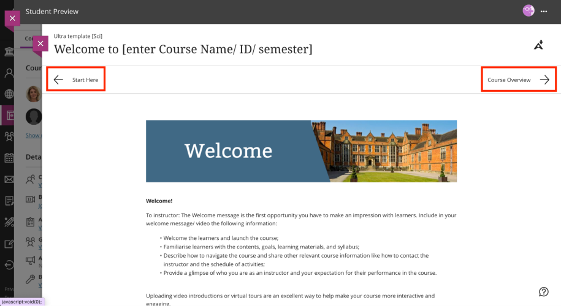
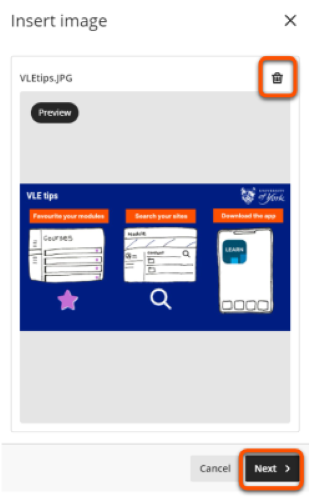
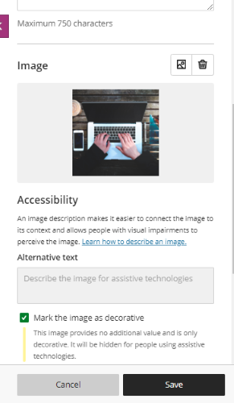

---
tags:
# Delete to leave only relevant tags
    - Key guide - tutors
    - Ultra
---

# Folders & Learning Modules 

!!! Summary

    Folders and Learning Modules are containers types for organising course content.

!!! principle "Relevant [VLE site design principles](../ultra/site-design-principles.md)"

    - 3.1 Essential: Organise module materials in sections that support student progress through the module.
    - 3.4 Essential: Site and materials content is accessible.

## Overview of the container types

Folders and Learning Modules are containers types for organising course content. They function largely the same for staff, but the student experience differs:

=== "Learning Module"

    **Learning Modules** make it easy for students to move between items, so are most appropriate for providing module materials.

    - Used in template structure
    - Design: grey bar, can add personalised icon/image
    - Item access: any order or forced sequence
    - Can contain sub-folders (nested folders function like Learning Modules)
    - Students can navigate between items without closing them (but staff can’t):   
    
    

=== "Folder"

    **Folders** are best used for reference items where students are likely to need only a specific item.
    
    - Design: white bar, fixed folder icon
    - Item access: any order
    - Can contain sub-folders
    - Students must close an item before selecting another:

    

This video also gives an overview of how to differentiate Folders vs Learning Modules: 

<iframe width="560" height="315" src="https://www.youtube.com/embed/aFUico3YEBc" title="YouTube video Folders vs Learning Modules" frameborder="0" allow="accelerometer; autoplay; clipboard-write; encrypted-media; gyroscope; picture-in-picture" allowfullscreen></iframe>
[Folders vs Learning Modules [YouTube]](https://www.youtube.com/watch?v=aFUico3YEBc)

## Create a Folder or Learning Module

1. In the Content page, hover your mouse where you want to add a learning module/folder and click the **plus icon** > **Create**.

    

    

2. In the Create Item panel, choose **Learning module** or **Folder**.

    
3. **Enter the name** of your Learning Module/Folder by selecting it or using the pen icon.

    
4. By default, the learning module/folder is hidden from students. You can change the visibility of the learning module/folder to “**Visible to students”**, “**Hidden from students**”, or set “**Release conditions**”.

    
5. Optionally, you can **add a description to the learning module/folder**. Providing a description for content gives students a preview of what's to come.

    
6. **[Learning Modules Only]** You can enable **Forced Sequence** so that students can access a learning module’s content in sequence.
    
7. Click **Save**.

    

Below is an embedded video detailing how to **Create Learning Modules in the Ultra Course View**. Alternatively, you can [open the video in a new browser tab](https://www.youtube.com/watch?v=Uzpx_sCkVwc).

<iframe width="560" height="315" src="https://www.youtube.com/embed/Uzpx_sCkVwc" title="YouTube video Create Learning Modules in the Ultra Course View" frameborder="0" allow="accelerometer; autoplay; clipboard-write; encrypted-media; gyroscope; picture-in-picture" allowfullscreen></iframe>

## Learning Module images

Learning Modules can display a small image on the Course Content page. This can be used to reflect the topic of weekly content.

The image will appear on the left of the module on the course content page, helping to make the site more visually appealing and aid navigation. You can't change the size or shape of the image shown.

!!! Note

    Some departmental templates include pre-populated Learning Module images. Refer to your departmental guidance on whether these should be changed.

### Add or update an image

1. Create a new Learning Module or click the three dots icon to edit an existing Learning Module. 
2. In the Image section, click the **image icon** or **Add Image** and upload an image. JPEG and PNG formats are supported.   

3. Preview the image: click **Next** to continue, or click the **bin icon** to delete and upload another.   

4. Select the area of the image to appear on the Learning Module. You can adjust the zoom of the image using the slider. Click **Save** to continue.   

5. Click **Save**. 

You can also watch a demonstration of adding a Learning Module image:
<iframe width="560" height="315" src="https://www.youtube.com/embed/3Wmyfp5i_Tw" title="How To Add Learning Module Icon Images To VLE Ultra" frameborder="0" allow="accelerometer; autoplay; clipboard-write; encrypted-media; gyroscope; picture-in-picture; web-share" allowfullscreen></iframe>
[How To Add Learning Module Icon Images To VLE Ultra [YouTube]](https://youtu.be/3Wmyfp5i_Tw)

### Accessiblity

The learning module image is automatically marked as decorative, which hides the banner for students using assistive technologies. If the content of the image is important, uncheck **Mark the image as decorative** and enter a description of the image in the **Alternative text** field. 

### Sourcing images

!!! Warning

    You must not use copyrighted material when creating your site’s course image.

Images should be high quality: use the [University’s photo library](https://brand.york.ac.uk/account/dashboard/) or [Unsplash.com](https://unsplash.com/) to source copyright-free images.

Download images at a resolution that meets the minimum requirements for Ultra. The **Web Image gallery** size on the University's photo library meets these requirements.

### Creating icons

[Guides on image manipulation to create an icon](https://subjectguides.york.ac.uk/media/images)

[Images for number or letter icons](https://docs.google.com/presentation/d/19ey3zq2l-GP7PAQocRhXfbK1Ua3Fy8mV/edit?usp=sharing&ouid=101199476229048788013&rtpof=true&sd=true)
