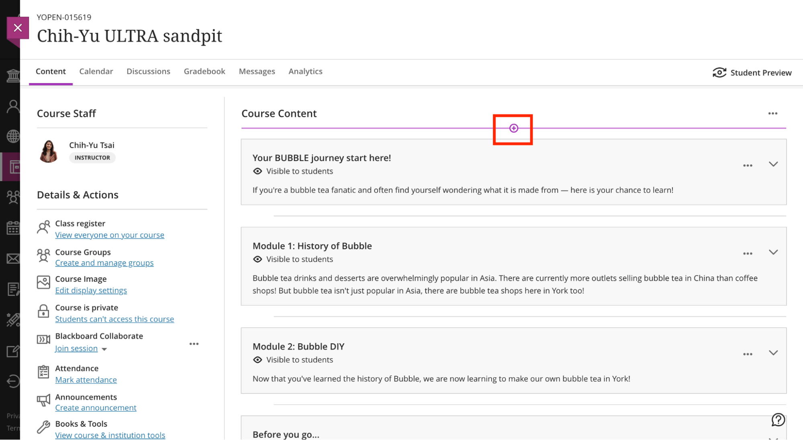
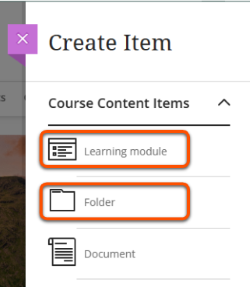
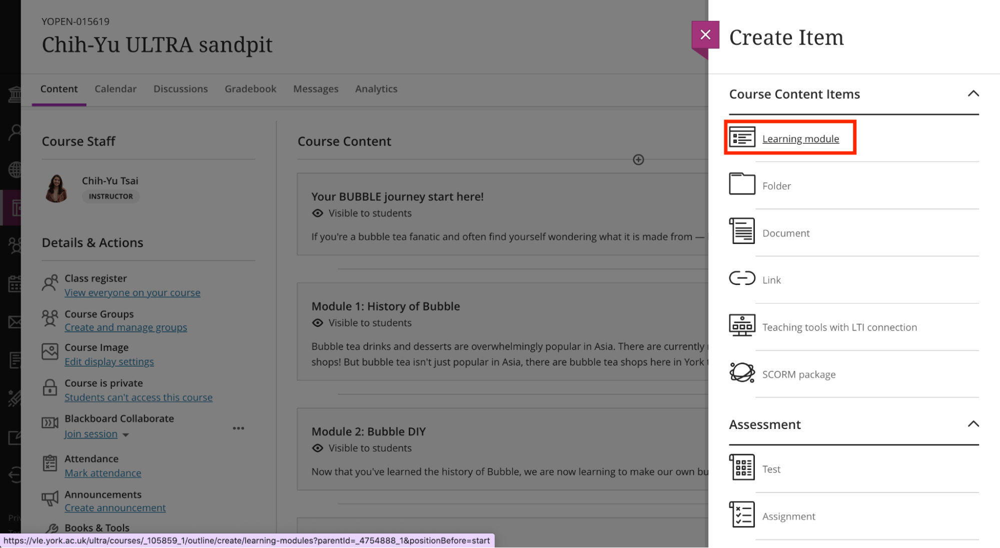
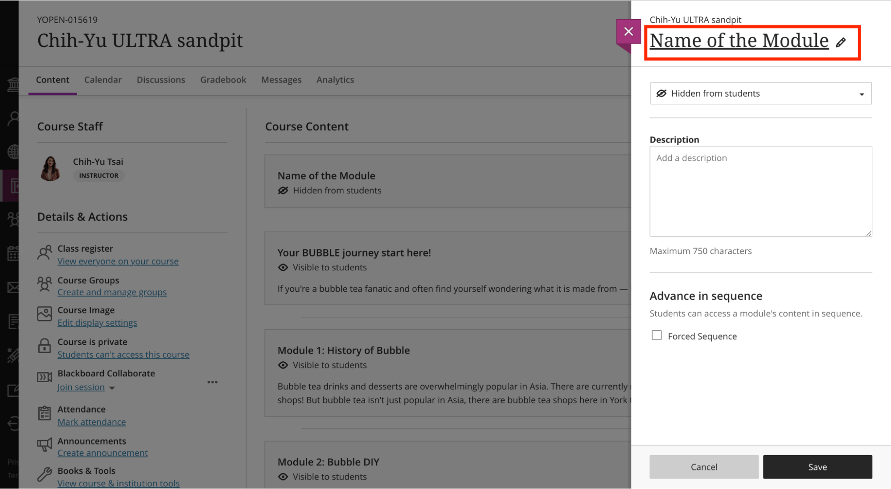
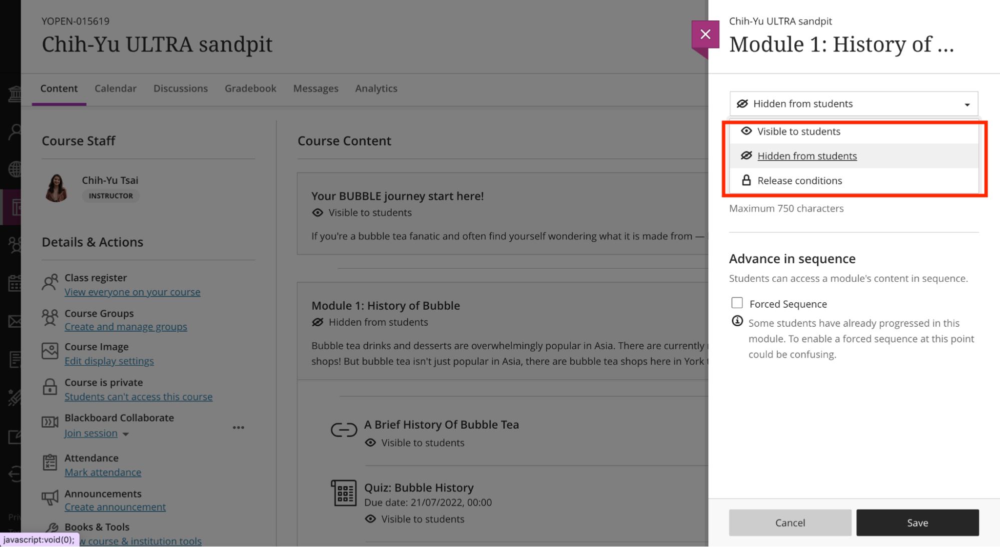
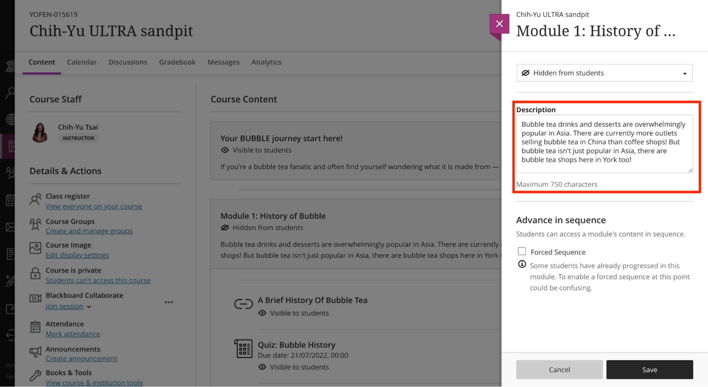
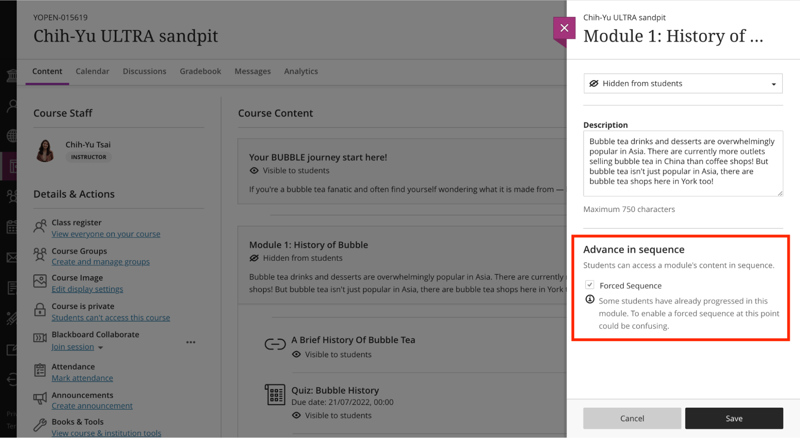
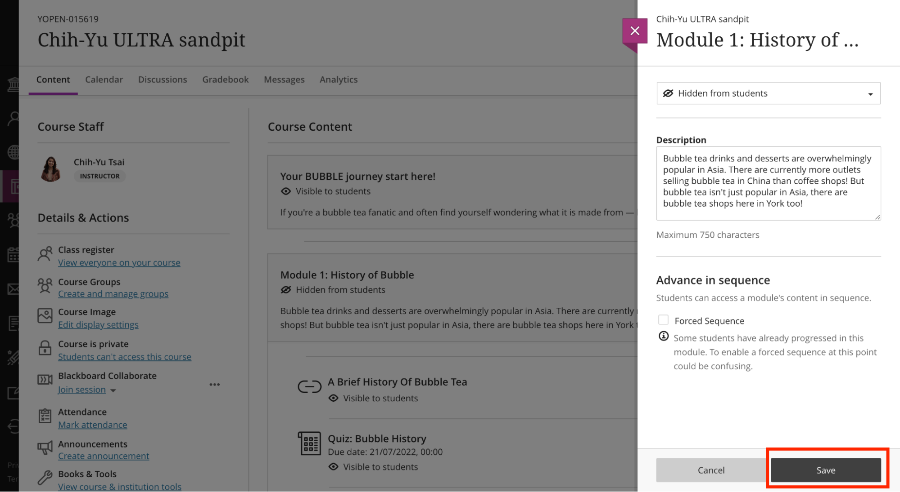
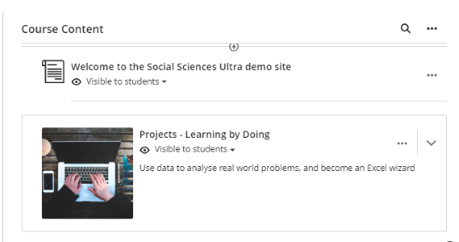

---
tags:
# Delete to leave only relevant tags
    - Foundation
    - Teaching
    - Ultra
---

# Folders vs Learning Modules 

!!! Summary

    In Ultra, **Learning Modules** and **Folders** are the two types of containers you can use to organise course content.

!!! principle "Relevant [VLE site design principles](../ultra/site-design-principles.md)"

    - 3.1 Essential: Organise module materials in sections that support student progress through the module.
    - 3.4 Essential: Site and materials content is accessible.

## **Which to use when**

* If you want students to proceed through the container viewing each item in sequence, use **Learning Modules**.
* If ordering doesn't matter (e.g., you're posting a syllabus, links which you want students to refer to regularly or a place with all the homework assignments), use **Folders**.

## **Differences in student experience**

* If contents are created within a **learning module**, students are able to **navigate the order of the contents** through the forward/backward arrows in sequence.

* If contents are created within a **folder**, students have to click **the exit button** on the upper left-hand side to choose another content within the folder.

### Video Steps

Below is an embedded video detailing **how to differentiate Folders vs Learning Modules**. Alternatively, you can [open the video in a new browser tab](https://www.youtube.com/watch?v=aFUico3YEBc).

<iframe width="560" height="315" src="https://www.youtube.com/embed/aFUico3YEBc" title="YouTube video Folders vs Learning Modules" frameborder="0" allow="accelerometer; autoplay; clipboard-write; encrypted-media; gyroscope; picture-in-picture" allowfullscreen></iframe>

## **To create a learning module/folder**

### Video Steps

Below is an embedded video detailing how to **Create Learning Modules in the Ultra Course View**. Alternatively, you can [open the video in a new browser tab](https://www.youtube.com/watch?v=Uzpx_sCkVwc).

<iframe width="560" height="315" src="https://www.youtube.com/embed/Uzpx_sCkVwc" title="YouTube video Create Learning Modules in the Ultra Course View" frameborder="0" allow="accelerometer; autoplay; clipboard-write; encrypted-media; gyroscope; picture-in-picture" allowfullscreen></iframe>

### Text Steps

1. In the Content page, hover your mouse where you want to add a learning module/folder and click the **plus icon** > **Create**.

    

    

2. In the Create Item panel, choose **Learning module/Folder**.

    
3. **Enter the name** of your Learning Module/Folder by selecting it or using the pen icon.

    
4. By default, the learning module/folder is hidden from students. You can change the visibility of the learning module/folder to “**Visible to students”**, “**Hidden from students**”, or set “**Release conditions**”.

    
5. Optionally, you can **add a description to the learning module/folder**. Providing a description for content gives students a preview of what's to come.

    
6. **[Learning Modules Only]** You can enable **Forced Sequence** so that students can access a learning module’s content in sequence.
    
7. Click **Save**.

    

## **Adding Images to Learning Modules** 

!!! Summary

    You can choose to add an image to a Learning Module.  This will appear on the left of the module on the course content page, helping to make the site more visually appealing whilst also aiding navigation.

!!! principle "Relevant [VLE site design principles](../ultra/site-design-principles.md)"

    - Section 3: Module materials & site content
    - 2.2 Essential: Materials within sections are clearly organised so content is easy to find.

  

### Video Steps

Below is an embedded video detailing how to **Add Images to Learning Modules in the Ultra Course View**. Alternatively, you can [open the video in a new browser tab](https://youtu.be/3Wmyfp5i_Tw).

<iframe width="560" height="315" src="https://www.youtube.com/embed/3Wmyfp5i_Tw" title="How To Add Learning Module Icon Images To VLE Ultra" frameborder="0" allow="accelerometer; autoplay; clipboard-write; encrypted-media; gyroscope; picture-in-picture; web-share" allowfullscreen></iframe>

### Text Steps

<!-- Clear and concise: Click **Submit**, not Click on the **Submit button** -->
<!-- Use **bold** to highight key tasks and features -->

1. Click the **three dots** to the right of the learning module on your course content page. Click **Edit** to show the learning module editing window.   
 
2. Click the **image icon / ’Add Image’** and upload an image. JPEG and PNG formats are supported.   

3. A preview of the image appears. Click **Next** to continue or delete the image by selecting the bin icon.   

4. Select the area of the image that you would like to appear on the Learning Module. You can adjust the zoom of the image using the slider. Click **Save** to continue.   

5. Remember to click **Save** again at the bottom of the editing window, to save the changes to the learning module.   

## Accessiblity
<!-- More info here as needed. Delete if not needed. Don't add support email address here. -->

The learning module is automatically marked as decorative, which hides the banner for students using assistive technologies. If you want all students to know the content of the image, uncheck Mark the image as decorative. Enter a description of the image in the Alternative text field. 

## Creating icons

[Guides on image manipulation to create an icon](https://subjectguides.york.ac.uk/media/images)

[Images for number or letter icons](https://docs.google.com/presentation/d/19ey3zq2l-GP7PAQocRhXfbK1Ua3Fy8mV/edit?usp=sharing&ouid=101199476229048788013&rtpof=true&sd=true)

## Sourcing images

You must not use copyrighted material when creating your site’s course image.

Images should be high quality; preferably taken by a professional photographer. You can use the [University’s photo library](https://brand.york.ac.uk/account/dashboard/) to download professional photographs owned by the University. 

You can also use [Unsplash.com](https://unsplash.com/) to source copyright-free images.

Download images at a resolution that meets the minimum requirements for Ultra. The **Web Image gallery** size on the University's photo library meets these requirements.

<!-- More info here as needed. -->