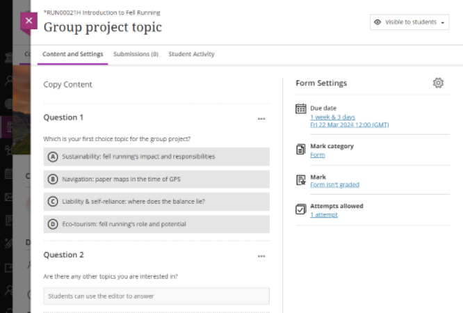
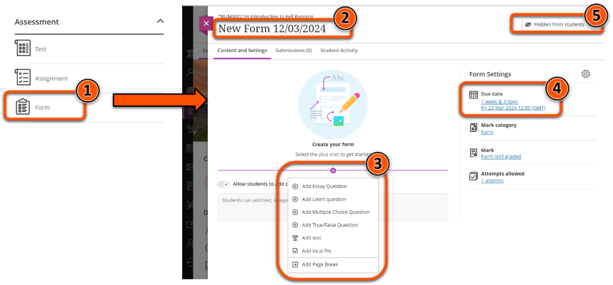

---
tags:
    - Interactive content
    - Ultra
---

# Form

!!! Summary

    Forms are a survey option to collect feedback, opinions or preferences.

## When to use Forms

Forms use a selection of Test question types, making them particularly useful as **asynchronous surveys**. However, responses cannot be collected anonymously.

For example, Forms could be be used to collect: 

- module feedback (mid or end of semester)
- topic preferences to assign students for group work, projects, presentations etc.
- difficulties/topics to focus on in review sessions

!!! Warning
    Although it is possible, **don't use a Form as a graded assessment** - please [use the Test tool](test.md) instead.

!!! tip "Alternative tools"
    
    [Padlet](../other-tools/padlet.md) or [Google Forms](https://subjectguides.york.ac.uk/data/gathering) can be used in a similar way, but allow anonymous responses.

## Form content

Forms can include these question types:

- Essay
- Likert scale
- Multiple Choice 
- True/False 

You can also add text or upload a file.

## Create a Form

1. In the relevant location, click **Create** > **Form**.
2. Give the Form a descriptive **name** at the top left.
3. Add your **questions**.
4. If relevant, add a **Due Date** and adjust other settings as needed.
5. Set the test as **Visible to students** or specify  **Release conditions** in the top right.

### Blackboard Help guides

- [Create Forms and view responses](https://help.blackboard.com/Learn/Instructor/Ultra/Grade/Forms) 
- [Test question types](https://help.blackboard.com/Learn/Instructor/Ultra/Tests_Pools_Surveys/Question_Types#ultra_types)