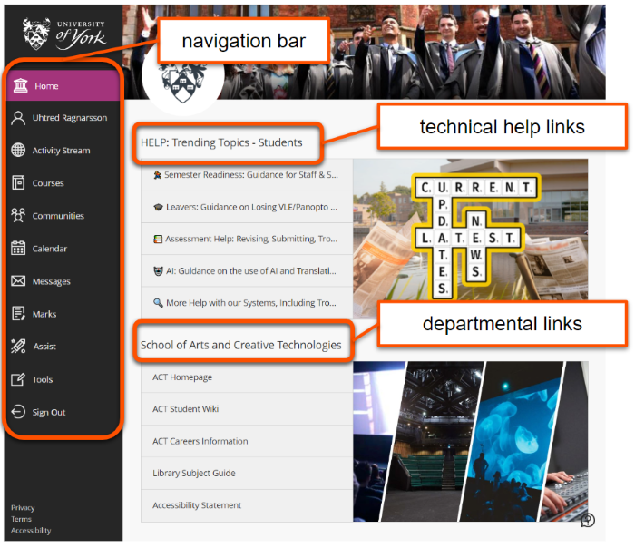
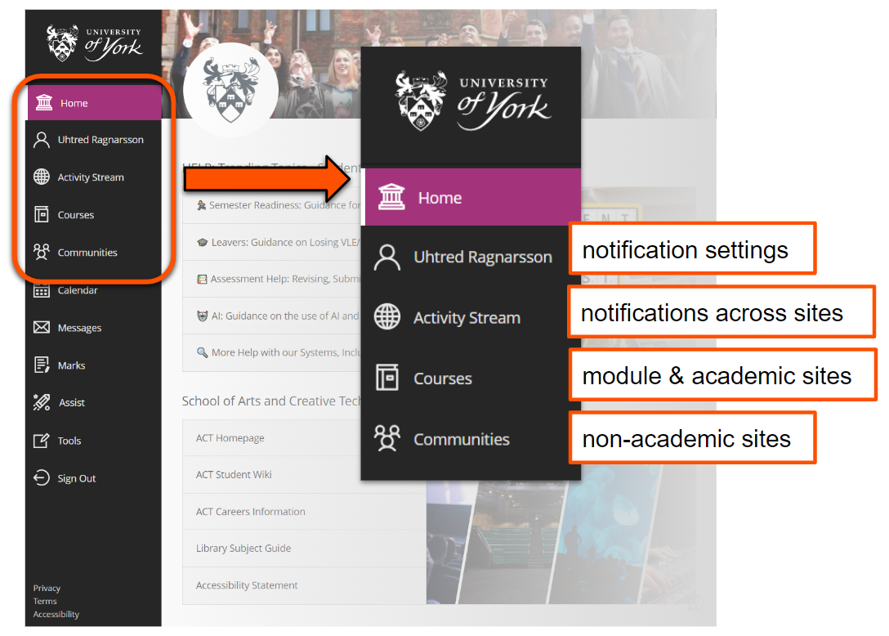
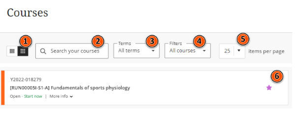
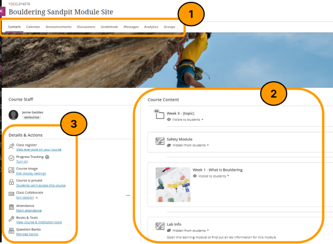
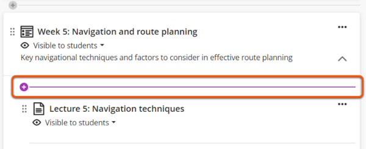
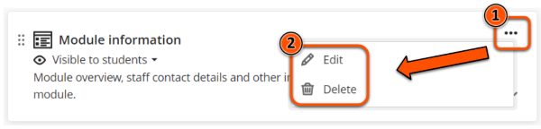
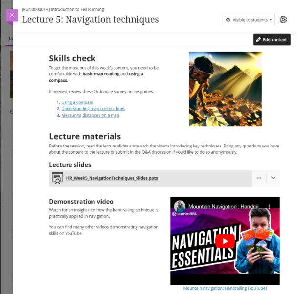

---
tags:
    - Key guide - teaching
    - Key guide - admin
    - Ultra
---

# Getting started with Ultra

!!! Summary

    An introduction to navigating the Ultra system and the basics of creating site content.

## Ultra system

### Ultra homepage

Access Learn Ultra at [vle.york.ac.uk](vle.york.ac.uk) (or for HYMS, [hymsvle.york.ac.uk](hymsvle.york.ac.uk)).

The homepage contains three key areas:

- **navigation bar**: access different parts of the Ultra system.
- **technical help links** for staff and students: where we provide information on trending topics (eg. Semester readiness information) and details of any current outages/issues.
- **departmental links**: key resources for staff and students affiliated to that department. 

Key pages accessed from the navigation bar are:

- Your **profile**: [manage your notification settings](../ultra/notifications.md) and personal information.
- **Activity Stream**: notifications collated across all your sites. You can manage what appears here in the notification settings withn your profile.
- **Courses**: module sites and academic-related sites (eg. study skills sites, Academic Integrity Tutorial)
- **Communities**: non-academic sites, such as careers information and programme handbook sites.

### Courses page: access your module sites

The **Courses** page lists all your module sites. Here you can browse, filter and search for sites.

[Detailed guide: Access your sites](../ultra/access-sites.md)

!!! Tip

    Click the star icon to Favourite a site and pin it to the top of your Courses list.

## Module sites

### VLE site design principles

These are a set of Essential (must meet) and Recommended (try to meet) principles to:

- **highlight best practice** in site design (*what makes a good site?*).
- help you meet **accessibility** and **copyright** legislation.
- **reduce workload** for preparing your Ultra site.

Each principle includes details and notes to help you implement it in your site, for example:

!!! essential "2.1 Essential: Site structure includes sections for module information, assessment, Reading List, Replay Content and module materials."
    
    - This provides a consistent experience across modules, helping students navigate the site and locate items easily.
    - This structure is provided in site templates.
    - For professional programmes this may be adapted to include other relevant sections, maintaining a clear and easy to navigate site structure.

Make sure to review the full [VLE site design principles](../ultra/site-design-principles.md) before preparing your site.

### Ultra site structure & module template

Within an Ultra site, there are three main sections:

1. **Top Menu**: Access course tools including the **Gradebook** and **Announcements**.
2. **Course Content area**: The main site area. Create and access course content here.
3. **Details & Actions** access site tools including the **Class Register** and **Course Image**.

[Detailed guide: Navigating an Ultra site](../ultra/navigate-ultra-site.md)

Most sites are created from a **departmental template** based on the VLE site design principles, to improve student experience and reduce your workload in setting up the site.

The Course Content area is pre-populated with placeholder items organised in three broad sections:

- **Module information**: module overview, teaching structure, staff contacts etc.
- **Assessment**: all assessment information and submission points.
- **Teaching materials**: lecture slides, workshop tasks, seminar preparation activities etc. Usually organised into weekly sections.

[Detailed guide: Prepare sites for teaching](../ultra/prepare-site.md)

## Basic editing & content creation

### Manage Course Content items 

To **add** an item in the Course Content area, hover where you would like to add it. Click the purple plus icon that appears and then select item type to add.

To **edit** or **delete** an item, click the three dots icon on the right hand side of the item.

To **move** an item drag and drop it using your mouse or tab to the six dots icon on the left with your keyboard, hit enter and use the up and down arrow keys. 

### Documents (pages)

Documents are the main 'page' content type where you can add text, images, files, embedded videos and more in a flexible drag-and-drop layout.

Find out more about creating and adding content in our [detailed guide: Documents](../ultra/documents.md)

!!! Success "Next steps"

    Congratulations for making your first steps with Ultra! To further develop your skills, you can:

    - work through our [Prepare sites for teaching](../ultra/prepare-site.md) guide.
    - explore the other guides on this site.
    - come to one of our [workshops or other tarining sessions](../training/index.md).