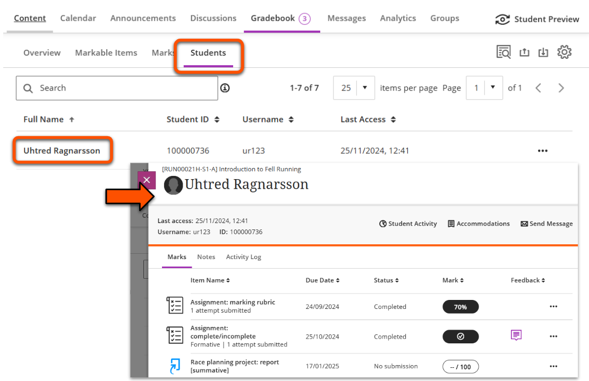
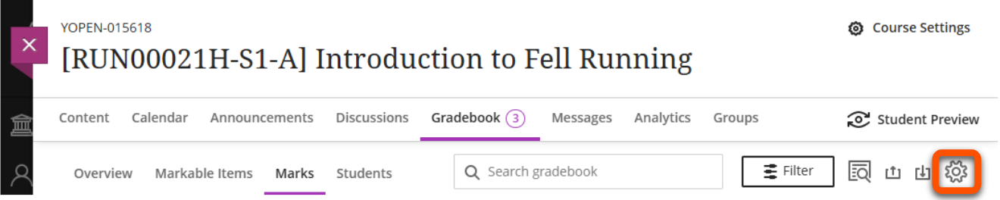
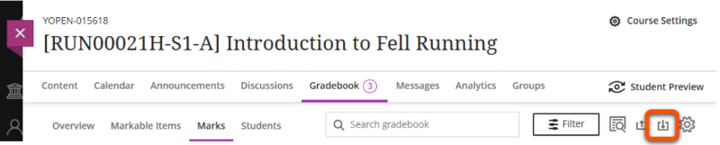
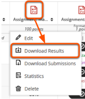
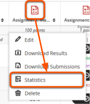
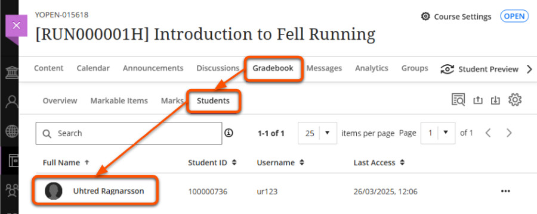
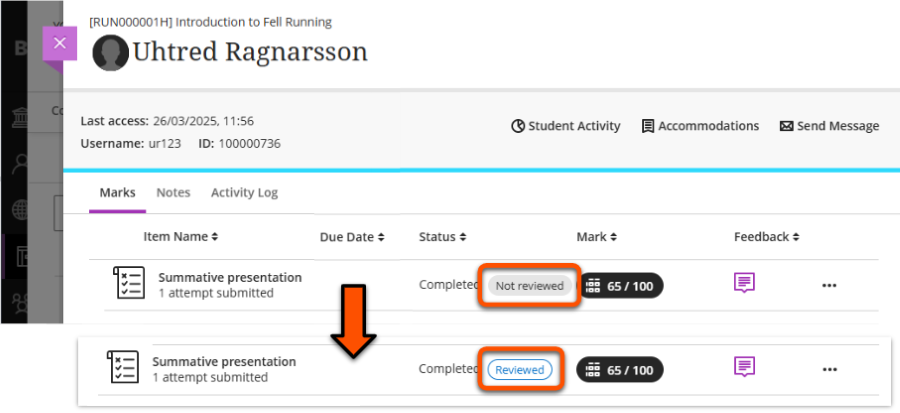

---
tags:
    - Assessment
    - Ultra
---

# Ultra Gradebook

!!! Summary

    The Gradebook pulls together all assessments and submissions from across the site.

Within the Gradebook, you can achieve various assessment-related tasks, including:

- access assignment submission points, Tests and other assessments
- mark submitted work
- view and download grades

For more complex assessment administration guidance, see our [Assessment Tracker guides](https://vle-support.york.ac.uk/assessment/tfs/set-up/#assessment-tracker-summatives-only).

## View Gradebook data and submissions

Access the Gradebook through the tab in the top navigation bar within a site.

This tab may also display an icon, depending on what action is needed:

- a number: count of submissions that need marking
- exclamation mark (!): no submissions to mark, but there are marks to post

Within the Gradebook, there are various tabs (or views) presenting assessment information in different ways:

=== "Overview"

    **Use for**: quick access to Assignments with submissions that *Needs Marking*.

    Click **Gradebook**, then select the **Overview** tab. Under **Needs Marking**, find the relevant Assignment and click:

    - the Assignment name to open its Submissions tab with the *Needs Marking* filter applied.
    - the **Mark now** button to go straight to the marking interface with the *Needs Marking* filter applied.

    
    
=== "Markable items"

    **Use for**: a summary of marking status for all assessment items.

    Click **Gradebook**, then select the **Markable items** tab. This displays all assessment items and the number still to mark. Click the relevant Assignment to open its Submissions tab.

    

=== "Marks"

    **Use for**:
    
    - a grid view of all students and all assessments
    - filtering for a marking group or specific assessment
    - quick access to a particular submission
    
    !!! Note
        
        This tab may not be available on very small screens (eg. a mobile phone). 

    Click **Gradebook**, then select the **Marks** tab. This displays a grid of students (rows) and assessment items (columns). 

    To filter for marking groups or other features, click **Filter**. Open the **Groups** dropdown, select your marking group (and/or apply other filters) and click **Apply**. 

    

    To open a submission, click the relevant student/assessment cell and select **View**.

    

=== "Students"

    **Use for**: a holistic view of a student's general and assessment activity

    Click **Gradebook**, then select the **Students** tab. This list all students, with their Student ID, username and date of last access. Click the relevant Student name to open a list of all their assessment activity, marks and feedback, [accommodations](../ultra/accommodations.md) details and general student activity.

    

=== "Assignment: Submissions"

    **Use for**: direct access to an Assignment's Submissions tab

    Not part of the Gradebook directly, but another way to access assessment information. In the Course Content area, open the **Assignment** then select the **Submissions** tab. Click on a student's row to open their submission.

    This also shows the numbers of submissions made, to mark and to post, and the date(s) that students made their submission(s). Grades also display here once work is marked.

    

## Marking assessments

See our assessment tool guides for details of the marking process:

- [TurnItIn marking](../assessment/tfs/marking.md)
- [Ultra Assignment - marking](../ultra/assignment-marking.md)
- [Ultra Test](../ultra/test.md)

## Assessment settings and resources

On any of the Gradebook views, click the *cog* icon on the right of the Gradebook navigation bar to open site-wide Settings.

### Automatic zeroes

- Automatically give a zero score if no work is submitted by the deadline.
- This doesn't affect deadline [accommodations](../ultra/accommodations.md) or assessment-specific late submission settings
- Recommended setting: *off* (default for sites created from January 2025).

### Marking schemas

- Marking schemas can be used to display an overall numerical mark as a qualitative grade or status, eg. A/B/C or Complete/Incomplete.
- Numerical marks aren't overridden; students and staff can still access the mark awarded to specific submission attempts.
- Only applies to in-built Ultra assessment types (ie. not TurnItIn or Gradescope).
- Find out more on our [guide to Marking schemas](../ultra/mark-schema.md)

### Course rubrics

- View, edit (if not yet used for marking), duplicate or delete all marking rubrics associated with the site.
- Option to create a new rubric or generate one with AI to later deploy in an assessment.
- Only applies to in-built Ultra assessment types (ie. not TurnItIn or Gradescope).
- Find out more on our [guide to Marking Rubrics](../ultra/rubric.md)

## Download Gradebook data

!!! Tip

    Anonymously graded assessments must be de-anonymised (by clicking *Post all marks*) to allow downloading marks or results.

### Download Gradebook (overall marks)

**Use to download**: final mark per student for each selected assessment. Useful for exporting grades for E:vision etc.

1. On any of the Gradebook views, click the *Download Gradebook* icon (a box with an arrow pointing down into it) on the right of the Gradebook navigation bar.
 
2. Select the appropriate settings:
    - **Mark records**: select *Full Gradebook* (for the final marks)
    - **Record details**:
        - Tick *Select All Items* or select specific assessment(s) from the list.
        - Include feedback: toggle on to also download feedback (for one specific assessment only).
    - **File Type**: .xls or .csv
    - **Save Location**: select *My Device* (do not use *Content Collection*)
        - *My Device*: leave selected to download to your computer.
        - *Content Collection*: do not choose this option
 
3. Click **Download**.

### Download Results (Test question scores)

**Use to download**: each student's individual answers and scores for each Test question. Might be useful for in-depth question analysis, offline marking etc. There’s also the built in [Question Analysis tool](https://help.blackboard.com/Learn/Instructor/Ultra/Tests_Pools_Surveys/Ultra_Question_Analysis).

!!! Tip

    Questions are included in the specific order they were presented to each student, so if questions were randomised, ‘Question 1’ will differ for each student. To convert back to consistent question order, select *By question and student* format and sort by question text.

1. Open the *Marks* or *Markable Items* Gradebook view.
2. Click the relevant assessment icon (in *Marks*) or the three dots icon (in *Markable Items*) and then select **Download Results**.
3. Select the appropriate settings:
    - **File type**: .xls or .csv
    - **Format of results**: appropriate option depends on particular use case
        - *By student*: wide format (one row per student). Only really useful if questions were in the same order for each student.
        - *By question and student*: long format (one row per question per student). Can easily sort by question text if questions were randomised.
    - **Attempts to download**: select ‘Mark attempts’
4. Click **Download**.

### Download submissions

!!! Tip

    For an Ultra Test, this downloads the submission information (time, overall mark), but *not* the student's answers. Use **Download Results** above for this.

Download all submissions to a specific Ultra Assignment as a ZIP file:

1. Open the *Marks* Gradebook view.
2. Click the relevant assessment icon and then select **Download Submissions**.
3. Select individual student(s) or tick the box next to *Name* to select all students.
4. Click **Create ZIP File**.

### Item statistics

To assist in analysing results, you can view summary mark statistics each assessment.

!!! Tip

    Statistics include any automatic zeroes assigned for non-submission.

1. Open the *Marks* or *Markable Items* Gradebook view.
2. Click the relevant assessment icon (in *Marks*) or the three dots icon (in *Markable Items*) and then select **Statistics**.
3. Review the statistics:
    - Grade Statistics: count, min, max, range, average, median, sd, variance
    - Marking Status: doesn't seem useful in our context
    - Grade Distribution: the count of marks in each 10% band, or each mark schema band (if used).
4. If desired, copy/paste the statistics for use elsewhere or use the dropdown menu to select another assessment.

## Monitor student review of feedback

Use the feedback review label to monitor whether students have reviewed their mark and feedback for a particular assessment.

This only relates to Ultra assessments: Assignment, Test etc.

1. Open the **Gradebook** then click the **Students** tab.
2. Select the row for the relevant student.
 
3. The student overview page lists their assessment activity. For posted marks, the *Not reviewed* or *Reviewed* label shows whether they have opened the submission to review their feedback.
 