---
tags:
    - Assessment
    - Ultra
---

# Ultra Gradebook

!!! Summary

    The Gradebook collates all assessments and submissions from across the site. You can access each assessment, mark or view submitted work and download grades.
    
    For more complex assessment administration guidance, see our [Assessment Tracker guides](https://vle-support.york.ac.uk/assessment/tfs/set-up/#assessment-tracker-summatives-only).

!!! Tip

    This guide does not cover how to mark assessments. Instead, please see our tool-specific guides for details:

    - [TurnItIn marking](../assessment/tfs/marking.md)
    - [Ultra Assignment - marking](../ultra/assignment-marking.md)
    - [Ultra Test marking](../ultra/test.md#marking--results)

Access the Gradebook through the tab in the top navigation bar within a site.

This tab may also display an icon, depending on what action is needed:

- a number: count of submissions that need marking
- exclamation mark (!): no submissions to mark, but there are marks to post

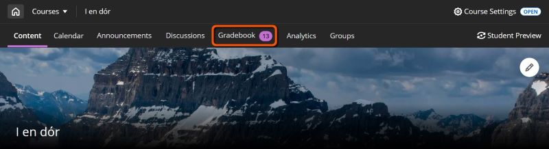

Within the Gradebook, there are two views presenting assessment information in different ways:

## List View (markable items)

**Use for**: a summary of marking status for all assessment items.

Click **Gradebook**, then select the **List View icon** (three stacked horizontal lines). This displays all assessment items in the site with the due date and number of submissions left to mark or post. 

Click the title of an assessment (or the number in the Marking Status column) to open its Submissions tab.

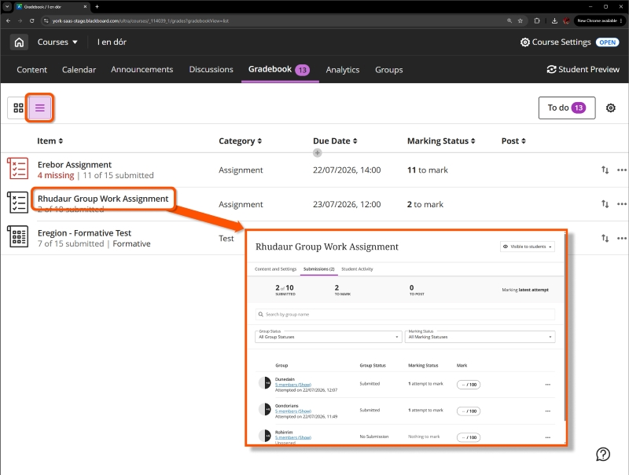

## Grid View (student marks for each item)

!!! Note

    On small screens (eg. a mobile phone) or with a narrow browser width, the Grid View reverts to the List View.

**Use for**:

- a grid view of all students and all assessments
- filtering for a marking group or specific assessment
- quick access to a particular submission

Click **Gradebook**. The Grid View is the default view, but can be selected specifically using the **Grid View icon** (small squares in a 2x2 block). This displays a grid of students enrolled on the site (rows) and assessment items (columns).

A purple dot shows an unmarked submission from that student for the relevant assessment. After grading this changes to the mark awarded.

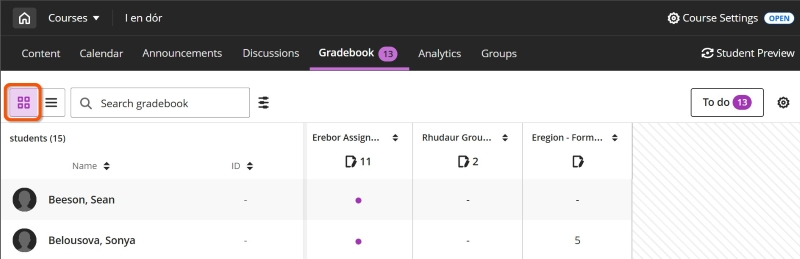

### Access submissions

To open the general marking interface for an assessment, click the **page and pencil icon** in the column header. The number next to the icon shows the number of unmarked submissions.

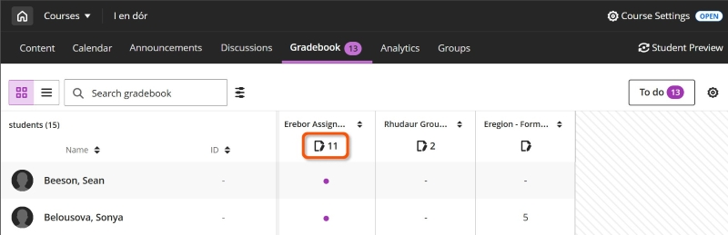

To open a specific student's submission, click the relevant cell to open the *Mark details* panel, then click **Mark submission** (for ungraded submissions) or **View submission** (for graded submissions).

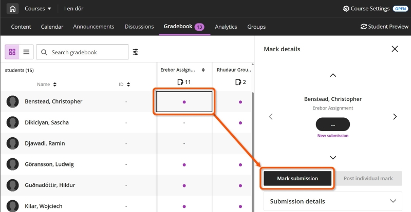

### Sort

To sort by scores, click the **arrow icons** to the right of the assessment title in its column header. Click once for low to high, click again for high to low, click again to remove ordering on that column.

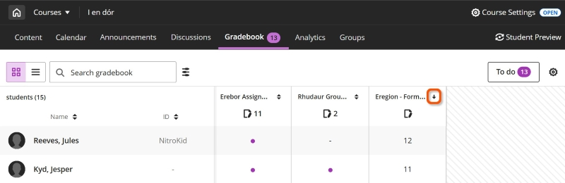

### Filter

Click the **Filter icon** (three stracked horizontal sliders) above the grid to open the *Filters and Views* panel. Filter by any of: Students, Groups, Category, Types or specific Markable items, then click **Apply**.

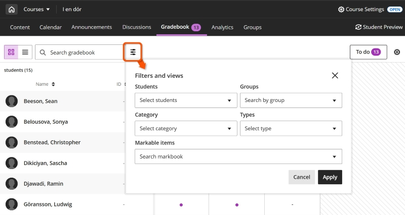

### Search

You can search for student name, assessment title, category, recipt code etc. Type into the **search box** above the grid. As you type, a drop-down appears showing any matches to your search.

Click an item in the drop down to show only that row/column as relevant. Click the **x icon** in the search box to remove the search filter.

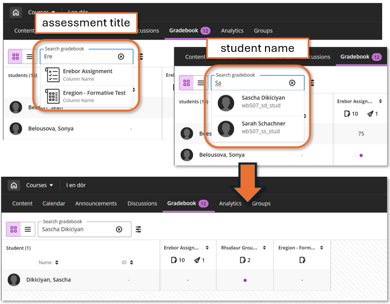

!!! Note

    Currently, searching on a submission receipt returns the full column for the assessment, not the specific submission (we have passed on feedback that this is not ideal). 
    
    To locate a *non-anonymous* submission by its receipt code, the simplest way is to download the Mark history for that specific assessment. This contains submission receipt codes and the relevant student name, which you can then search for in the Grid View.

### Assessment details panel

Click an item's title in the column header to open the *Assessment details* panel. This contains various assignment-level information and tasks.

#### Navigation

Use the **left/right arrows** to move between assessments.

#### Mark submissions

If submissions need marking, click the **Mark** button to open the marking interface. The number of submissions that still need marking is displayed on the button in brackets. If marking is complete the button will read **View submissions** instead.

#### Post all marks

If *any* submissions have been marked, it is possible to click **Post all marks button** to release marks and feedback to students. If the assessment was set up to be anonymous then posting de-anonymises the submission point. **Once posted, this cannot be undone.**

If no submissions have been marked yet, the **Post all marks button** will be greyed out.

!!! Warning 
    
    In general you **should not press this button**; it's more typical to mark all submissions and for administrative staff to post all marks simultaneously.

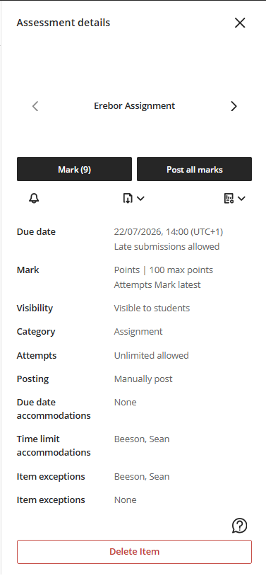

#### Task icons

- **Send Reminder** (bell icon): click to send a reminder to students that have not made a submission.
- **Download** (document with a downward pointing arrow icon): click to [download submissions](#download-submissions-ultra-assignment) or [download results per question](#download-results-test-question-responses-and-scores).
- **[Statistics](#mark-statistics)** (document with a bar graph icon): view the overall marks distribution and other statistics.

#### Assessment settings

Lists various assessment settings (these can't be edited here):

- Due date: the general due date and any settings for allowing late submissions
- Mark: how the assessment is marked and which attempt is marked
- Visibility: if the item is visible to students
- Category: the assessment item type
- Attempts: how many attempts allowed
- Posting: if marks are released manually or automatically
- Accommodations and exceptions: names of students with the various course-level and item-level accommodations. 

#### Delete item

!!! Warning

    If an assessment item is deleted, this **cannot be undone**. If you want to delete an assessment item, discuss this with your departmental administrative team.

Click this button and follow the prompts to delete the item and all submissions made and marks/feedback given. 

### Mark details panel

Click on a cell to open the *Mark details* panel for a submission. This contains various information about the assessment and the specific submission.

#### Navigation
Use the **up/down arrows** to move between students within the same assessment and the **left/right arrows** to move between assessments for the same student.

#### Mark/View submission

Click the **Mark submission** (for ungraded submissions) or **View submission** (for graded submissions) button to open it in the marking interface.

#### Post individual mark

After marking, the **Post individual mark** button becomes available; this releases the mark and any feedback to the individual student. **Once posted, this cannot be undone.**

!!! Warning 
    
    In general you **should not press this button**; it's more typical to mark all submissions and for administrative staff to post all marks simultaneously.

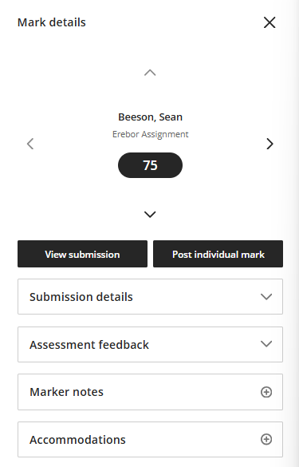

#### Submission details

This shows details of the student's submission and also a summary of the assessment marking settings:

- Due date: the main assessment due date. Any personal extensions set for the student (in the VLE site) appear in *Accommodations* (see below).
- Submitted: the date and time of the student's last submission.
- Receipt number: the submission receipt code of the student's last submission.
- Mark, Category, Attempts: summary of the general assessment settings.

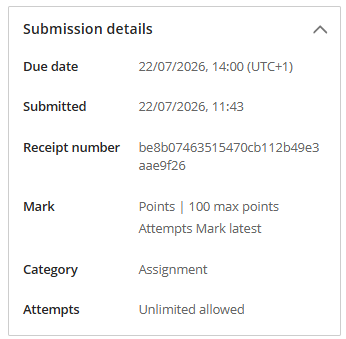

#### Assessment feedback

This shows any feedback given within the marking interface. This will be shown to students after marks are posted.

This shows *Overall feedback* and any specific *Attempt feedback* for multiple attempts. You can edit or add feedback here using the *pencil icon* or *plus icon* respectively, although we'd recommend adding feedback in the marking interface instead.

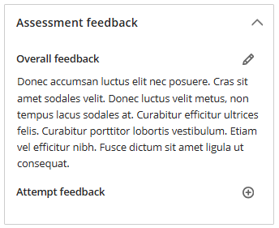

#### Marker notes

This is a ‘staff-eyes-only’ field and can be used similarly to feedback fields discussed above. This will **not** be shown to students after marks are posted.

Notes here may be useful for moderation purposes or in cases of academic misconduct, for example.

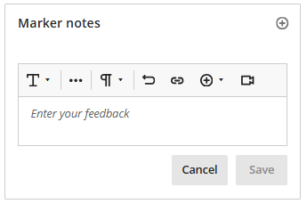

#### Accommodations

This section is for setting assessment-specific accommodations for individual students. You can:

- exempt the student from needing to submit.
- add a personal extension to the main assessment due date.
- provide a personal access window using *Access from* and/or *Access until* release conditions.
- limit or extend the number of attempts the student is allowed to make for the assessment.

Any [course-level accommodations](../ultra/accommodations.md) for the student are also shown (eg. 25/50% extra time for timed assessments), but can't be edited here.

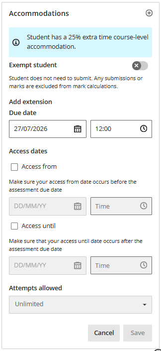

## Assessment settings and resources

On either Gradebook view, click the **cog** icon on the right of the Gradebook navigation bar to open site-wide Settings.

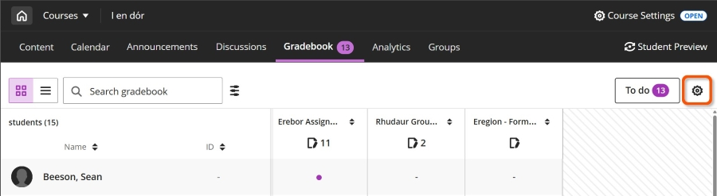

### Automatic zeroes

- Automatically give a zero score if no work is submitted by the deadline.
- This doesn't affect deadline [accommodations](../ultra/accommodations.md) or assessment-specific late submission settings
- Recommended setting: *off* (default for sites created from January 2025).

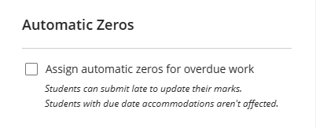

### Marking schemas

- Marking schemas can be used to display an overall numerical mark as a qualitative grade or status, eg. A/B/C or Complete/Incomplete.
- Numerical marks aren't overridden; students and staff can still access the mark awarded to specific submission attempts.
- Only applies to in-built Ultra assessment types (ie. not TurnItIn or Gradescope).
- Find out more on our [guide to Marking schemas](../ultra/mark-schema.md)

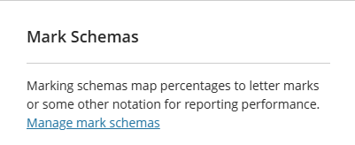

### Course rubrics

- View, edit (if not yet used for marking), duplicate or delete all marking rubrics associated with the site.
- Option to create a new rubric or generate one with AI to later deploy in an assessment.
- Only applies to in-built Ultra assessment types (ie. not TurnItIn or Gradescope).
- Find out more on our [guide to Marking Rubrics](../ultra/rubric.md)

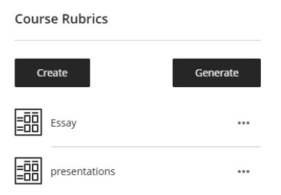

## Gradebook data

!!! Tip

    Anonymously graded assessments must be de-anonymised (by clicking *Post all marks*) to allow downloading marks or results.

### Download overall marks

**Use to download**: final mark per student for each selected assessment. Useful for exporting grades for trackers, E:vision etc.

1. On either Gradebook view, click the **cog** icon on the right of the Gradebook navigation bar to open the Gradebook Settings panel.
 
2. Click **Download marks** in the *Upload and download markbook* section.
3. Select the appropriate settings:
    - **Mark records**: select *Full Gradebook* (for the final marks)
    - **Record details**:
        - Tick *Select All Items* or select specific assessment(s) from the list.
        - Include feedback: toggle on to also download feedback (for one specific assessment only).
    - **File Type**: .xls or .csv
    - **Save Location**: select *My Device* (do not use *Content Collection*)
4. Click **Download**.
 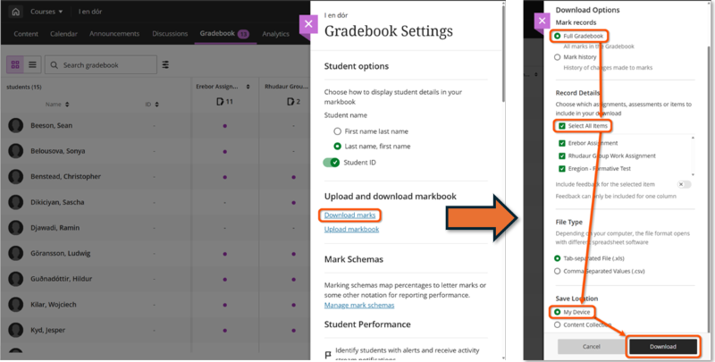

### Download Results: Test question responses and scores

**Use to download**: each student's individual answers and scores for each Test question. Might be useful for in-depth question analysis, offline marking etc. There’s also the built in [Question Analysis tool](https://help.anthology.com/blackboard/instructor/en/interact-with-students/discussions/view-discussion-performance-and-analytics.html).

!!! Tip

    Questions are included in the specific order they were presented to each student, so if questions were randomised, ‘Question 1’ will differ for each student. To convert back to consistent question order, select *By question and student* format and sort by question text.

1. Open the **Download Results** panel:
    - *Grid View*: Click a Test's title in its column header to open the *Assessment details* panel. Click the **download icon** (a document with a downward pointing arrow over it) and select **Download Results** from the drop-down.
     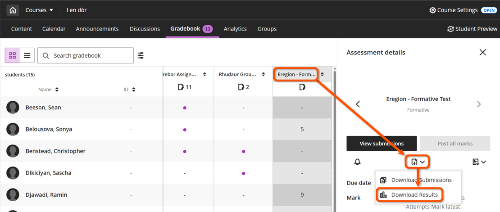
    - *List View*: Click the three dot menu at the far right of the assessment’s row and select **Download Results** from the drop-down.
     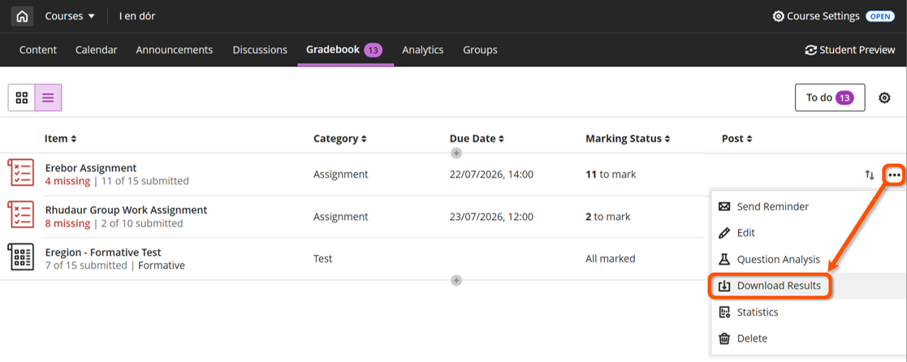
2. Select the appropriate settings:
    - **File type**: .xls or .csv
    - **Format of results**: appropriate option depends on particular use case
        - *By student*: wide format (one row per student). Only really useful if questions appeared in the same order for each student.
        - *By question and student*: long format (one row per question per student). Can easily sort by question text if questions were randomised.
    - **Attempts to download**: select ‘Mark attempts’
4. Click **Download**.

### Download submissions: Ultra Assignment

!!! Tip

    For an Ultra Test, this downloads the submission information (time, overall mark), but *not* the student's answers. Use **Download Results** above for this.

**Use to download**: all submissions made to a specific Ultra Assignment as a ZIP file.

1. On the *Grid View*, click a Test's title in its column header to open the *Assessment details* panel.
2. Click the **download icon** (a document with a downward pointing arrow over it) and select **Download Submissions** from the drop-down.
 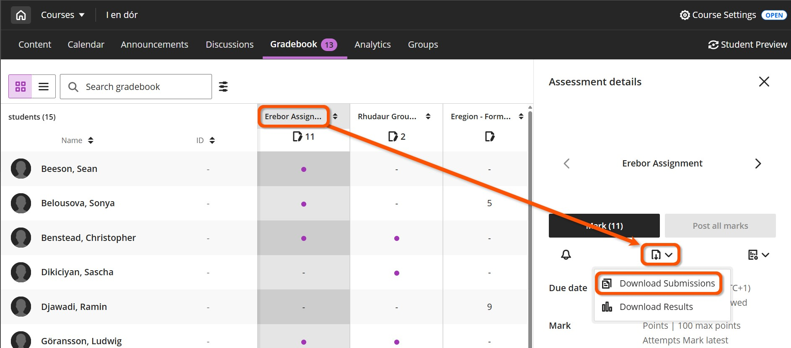
3. Select individual student(s) or tick the box next to *Name* at the top to select all students.
4. Click **Create ZIP File**, then click the **Send** button on the confirmation panel that appears. When the ZIP has been prepared the system will send an email to your University email address with a link to download the ZIP.
 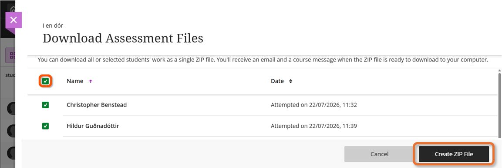

### Mark statistics

**Use to**: review and analyse overall mark distributions. For Tests, [question-level analytics](../ultra/test.md#question-analysis) are also available.

1. Open the assessment **Statistics** panel:
    - *Grid View*: Click an assessment's title in its column header to open the *Assessment details* panel. Click the **statistics icon** (document with a bar graph on it) and select **Statistics** from the drop-down.
     
    - *List View*: Click the three dot menu at the far right of the assessment’s row and select **Statistics** from the drop-down.
     
3. Review the statistics. Note that these include any automatic zeroes assigned for non-submission.
    - Grade Statistics: count (of different grades awarded), min, max, range, average, median, sd, variance
    - Marking Status: count of submissions completed, still to mark etc.
    - Grade Distribution: the count of marks in each 10% band, or each mark schema band (if used).
4. If desired, copy/paste the statistics for use elsewhere or use the dropdown menu to select another assessment.

## Monitor student review of feedback

Use the feedback review label to monitor whether students have reviewed their mark and feedback for a particular assessment.

This only relates to Ultra assessments: Assignment, Test etc.

1. Click a student's name on the **Grid View** to open the student overview page.
2. For Ultra Tests and Assignments where marks have been posted (ie. made available to students), the *Status column* indicates if a student had reviewed their feedback or not.
 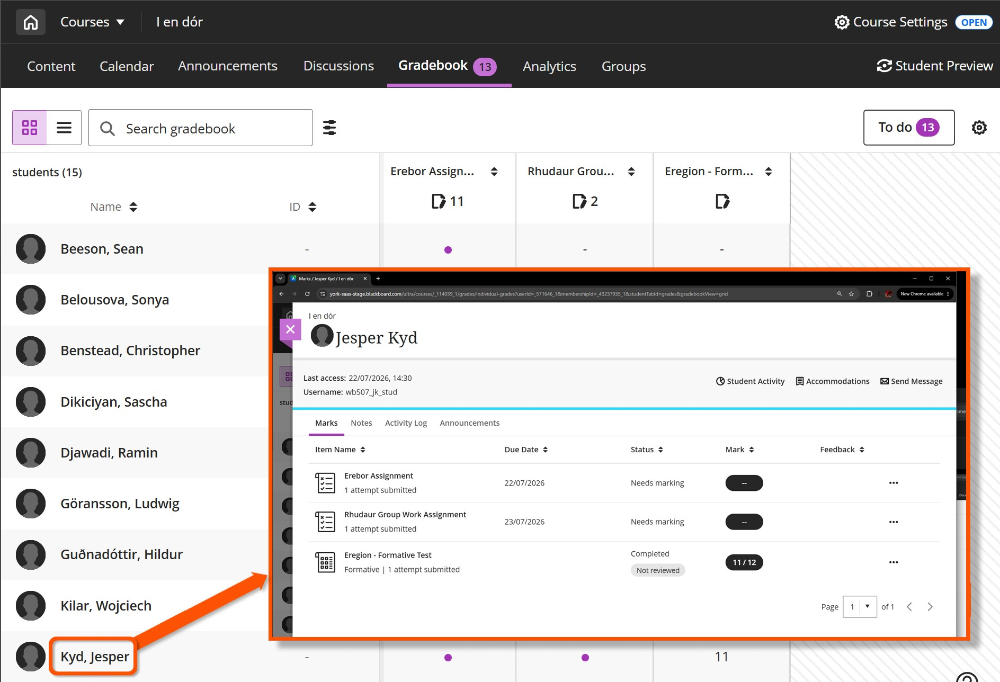