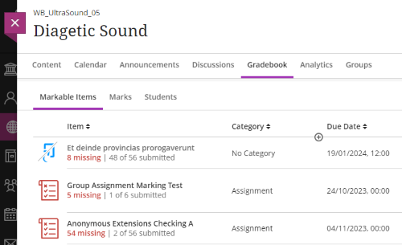
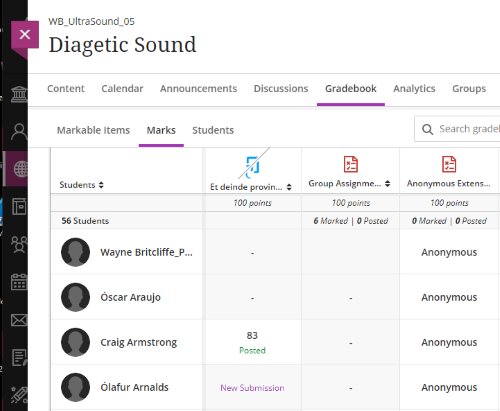
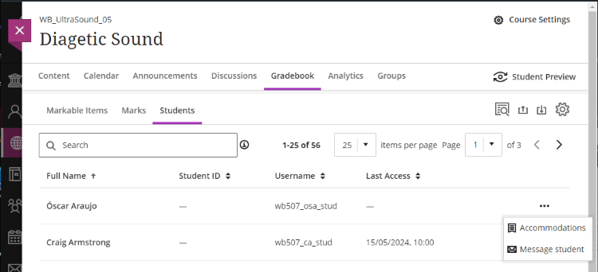
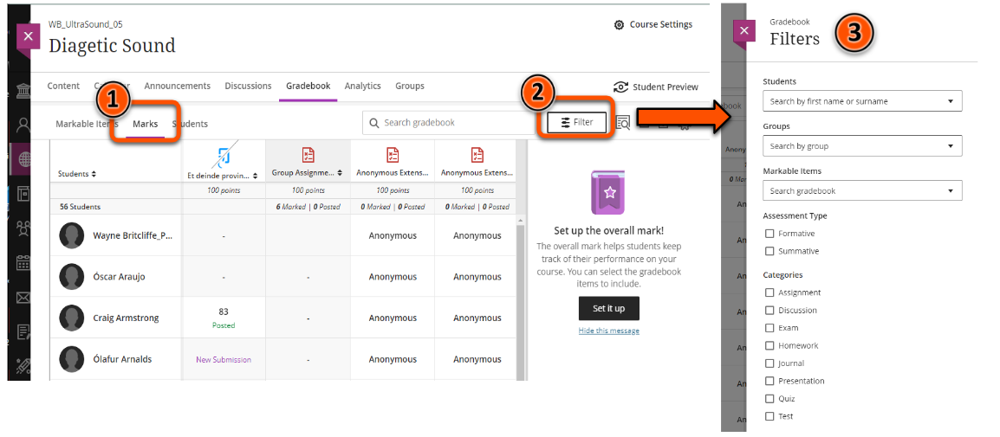
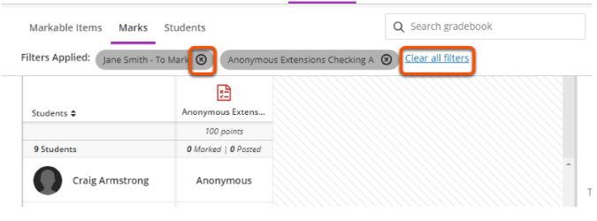

# Ultra Gradebook

!!! Summary

    The Gradebook pulls together assessments and submissions from across the site.

Within the gradebook, you can:

- access assigment submission points, Tests and other assessments
- mark submitted work (also see [Ultra Assignment: marking](../ultra/assignment-marking.md))
- upload/download grades

This page summarises key information about using the Gradebook. For more in-depth guidance, see the [BlackBoard Help: Ultra Gradebook](https://help.blackboard.com/Learn/Instructor/Ultra/Grade/Navigate_Grading) page.

## Gradebook views

The Gradebook has three views, each presenting assessment information with a different focus:

### Markable items

A list of all the assignment submission points, Tests and other assessed work in the site. Shows the due date, number of submissions, number left to mark and links to the assessment.

### Marks

A table of student submissions/marks for each assessment.

### Students

A list of enrolled students, their last access date/time and Options to view/set accommodations or message the student.

## Filter the Gradebook view

To make it easier to locate relevant submissions, you can  filter the Marks Gradebook view to show only particular students, groups (eg. marking groups) or assessments.

### Set up a filter

1. In the **Gradebook**, select the **Marks** view.
2. Click the **Filter** button.
3. Choose the relevant **filter option(s)** and click **Apply**

### Remove a filter

Filters applied are listed above the Marks table.

- **Remove an individual filter**: click the x icon next to teh filter name
- **To remove all filters**: click 'Clear all filters' after the list of applied filters.

