---
tags:
# Delete to leave only relevant tags
    - Advanced
    - Teaching
    - Administration
    - Ultra
    - Panopto
    - Reading List
    - Canvas
    - Xerte
    - Padlet
    - Mentimeter
---

# Groups - Setup

!!! Summary

    It is possible to set up groups in Ultra and assign students to these groups, randomly or manually, for the purposes of group work or conditional content release.

## Quick Start Guide

### Video Steps

Below is an embedded video detailing how to set up Groups in Ultra. Alternatively, you can [open the video in a new browser tab](https://youtu.be/tdaSl74psNY).

<!-- PASTE YOUTUBE EMBED (should look like this:) -->
<iframe width="560" height="315" src="https://www.youtube.com/embed/tdaSl74psNY" title="YouTube video player" frameborder="0" allow="accelerometer; autoplay; clipboard-write; encrypted-media; gyroscope; picture-in-picture" allowfullscreen></iframe>

### Text Steps

<!-- Clear and concise: Click **Submit**, not Click on the **Submit button** -->
<!-- Use **bold** to highight key tasks and features -->

### Randomly assigning students to groups

You can randomly assign students to groups of equal size. To do this:

1. Open your Ultra site and click on **View sets & groups** under **Course Groups** in the left hand menu.
2. Click **New Group Set**
3. Type a name for your group set, e.g. “Group Set 1”.
4. Click on the drop-down menu labelled **Group students**, then click **Randomly assign**.
5. Click on the drop-down menu labelled **Number of groups** and select how many groups you would like to create. Ultra will automatically create the specified number of groups and assign an equal number of students to each one.
6. (Optional) Name each group by hovering your mouse over each group’s name, then clicking the pencil icon that appears and typing in the desired group name.
7. (Optional) Add a description to each group by clicking the pencil icon labelled *Add a group description**.
8. When you have finished naming your groups and adding descriptions, click **Save**.
9. To make groups visible to students, click on the down arrow labelled **Hidden from students**, and click **Visible to students**. Note that students will only be able to view the group they are assigned to.

!!! Tip
	
	To unassign students from all groups and start over, open the Group Set and click **Unassign all** in the upper right corner of the screen.

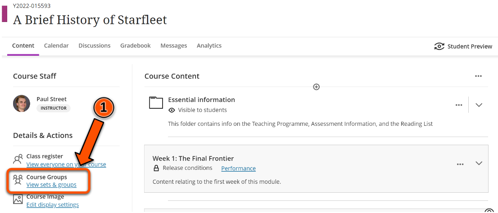
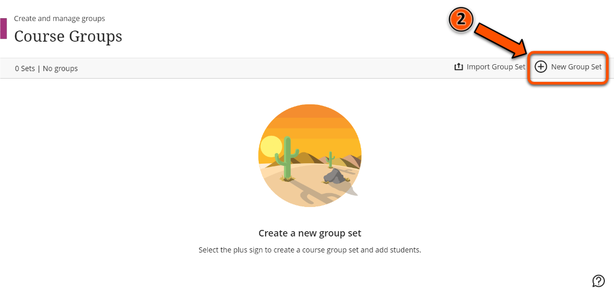
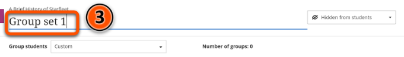
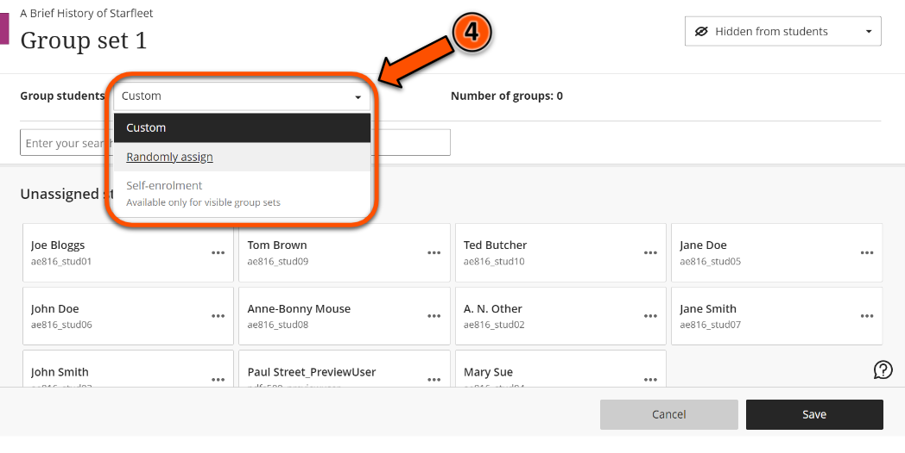
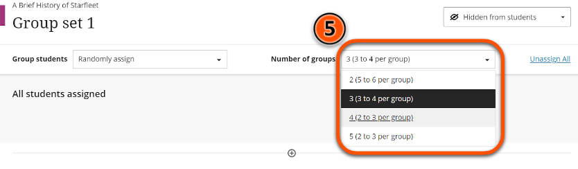
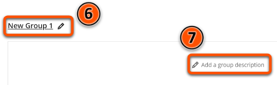
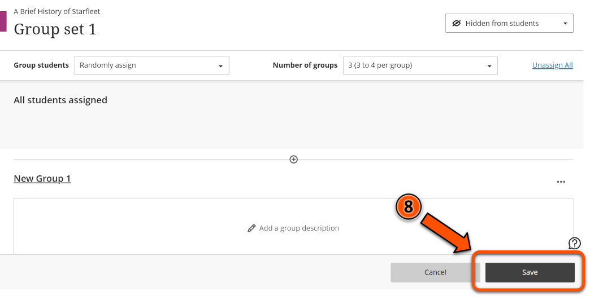
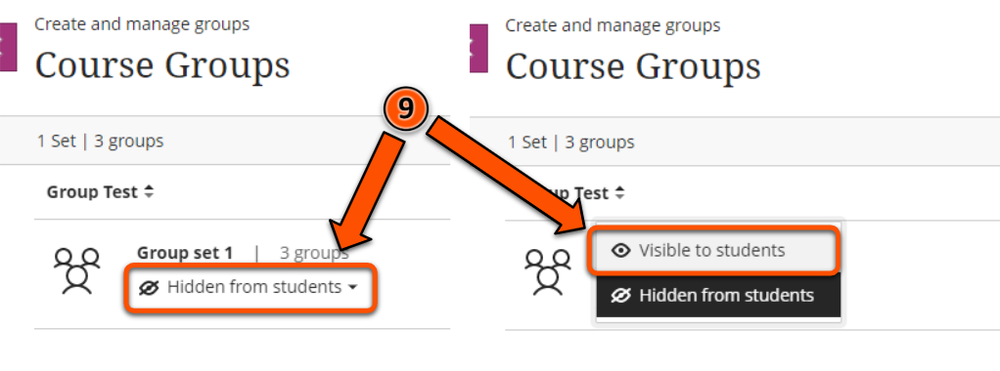

### Manually assigning students to groups

1. Open your Ultra site and click on **View sets & groups** under **Course Groups** in the left hand menu.
2. Click **New Group Set**
3. Type a name for your group set, e.g. “Group Set 1”.
4. Click on each student’s name under **Unassigned students**.
5. Once you have selected the students that will make up the group, click the three dots icon next to any of the selected students’s names. 
6. Click **Create a new group**. Repeat steps 4-6 until all students are assigned to a group.
7. (Optional) Name each group by hovering your mouse over each group’s name, then clicking the pencil icon that appears and typing in the desired group name.
8. (Optional) Add a description to each group by clicking the pencil icon labelled *Add a group description**.
9. When you have finished naming your groups and adding descriptions, click **Save**.
10. To make groups visible to students, click on the down arrow labelled **Hidden from students**, and click **Visible to students**. Note that students will only be able to view the group they are assigned to.

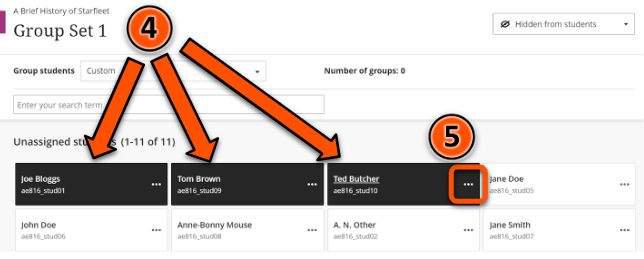
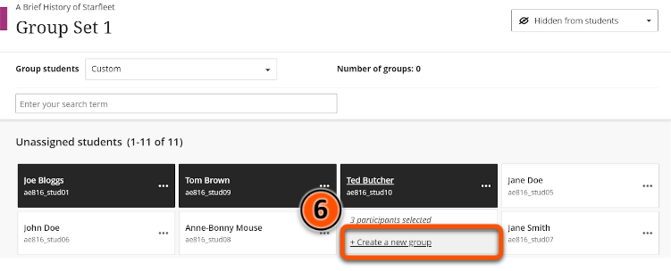
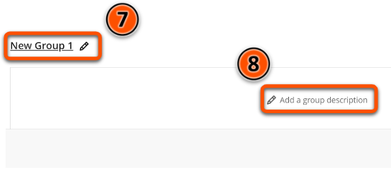
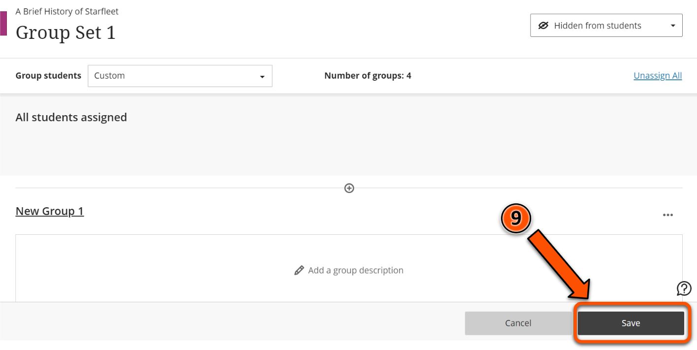
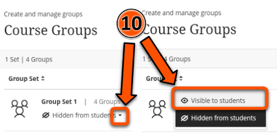

### Self enrol groups

1. Open your Ultra site and click on **View sets & groups** under **Course Groups** in the left hand menu.
2. Click **New Group Set**
3. Type a name for your group set, e.g. “Group Set 1”.
4. Click the drop down menu labelled **Hidden from students** and change this to **Visible to students**.
5. From the drop down menu labelled **Group students** select **Self-enrolment**.
6. Type a description into the **Description** box. This will be visible to students when they enrol themselves into groups.
7. Enter the date and time that students will be able to start enrolling themselves into groups in the boxes labelled **Enrolment start date**.
8. Enter the date and time that students must enrol by in the boxes labelled **Enrolment end date**.
9. Set the maximum number of students per group in the box labelled **Maximum members per group**.
10. Click **Save**.

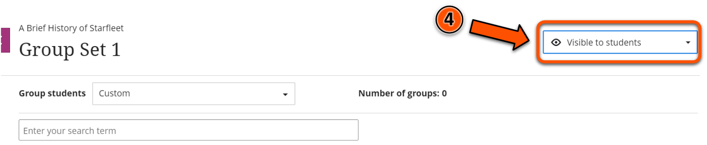
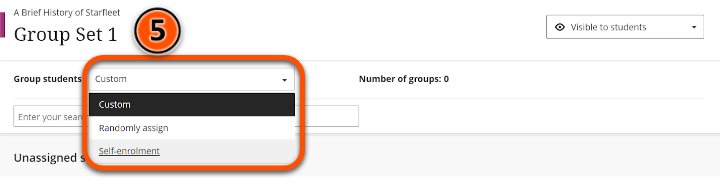
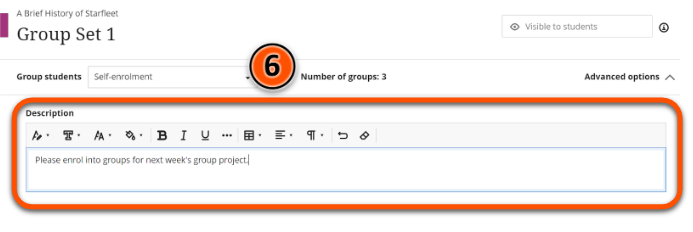
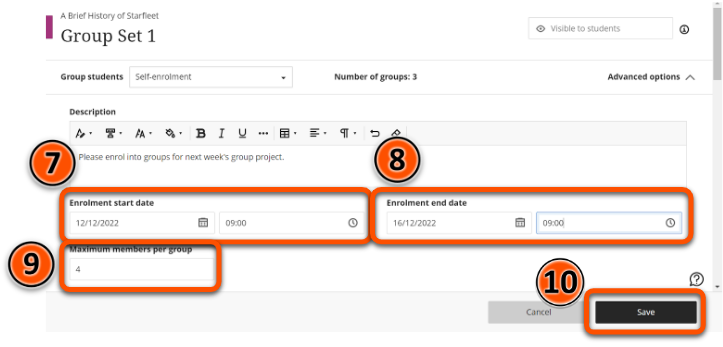

!!! Warning

	If you set the **Maximum members per group** for a self-enrol group set to a value lower than the default, remember to create enough extra groups so that all students can enrol themselves into a group.

### Moving students to different groups

1. In the Course Groups pane, click the **Group set** you want to change.
2. Locate the student you want to move, then click the three dots icon next to their name.
3. Select the group to move the student to.
4. Click **Save**.

