---
tags:
    - Advanced
    - Teaching
    - Administration
    - Ultra
---

<!-- Site used for demo: Y2022-015593 (10 example students) -->

# Groups

!!! Summary

    Use Groups to manage teaching and administration activities in your course. There are various ways to allocate groups, incluidng randomly, manually or imported from a file.

## Video Steps

Below is an embedded video showing how to set up Groups in Ultra. Alternatively, you can [open the video in a new browser tab](https://youtu.be/tdaSl74psNY).

<!-- PASTE YOUTUBE EMBED (should look like this:) -->
<iframe width="560" height="315" src="https://www.youtube.com/embed/tdaSl74psNY" title="YouTube video player" frameborder="0" allow="accelerometer; autoplay; clipboard-write; encrypted-media; gyroscope; picture-in-picture" allowfullscreen></iframe>

## Why use groups?

Groups can be used in many ways to manage different teaching and administrative activities in your course. Common uses of groups include:

- facilitating collaborative work (eg. group projects or assignments).
- restricting course content visibility (eg. provide separate Discussions for each seminar group).
- managing assessment workflows (eg. identify students with deadline extensions).

## Group Sets

Groups are organised within Group Sets, which is a 'group of groups' for a specific purpose. For example:

- a Presentation group set to allocate students for a group presentation.
- a Marking group set to assign submissions to different markers.

Within a group set, students can only belong to one group; Presentation group 1 OR Presentation group 2.
Across group sets, students can belong to multiple groups; Presentation group 1 AND Marking group 2.

### Group set visibility
Each group set can be visible to or hidden from students depending on the set's purpose. The default is hidden from students. If the group set is visibile, students will only see their specific group.

For example, the Presentation group set should be visible so that students can see their group details, but the Marking group should be hidden as students don't need access to this information.

There are two ways to set group set visibility: 

- On the Course Groups page: the visibility drop-down menu appears under each group set name. 
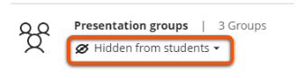
- Within a specific group set: the visibility drop-down menu appears in the top right. 
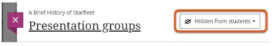

### Create a group set

1. Under **Details & Actions**, click **Course Groups**. You'll see "Create and manage groups" here if you don't have any groups yet, or "View sets & groups" if you have existing groups. 
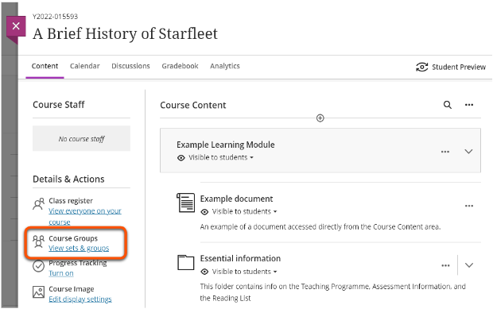
2. Click **New Group Set** with the plus icon in the top right (on a small screen you'll only see the plus icon). 
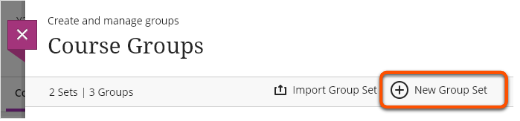
3. Click the default 'New group set' name and input your desired name, e.g. "Presentation groups". 

4. Click **Save** or create groups and assign students using one of the methods below.

### Import a group set

You can import a CSV file with details of the group set and names of the groups to create (not student allocations at this point). However, unless you have a lot of groups to create, it's usually quicker to create the group set manually.

1. Under **Details & Actions**, click **Course Groups**. You'll see "Create and manage groups" here if you don't have any groups yet, or "View sets & groups" if you have existing groups. 

2. Click **Import Group Set** with the arrow icon near the top right (on a small screen you'll only see the arrow icon). 
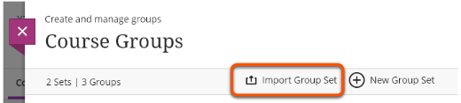
3. **Upload** your CSV file according to the format in the template given.
4. Click **Import**.
5. Allocate students using one of the methods below.

## Assign students to groups

There are numerous ways to assign students to groups:

- random assignment
- custom (manual) assignment
- self-enrol
- reuse groups
- import assignments

For each method, start by opening the Group Set: under **Details & Actions**, click **Course Groups** and select a group set. If you don't have a group set yet, follow the steps above.
 
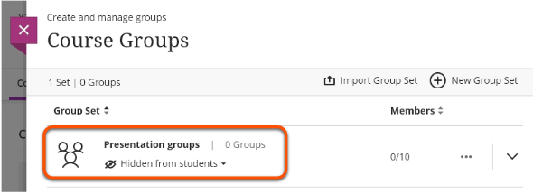

Then follow one of the methods below.

!!! Tip
	
	To unassign students from all groups and start over, open the Group Set and click **Unassign all** in the upper right corner of the screen.

### Custom (manual) assignment

Manually choose which students are assigned to each group.

1. Next to **Group students**, select **Custom** from the drop-down menu (this is the default option). 
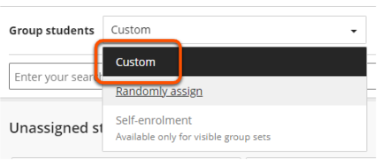
2. Under the student names, click the plus icon to create groups. Alternatively, you can create groups later. 
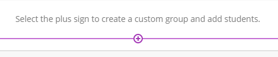
3. For each group, click the default 'New group X' name and input your desired name, e.g. "Presentation group 1". Add a description if you wish. 
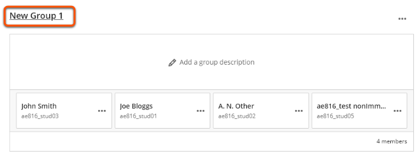
4. In the **Unassigned students** area, select the students to add to the first group. 
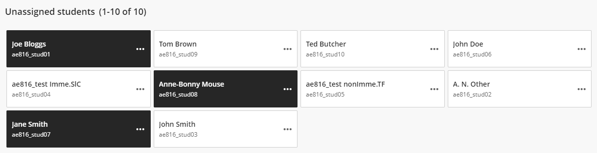
5. Click the three dots icon next to one of the student's names and select the group to add the selected students to. If you didn't create groups in step 2, you can create a new group here. 
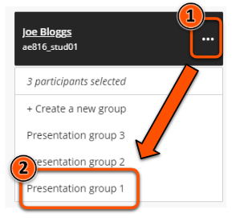
6. Repeat steps 4 and 5 until all students are assigned to a group.
7. Adjust group set visibility if desired (see above).
8. Click **Save**

### Random assignment

Automatically assign students at random to evenly-sized groups.

1. Next to **Group students**, select **Randomly assign** from the drop-down menu. 
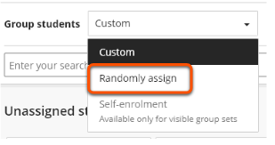
2. Next to **Number of groups**, select your desired number of groups from the drop-down menu. Each option shows the resulting group size. 
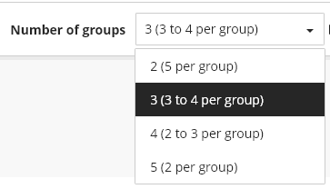
3. For each group, click the default 'New group X' name and input your desired name, e.g. "Presentation group 1". 

4. Add a description for each group if you wish. 
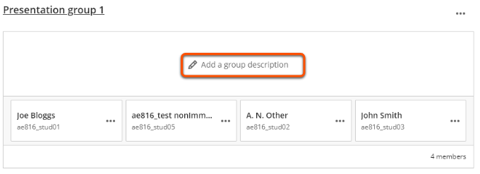
5. Adjust group set visibility if desired (see above).
6. Click **Save**.

### Self enrol

Students choose which group to join (eg. choose the project topic they want to do).

1. Use the **visibility menu** in the top right to make the group set visible to students. 

2. Next to **Group students**, select **Self-enrolment** from the drop-down menu. 
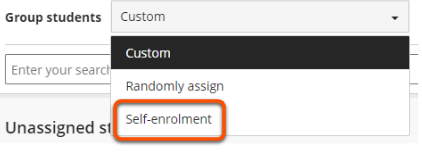
3. In the Advanced options section that appears, add a **Description** with instructions for students, and **enrolment start and end dates**. Adjust the **maximum members per group** if desired (make sure this gives enough capacity for all students to join a group). 
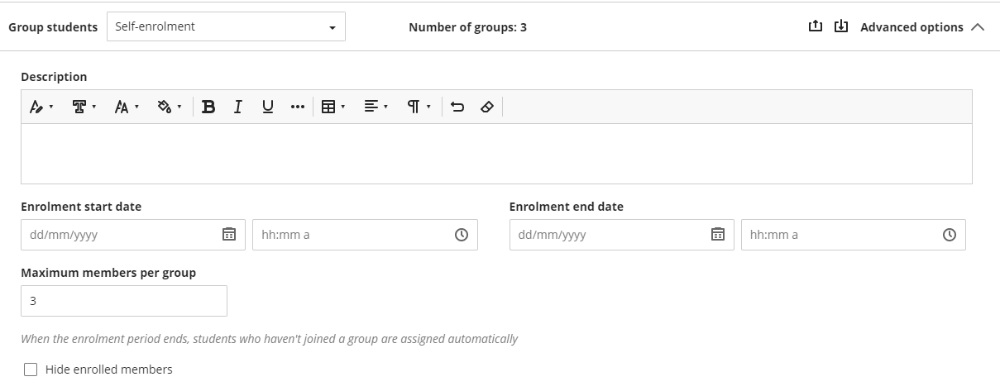
4. Self-enrol groups are automatically created. You can add more groups by clicking the plus icon at the bottom of the page, or delete a group by clicking the three dots next to the group name. 

5. For each group, click the default 'New group X' name and input your desired name, e.g. "Presentation group 1". Add a description if you wish. 

6. Adjust group set visibility if desired (see above).
7. Click **Save**

### Reuse groups

Copy groups and student assignments from another group set.

1. Next to **Group students**, select a group set under **Reuse groups** from the drop-down menu. You'll only see this option if you have at least one other existing group set. 

2. The groups and student assignments will be copied from the selected group set. Edit group names and descriptions as needed.
3. Adjust group set visibility if desired (see above).
4. Click **Save**

### Import groups or members

1. 

## Managing groups

### Add a group

### Delete a group

### Unassign students from groups

### Move students to a different group

1. In the Course Groups pane, click the **Group set** you want to change.
2. Locate the student you want to move, then click the three dots icon next to their name.
3. Select the group to move the student to.
4. Click **Save**.

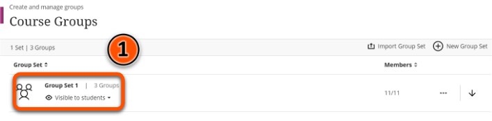
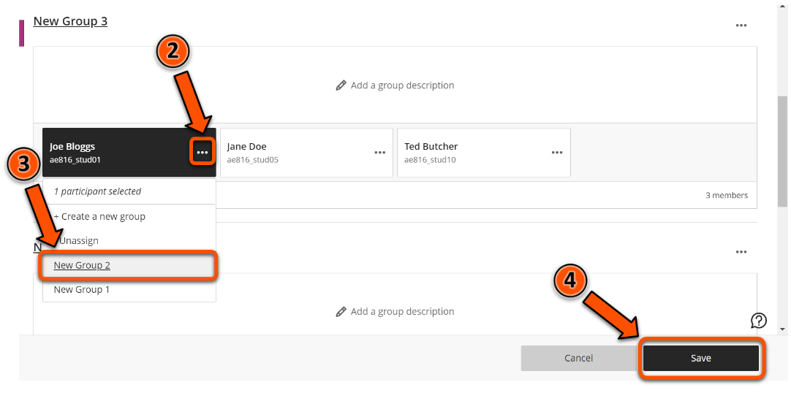