---
tags:
    - Advanced
    - Teaching
    - Administration
    - Ultra
---

<!-- Site used for demo: Y2022-015593 (10 example students) -->

# Groups

!!! Summary

    Use Groups to manage teaching and administration activities in your course. There are various ways to assign members to groups. 

## Video Steps

Below is an embedded video showing how to set up Groups in Ultra. Alternatively, you can [open the video in a new browser tab](https://youtu.be/tdaSl74psNY). 

<!-- PASTE YOUTUBE EMBED (should look like this:) -->
<iframe width="560" height="315" src="https://www.youtube.com/embed/tdaSl74psNY" title="YouTube video player" frameborder="0" allow="accelerometer; autoplay; clipboard-write; encrypted-media; gyroscope; picture-in-picture" allowfullscreen></iframe>

## Why use groups?

Groups can be used in many ways to manage different teaching and administrative activities in your course. Common uses of groups include:

- facilitating collaborative work (eg. group projects or assignments).
- restricting course content visibility (eg. provide separate Discussions for each seminar group).
- managing assessment workflows (eg. identify students with deadline extensions).

Administrative staff managing assessments, may wish to follow the guide: [Setting up Groups to manage extensions, glagging and multiple markers using CSV files](https://docs.google.com/document/d/1Qvp8gtv8INZOn_Ns4tbJuFJjIu9edDB6hV7oOYpLdoc). 

## Group Sets

Groups are organised within Group Sets, which is a 'group of groups' for a specific purpose. For example:

- a Presentation group set to allocate students for a group presentation.
- a Marking group set to assign submissions to different markers.

Within a group set, students can only belong to one group; Presentation group 1 OR Presentation group 2.
Across group sets, students can belong to multiple groups; Presentation group 1 AND Marking group 2.

### Group set visibility
Each group set can be hidden from (default) or visible to students depending on the set's purpose. If the group set is visible, students will only see their specific group.

For example, the Presentation group set should be visible so that students can see their group details, but the Marking group should be hidden as students don't need access to this information.

There are two ways to set group set visibility: 

- On the Course Groups page: the visibility drop-down menu appears under each group set name. 

- Within a specific group set: the visibility drop-down menu appears in the top right. 

### Create a group set

1. Click **Groups** in the top navigation pane. Here you can view and manage all of the group sets you have created. 
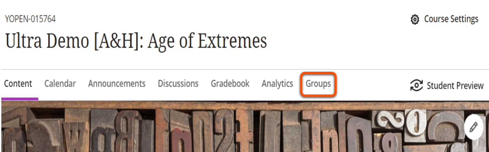
2. Click **New Group Set** with the plus icon in the top right (on a small screen you'll only see the plus icon). 

3. Click the default 'New group set' name and input your desired name, e.g. "Presentation groups". 

4. Click **Save** or create groups and assign students now using one of the methods below.

<!-- ### Import a group set (and empty groups)

You can import a CSV file with details of the group set and names of the groups to create (not student allocations at this point). However, unless you have a lot of groups to create, it's usually quicker to create the group set manually.

1. Under **Details & Actions**, click **Course Groups**. You'll see "Create and manage groups" here if you don't have any groups yet, or "View sets & groups" if you have existing groups. 

2. Click **Import Group Set** with the arrow icon near the top right (on a small screen you'll only see the arrow icon). 

3. **Upload** your CSV file according to the format in the groups template given.
4. Click **Import**.
5. Click **Save** or assign students to groups now using one of the methods below. -->

## Assign students to groups

There are numerous ways to assign students to groups:

- random assignment
- custom (manual) assignment
- self-enrol
- reuse groups
- import groups and assignments

For each method, start by opening the Group Set: under **Details & Actions**, click **Course Groups** and select a group set. If you don't have a group set yet, follow the steps above. 

Then follow one of the methods below.

### Custom (manual) assignment

Manually choose which students are assigned to each group.

1. Next to **Group students**, select **Custom** from the drop-down menu (this is the default option). 

2. Under the student names, click the plus icon to create groups. Alternatively, you can create groups later. 

3. For each group, click the default 'New group X' name and input your desired name, e.g. "Presentation group 1". Add a description if you wish. 

4. In the **Unassigned students** area, select the students to add to the first group. 

5. Click the three dots icon next to one of the student's names and select the group to add students to. If you didn't create groups in step 2, you can create a new group here. 

6. Repeat steps 4 and 5 to assign all students to a group.
7. Click **Save**

### Random assignment

Randomly assign students to evenly-sized groups.

1. Next to **Group students**, select **Randomly assign** from the drop-down menu. 

2. Next to **Number of groups**, select your desired number of groups from the drop-down menu. Each option shows the resulting group size. 

3. For each group, click the default 'New group X' name and input your desired name, e.g. "Presentation group 1". 

4. Add a description for each group if you wish. 

5. Click **Save**.

### Self enrol

Students choose which group to join (eg. the project topic they want to do).

1. Use the **visibility menu** in the top right to make the group set visible to students. 

2. Next to **Group students**, select **Self-enrolment** from the drop-down menu. 

3. In the Advanced options section that appears:

    - add **Description** with instructions for students
    - add **enrolment start and end dates**
    - adjust the **maximum members per group** if desired (make sure this gives enough capacity for all students to join a group). 

4. A number of self-enrol groups are then automatically created. You can add or delete groups as needed to give your desired amount. 

5. For each group, click the default 'New group X' name and input your desired name, e.g. "Presentation group 1". Add a description if you wish. 

6. Click **Save**.

### Reuse groups

Copy groups and student assignments from existing group set.

1. Next to **Group students**, select a group set under **Reuse groups** from the drop-down menu. You'll only see this option if you have at least one other existing group set. 

2. Groups and student assignments will be copied from the selected group set. Edit as needed.
3. Click **Save**.

## Manage groups & members

Start by opening the Group Set: under **Details & Actions**, click **Course Groups** and select a group set to manage.

!!! Tip
    Editing groups or assignments here will affect all places where that group is used: Discussions, group assignments etc.

### Add a group

1. Click the plus icon in the list of existing groups. 

2. Click the default 'New group X' name and input your desired name, e.g. "Presentation group 1". 

3. Add a description for each group if you wish.
 
### Delete a group

1. Click the three dots across from the group name and select **Delete group**. 
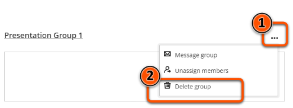
2. On the 'Are you sure' prompt, click **Delete** again. Note: this can't be undone.
3. Students from the deleted group are returned to the **Unassigned students** section.

### Move or unassign individual students

1. Select the student(s) to move and click the three dots next to their name.
2. Select an option from the drop down menu that appears: create a new group, unassign from the current group or move to an existing group. 
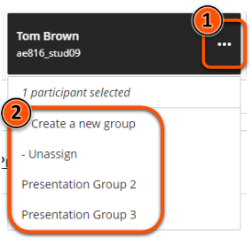

### Unassign students in bulk

- Unassign all students from all groups in a group set: Click **Unassign All** near the top right of the group set page. 
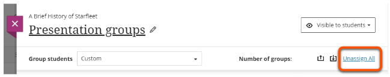
- Unassign all students from a single group: click the three dots across from the group name and select **Unassign members**. 
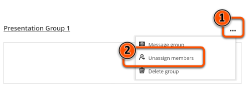
- Unassigned students are returned to the **Unassigned students** section.

## Import groups or members

You can upload group and/or member information from CSV files (in separate stages). It's possible to import to multiple group sets using the same CSV file.

!!! Tip 
    It can be very fiddly to prepare the CSV files in the right format, so unless you have a lot of groups and/or enrolments it's likely easier to set up and assign members to groups using one of the methods above.

### Import groups

Recommended only for importing a large amount of groups. In most cases it will be quicker and easier to create groups manually.

1. Create and save a group set and then reopen it, or the import icon won't appear.
2. Click the import **box/arrow icon** near the top right. If you hover over this icon, the text 'Import groups or Members' will appear. 
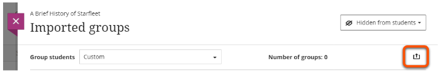
3. On the **Create groups** tab, click **Download groups template**.
4. Open the downloaded file and fill in the group information:

    - **Group Code** (mandatory): an alphanumeric code for each group, eg. g1. These are only used to import group assignments, so can be anything.
    - **Title** (mandatory): the group title that will be visible in the course, eg. Presentation group 1.
    - **Description** (optional): a description for the group that will be visible in the course.
    - **Group Set** (mandatory): the name of the group set, with words separated by _gc_, eg. Presentation groups becomes Presentation_gc_groups.
    - **Self Enroll** (mandatory): Y or N, depending on whether the groups should be self-enroll. 
    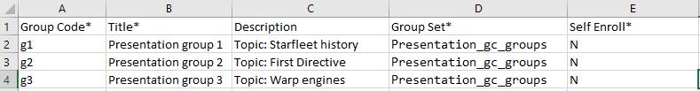

5. Save the file in **csv format** (NOT .xls or .xlsx).
6. On the **Create groups** tab, upload the CSV file and click **Import**. 
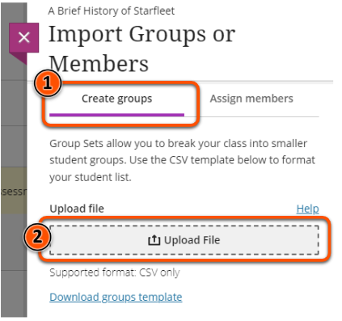
7. Click **Save**.

### Import assignments/group members
1. Create and save a group set and then reopen it, or the import icon won't appear.
2. Click the import **box/arrow icon** near the top right. If you hover over this icon, the text 'Import groups or Members' will appear. 

3. On the **Assign members** tab, click **Download members template**.
4. Open the downloaded file and fill in the group information:

    - **Group Code** (mandatory): the alphanumeric code for the relevant group, eg. g1. This is the code created in the import groups step.
    - **Username** (mandatory): the student's username, eg abc123.
    - **StudentID** (optional): leave blank.
    - **First Name** (optional): leave blank.
    - **Last Name** (optional): leave blank.
    - **Group Set** (optional): if assigning members to 1 group set, leave blank. If assigning members to 2+ group sets, the name of the group set, with words separated by _gc_, eg. Presentation groups becomes Presentation_gc_groups. 
    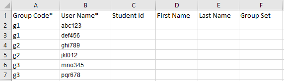

5. Save the file in **csv format** (NOT .xls or .xlsx).
6. On the **Assign members** tab, upload the CSV file and click **Import**. 
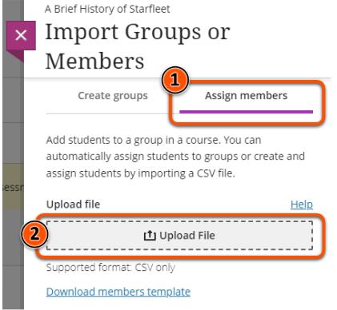
7. Click **Save**.

### Group Spaces

Students can access their assigned groups on the groups tab. From there, students can view all student members of their group.

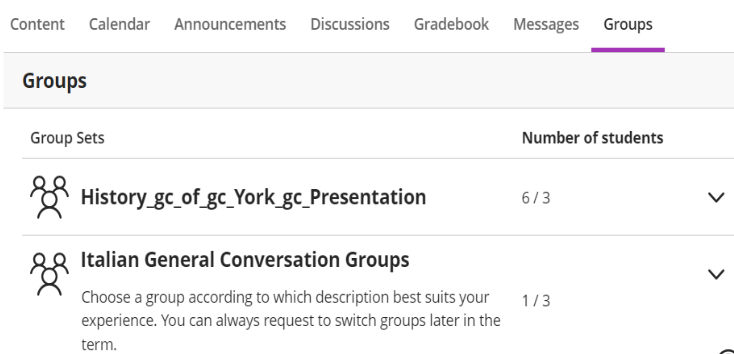

To access a Group Space, students should select the group's name. Students can access all assessments aligned to their group.

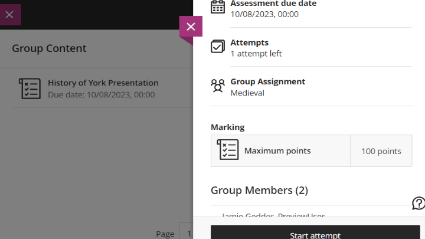