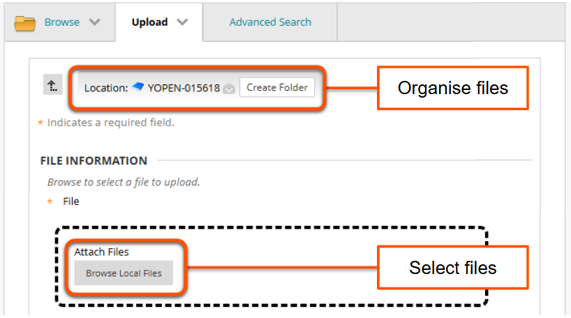
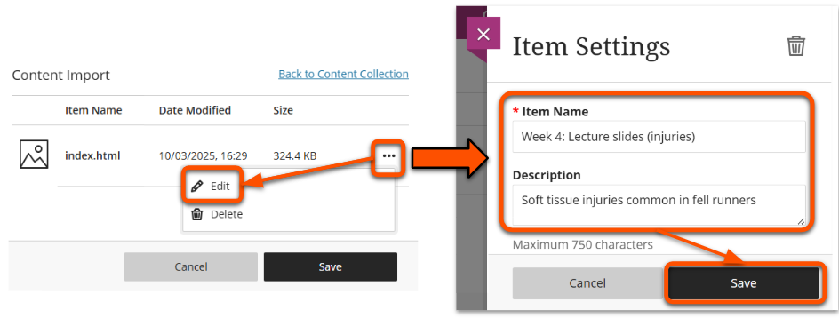

---
tags:
    - Ultra
---

# Upload custom HTML objects

!!! Summary

    Request access to upload custom HTML objects to your site.

Use this workflow to add custom HTML objects to your site. For example, you can upload lecture notes or slides created with an authoring tool such as reveal.js. This can be especially useful for providing accessible maths-based content.

!!! Tip

    The [Document HTML content block](../ultra/documents.md#block-html) is only for embedding content from third-party tools (eg. Panopto videos). Do not use it to add custom HTML objects.

## Request access

Request access by [filling in the "Upload HTML Objects" form](https://docs.google.com/forms/d/e/1FAIpQLSdU0y5Y8hWQAmschhaVXDs7216IOD1d36269fM5lmIKCYmEsA/viewform). We will confirm via email when you have been given the right permissions settings.

## Prepare your files

You can upload either:

- a self-contained HTML file (ie. styles and scripts included in the file directly)
- a zip file containing a HTML file and relevant assets (ie. styles and scripts in separate files)

!!! Warning

    When uploading a zip file, the HTML file must be on the same level as the assets folder(s) to set up access permissions correctly.

    - Correct: Zip file > project folder > **HTML file** & asset folder(s)
     Students will see the expected output.
    - Incorrect: Zip file > **HTML file** & project folder > asset folder(s)
     Students will see the raw HTML only, without associated styles or scripts.

## Upload your files

1. In your Ultra site, hover where you want the HTML content to appear. Click the **plus icon** then select **Content Collection**.
 
2. Click **Browse Content Collection** to open the Content Collection page. 
3. Click **Upload** then select **Upload files** or **Upload Zip Package** as relevant.
 
4. Select the file to upload. Optionally, you can organise the uploaded file(s) by navigating to an existing folder or clicking **Create Folder**. Click **Submit**
 
4. In the list of items, tick the box next to the HTML file to link and click **Submit**.
5. Back in your your site, click the **three dots icon** next to the item name then select **Edit**. On the settings panel, enter a meaningful title and description. Click **Save**. You can also edit this later.
 
6. Click **Save** to import the file to your site.