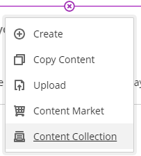
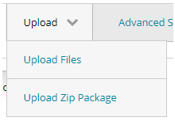
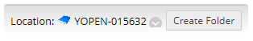

---
tags:
    - Ultra
---

# Upload custom HTML objects

!!! Summary

    Request access to upload custom HTML objects to your site.

!!! Warning

    Do not add custom HTML using the **Add HTML** content option: site CSS is not applied and it can conflict with Ultra's own code. This option is only for embedding content from third-party tools.

## Request access

Request access by [filling in the "Upload HTML Objects" form](https://docs.google.com/forms/d/e/1FAIpQLSdU0y5Y8hWQAmschhaVXDs7216IOD1d36269fM5lmIKCYmEsA/viewform). We will confirm via email when you have been given the right permissions settings.

## Prepare your files

Prepare your HTML files and turn them into a zip package ready for upload once access has been granted.

## Add your files

1. In your Ultra site, hover where you want the embedded content to appear.
2. Click the **plus icon** then **Content Collection**.
 
3. Click **Browse Content Collection**.
4. Click **Upload** then **Upload Zip Package**.
 
5. Near the top of the screen, click **Create Folder** and give your new folder a name. Click **Create Folder**. You can also navigate to a folder that already exists in your VLE site Content Collection.
 
6. Click **Browse local files** and select your zip package. Click **Submit**.
7. Select the index.html or first page of your web package, and click **Submit**.
8. Click **Save** in the Content Collection screen and the link to the first page of your web content will appear in the VLE site.

!!! Tip
    Click the 3 dots icon to rename the file so it shows in the site as something meaningful (eg. *Lab notes* rather than *index.html*) You can also edit this name after you save.