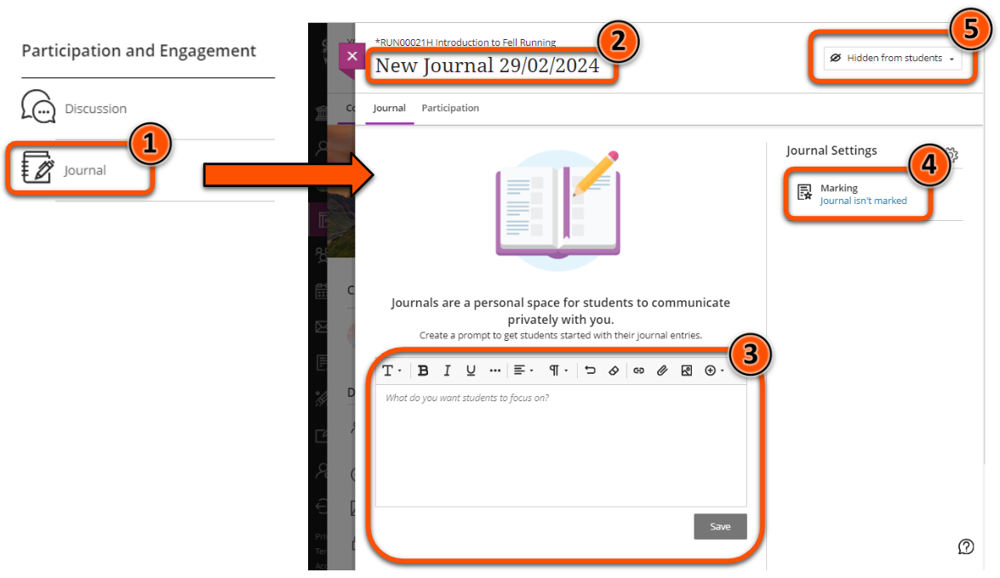

---
tags:
    - Assessment
    - Communication
    - Interactive content
    - Ultra
---

# Journal

!!! Summary

    Journals are a personal space for reflection and communication between a student and teacher. They can be used for informal tasks or for assessment.

    This guide covers how to use and set up a Journal, and is primarily aimed at **teaching staff**.

!!! principle "Relevant [VLE site design principles](../ultra/site-design-principles.md)"

    - 4.1 Essential: The assessment section contains all information about module assessments.
    - 4.2 Essential: Assessment instructions are clearly labelled and explain the task and requirements.

## When to use Journals

Journals can be useful in a variety of situations:

- reflective practice
- demonstrate development over time
- ongoing individual project work
- non-anonymous formative/summative assessment tasks
- student-directed or teacher-directed entries

## Set up a Journal

### Journal location
Consider where students would expect the Journal to appear.

#### With module materials
Journals used for informal reflection or project work may be best placed alongside the relevant module materials, or in a dedicated project area.

#### In the Assessment section
Journals listed as either a formative or summative assessment in your module catalogue entry should appear in the Assessment section of the site. If you also want the Journal to be accessible through a weekly content folder, use a Course Link.

### Create a Journal

1. In the relevant location, click **Create** > **Journal**.
2. Give the Journal a descriptive **name** at the top left.
3. Add a **prompt** with instructions.
4. Choose whether the Journal is graded and adjust other settings as needed.
5. Set the test as **Visible to students** or specify  **Release conditions** in the top right.

This is demonstrated in the video below, or for more detail see [Blackboard's guide to setting up Journals](https://help.blackboard.com/Learn/Instructor/Ultra/Interact/Journals)

<iframe width="560" height="315" src="https://www.youtube.com/embed/lk180brvk2c?si=D3JU-GJY7zBA5P4P" title="YouTube video player" frameborder="0" allow="accelerometer; autoplay; clipboard-write; encrypted-media; gyroscope; picture-in-picture; web-share" allowfullscreen></iframe>
[Blackboard guide: Create a Journal in the Ultra Course View [YouTube]](https://youtu.be/lk180brvk2c?si=bfzUaZLJVsuDQqrA)

## Marking a Journal

Journals can be used for assessment purposes, and marked online in the Ultra site. You can include a marking rubric.

For details on the marking workflow, see [Blackboard's guide to Grading Journals](https://help.blackboard.com/Learn/Instructor/Ultra/Interact/Journals/Grade_Journals).