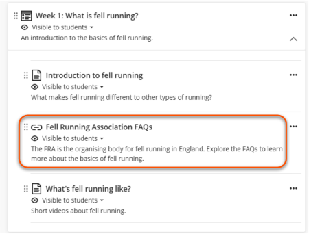
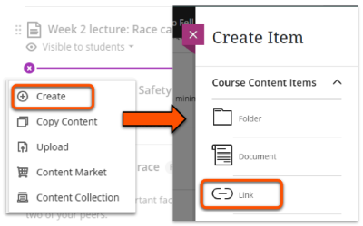
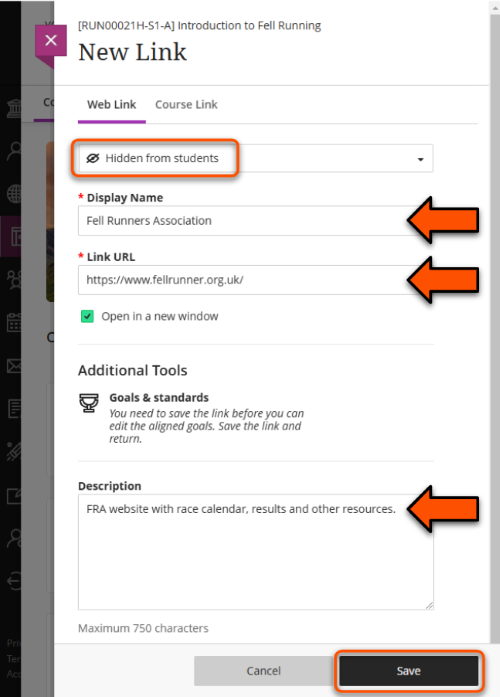
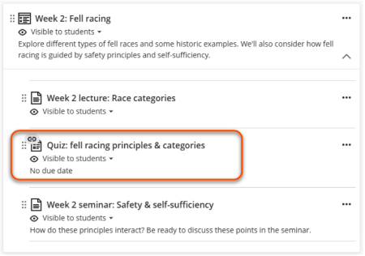
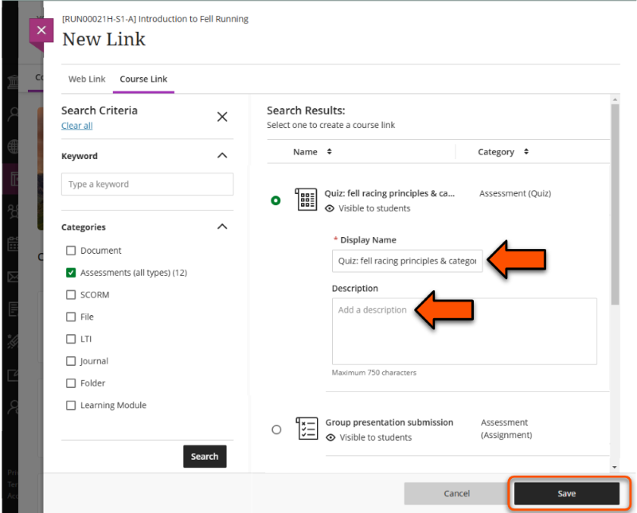

---
tags:
    - Ultra
---

# Links

!!! Summary

    There are various ways to link to external websites or other course items. 

!!! principle "Relevant [VLE site design principles](../ultra/site-design-principles.md)"

    - 3.4 Essential: Site and materials content is accessible.
    - 3.6 Essential: Links and materials titles describe the destination or content.

## Weblinks

See our [guide to the Documents Content Block](../ultra/documents.md#block-content-text-editor) for details of how to add a link within text.

Links can be added as a **standalone content item** within the Course Content area. This is recommended for reference materials or other content that doesn't require context, such as student handbooks.

1. Hover over where you want to add the link and click the **plus icon**.
2. Click **Create** then select **Link**.
 
3. On the *New Link* panel, enter a **Display Name** (title), the URL and a brief description. Make it visible to students, then click **Save**.
 

Watch a demonstration of adding a standalone Link item:
<iframe width="560" height="315" src="https://www.youtube.com/embed/yC8dvJsoC4g" title="YouTube video player" frameborder="0" allow="accelerometer; autoplay; clipboard-write; encrypted-media; gyroscope; picture-in-picture; web-share" allowfullscreen></iframe>
[Adding links in Ultra [YouTube]](https://youtu.be/yC8dvJsoC4g)

## Course Link

Course Links display a VLE content item in another area of the same site, helping users navigate easily between content in different areas. For example, a Course link could be added to a weekly materials section to direct students to details of an assessment task introduced that week.

The linked item appears in the Course Content area with a small link icon added to the usual item icon.

To add a Course Link: 

1. Hover over where you want to add the link and click the **plus icon**.
2. Click **Create** then select **Link**.
  
3. Select the **Course Link** tab. 
4. Enter a *keyword* and/or select a relevant content *Category*, then click **Search**.
5. Select the relevant item. Adapt the **Display Name** (title) and **Description** as needed (this does not change the original item).
6. Click **Save**.

