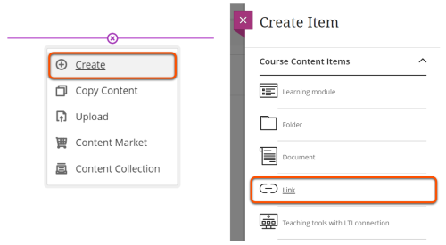
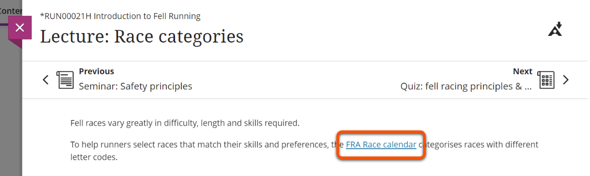
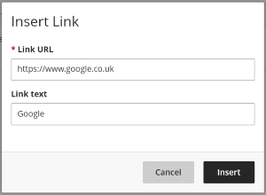
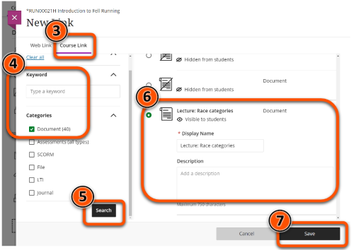

---
tags:
    - Ultra
---

# Links

!!! Summary

    There are various ways to link to external websites or other course items. 

!!! principle "Relevant [VLE site design principles](../ultra/site-design-principles.md)"

    - 3.4 Essential: Site and materials content is accessible.
    - 3.6 Essential: Links and materials titles describe the destination or content.

## Standalone Link item

Links can be added as a standalone item within the Course Content area. This is recommended for reference materials or other content that doesn't require context, such as student handbooks.

### Add a Link item

1. Hover over where you want to add the link and click the plus icon.
2. Choose **Create** then select **Link**.
 
3. Edit the title to show the link name, make it visible to students, enter the relevant URL, add a brief description, and click **Save**.
 

Watch a demonstration of adding a standalone Link item:
<iframe width="560" height="315" src="https://www.youtube.com/embed/yC8dvJsoC4g" title="YouTube video player" frameborder="0" allow="accelerometer; autoplay; clipboard-write; encrypted-media; gyroscope; picture-in-picture; web-share" allowfullscreen></iframe>
[Adding links in Ultra [YouTube]](https://youtu.be/yC8dvJsoC4g)

## Integrated hyperlink

Within a Document or other content item, Links can be integrated into text content. This gives context to the linked content and makes it easier to navigate content.

### Add a hyperlink
1. If adding a hyperlink to pre-existing text, highlight that text.
2. Press the **Link** tool in the Text Editor
 
3. Enter destination URL and a descriptive link (**not** "click here" or "open link") and press **Insert**
 

Watch a demonstration of adding a hyperlink:
<iframe width="560" height="315" src="https://www.youtube.com/embed/twsTPVFlULE" title="YouTube video player" frameborder="0" allow="accelerometer; autoplay; clipboard-write; encrypted-media; gyroscope; picture-in-picture; web-share" allowfullscreen></iframe>
[Adding hyperlinks in Ultra[YouTube]](https://youtu.be/twsTPVFlULE).

### Hyperlink accessibility tips

These tips are important for assistive technology (eg. a screenreader can pick out just the links from a page) and also make your content more readable:

- Describe the link content, eg: [How to write better link text](https://business.scope.org.uk/article/how-to-write-better-link-text-for-accessibility/).
- Don’t use generic text like ‘Click here’ or ‘more information’ - the link text must make sense by itself.
- Don't enter the raw URL as text.
- Don’t use the same link text for different URLs on one page.

## Course Link

Use Course Links to add a standalone link to another item within the same Ultra site. For example, you could link to an item in the Assessment section in the week it should be completed.

A Course Link appears in the Course Content area with a small link icon. Editing or deleting this link does not change the original item.

### Add a Course Link
1. Hover over where you want to add the link and click the plus icon.
2. Choose **Create** then select **Link**.
  
3. Select **Course Link**. 
4. Enter a keyword and/or select relevant Category.
5. Click **Search**.
6. Select the relevant item from results. You can adapt the display name and add a description for the link item (this does not change the original item).
7. Click **Save**

