---
tags:
    - Key guide - admin
    - Assessment
    - Ultra
---

# Mark Schemas

!!! Summary

    Mark schemas convert a raw numerical mark to another format, eg. A/B/C or Complete/Incomplete.

## When to use a Mark Schema

!!! Tip

    Mark Schemas can be applied to built-in Ultra assessment tasks only (eg. [Assignment](../ultra/assignment-set-up.md) and [Test](../ultra/test.md)). They cannot be applied to Turnitin Feed Studio or Gradescope assessments.

Mark schemas can be useful whenever raw scores should be converted to another mark or label. Possibilities include:

- Formative assessment:
    - convert numerical marks to a qualitative label (*Excellent*, *Good* etc.) to focus on the feedback rather than the grade.
    - display mark of 0/1 as Complete/Incomplete to show the work has been reviewed.
- Stepped or banded marking: automatically map raw marks to the relevant stepped grade (*62*, *65*, *68* etc.)

## How Mark Schemas works

Mark Schemas contain bands where ranges of raw marks are mapped to another format. Each band has two components:

- **Mark Name**: the converted label/letter/number etc. that is displayed (eg. *Excellent*)
- **Mark Range %**: the corresponding raw mark range that maps to the mark name (eg. *75% - 100%*)

For example, this mark schema has four bands:

- Excellent: 75% - 100%
- Good: 50% - <75%
- Satisfactory: 25% - <50%
- Poor: 0% - <25%

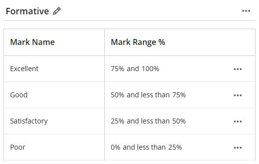

If this mark schema is applied to an assessment, a raw score of 55% is displayed as **Good**.

=== "Mark display: staff view"

    Once a raw score (*55*) is entered, the mapped mark (*Good*) is displayed on the:

    - marking interface
    - the assessment's Submissions tab
    - Gradebook Marks tab

    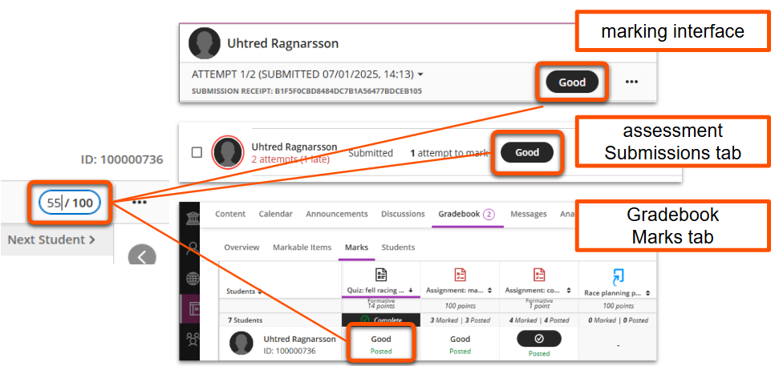

    Click the mapped mark to view or edit the raw score. This can only be done for individual students, not the whole cohort in bulk.

    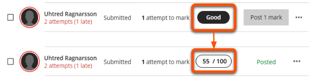

    The downloaded Gradebook shows different data depending on the mark download option selected:
    
    - **Full Gradebook**: mapped mark only (*Good*)
    - **Mark history**: mapped mark(*Good*) and raw score (*55*)

=== "Mark display: student view"

    After marks are posted, the mapped mark is displayed instead of the raw score on the student Gradebook view.
    
    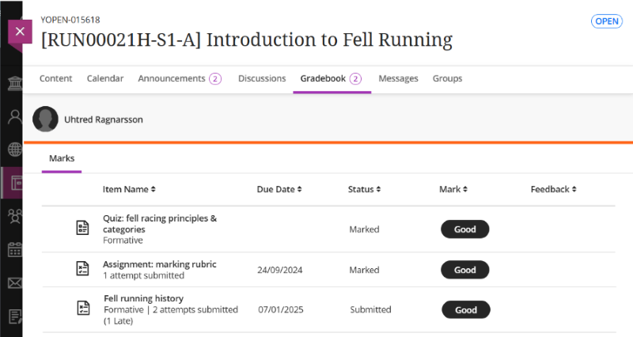
    
    The mark shown within the submission depends on the type of assessment and marking used:

    - Assignment with manual mark entry: mapped mark only (*Good*)
     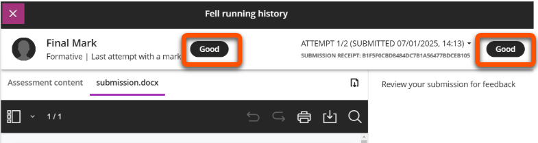
    - Assignment with marking rubric: mapped mark(*Good*) and the raw rubric score (*55/100*)
     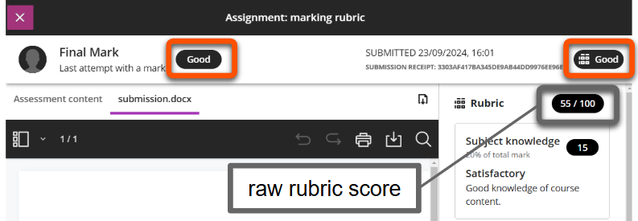
    - Test (auto and/or manual mark entry): mapped mark (*Good*), but the raw score can be calculated from the question scores (eg. *0/1*).
     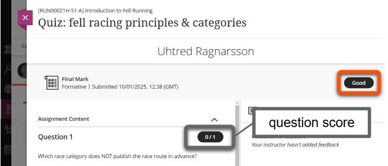

## Add and manage Mark Schemas

Set up and edit Mark Schemas in the Gradebook.

1. Open the **Gradebook** tab in the top navigation bar in the site. Any tab within the Gradebook is fine.
2. Click the **Settings (cog) icon** in the top right of the Gradebook, then click **Manage mark schemas** on the overlaid Settings menu.
 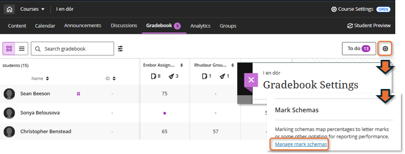
3. The Mark Schemas page lists all the site's mark schemas.
    - To add a new mark schema: click the **Plus icon**, then enter a name and click **Add**
    - To edit an existing schema: click the schema name
     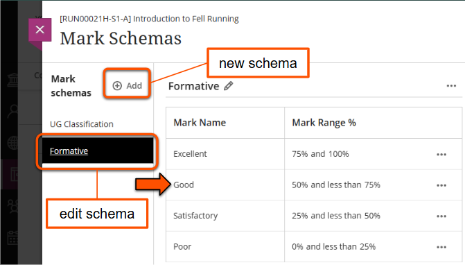
4. Within a Mark Schema you can edit the name, or click the **three dots icon** adjacent to the name to copy or delete the schema.
 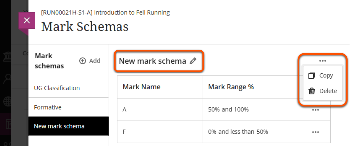
5. To add rows: hover between the relevant rows and click the **plus icon** that appears. Enter a Mark Name and the relevant Mark Range.
 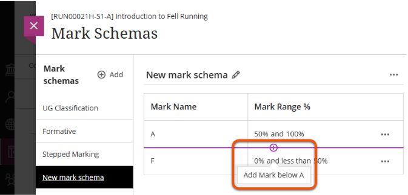
6. To edit existing rows: click the **three dots** icon on the right of the row or click the mark name or values. Update as needed.
 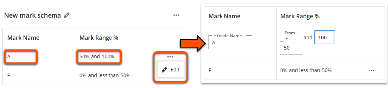
7. When the mark schema is finished, click **Save**.

!!! Tip

    There can't be gaps between mark ranges, so when building a new mark schema it may be easiest to first add the correct number of rows and then edit the mark ranges afterwards.

## Associate a Mark Schema with an Ultra assessment

After a Mark Schema is set up, you can associate it with built-in Ultra assessments. This can be done at any point in the assessment process.

1. Open or create an Assignment or Test.
2. Click the **cog icon** to open the assessment settings.
3. Under *Marking & Submissions*, open the drop down **Mark Using** menu.
4. Select the relevant Mark Schema.
5. Click **Save**.

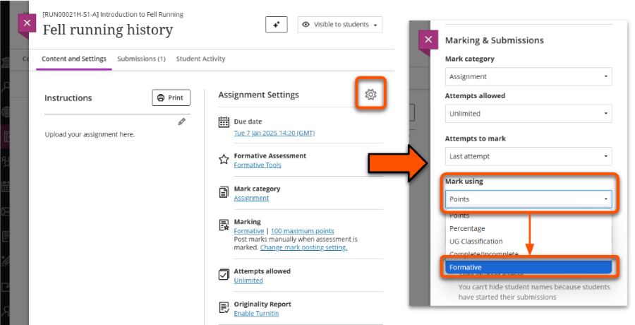

See the [Assignment](../ultra/assignment-set-up.md) or [Test](../ultra/test.md) guides for details on other Assessment Settings.