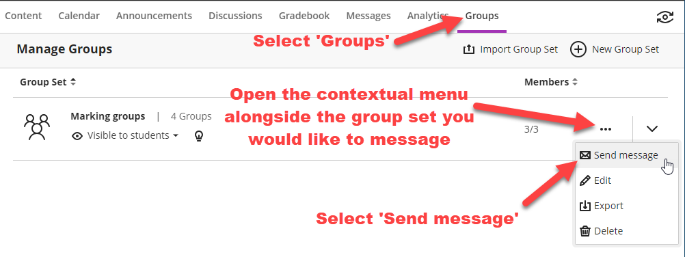
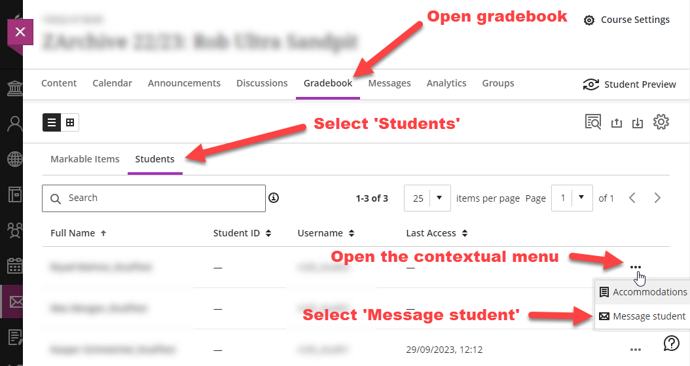
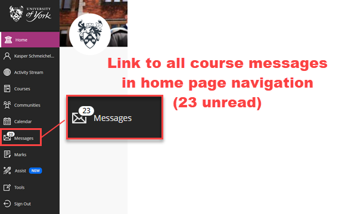
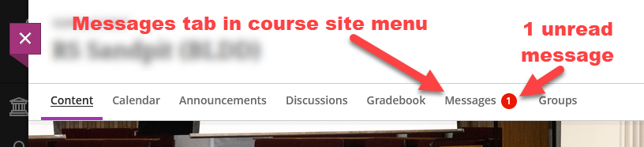

---
tags:
    - Foundation
    - Teaching
    - Administration
    - Ultra
---

# Messages

!!! Summary

    If you want to send targeted communications to users on your VLE site, then the Messages tool is more suitable than Announcements. By default the Messages tool is turned off on Ultra sites, but you can enable it and use it if desired. Students cannot reply to Messages.

## Background
Announcements are the recommended way to send messages to all users in a course site as they provide the option to make sure that an email is triggered to users if you wish and they also provide a reliable archive of sent announcements for all users within a course site. See [our announcements page](https://vle-support.york.ac.uk/ultra/announcements/) for the following guidance:

- Create an announcement
- Edit, copy or delete an announcement
- What do students see?
- What emails do announcements generate?

It is not currently possible to send announcements to specific sub groups of users within a course site such as to students only, or to specified groups or individuals.  Where this is required, it is possible to use the messages tool as described below. This works in a very similar way to announcements in that it sends a one-way message to students. It is not possible for them to reply to your messages, nor to create a new message themselves.

## Summary: Which Way?
There are two main ways to use Messages. Which way you choose largely depends on whether you want versions of the messages to appear: 

- in the VLE [and optionally via email] = "Way 1", *or* 
- only via email = "Way 2".

### Way 1 - Activate the Messages tool for your site  
This allows for messages via email and/or messages that also appear in the VLE.  An extra ‘Messages’ menu item will be added both at the top of the course VLE site and in the left navigation menu on the home page. See the "How do students access my messages?" section towards the bottom of the page for more details.

### Way 2 - *Don't* Activate the whole Messages tool for your site
Rather, send adhoc messages as needed from the Gradebook or Groups tab within a course site.  This allows for messages to be sent via email without a version appearing within the VLE. The ‘messages’ menu items will *not* appear in the course VLE site.  Instead, messages will only be sent via email and you will receive a copy of the sent message in your own email inbox.

## Way 1 - Details

1. **Activite the "Messages" tool:** click on the ‘Course settings’ link in the top-right of your VLE site, then toggle on the ‘Allow course messages’ option in the course settings options.
2. **Access the "Messages" tool:** normally you will do this by clicking on the "Messages" link on your site's top menu (under the name of your VLE site, alongside "Content", "Calendar", "Announcement", etc), but you can also messages from within the groups and gradebook areas of your site. Details of this are in "Way 2" below.
3. **Create and send your message** (these are immediate, and cannot be scheduled for the future): 

    i. click on the "New message" button in the top right of the screen

    ii. select the desired recipients for your message: either a pre-determined group, or individual users if you type in their name, or a combination of both

    iii. tick "send an email copy to recipients" if desired

    iv. type in your message, add any desired attachments, then click Send.

## Way 2 - Details
If you would simply like to email users within your site and you would prefer not to add the messages menu items in your site(s), you can access the messages tool for a site via the groups tab or the gradebook - see below.  

You will not be given the option to email the message and, instead, you will see a message stating ‘Recipients will receive this message as an email’.  The sent message will not appear in the VLE site but will be emailed to recipients.  You will also receive an emailed copy of the message.

### To message via Groups
Click on the ‘Groups’ tab to view any existing group sets in the course site.  To send a message to a whole group set, select the contextual menu alongside the group set and select ‘Send message’.

This will open a new message as described above with the group set pre-filled in the recipient list.  You can add further recipients or change the recipient(s) here as normal if you wish.  If you would like to choose a specific group to send a message to, you can also do this by selecting ‘Edit’ from the contextual menu to view all the groups within the group set.  Then choose ‘Message group’ from the contextual menu alongside the group you would like to message.  Again, this will open a new message as described above with the group prefilled in the recipient list, and again, the recipient list can be edited from here if you wish.

### To message via Gradebook
You can send a message direct from the Gradebook if you wish by opening the gradebook and selecting ‘Students’. Click on the contextual menu alongside the student you would like to send a message to, and choose ‘Message student’.  This will open a new message as described above with the student prefilled in the recipient list.  You can add further recipients or change the recipient(s) here as normal if you wish.

## How do students access my messages?

If you **opt to email students when you message** them, they will receive an email with the message contents in full regardless of the notification setting they have selected in their VLE profile.  

If you **do not opt to email students**, they will be able to see the messages:

- from [the Messages tab from the main VLE navigation pane](https://vle.york.ac.uk/ultra/messages), *or* 

- from the "Messages" tab at the top of the course site. 

Either way, the messages link will show the number of unread messages the user has. They may also receive an email notifying them that they have received a message and linking them to the VLE site, depending on their personal notification settings.

Unlike for announcements, students can delete messages from their own VLE view.  

While announcements appear in a student’s activity stream, messages do not.