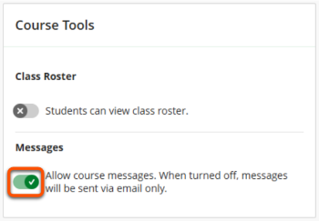
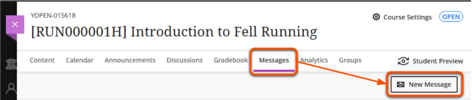
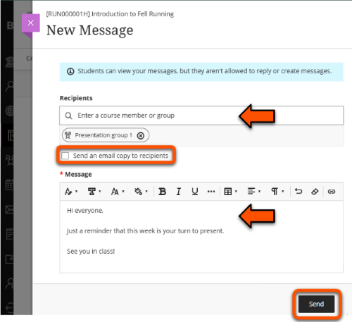
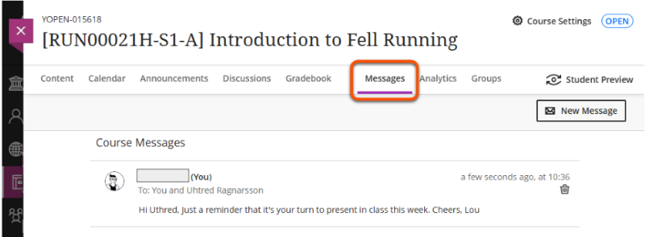
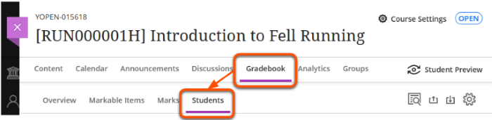
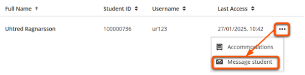
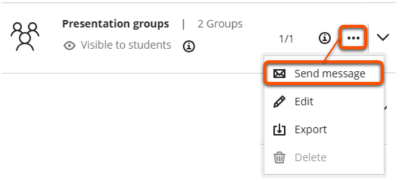
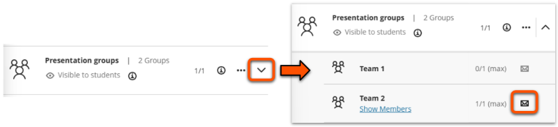
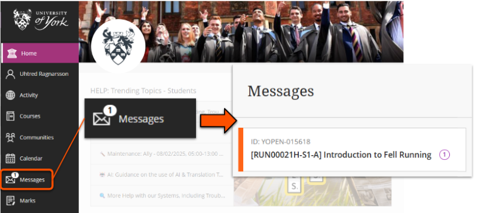
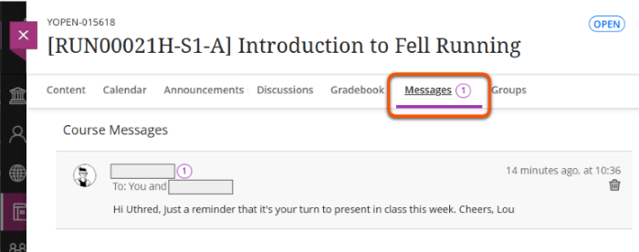

---
tags:
    - Communication
    - Ultra
---

# Messages

!!! Summary

    Messages are a one-way communication channel for targeted updates for specific users or groups.

!!! principle "Relevant [VLE site design principles](../ultra/site-design-principles.md)"

    - 1.3 Essential: Provide module staff details and communication expectations.

Messages are similar to [Announcements](../ultra/announcements.md), but can be **targeted to specific users or groups**. Students can't reply to Messages or create a new Message themselves.

!!! Tip

    - Messages are sent straight away. They can't be scheduled for later.
    - You can't send messages to hidden groups.

There are two main ways to use Messages depending on how you want messages to appear.

## Messages tool

Use the Messages tool to send messages within the VLE site and optionally also by email.

First, activate the Messages tool. This only needs to be done once, and can be turned off again later if desired.

1. Click **Course settings** in the top-right of the site.
2. In the *Course Tools* section, toggle on **Allow course messages**.
 
3. Close the panel and return to the site content. A *Messages* tab is now added to the top navigation menu in the site.

You can now use the Messages tool:

1. Click the **Messages tab** in the top navigation bar then the **New Message** button.
 
2. On the *New Message* panel:
    - Under *Recipients*, select individuals or groups to send the message to.
    - Optional: tick **Send an email copy to recipients**.
    - Enter your message using the text editor.
    - Click **Send**.
 
3. You can view Messages sent on the Messages tab.
 

## Adhoc Messages

The Message format via these methods depends on whether the Message tool is also activated:

- Messages tool active: message sent within VLE site and optionally also by email
- Messages tool off: message sent only by email

### Send to individuals via the Gradebook tab

1. Click the **Groups tab** in the top navigation bar and then the **Students tab**.
 
2. Locate the relevant student and click the **three dots icon** then select **Message student**.
 
3. On the *New Message* panel:
    - *Recipients* is pre-populated with the selected student. Check and edit as necessary.
    - If the Messages tool is also activated in your site, you can choose to **Send an email copy to recipients**.
    - Enter your message using the text editor.
    - Click **Send**.

### Send to groups via the Groups tab

!!! Tip

    Messages can't be sent to hidden or empty groups.

1. Click the **Groups tab** in the top navigation bar and locate the relevant Group Set.
2. To send a message to:
    - every group within the groupset, click the **three dots icon** and select **Send Message**.
     
    - a specific group, click the **chevron icon** to show the groups and click the **Message icon** for the relevant group(s).
     
4. On the *New Message* panel:
    - *Recipients* is pre-populated with the selected group(s). Check and edit as necessary.
    - If the Messages tool is also activated in your site, you can choose to **Send an email copy to recipients**.
    - Enter your message using the text editor.
    - Click **Send**.

## How students access Messages

!!! Tip

    - Message **do not** appear in the Activity Stream.
    - Students can choose to delete messages from their own VLE view.

Students can access **Messages sent within the VLE site** in a number of locations:

- The Messages page in the VLE main navigation pane (this shows Messages from all of their sites)
 
- The Messages tab within the site
 
- Depending on their chosen VLE notification settings, they may receive an email notifying them that they have received a message and linking them to the VLE site. This doesn't contain the actual message.

If the **Message is sent by email**:

- Students will receive an email with the message contents in full, regardless of their chosen VLE notification settings.
- Content in the emailed version may not display the same as the VLE version: [more details about "Messages" email content](https://docs.google.com/document/d/1ceRztJknmK7SWcnPHBibJnp9ny0nUvKoVJICteDmaGQ/edit).
