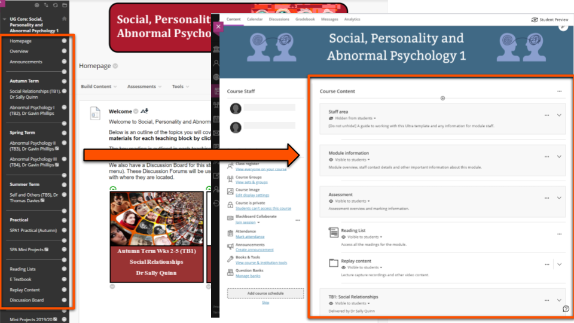
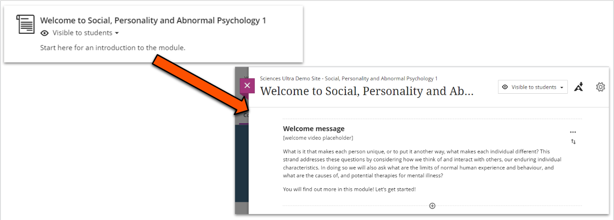
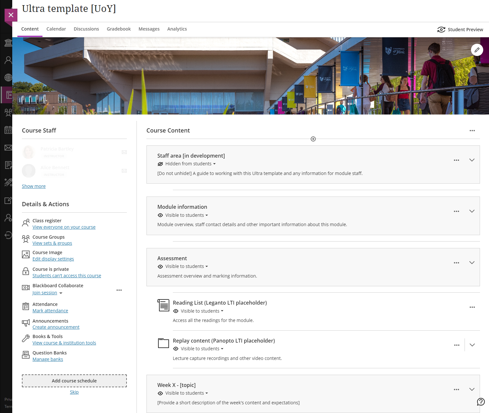

---
tags:
# Delete to leave only relevant tags
    - Foundation
    - Teaching
    - Ultra
---

# Moving to Ultra: introduction for module staff

!!! Summary

    Module sites will run as new Ultra sites from September 2023. This overview explains what this means for module staff and how you'll be supported.

## Key differences between Original & Ultra sites
There are some  structural differences that may affect how you present your module materials:

1. The Original left-hand navigation menu is replaced in Ultra by a **central Course Content area**.
    
2. In Ultra, items can include a short description on the Course Content area. Users then **open the item to see its content**.
    
3. Ultra allows **two levels of nesting** (folders within folders), compared to unlimited nesting in Original. 

## The VLE in 23/24: Ultra template sites
These structural differences between Original and Ultra sites (and Modularisation & Semesterisation changes) mean that **rollover will happen differently for 23/24**.

Instead of a direct copy of this year's Original site, you'll receive a blank **departmental Ultra template site** to populate with module materials.

!!! Note

    This only affects module sites created for 23/24. Existing Original module sites do not need to move to Ultra and will still be available for staff and students.

Here's a preview of the Course Content area in an Ultra template site:

Departmental template sites:

- are pre-populated with key departmental information, overall site structure and placeholders for key module information.
- are flexible so you can adapt them to fit your module's needs.
- contain resources and guides to help you build the site.

[Explore the Ultra template in this video tour](https://youtu.be/dkLWyI1UuRE):
<iframe width="560" height="315" src="https://www.youtube.com/embed/dkLWyI1UuRE" title="YouTube video player" frameborder="0" allow="accelerometer; autoplay; clipboard-write; encrypted-media; gyroscope; picture-in-picture; web-share" allowfullscreen></iframe>

## Adding your content to an Ultra template site
Ultra is more streamlined, so it's easier to create and organise content. Our Ultra training covers how to add content, and there will be a step-by-step guide to walk you through using the template to build your module site.

It's generally **quickest to build content within the Ultra site** because of the structural differences between Original and Ultra. This also gives you control over how and where content appears, so you know exactly what you're getting.

You can easily:

- [add and format text content](https://vle-support.york.ac.uk/ultra/adding-text).
- [upload images](https://vle-support.york.ac.uk/ultra/adding-images) and [files from your computer](https://vle-support.york.ac.uk/ultra/adding-files). Most documents will preview within a Document without needing to be downloaded.
- [embed interactive tools](https://vle-support.york.ac.uk/ultra/embedding-content) such as Padlet or Xerte.
- use the built in tool to quickly [add YouTube videos](https://vle-support.york.ac.uk/ultra/adding-youtube)
- [set up discussion boards](https://vle-support.york.ac.uk/ultra/discussions-setup).

**Copying or importing content from an Original site doesn't work well**. It is possible to copy content directly from an Original site, but structural differences mean that content will need very careful rearranging and restructuring - this generally takes longer than building content directly, so we don't recommend it in most cases.

However, copying content might be useful for Tests and some other specialised content types. See our [guide on copying content](https://vle-support.york.ac.uk/ultra/copying-content) for more information.

## Make moving to Ultra easier
There are some steps you can take now to make it easier for you to prepare your Ultra site for 23/24.

### Prepare your Original site

A clear and well-organised site will be easier and quicker to move to Ultra. To help prepare your site, you can:

- identify content to bring to the new Ultra site and make sure it's up-to-date.
- download relevant files that aren't already on your local storage or Google Drive.
- if your site has more than two levels of nesting (folders within folders), consider how you can restructure the content.

### Find out more about Ultra

- Participate in departmental Ultra training when available.
- Explore our [Learn Ultra guides](https://vle-support.york.ac.uk/ultra) on this site.
- Attend a [VLE information session](https://sites.google.com/york.ac.uk/vletransformationproject/#h.hv51efyttnrw) to learn about new features and next steps in the project.
- Join the [VLE transformation forum Slack channel](https://www.google.com/url?q=https%3A%2F%2Fuoy.slack.com%2Farchives%2FC022X8PJCV7&sa=D&sntz=1&usg=AOvVaw0Ga3lNGa4EBEuNQnRNM3i2) for updates or to ask questions.