---
tags:
# Delete to leave only relevant tags
    - Foundation
    - Teaching
    - Ultra
---

# Navigating an Ultra site (comparing to original)

!!! Summary

    The transition to Ultra site provides a number of advantages for different users. Staff benefit from new simpler workflows designed to make it easier to manage a VLE site. Students have a more activity based learner experience and are also able to access and use the VLE on any sized screen, such as mobile phone, tablet or computer. The guide gives you an overview on the key differences between the Ultra site and the Original site.

## Quick Guidance
<!-- Summary/key considerations -->

### Video Steps

Below is an embedded video detailing **how to differente an Original site and an Ultra site**. Alternatively, you can [open the video in a new browser tab](https://www.youtube.com/watch?v=zO1UCI92b_8).

<!-- PASTE YOUTUBE EMBED (should look like this:) -->

<iframe width="560" height="315" src="https://www.youtube.com/embed/zO1UCI92b_8" title="YouTube video How to differente an Original site and an Ultra site?" frameborder="0" allow="accelerometer; autoplay; clipboard-write; encrypted-media; gyroscope; picture-in-picture" allowfullscreen></iframe>

Below is an embedded video detailing **how to navigate an Ultra site**. Alternatively, you can [open the video in a new browser tab](https://www.youtube.com/watch?v=2y5NQCYidiI).

<!-- PASTE YOUTUBE EMBED (should look like this:) -->

<iframe width="560" height="315" src="https://www.youtube.com/embed/2y5NQCYidiI" title="YouTube video Navigating an Ultra site" frameborder="0" allow="accelerometer; autoplay; clipboard-write; encrypted-media; gyroscope; picture-in-picture" allowfullscreen></iframe>

### Text Guide

#### **How to differentiate?**

1. When you log onto Ultra, select **Courses** in the left-hand side menu to see all the courses you are enrolled in.

    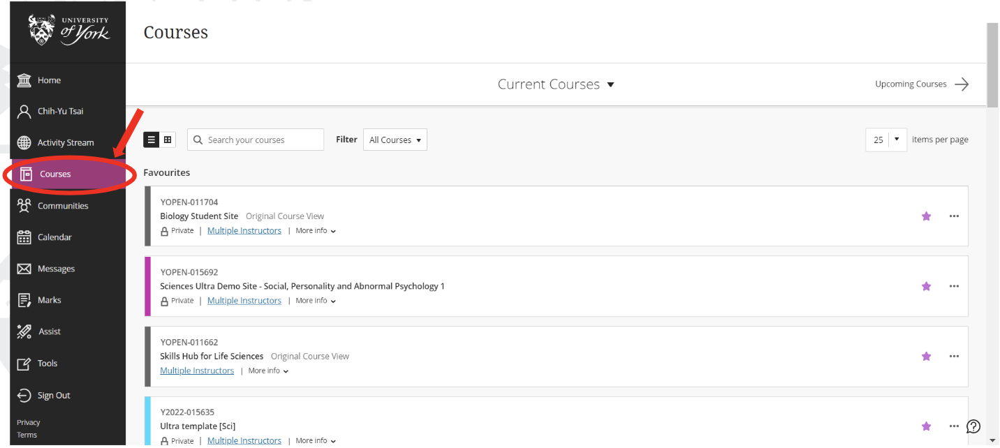

2. You may then need to **identify** which courses were created in Original Blackboard and which were created in Ultra. You can differentiate via the **colour bars** immediately to the left of each course. **Coloured bars typically indicate an Ultra site, while grey coloured bars indicate Original sites.** You can also differentiate Original sites from Ultra because Original sites will have states “**Original Course View**”.

    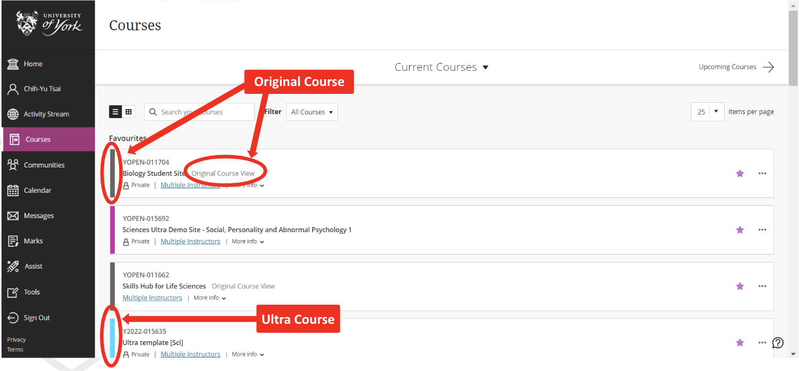

3. Once you select a course, differentiate Original sites from Ultra ones by looking at the navigation panel located to the left of the page. An Original site’s navigation panel is typically **grey and lacks icons**. When you select a Ultra site, the navigation panel on the left-hand side is typically **white in colour and organised with icons**.

    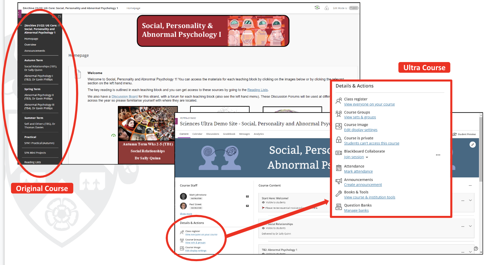

#### **Ultra site**

In the Ultra site, you have simplified workflows, a modern look and feel, and a fully responsive interface divided into three sections.

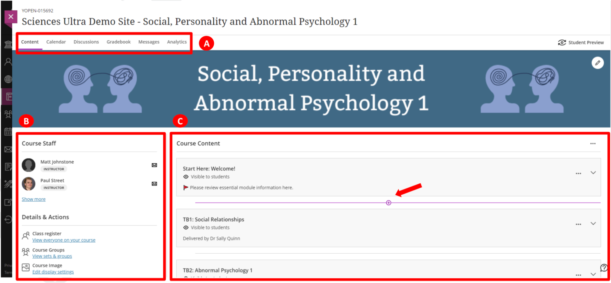

A: On the upper navigation bar, you can select the keywords to **open frequently used tools**, such as calendar, discussions or gradebook. Access frequently used tools quickly within your module via the upper navigation bar. 

B: You also have a left-hand side menu with icons. This is where you can **view module enrolments, create and manage groups, add a module banner image, set the module availability, post announcements, manage test question banks and add a module schedule.**

C: Finally, the middle part is the **Course Content area**. Select **the plus icon** wherever you want to create content. This is the area where you add your module information, learning materials and assessments as required for your module.

After selecting **the plus icon**, you are able to create items, such as documents or videos, through a new layer page on your right-hand side. You can also **copy content** from your past courses. All of your course items appear in the main part of the page.

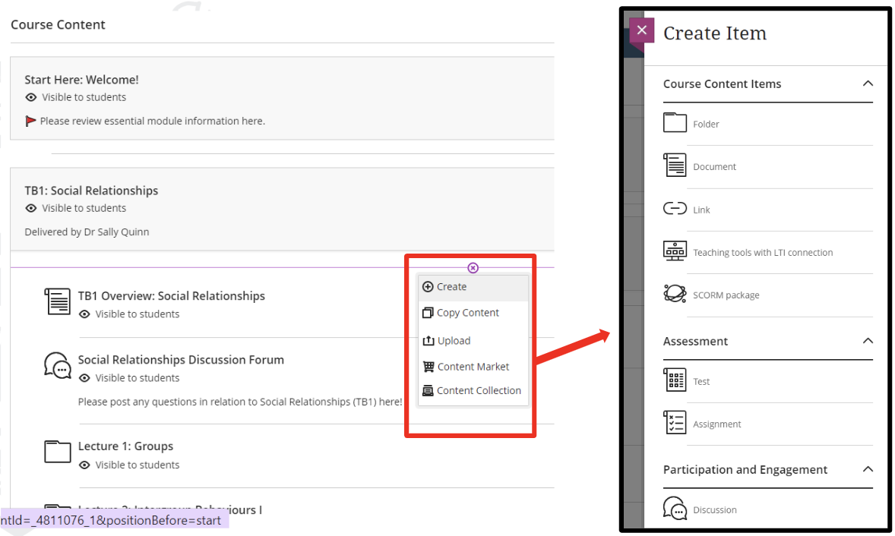

#### **Learning Modules vs Folders in Ultra**

In Ultra site, **Learning Modules** and **Folders** are the two types of containers you can use to organise course content. You can distinguish the two by the folder icon.

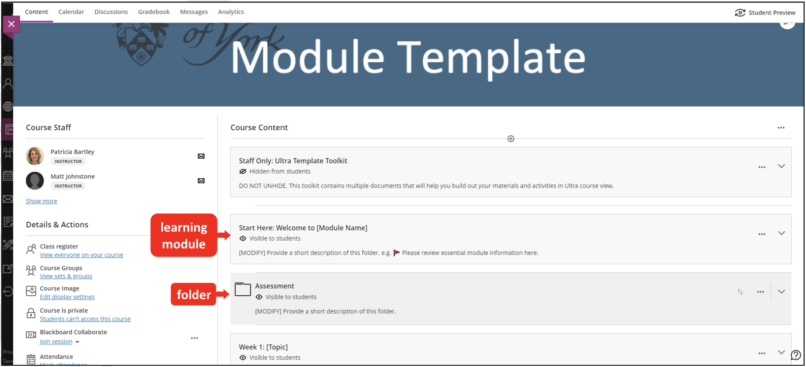

**1. Two-level structure**

When you build content, Ultra allows you to create 2 levels of structure. It is important to think about how you want to structure your module before adding content, especially when you copy content from the Original site. Although the interfaces might look similar to you, there are key differences for the student experience.

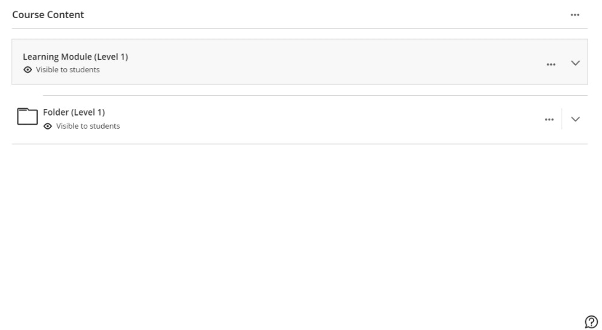

**2. Nesting**

In Original, you type the details of the content out on the learning module itself.

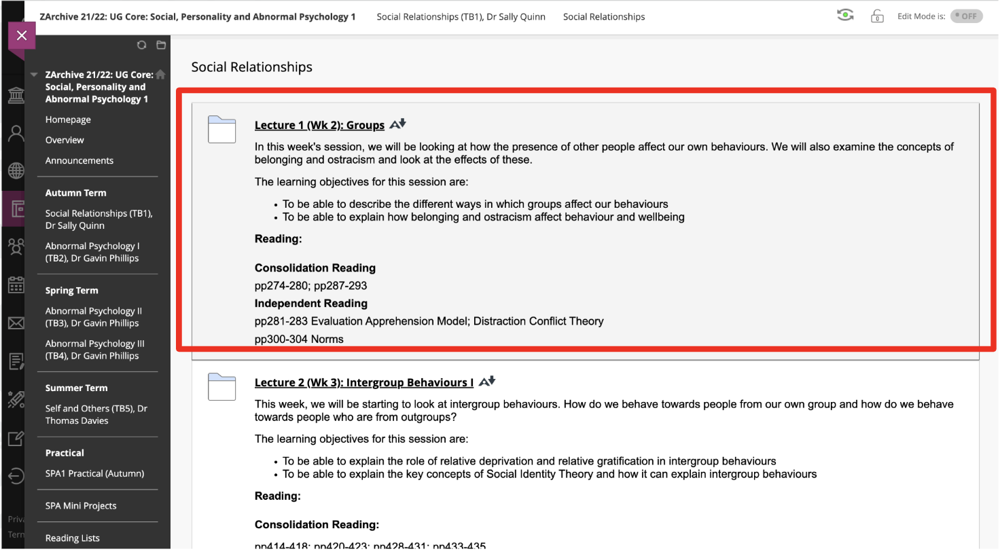

In the new Ultra nesting design, you get a much simpler interface with only a short description on the learning module. You can use a document to deliver the details, which provides students a better learning flow.

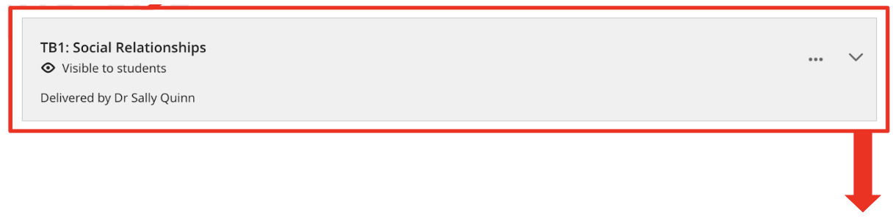

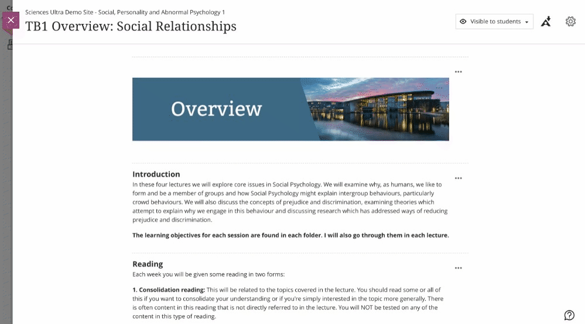

**3. Differences in student experience**

If contents are created within a **learning module**, students are able to **navigate the order of the contents** through the forward/backward arrows in sequence.

If contents are created within a **folder**, students have to click **the exit button** on the upper left-hand side to choose another content within the folder.

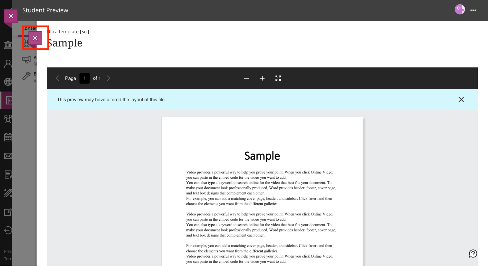

If you need more information on how to add content to a learning module/folder, please go to [Folders vs Learning Modules](https://pdlt-university-of-york.github.io/vle-help/ultra/folder-learning-module/) guide.

## Further Help

* [Blackboard Help: Course View Options](https://help.blackboard.com/Learn/Administrator/SaaS/Courses/About_Courses_in_Ultra_Experience/Course_View_Options#ultra)
* [Folders vs Learning Modules](https://pdlt-university-of-york.github.io/vle-help/ultra/folder-learning-module/)