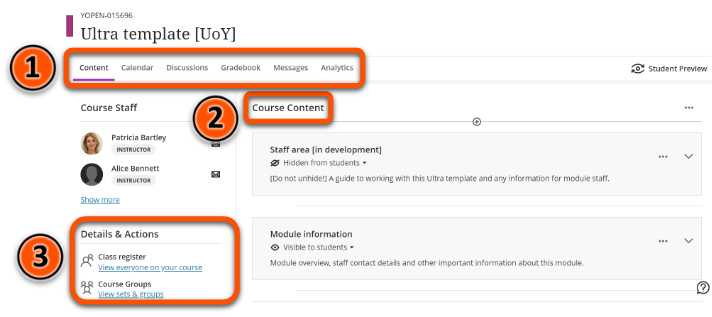
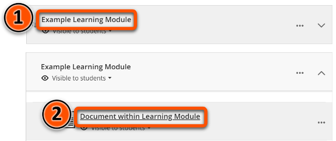
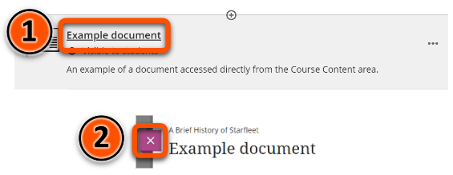

---
tags:
# Delete to leave only relevant tags
    - Foundation
    - Teaching
    - Ultra
---

# Navigating an Ultra site

!!! Summary

    Blackboard Ultra has a new user interface designed to make sites easy to use and accessible.

## Overview

You can access all of the tools needed for site construction and administration through the following menus:

1. **[Top Menu](#top-menu)**: access course tools including the **Gradebook** and **Messages**.
2. **[Course Content](#course-content) area**: course content is created and accessed here.
3. **[Details & Actions](#details--actions)** access site tools including the **Class Register** and **Announcements**.

### Top menu

The menu above the **Course Content** area gives access to a number of course tools.

| Menu item | Description |
| ----------- | ----------- |
| Content | Return to the **Course Content** area |
| Calendar | View the Blackboard Calendar for this course |
| [Discussions](https://vle-support.york.ac.uk/ultra/discussions/) | Quick access all of the course's discussion boards |
| Gradebook | Quick access grade information for all of the marked items in a course |
| Messages | Send private messages to individual students or groups |
| Analytics | Not currently used at York |
| Student Preview | View the course as it appears to a student |

!!! Warning

    The Blackboard Calendar is not currently integrated with Google Calendar or the University's timetabling system.

### Course Content

Content is created and accessed in the **Course Content** area.

Items can be organised in content containers such as **Folders** or **Learning Modules**.

Click a content container to expand it. You will see a list of all the items in the content container. 

You can open any of the items in a content container by clicking on them. You can collapse the Learning Module or Folder by clicking on it again.

To open an item, click the item in the **Course Content** area.

To close the item and return to the **Course Content** area, click **X**.

!!! Tip

    For more information on Folders and Learning Modules, please refer to the [Folders vs Learning Modules](https://vle-support.york.ac.uk/ultra/folder-learning-module/) guide.

### Details & Actions {#details--actions}

This menu on the left hand side of the screen gives access to a number of different tools.

| Menu item | Description |
| ----------- | ----------- |
| Class register | List of everyone enrolled on the site, including staff members |
| [Course Groups](https://vle-support.york.ac.uk/ultra/groups/) | Create and manage student groups |
| [Course Image](https://vle-support.york.ac.uk/ultra/course-image/) | Upload, edit or remove the site's Course Image |
| Course is open / Course is private | Set the course as visible or invisible to students |
| Class Collaborate | Access the Blackboard Collaborate virtual classroom |
| Attendance | Not used at York |
| [Announcements](https://vle-support.york.ac.uk/ultra/announcements/) | Create announcements and view previous announcements  |
| Books & Tools | Access LTI tools such as Reading Lists and Panopto/Replay |
| Question banks | Build and manage sets of questions shared between tests |

