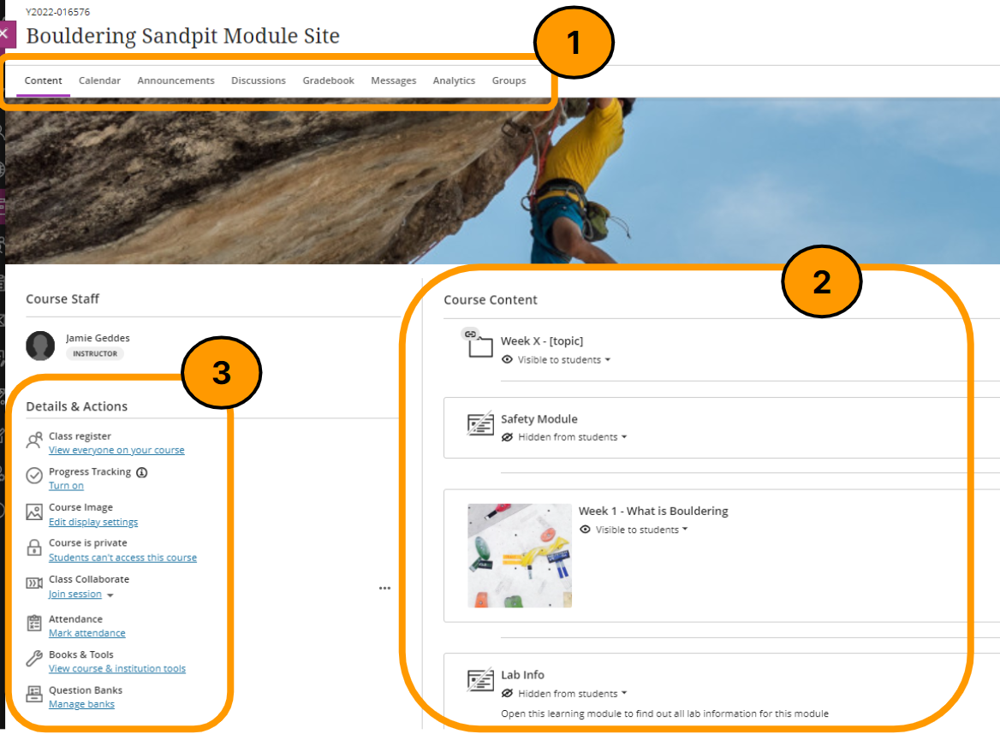

---
tags:
    - Ultra
---

# Navigating an Ultra site

!!! Summary

    Blackboard Ultra has a new user interface designed to make sites easy to use and accessible.

## Overview

There are three navigation bar menus used to navigate an Ultra site:

1. **Top Menu**: Access course tools including the **Gradebook** and **Messages**.
2. **Course Content area**: course content is created and accessed here.
3. **Details & Actions** access site tools including the **Class Register** and **Course Image**.

{: style="height:auto;width:100%"}

### Top menu

The menu above the **Course Content** area gives access to a number of course tools.

| Menu item | Description |
| ----------- | ----------- |
| Content | Return to the **Course Content** area |
| Calendar | View the Blackboard Calendar for this course |
| [Announcements](../ultra/announcements.md)| View or create an announcement email or direct message for this course |
| [Discussions](../ultra/discussions.md) | Quick access all of the course's discussion boards |
| [Gradebook](../ultra/gradebook.md) | Quick access grade information for all of the marked items in a course |
| [Messages](../ultra/messages-tool.md) | Send private messages to individual students or groups |
| Analytics | Not currently used at York |
| [Groups](../ultra/course-groups.md) |Use Groups to manage teaching, administration and assessment activities in your course |
| Student Preview | View the course as it appears to a student |

!!! Warning

    The Blackboard Calendar is not currently integrated with Google Calendar or the University's timetabling system.

### Course Content

Content is created and accessed in the **Course Content** area.

Items can be organised in content containers such as **Folders** or **Learning Modules**.

Click a content container to expand it. You will see a list of all the items in the content container. 

You can open any of the items in a content container by clicking on them. You can collapse the Learning Module or Folder by clicking on it again.

To open an item, click the item in the **Course Content** area.

To close the item and return to the **Course Content** area, click **X**.

!!! Tip

    For more information on Folders and Learning Modules, please refer to the [Folders vs Learning Modules](../ultra/folder-learning-module.md) guide.

### Details & Actions {#details--actions}

This menu on the left hand side of the screen gives access to a number of different tools.

| Menu item | Description |
| ----------- | ----------- |
| Class register | List of everyone enrolled on the site, including staff members |
| [Course Image](../ultra/course-image.md) | Upload, edit or remove the site's Course Image |
| Course is open / Course is private | Set the course as visible or invisible to students |
| Class Collaborate | Access the Blackboard Collaborate virtual classroom |
| Attendance | Not used at York |
| Books & Tools | Access LTI tools such as Reading Lists and Panopto/Replay |
| Question banks | Build and manage sets of questions shared between tests |

