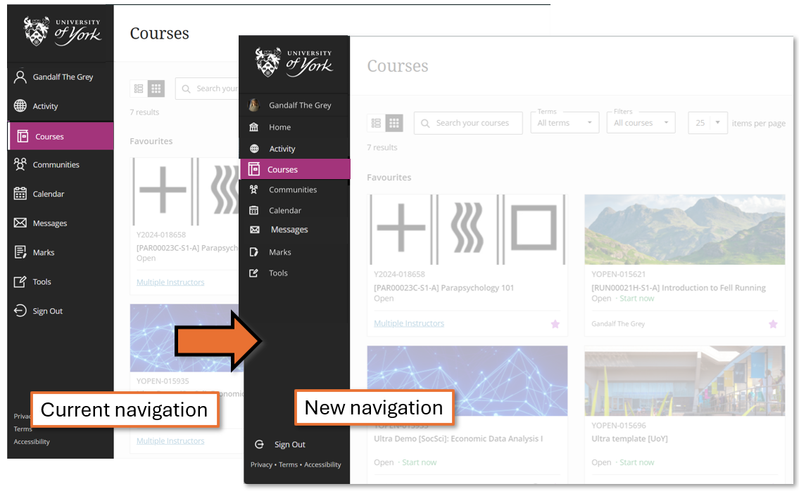
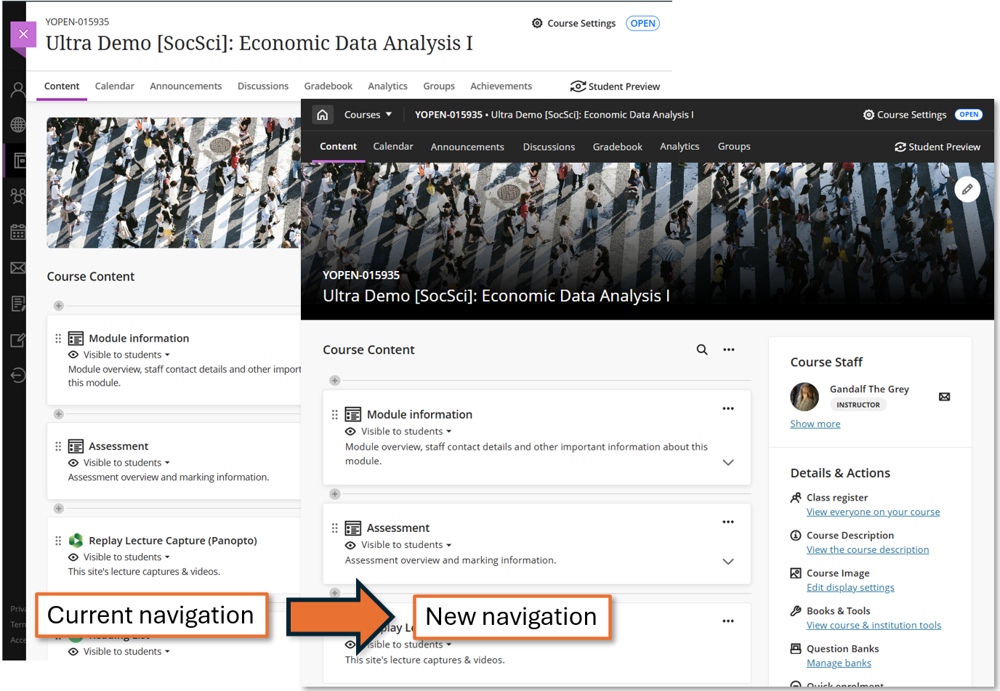
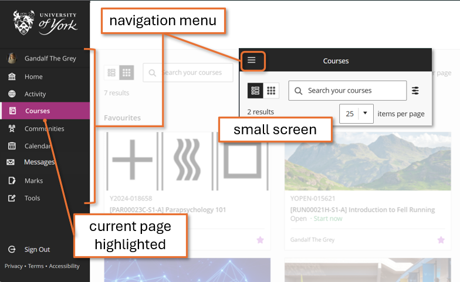
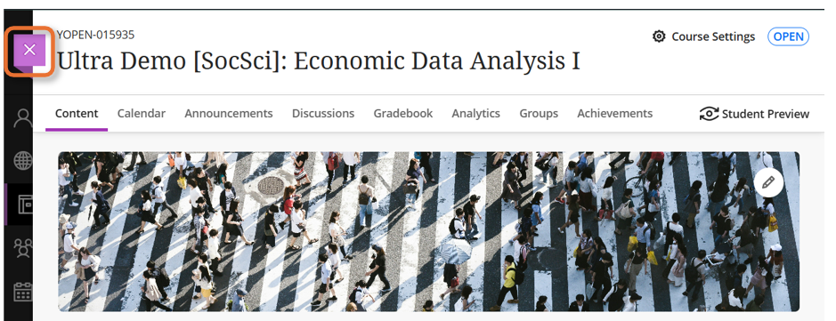
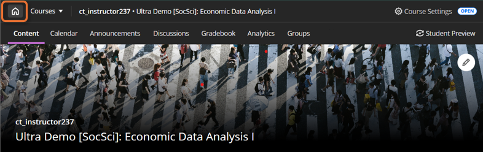
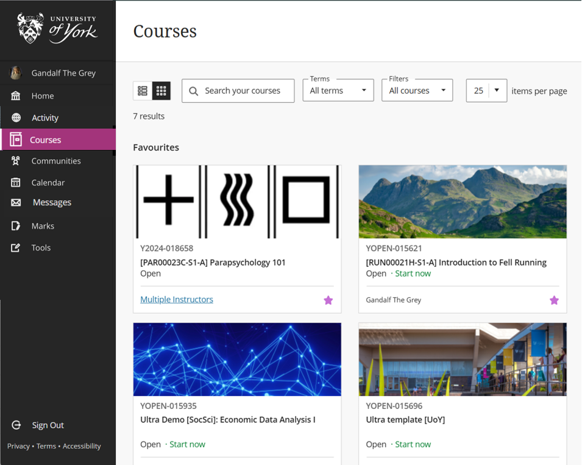
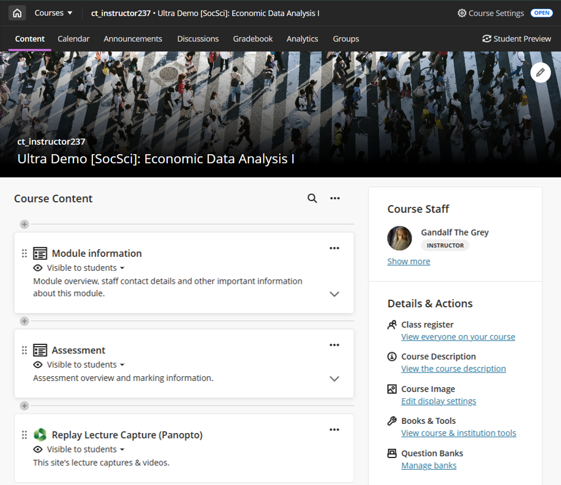
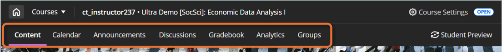
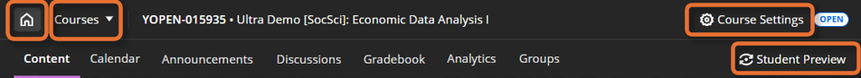

---
tags:
    - Key guide - teaching
    - Key guide - admin
    - Ultra
---

# Navigation: system & sites

!!! Summary

    An introduction to navigating the Ultra system and within sites.

## Updated navigation: January 2026

An updated navigation system is coming in January 2026. This will make it easier to move around the Ultra system and between sites, and makes better use of screen space.

### System-level changes

Small changes to system-level navigation:

- more compact navigation menu
- **Sign out** moved to the bottom of the screen
- profile avatar shown in the navigation menu (if you have set one)

### Site-level changes

!!! Tip

    This applies to Course and Community sites.

Cosmetic changes and some additional functionality for site-level navigation:

- Sites open **full-width**, rather than as an overlaid panel - return to the Home page using the **Home** icon.
- The Course Image (banner) becomes full width, with the site name overlaid. This frees up more screen space for content.
- Top menu and header bars changes from white to a dark colour.
- Move between sites using the **Course** switcher feature.

## Navigating the Ultra system

### Navigation menu

The main site navigation bar appears on the left hand side on a larger screen, or can be accessed through the three lines icon in the top left on a smaller screen.

Use the menu to navigate between:

- **Your profile**: [manage your notification settings](../ultra/notifications.md), avatar and personal information
- **Home**:  landing page with key system updates and departmental links
- **Activity**: summary of activity collated across all your sites
- **Courses**: access your module and other academic related sites
- **Communities**: access your non-academic sites, such as departmental noticeboards. If you are not enrolled on any Community sites, this option will not appear.
- **Calendar**: collates Due Dates across all your sites. Does not integrate with the Timetable or other UoY systems.
- **Messages**: summary of [Messages](../ultra/messages.md) (one-way communications to specific students) in your sites. This feature is turned off within sites by default. 
- **Marks**: summary of assessments and marking to do across your sites
- **Tools**: access to some LTIs - it's not likely you'll need this page.

Your current page is highlighted in the menu.

### Home

<figure markdown>

<figcaption>Home page</figcaption>
</figure>

When you log into Ultra, you will land on the Home page, which contains:

- **Communications from the VLE support team**:
    - trending topics (eg. preparing for CAP or a new semester)
    - key support links (getting help, accessibility etc.)
    - details of any system issues
- **Department-specific links**: mostly student-facing; handbooks, student support sites etc.

Within a site, click the **purple cross** icon in the top left of the page panel to return to the Home page.

From January 2026, sites will open as full-width pages. Click the **Home** icon to return to the Home page.

### Courses & Communities

<figure markdown>

<figcaption>Courses page</figcaption>
</figure>

- **Courses** page: lists all your module sites. You can browse, filter and search for sites. Favourite key sites by clicking the **star** icon to pin them to the top of list.
- **Communities** page: lists any non-academic sites. Use it in the the same way as the Courses page.

For more details, see the [Courses list](../ultra/courses-list.md) guide.

## Navigating sites

<figure markdown>

<figcaption>Module site (from January 2026)</figcaption>
</figure>

Courses and Community sites are navigated in the same way.

### Top menu

Within sites, navigate between parts of the site using the top menu. The menu tabs are:

- **Content**: the site homepage, with all site content.
- **Calendar**: collates Due Dates for assessments within the site. Does not integrate with the Timetable or other UoY systems.
- [**Announcements**](../ultra/announcements.md): send read-only messages to all enrolled students
- [**Gradebook**](../ultra/gradebook.md): collates all assessments in the site.
- **Analytics**: information on student activity within the site.
- [**Groups**](../ultra/course-groups.md): create and manage student groups for collaborative work or to support marking

The top menu banner also includes:

- **Home**: to close the site and return to the Home page (from January 2026).
- **Courses**: to move between recently-visited course sites, or to go to the Courses page (from January 2026).
- **Course Settings**: to manage [site availability](../ultra/course-access.md) and other site-wide settings.
- **Student Preview**: to check how content appears to students.

### Content tab

The Content tab is the main area of the site, and acts as the site's home page. It has two sections:

- **Course Content**: where all the site content is added and viewed
- **Details & Actions**: some additional site features and settings, including:
    - **Class Register**: set the [Primary Instructor](../ultra/course-staff.md#primary-instructor) and [enrol users](../ultra/user-management.md#enrol-individual-users) if needed.
    - [**Course Image**](../ultra/course-image.md): update the site banner.
    - **Books & Tools**: for integrated tools, particularly the [Ally accessibility report](../ultra/ally-accessibility-report.md).
