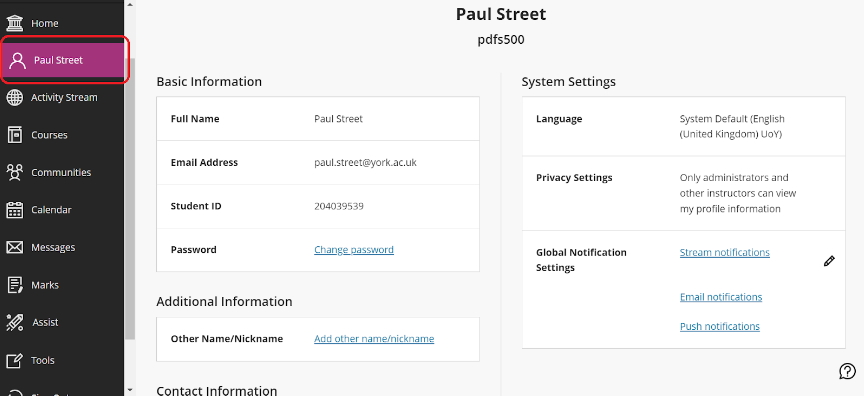
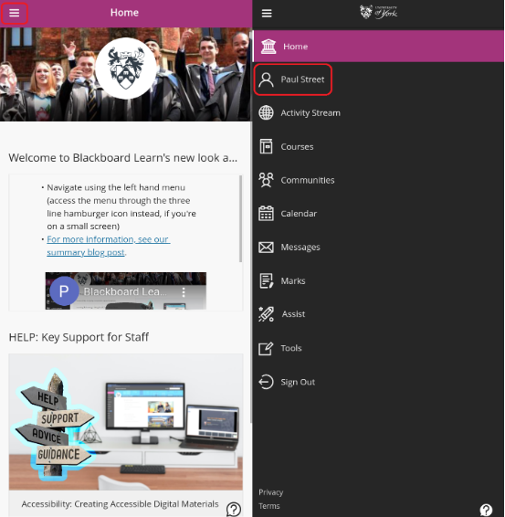
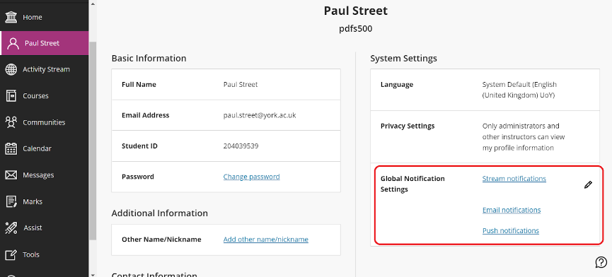
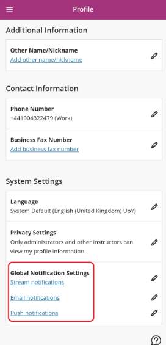
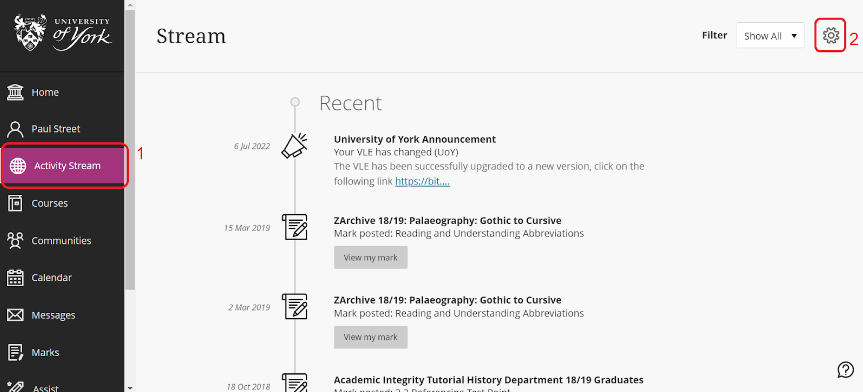
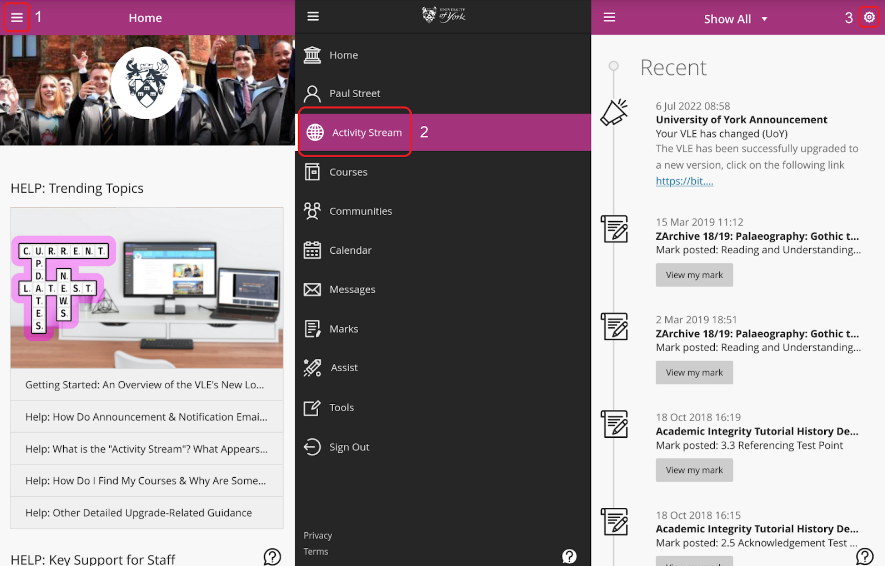

---
tags:
# Delete to leave only relevant tags
    - Foundation
    - Advanced
    - Teaching
    - Administration
    - Ultra
---

# Updating Your Notification Settings

!!! Summary

    The default notification settings in Blackboard Ultra can result in a significant number of unnecessary emails being sent to your inbox - particularly for those enrolled on many modules. You can also configure the frequency and type of notifications you receive, as well as those that appear in your Activity Stream.

## Video Steps

<!-- PASTE YOUTUBE EMBED (should look like this:) -->
<iframe width="560" height="315" src="https://www.youtube.com/embed/gxxLlZtyWBQ?start=88" title="YouTube video player" frameborder="0" allow="accelerometer; autoplay; clipboard-write; encrypted-media; gyroscope; picture-in-picture; web-share" allowfullscreen></iframe>

Watch this section of our brief video [Blackboard Learn - Navigation](https://youtu.be/gxxLlZtyWBQ?t=88)

## Text Steps

<!-- Clear and concise: Click **Submit**, not Click on the **Submit button** -->
<!-- Use **bold** to highight key tasks and features -->

1. On the VLE homepage, click on your name in the left hand navigation panel
    
   
2. Select any of the three options under **Global Notification Settings**
    
    
3. You can also access your notification settings in the Activity Stream by clicking the cog icon in the top right
   
    
4. In the **Notification Settings** pane that appears, select which events you want to receive notifications about.
    1. **Stream Notifications:** in this tab you can configure the notifications that appear in your **Activity Stream**. You can enable/disable entire categories of notifications (e.g. **Journal Activity**). You can also enable/disable specific types of notifications within categories (e.g. **Journal entry posted**) by clicking the down arrow icon next to the category.
    2. **Email Notifications:** in this tab you can configure which activities you will receive email notifications about, as well as how often to receive these email notifications.
    3. **Push Notifications:** in this tab you can configure whihc events will trigger notifications on your phone, if you have the Blackboard App installed and set up.
5. When you have finished editing your notification settings, be sure to click **Save** to save your changes.

## Further Details
As well as the guidance on this page, you can reduce the amount of emails you're receiving by adding filters to your University (Gmail) inbox - [Learn more about Gmail Filters](https://support.google.com/mail/answer/6579?hl=en-GB).