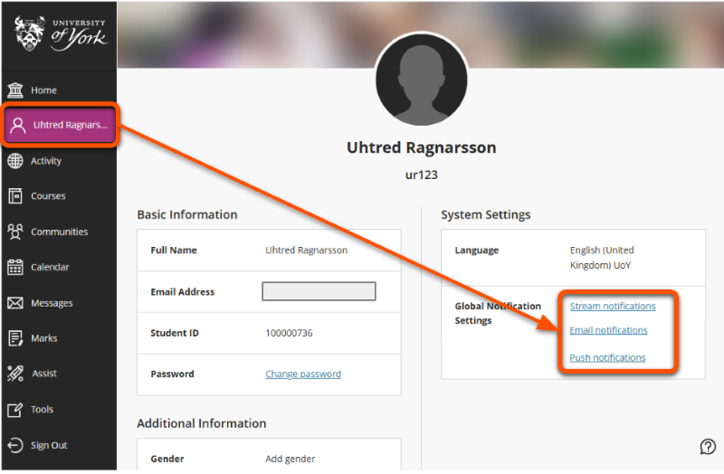
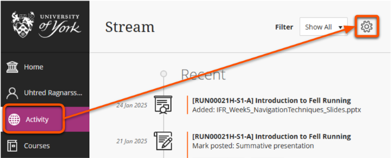
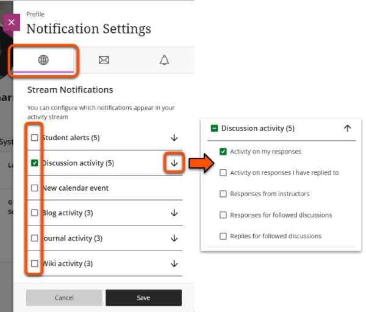
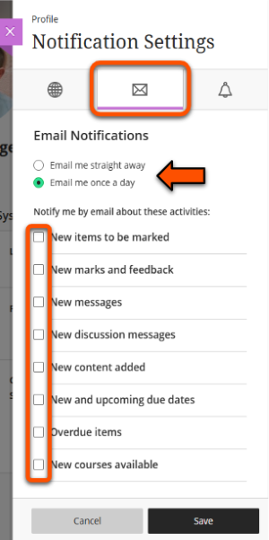
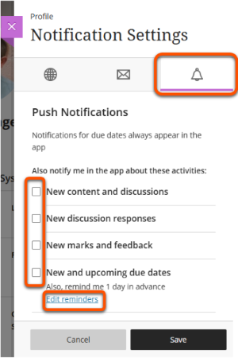

---
tags:
    - Communication
    - Ultra
---

# Notification settings

!!! Summary
    
    Email and Activity Stream notifications are turned on by default. You can adjust your settings to choose which notifications to receive.

!!! Tip

    You can also use [GMail Filters](https://support.google.com/mail/answer/6579?hl=en-GB) to manage which emails from the VLE are delivered to your University email inbox.

### Types & formats

You can receive notifications about various types of activity within VLE sites, such as: 

- new discussion posts
- new content added
- new items to be marked
- student activity alerts

Notifications can appear in the *Activity Stream*, be sent by *email* or as a *push notification*. The specific activities you can be notified of differ slightly for each format.

!!! Note

    Notifications tell you that activity occurred, but usually won't include specific content. Eg. "There are new discussion messages in site X" but not the actual message content.

### Adjust settings

Adjusting settings will apply to all of your VLE sites.

1. Open the settings panel with one of these methods:
    - Click **Your name** in the main VLE navigation menu to open your profile, then select any of the three options under **Global Notification Settings**. 
     
    - Click **Activity** in the main VLE navigation menu and click the **cog icon** in the top right.
     
2. *Stream notifications*: received in the VLE Activity Stream page
    - Tick the box next to a category to receive all notifications for that category.
    - Click the **Arrow icon** to select specific notifications within a category.
     
3. *Email notifications*: receive an email when a selected activity occurs 
    - Select whether to receive each email straight away or a daily summary email.
    - Tick the box for each activity to receive notifications for.
     
4. *Push notifications*: received in the [Blackboard app](https://www.blackboard.com/en-uk/teaching-learning/learning-management/mobile-learning-solutions)
    - Due date notifications can't be turned off in the app.
    - Tick the box for each activity to receive notifications for.
    - Edit reminders for upcoming due dates.
     
5. Click **Save**.

??? Abstract "Example: Notification setting options"

    **Stream notification categories**:

    - Student alerts (5 options)
    - Discussion activity (the 5 options below)
        - Activity on my responses
        - Activity on responses I have replied to
        - Responses from instructors
        - Responses for followed discussions
        - Replies for followed discussions
    - New calendar event
    - Blog activity (2 or 3 options)
    - Journal activity (2 or 3 options)
    - Wiki activity (3 options)

    **Email notification activities**:

    - New items to be marked
    - New marks and feedback
    - New messages
    - New discussion messages
    - New content added
    - New and upcoming due dates
    - Overdue items
    - New courses available
    
    **Push notification activities**:

    - New content and discussions
    - New discussion responses
    - New marks and feedback
    - New and upcoming due dates (option to set up reminders)
