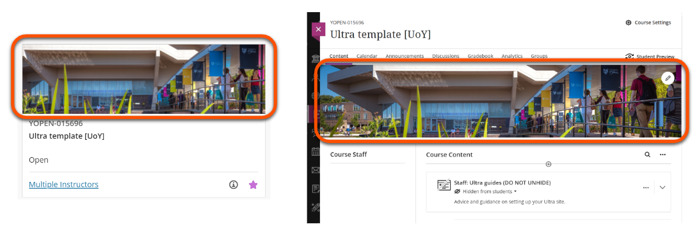

---
tags:
    - Key guide - teaching
    - Ultra
---

# Personalising Your Site Design

!!! Summary
    
    There are various ways to adapt the design of your departmental template to suit your module's needs and give your site a more personalised appearance.

## Course Image

The Course Image is a site banner image. It appears in two locations:

- Course List: appears in the tile view of the module site 
- Within the site: a banner across the main 'Content' view of the site.

You can change the Course Image supplied with your site template to something related to your module.

**Guide**: [Add/change Course Image](../ultra/course-image.md)

## Learning Module images

Learning Module containers can display a small image on the Course Content page. This can be used to reflect the topic of weekly content.

!!! Note

    Some departmental templates include pre-populated Learning Module images. Refer to your departmental guidance on whether these should be changed.

**Guide**: [Add Learning Module images](../ultra/folder-learning-module.md/#adding-images-to-learning-modules)

## Course Staff

If there are more than two Instructors on the site (eg. multiple teaching staff, or your department enrolls staff on all sites) you can set up the  Course Staff (Instructors) list to show module/primary teaching staff first.

**Guide**: [Set primary Course Staff](../ultra/course-staff.md)

 <!-- - [Video Guide on how to build module content to documents in ultra](https://www.youtube.com/watch?v=2KA0UWiTMWI&feature=youtu.be) -->
