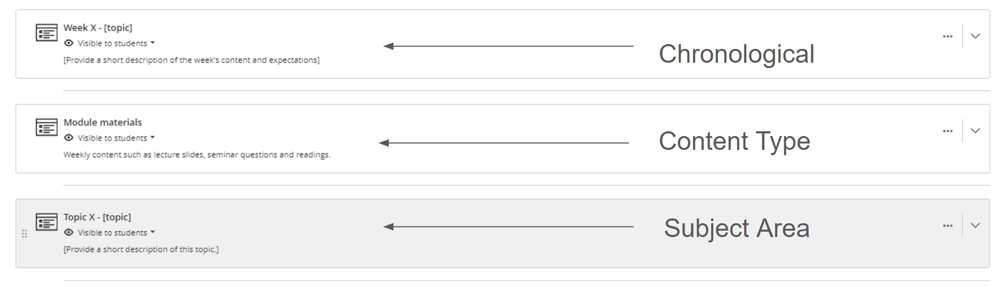
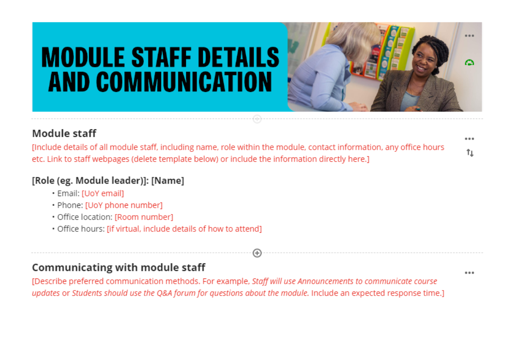

---
tags:
    - Key guide - teaching
    - Accessibility
    - Ultra
---

# Prepare module sites for teaching: rollover updates & new sites

!!! Summary

    Get ready for teaching with this walkthrough of updating an existing site after rollover or setting up a new site from a departmental template:

    - develop an accessible, high-quality site.
    - save time by focusing on what's important to get right.
    - avoid common start-of-semester issues.
    - explore Learn Ultra features that might be useful in your teaching.

<!-- 
!!! principle "Relevant [VLE site design principles](../ultra/site-design-principles.md)"

    - The template has been designed to apply the site designb principles as a whole. -->

## Introduction

The easy-to-follow walkthrough takes you through the steps to update an existing site or prepare a new site. 

Work through the sections in order or use the navigation on the right to jump to a specific section. Each section also 

- checklist of what to do/consider
- good practice examples
- links to relevant in-depth guides
- advice on meeting relevant [VLE site design principles](../ultra/site-design-principles.md).

Following this guide will help you:
    
- develop an accessible, high-quality site meeting the [VLE site design principles](../ultra/site-design-principles.md).
- save time by showing you what to focus on.
- avoid common start-of-semester issues.
- explore Learn Ultra features that might be useful in your teaching.

contact us to reset site to departmental template

based on using a departmental template, but most advice also applicable to other sites

easiest way to prepare an effective site:

- well organised - no out of date docs/info, files in logical place & order
- USE THE READING LIST
- remove any unused template placeholders

## 1: General site settings
For an introduction to key parts of the site, see the [Detailed guide: Navigate Ultra sites](../ultra/navigate-ultra-sites.md)

=== "Update after rollover"

    
    
    1. **Check the Site name** 
    Site names have a standardised format needed for various systems to run. **You must not rename your site**. If there are any problems, please [contact us](mailto:vle-support@york.ac.uk) to resolve. 
    [Detailed guide: Site name](../ultra/site-name.md)
    2. **Check the Course Image** 
    Check that the Course image is still appropriate (eg. it doesn't reference a previous academic year) and update if needed.  
    [Detailed guide: Course image](../ultra/course-image.md)
    3. **Course staff: check Primary Instructor setting** 
    Check that the correct module staff for that year are shown at the top of the Course Staff list. If needed, identify/update module staff using the Primary Instructor setting. 
    [Detailed guide: Course staff](../ultra/course-staff.md)

=== "Set up new site"

    

    1. **Site name** 
    Site names have a standardised format needed for various systems to run. **You must not rename your site**. If there are any problems, please [contact us](mailto:vle-support@york.ac.uk) to resolve. 
    [Detailed guide: Site name](../ultra/site-name.md)
    2. **Select a Course Image** 
    Your departmental template contains a default course image which shows as a banner in the site and a thumbnail on the Courses page. If desired, you can change this to something relevant to your specific module. 
    [Detailed guide: Course image](../ultra/course-image.md)
    3. **Course staff: set Primary Instructor(s)** 
    If non-module staff are also enrolled on the site, identify all module teaching staff using the Primary Instructor setting. This will make sure the correct staff are shown first in the Course Staff list. 
    [Detailed guide: Course staff](../ultra/course-staff.md)

=== "Good practice: examples"

## 2: Module information

This section contains general information about the module and department:

- module-specific content: module overview, staff contact details etc.
- pre-built departmental information

!!! tip "Good practice/Avoid common problems"

    - All **placeholder text** is updated with module information or deleted. This text is usually within [square brackets] and may be coloured red.
    - **Module staff contact details** are completed and up to date.

=== "Update after rollover"

    
    
    Check and update content for the new academic year:

    1. *Welcome to [Module]*, *Module overview* and *Module staff* pages:

        - **check module information** is complete and up to date
        - **check and update contact details** for all teaching staff on the *Module staff details & communication* page
        - **remove any remaining placeholder text** from the template
        - **check links are up to date** and **update links** for specific year-based documents to the new version (or even better, a stable ongoing link so you don't have to update it again in the future)
    2. *Technical Requirements* page

        If your module has:

        - **specific software/equipment needed**: check information on how to get the software/equipment and make sure the page is visible to students.
        - **no technical requirements**: delete the page or hide from students.
    3. *Departmental pages*
     The remaining pages contain departmental information; don't adapt, hide or delete these pages 

    [Detailed guide: Edit, delete and move content](../ultra/edit-delete-move-content.md)

=== "Set up new site"

    

    Complete the pages with your module information:

    1. *Welcome to [Module]*, *Module overview* and *Module staff* pages:

        - **update template placeholder text** with module information, or delete if not relevant.
        - **complete contact details** for all teaching staff on the *Module staff details & communication* page
        - **use stable, ongoing links** rather than links to year-based documents (eg. link to a page where current handbooks are hosted, not the specific document for this year). This will make your site easier to maintain.
    2. *Technical Requirements* page

        If your module has:

        - **specific software/equipment needed**: add information on how to get the software/equipment and make sure the page is visible to students.
        - **no technical requirements**: delete the page or hide from students.
    3. *Departmental pages*
     The remaining pages contain departmental information; don't adapt, hide or delete these pages 

    [Detailed guide: Edit, delete and move content](../ultra/edit-delete-move-content.md)

=== "Good practice: examples"

## 3: Assessment

This section collates all assessment-related information in one place, so students can easily locate their assessment instructions and submission points.

!!! tip "Good practice/Avoid common problems"

    - **All assessment information appears in this section**. This helps student find assessment information in each of tehir module sites. 
    - Materials are **clearly organised and labelled** so students know what to complete and when.

=== "Update after rollover"

    Check all assessment information is up to date and appears in this section:

    1. ***Assessment overview***: check the summary table listing formative and summative assessment tasks is up to date.
    2. ***Assessment criteria***, ***sample work***, ***past papers***: check and update as needed. If these weren't set up in the previous year, see the 'Set up new site' tab for details.
    3. **Assessment tasks & submission points**:
        
        - check that all formative and summative assessment instructions, quizzes and asubmission points (as listed on the Module Catalogue) are up to date and included in this section.
        - move any assessment information previously added to a different area into this section. For students to also access an assessment item from a particular week's materials, use a Course Link in the weekly section.
         [Detailed Guide: Course Links](../ultra/course-links.md)
        - if instructions and quizzes/submission points are included as separate items, label these clearly.
        - your departmental assessment administrators may set up submission points for you - see your departmental information.
    4. **Deadlines & release dates**: update for the new academic year. Batch edit may be useful for updating dates set in the system. Specific dates given in instruction text will need to be manually updated; consider changing to relative dates instead (eg. "Week 2, Friday 13:00").
     [Detailed guide: Batch Edit](../ultra/batch-edit.md)

=== "Set up new site"

    Add all assessment-related content to this section:

    1. ***Assessment overview***: complete the summary table listing formative and summative assessment tasks. The rest of the page contains departmental-level information, so you don't need to change that.
    2. ***Assessment criteria***: for submission-based assessment, update with information on how work is marked. You could upload a document, or replace this item with a link to marking criteria in a course handbook. Delete or hide from students if not relevant.
    3. ***Sample work***: consider providing some examples of past work to help students understand task requirements and expectations for good submissions. Delete or hide from students if not relevant.
    4. ***Past papers***: check or update the link to online past paper repository, or consider replacing with a folder containing past papers. Delete or hide from students if not relevant.
    5. **Assessment tasks & submission points**:
        
        - include all formative and summative assessment instructions, quizzes and asubmission points (as listed on the Module Catalogue) in this section.
        - for students to also access an assessment item from a particular week's materials, use a Course Link in the weekly section.
         [Detailed Guide: Course Links](../ultra/course-links.md)
        - if instructions and quizzes/submission points are included as separate items, label these clearly.
        - your departmental assessment administrators may set up submission points for you - see your departmental information.
        - informal practice quizzes or tasks can be included in weekly materials sections.
    6. **Deadlines & release dates**: to make dates easier to update for later years, set dates in the system or give relative dates (eg. "Week 2, Friday 13:00") instead of giving specific dates in instructions.

=== "Good practice: examples"

    - clear instructions given (Psych?)
    - course link to weekly section (Maths?)
    - exemplar Y2023-017605 (HEA - midwifery)

## 4: Module materials & content

=== "Update after rollover"

    Check the content in each weekly (or topic etc.) materials section:

    - **update materials** as needed for the new year (eg. new lecture slides)
    - **delete** any old materials (files, text content etc.) or unused placeholder items.
    - **organise materials cleary** and consistently within each section.
    - **check item visibility** and **update any [Release conditions](../ultra/release-conditions.md)** (eg. show on a specific date). [Batch Edit](../ultra/batch-edit.md) may be useful for this.
    - check any **re-used Panopto recordings** are shared correctly for the new year's cohort (see Panopto section below)

=== "Set up new site"

    Add your content to the relevant weekly (or topic-based) sections provided in your template:

    - most content is best provided within a **[Document](../ultra/documents.md)**, which is a flexible page type for adding text, images and files (eg. lecture slides) and embedded third-party content.
    - **edit placeholder Documents** included in the template or **add your own Documents** as needed. 
    - **delete** any unused placeholder Documents or content.
    - **organise materials cleary** and consistently within each section.
    - **set item visibility** and **add any [Release conditions](../ultra/release-conditions.md)** (eg. show on a specific date). [Batch Edit](../ultra/batch-edit.md) may be useful for this.
    - if reusing content or materials from previous years, check that:
        - all **content and files are up to date**. Don't add any old material.
        - any **re-used Panopto recordings** are shared correctly for the new year's cohort (see Panopto section below)

=== "Good practice: examples"

    well labelled
    context given for items

### Accessibility

copy section 2.1 from site readiness checklist

=== "All sites"

=== "Good practice: examples"

### Going beyond Ultra basics

=== "All sites"
    As well as providing lecture slides and other file-based content, Ultra has other tools and features available to support your teaching goals.
    
    There are advanced features built into the Ultra system:

    - [Course groups](../ultra/course-groups.md) for facilitating collaboration and group work
    - [Discussions](../ultra/discussions.md) for Q&A forums and asynchronous student discussion
    - [Tests](../ultra/test.md) for informal/practice quizzes
    - [Journals](../ultra/journal.md) for reflective practice

    You can also embded various third party teaching materials into your Ultra site, such as:
    
    - [interactive Xerte objects](../other-tools/xerte.md)
    - [Padlet pinboards and discussions](../other-tools/padlet.md)
    - [Panopto](../panopto/embed-panopto-ultra.md) or [YouTube](../ultra/youtube.md) video content

=== "Good practice: examples"
    The case studies below demonstrate how advanced tools features have been applied in module sites across the University. You can also browse our [full set of case studies](../training/case-studies/index.md) for more examples.

    ??? case-study "Case study: Developing the ‘Structure of English’ module site (using Discussions and Tests)"

        Ellie Rye explains how they applied the Ultra template to present teaching content, and reflects on the use of Discussions and Tests for formative practice quizzes.

        Watch their presentation:<iframe src="https://york.cloud.panopto.eu/Panopto/Pages/Embed.aspx?id=affd8a23-7d50-4d21-87d0-b15600b04234&autoplay=false&offerviewer=true&showtitle=false&showbrand=false&captions=false&interactivity=all" height="405" width="720" style="border: 1px solid #464646;" allowfullscreen allow="autoplay" aria-label="Panopto Embedded Video Player" aria-description="Ellie Rye, LLS, Structure of English" ></iframe>

        [Structure of English (Panopto viewer)](https://york.cloud.panopto.eu/Panopto/Pages/Viewer.aspx?id=affd8a23-7d50-4d21-87d0-b15600b04234) (8 mins 21 secs, UoY log-in required)

        See the [full case study for more details and the transcript (Rye)](../training/case-studies/lls-rye.md).
    
    ??? case-study "Case study: Using interactive Xerte objects to enhance asynchronous learning"

        Phil Martin and Dawn Genner Lowson outline how they use Xerte to create interactive materials with built-in feedback to support asynchronous learning.

        Watch their presentation:
        <iframe src="https://york.cloud.panopto.eu/Panopto/Pages/Embed.aspx?id=d87fc4fc-b05a-4ee3-af92-aecc00cf2948&autoplay=false&offerviewer=true&showtitle=false&showbrand=false&captions=false&interactivity=all" height="405" width="720" style="border: 1px solid #464646;" allowfullscreen allow="autoplay" aria-label="Panopto Embedded Video Player" aria-description="Using Xerte to enhance asynchronous learning - Phil Martin and Dawn Genner Lowson" ></iframe>

        [Using Xerte to enhance asynchronous learning (Panopto viewer)](https://york.cloud.panopto.eu/Panopto/Pages/Viewer.aspx?id=d87fc4fc-b05a-4ee3-af92-aecc00cf2948) (2 mins 47 secs, UoY log-in required)

        See the [full case study for more details and the transcript (Martin & Genner)](../training/case-studies/ipc-martin-genner.md).

    ??? case-study "Case study: Use of discussion boards in the Popular Culture, Media and Society module"

        David Beer reflects on using discussion boards in a regular pattern of activities triggered by online videos posing a key question related to weekly lectures. This facilitated contributions from many students who were less likely to contribute to in-person / synchronous sessions and provided a useful entry point for approaching challenging key concepts within the module. 

        Watch their presentation:
        <iframe src="https://york.cloud.panopto.eu/Panopto/Pages/Embed.aspx?id=9e70e40b-1080-407a-bafa-ad4f0188ef82&autoplay=false&offerviewer=true&showtitle=false&showbrand=false&captions=false&interactivity=all" height="405" width="720" style="border: 1px solid #464646;" allowfullscreen allow="autoplay" aria-label="Panopto Embedded Video Player" aria-description="Use of discussion boards, David Beer, Sociology" ></iframe>

        [Use of discussion boards in the Popular Culture, Media and Society module (Panopto viewer)](https://york.cloud.panopto.eu/Panopto/Pages/Viewer.aspx?id=9e70e40b-1080-407a-bafa-ad4f0188ef82) (15 mins 05 secs, UoY log-in required)

        See the [full case study for more details and the transcript (Beer)](../training/case-studies/sociology-beer.md).

## 5. Reading List

=== "Update after rollover"
    
    check RL on site
    include all readings
    tag items
    fix common issue - readings provided in othegr ways (dropbox, Google Drive, links etc.) - library can't manage stock, copyright

=== "Set up new site"

=== "Good practice: examples"

set up new RL instructions

## 6. Panopto (Replay content)

Just because you can see an embedded/reused video, doesn't mean that students can!

- how to check on timetable if scheduled for recording
- resued vids - check access

=== "Update after rollover"

=== "Set up new site"

=== "Good practice: examples"

--- 

## Template structure

The Ultra module site template has a pre-built overall structure:

- **Staff Ultra guides**: Advice on building the site
- **Assessment**: Pre-built content & placeholders collating all assessment information. All assessment information for the site must be added to this section.
- **Module information**: Placeholders for key module information (module overview, staff contacts etc.) and pre-built departmental information. In some departments, this may be separated into distinct module and departmental sections.
- **Module materials**: Containers for you to add your module content to (slides, quizzes, Padlets etc.). This could be a single container, or separate containers for each week/part of the module (see below).
- **Reading List**: an LTI link to the [Reading List](../other-tools/reading-list.md) tool. The Reading List must be used to provide all set  readings for the module.
- **Panopto Replay content**: an LTI link to the Replay Lecture Capture content area for lecture capture recordings.

There are small differences across Department- and School-specific templates, particularly in terms of how these components are organised, but each template has the same broad structure.

!!! Tip "Benefits of a consistent overall structure"

    - For staff: the pre-built structure and placeholders for key information help minimise workload in developing sites.
    - For students: we have significant feedback from students that broad consistency across module sites is key to helping them find important information across multiple sites.
    - A consistent, predictable structure across sites is particularly important for improving accessibility.

## Using the content in template

The **staff ultra guides** learning module is designed to help staff easily find resources that can aid development and personalisation of the ultra site from the base template. It is important that the learning module is left on hidden, so students can not see this resoource.

The **module materials section** can appear different in the template dependant on the department. The module materials section learning module can appear in the format of either:

* **Chronological**: Each module materials section contains a week’s worth of readings, assignments,
lecture notes, and discussion forums.
* **By subject area**: Each module materials section contains lecture material and readings on a specific
subject, along with assignments, discussion forums, and tests.
* **By content type**: Similar content types are grouped together in a module materials section (e.g., all
the lectures for the entire course).
<figure markdown="span">

<figcaption>*Example of 3 types of module material layouts*</figcaption>
</figure>
We have placeholders in the module **Information & Assessment** sections these are **required** to be replaced with relevant information and module materials sections there are optional placeholders to help you build your site but feel free to delete them if not relevant. Below demonstrates an example of the placeholder information found in the template documents.

<figure markdown="span">

<figcaption>*Example of placeholder text in template*</figcaption>
</figure>

The **Reading List tool** allows students to access all readings you have setup. If you need to add readings to the tool, please find more advice or help implementing the reading lists on the [ reading list guide page](../other-tools/reading-list.md). 

The **Panopto LTI tool** allows you to access replays of lecture capture recordings and record videos for the module site. More advice on how to use panopto can be found at the [panopto guide page](../panopto/index.md).

!!! case-study "Case study: Developing the ‘Structure of English’ module site"

    Ellie Rye provides a walkthrough of the Ultra site, describing how they applied the Ultra template to present teaching content, and reflects on the use of Discussions and Tests for formative practice quizzes.

    Watch their presentation:<iframe src="https://york.cloud.panopto.eu/Panopto/Pages/Embed.aspx?id=affd8a23-7d50-4d21-87d0-b15600b04234&autoplay=false&offerviewer=true&showtitle=false&showbrand=false&captions=false&interactivity=all" height="405" width="720" style="border: 1px solid #464646;" allowfullscreen allow="autoplay" aria-label="Panopto Embedded Video Player" aria-description="Ellie Rye, LLS, Structure of English" ></iframe>

    [Structure of English (Panopto viewer)](https://york.cloud.panopto.eu/Panopto/Pages/Viewer.aspx?id=affd8a23-7d50-4d21-87d0-b15600b04234) (8 mins 21 secs, UoY log-in required)

    See the [full case study for more details and the transcript](../training/case-studies/lls-rye.md).
    You can also browse our [full set of case studies](../training/case-studies/index.md).
