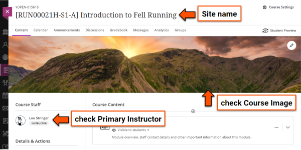
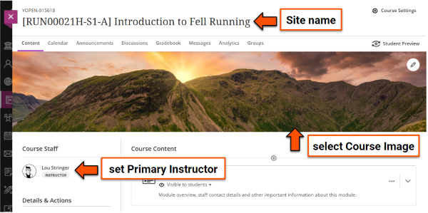
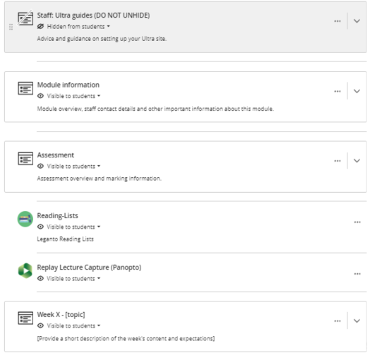

---
tags:
    - Key guide - teaching
    - Accessibility
    - Ultra
---

# Prepare module sites for teaching: rollover updates & new sites

!!! Summary

    Get ready for teaching with this walkthrough of updating an existing site after rollover or setting up a new site from a departmental template:

    - develop an accessible, high-quality site.
    - save time by focusing on what's important to get right.
    - avoid common start-of-semester issues.
    - explore Learn Ultra features that might be useful in your teaching.

<!-- 
!!! principle "Relevant [VLE site design principles](../ultra/site-design-principles.md)"

    - The template has been designed to apply the site designb principles as a whole. -->

## Introduction

The easy-to-follow walkthrough takes you through the steps to update an existing site or prepare a new site. 

Work through the sections in order or use the navigation on the right to jump to a specific section. Each section also 

- checklist of what to do/consider
- good practice examples
- links to relevant in-depth guides
- advice on meeting relevant [VLE site design principles](../ultra/site-design-principles.md).

Following this guide will help you:
    
- develop an accessible, high-quality site meeting the [VLE site design principles](../ultra/site-design-principles.md).
- save time by showing you what to focus on.
- avoid common start-of-semester issues.
- explore Learn Ultra features that might be useful in your teaching.

contact us to reset site to departmental template

based on using a departmental template, but most advice also applicable to other sites

easiest way to prepare an effective site:

- well organised - no out of date docs/info, files in logical place & order
- USE THE READING LIST
- remove any unused template placeholders

## 1: General site settings
For an introduction to key parts of the site, see the [Detailed guide: Navigate Ultra sites](../ultra/navigate-ultra-sites.md)

=== "Update after rollover"

    
    
    1. **Check the [Site name](../ultra/site-name.md)** 
    Site names have a standardised format needed for various systems to run. **You must not rename your site**. If there are any problems, please [contact us](mailto:vle-support@york.ac.uk) to resolve.
    2. **Check the [Course image](../ultra/course-image.md)** 
    Check that the Course image is still appropriate (eg. it doesn't reference a previous academic year) and update if needed.
    3. **[Course staff](../ultra/course-staff.md): check Primary Instructor setting** 
    Check that the correct module staff for that year are shown at the top of the Course staff list. If needed, identify/update module staff using the Primary Instructor setting.

=== "Set up site from template"

    

    1. **Check the [Site name](../ultra/site-name.md)** 
    Site names have a standardised format needed for various systems to run. **You must not rename your site**. If there are any problems, please [contact us](mailto:vle-support@york.ac.uk) to resolve.
    2. **Select a [Course image](../ultra/course-image.md)** 
    Your departmental template contains a default Course image which shows as a banner in the site and a thumbnail on the Courses page. If desired, you can change this to something relevant to your specific module.
    3. **[Course staff](../ultra/course-staff.md): set Primary Instructor(s)** 
    If non-module staff are also enrolled on the site, identify all module teaching staff using the Primary Instructor setting. This will make sure the correct staff are shown first in the Course staff list.

## 2: Module information

This section contains general information about the module and department:

- module-specific content: module overview, staff contact details etc.
- pre-built departmental information

Prepare this section by:

- [editing, updating or deleting content](../ultra/edit-delete-move-content.md) in the pre-built pages.
- you should not need to add new pages.

<figure markdown="span">
![Module specific pages: Welcome to [Module name], Module overview, Module staff details & communication, Technical requirements](images/prepare-site-module-specific-information.png)
<figcaption>Module-specific pages</figcaption>
</figure>

<!-- !!! tip "Good practice/Avoid common problems"

    - All **placeholder text** is updated with module information or deleted. This text is usually within [square brackets] and may be coloured red.
    - **Module staff contact details** are completed and up to date. -->

=== "Update after rollover"

    
    
    Check and update content for the new academic year:

    1. *Welcome to [Module]*, *Module overview* and *Module staff* pages:

        - **check module information** is complete and up to date
        - **check any introductory Panopto videos** on these pages can be accessed by this year's students (see Panopto section below) 
        - **check and update contact details** for all teaching staff on the *Module staff details & communication* page
        - **delete any remaining placeholder content** from the template
        - **check links are up to date** and **update links** for specific year-based documents to the new version (or even better, a stable ongoing link so you don't have to update it again in the future)
    2. *Technical Requirements* page

        If your module has:

        - **specific software/equipment needed**: check information on how to get the software/equipment and make sure the page is visible to students.
        - **no technical requirements**: delete the page or hide from students.
    3. *Departmental pages*
     The remaining pages contain departmental information; don't adapt, hide or delete these pages 

=== "Set up site from template"
    

    Complete the pages with your module information:

    1. *Welcome to [Module]*, *Module overview* and *Module staff* pages:

        - **update template placeholder text** with module information, or delete if not relevant.
        - **complete contact details** for all teaching staff on the *Module staff details & communication* page
        - **use stable, ongoing links** rather than links to year-based documents (eg. link to a page where current handbooks are hosted, not the specific document for this year). This will make your site easier to maintain.
    2. *Technical Requirements* page

        If your module has:

        - **specific software/equipment needed**: add information on how to get the software/equipment and make sure the page is visible to students.
        - **no technical requirements**: delete the page or hide from students.
    3. *Departmental pages*
     The remaining pages contain departmental information; don't adapt, hide or delete these pages 

=== "Good practice: examples"

## 3: Assessment

This section collates all assessment-related information in one place:
    
- students can easily locate assessment details across all their module sites
- assessment information is easier for staff to update and maintain

Prepare this section by:

- [editing, updating or deleting content](../ultra/edit-delete-move-content.md) in the pre-built pages.
- adding materials for your specific assessment tasks (instruction, Tests, submission points etc.).

<figure markdown="span">

<figcaption>Sample Assessment section</figcaption>
</figure>

!!! Tip

    Being able to find assessment information easily is very important to students; we have significant feedback that they highly value consistency and clear organisation in how assessment details are presented in this section.
 

=== "Update after rollover"

    Check all assessment information is up to date and appears in this section:

    1. ***Assessment overview***: check the summary table listing formative and summative assessment tasks is up to date.
    2. ***Assessment criteria***, ***sample work***, ***past papers***: check and update as needed. If these weren't set up in the previous year, see the 'Set up new site' tab for details.
    3. **Assessment tasks & submission points**:
        
        - check that all formative and summative assessment instructions, quizzes and asubmission points (as listed on the Module Catalogue) are up to date and included in this section.
        - move any assessment information previously added to a different area into this section. For students to also access an assessment item from a particular week's materials, use a [Course Link](../ultra/course-links.md) in the weekly section.
        - if instructions and quizzes/submission points are included as separate items, label these clearly.
        - your departmental assessment administrators may set up submission points for you - see your departmental information.
    4. **Deadlines & release dates**: update for the new academic year. [Batch Edit](../ultra/batch-edit.md) may be useful for updating dates set in the system. Specific dates given in instruction text must be manually updated; consider changing to relative dates instead (eg. "Week 2, Friday 13:00").

=== "Set up site from template"

    Add all assessment-related content to this section:

    1. ***Assessment overview***: complete the summary table listing formative and summative assessment tasks. The rest of the page contains departmental-level information, so you don't need to change that.
    2. ***Assessment criteria***: for submission-based assessment, update with information on how work is marked. You could upload a document, or replace this item with a link to marking criteria in a course handbook. Delete or hide from students if not relevant.
    3. ***Sample work***: consider providing some examples of past work to help students understand task requirements and expectations for good submissions. Delete or hide from students if not relevant.
    4. ***Past papers***: check or update the link to online past paper repository, or consider replacing with a folder containing past papers. Delete or hide from students if not relevant.
    5. **Assessment tasks & submission points**:
        
        - include all formative and summative assessment instructions, quizzes and asubmission points (as listed on the Module Catalogue) in this section.
        - for students to also access an assessment item from a particular week's materials, use a [Course Link](../ultra/course-links.md) in the weekly section.
        - if instructions and quizzes/submission points are included as separate items, label these clearly.
        - your departmental assessment administrators may set up submission points for you - see your departmental information.
        - informal practice quizzes or tasks can be included in weekly materials sections.
    6. **Deadlines & release dates**: to make dates easier to update for later years, set dates in the system or give relative dates (eg. "Week 2, Friday 13:00") instead of giving specific dates in instructions.

=== "Good practice: examples"

    - clear instructions given (Psych?)
    - course link to weekly section (Maths?)
    - exemplar Y2023-017605 (HEA - midwifery)

## 4: Module materials & content

These weekly sections contain lecture slides, seminar questions, workshop preparation materials etc. Some sites have topic-based sections instead.

Add your content to the relevant section by:

- [editing, updating or deleting content](../ultra/edit-delete-move-content.md) in the optional pre-built Documents for different content types. Delete any that you don't use.
- building your own [Documents](../ultra/documents.md) or other items.

<figure markdown="span">

<figcaption>Sample weekly materials section</figcaption>
</figure>

!!! Tip

    Don't be a 'digital hoarder'! Refresh your materials sections each year so all content is up to date and any clutter is removed.
    
    This will make it much easier for you to maintain your site and for students to find what they need.

=== "Update after rollover"

    Check the content in each weekly materials section:

    - **make sure all materials are accessible** (see section below)
    - **update materials** as needed for the new year (eg. new lecture slides) and **delete** any old materials (files, text content etc.) or unused placeholder Documents/content.
    - **label items and files clearly** to describe the content without having to open it and give **context on when/how** to use materials. [Documents](../ultra/documents.md) are useful for providing text alongside many different content types.
    - **organise items logically** to guide students through the materials (eg. every week: lecture materials then seminar information)
    - **check video files are not directly uploaded** to the site or within slide decks. Video content must be streamed: Panopto for in-house recordings or YouTube (or similar) for external videos.
    - **check re-used Panopto recordings** are shared correctly for the new year's cohort (see Panopto section below).
    - **check item visibility** and **update any [Release conditions](../ultra/release-conditions.md)** (eg. show on a specific date). [Batch Edit](../ultra/batch-edit.md) may be useful for this.

=== "Set up site from template"

    Add your content to the relevant weekly materials section:

    - **make sure all materials are accessible** (see section below)
    - **edit placeholder Documents** included in the template or **add your own Documents** as needed. 
    - **delete** any unused placeholder Documents or content.
    - **label items and files clearly** to describe the content without having to open it, and give *context on when/how** to use materials. [Documents](../ultra/documents.md) are useful for providing text alongside many different content types. 
    - **organise items logically** to guide students through the materials (eg. every week: lecture materials then seminar information)
    - **do not upload video files** directly to the site or within slide decks. Video content must be streamed: Panopto for in-house recordings or YouTube (or similar) for external videos.
    - **set item visibility** and **add any [Release conditions](../ultra/release-conditions.md)** (eg. show on a specific date). [Batch Edit](../ultra/batch-edit.md) may be useful for this.
    - if reusing content or materials from previous years, check that:
        - all **content and files are up to date**. Don't add any old material.
        - any **re-used Panopto recordings** are shared correctly for the new year's cohort (see Panopto section below)

=== "Good practice: examples"

    well labelled
    context given for items

### Accessibility

!!! Warning 
    It is a **legal requirement** that all our online content is accessible, including your VLE site and any materials or files provided through it.

    Accessible materials also improve the learning experience for all students and make sites easier to maintain.

=== "All sites"

    Check that your site and materials meet these key accessibility features:

    - **Text content** on the site itself and any uploaded materials is easily readable and accessible: structured with Heading Styles, left-aligned text, sufficient colour contrast, legible font and text size, bulleted lists to break up content, tables only used for data etc. 
    - Meaningful **[images](../ultra/images.md) and figures** have appropriate ALT text or other descriptions to allow screenreader users to access the information.
    - **[Link](../ultra/links.md) text** accurately describes the destination content, eg. [how to write better link text](https://business.scope.org.uk/article/how-to-write-better-link-text-for-accessibility). Don’t use generic text like ‘click here’ or ‘find out more’, and don’t paste the URL as text (eg. https://www.link.com).
    - **[Files](../ultra/files.md) and external materials** are accessible
        - the title describes the file content (eg. Week05_Slides_NavigationTechniques)
        - Any PDF materials are good quality and have searchable/highlightable text (OCR). If scans of handwritten notes are uploaded, an alternative text-based version is also provided.
        - Do not scan and upload published materials 
    - Pre-recorded **videos** are hosted in a streaming service (eg. Panopto/YouTube) and captioned accurately. 
    - Use an **accessibility checker** for all text and materials to identify errors and receive guidance on how to fix them (eg. [Blackboard Ally](https://help.blackboard.com/Ally/Ally_for_LMS/Instructor/Quick_Start) within Blackboard, [Grackle](https://www.grackledocs.com/) for Google Docs/Slides, [Microsoft Accessibility Checker](https://support.microsoft.com/en-us/office/improve-accessibility-with-the-accessibility-checker-a16f6de0-2f39-4a2b-8bd8-5ad801426c7f)).
    
    <!-- For more detail, see our [guide to accessible Ultra content](../accessibility/accessible-ultra-content.md). You can also attend our [Creating Accessible Documents workshop](http://bit.ly/eaccess-training) for a practical introduction. -->

=== "Good practice: examples"

### Going beyond Ultra basics
As well as providing lecture slides and other file-based content, Ultra has other tools and features available to support your teaching goals.

=== "All sites"
    Advanced built-in Ultra features:

    - [Course groups](../ultra/course-groups.md) for facilitating collaboration and group work
    - [Discussions](../ultra/discussions.md) for Q&A forums and asynchronous student discussion
    - [Tests](../ultra/test.md) for informal/practice quizzes
    - [Journals](../ultra/journal.md) for reflective practice

    Other materials you can embed in your Ultra site:
    
    - [interactive Xerte objects](../other-tools/xerte.md)
    - [Padlet pinboards and discussions](../other-tools/padlet.md)
    - [Panopto](../panopto/embed-panopto-ultra.md) or [YouTube](../ultra/youtube.md) video content

=== "Good practice: examples"
    The case studies below demonstrate how advanced tools features have been applied in module sites across the University. You can also browse our [full set of case studies](../training/case-studies/index.md) for more examples.

    ??? case-study "Case study: Developing the ‘Structure of English’ module site (using Discussions and Tests)"

        Ellie Rye explains how they applied the Ultra template to present teaching content, and reflects on the use of Discussions and Tests for formative practice quizzes.

        Watch their presentation:<iframe src="https://york.cloud.panopto.eu/Panopto/Pages/Embed.aspx?id=affd8a23-7d50-4d21-87d0-b15600b04234&autoplay=false&offerviewer=true&showtitle=false&showbrand=false&captions=false&interactivity=all" height="405" width="720" style="border: 1px solid #464646;" allowfullscreen allow="autoplay" aria-label="Panopto Embedded Video Player" aria-description="Ellie Rye, LLS, Structure of English" ></iframe>

        [Structure of English (Panopto viewer)](https://york.cloud.panopto.eu/Panopto/Pages/Viewer.aspx?id=affd8a23-7d50-4d21-87d0-b15600b04234) (8 mins 21 secs, UoY log-in required)

        See the [full case study for more details and the transcript (Rye)](../training/case-studies/lls-rye.md).
    
    ??? case-study "Case study: Using interactive Xerte objects to enhance asynchronous learning"

        Phil Martin and Dawn Genner Lowson outline how they use Xerte to create interactive materials with built-in feedback to support asynchronous learning.

        Watch their presentation:
        <iframe src="https://york.cloud.panopto.eu/Panopto/Pages/Embed.aspx?id=d87fc4fc-b05a-4ee3-af92-aecc00cf2948&autoplay=false&offerviewer=true&showtitle=false&showbrand=false&captions=false&interactivity=all" height="405" width="720" style="border: 1px solid #464646;" allowfullscreen allow="autoplay" aria-label="Panopto Embedded Video Player" aria-description="Using Xerte to enhance asynchronous learning - Phil Martin and Dawn Genner Lowson" ></iframe>

        [Using Xerte to enhance asynchronous learning (Panopto viewer)](https://york.cloud.panopto.eu/Panopto/Pages/Viewer.aspx?id=d87fc4fc-b05a-4ee3-af92-aecc00cf2948) (2 mins 47 secs, UoY log-in required)

        See the [full case study for more details and the transcript (Martin & Genner)](../training/case-studies/ipc-martin-genner.md).

    ??? case-study "Case study: Use of discussion boards in the Popular Culture, Media and Society module"

        David Beer reflects on using discussion boards in a regular pattern of activities triggered by online videos posing a key question related to weekly lectures. This facilitated contributions from many students who were less likely to contribute to in-person / synchronous sessions and provided a useful entry point for approaching challenging key concepts within the module. 

        Watch their presentation:
        <iframe src="https://york.cloud.panopto.eu/Panopto/Pages/Embed.aspx?id=9e70e40b-1080-407a-bafa-ad4f0188ef82&autoplay=false&offerviewer=true&showtitle=false&showbrand=false&captions=false&interactivity=all" height="405" width="720" style="border: 1px solid #464646;" allowfullscreen allow="autoplay" aria-label="Panopto Embedded Video Player" aria-description="Use of discussion boards, David Beer, Sociology" ></iframe>

        [Use of discussion boards in the Popular Culture, Media and Society module (Panopto viewer)](https://york.cloud.panopto.eu/Panopto/Pages/Viewer.aspx?id=9e70e40b-1080-407a-bafa-ad4f0188ef82) (15 mins 05 secs, UoY log-in required)

        See the [full case study for more details and the transcript (Beer)](../training/case-studies/sociology-beer.md).

## 5. Reading List

**Sites must use the Reading List** to provide course readings, unless there is a pressing reason not to (this should be discussed with your Faculty Librarian).

Using the Reading List:

- ensures consistent and equal access to reading materials for students.
- allows the Library to manage stock and access rerquired to support modules.
- helps you comply with copyright regulations.

Note: the Reading Tool is supported by the [Library Reading List team](mailto:lib-readinglists@york.ac.uk).

!!! Tip
    The Reading List team can set up a brand new list or make major changes to an existing list for you. Use the [Reading List online submission form](https://forms.gle/q4JLKxwX39a4F8tr7) to arrange this.

=== "Update after rollover"
    
    Check the ***Reading List* item** in your Course Content area:
    
    - if it is missing, add the link by following the steps on the [Reading List guide](../other-tools/reading-list.md)
    - make sure it is [visible to students](../ultra/content-visibility.md)
    
    Check and update your Reading List:

    - access your Reading List by clicking the Reading List item in the Course Content area
    - **check reading list items are up to date**, and delete any old materials that are no longer needed.
    - make sure it is **structured to match materials sections** in your Ultra site (usually weekly sections)
    - make sure readings are **tagged** as Essential, Recommended or Background
    - make sure **all module readings are included** on the Reading List. Do not upload readings, link directly to websites or use Google Drive/DropBox - if previously used, these must be removed and items added to the Reading List instead. A [digitisation service](https://subjectguides.york.ac.uk/readinglists/digitisation) is available if required.
    - **publish** the Reading List so students can access it
    
    [Video guide: Managing and editing your Reading Lists [YouTube]](https://youtu.be/KzjyUZmDcrs)
    <iframe width="560" height="315" src="https://www.youtube.com/embed/KzjyUZmDcrs?si=56LTihtbrnO3znb4" title="YouTube video player" frameborder="0" allow="accelerometer; autoplay; clipboard-write; encrypted-media; gyroscope; picture-in-picture; web-share" referrerpolicy="strict-origin-when-cross-origin" allowfullscreen></iframe>

    More quidance and videos can be found on the [Reading List: edit and manage lists guide](https://subjectguides.york.ac.uk/readinglists/manage).

=== "Set up site from template"
    
    Check the ***Reading List* item** in your Course Content area:
    
    - if it is missing, add the link by following the steps on the [Reading List guide](../other-tools/reading-list.md)
    - make sure it is [visible to students](../ultra/content-visibility.md)

    Set up your Reading List:

    - create or access your Reading List by clicking the Reading List item in the Course Content area
    - **structure your list to match materials sections** in your Ultra site (usually weekly sections)
    - **tag** readings as Essential, Recommended or Background
    - **include all module readings on the Reading List**. Do not upload readings, link directly to websites or use Google Drive/DropBox. A [digitisation service](https://subjectguides.york.ac.uk/readinglists/digitisation) is available if required.
    - **publish** the Reading List so students can access it
    
    [Video guide: Creating a new Reading List [YouTube]](https://youtu.be/OBuh3W4-UWQ)
    <iframe width="560" height="315" src="https://www.youtube.com/embed/OBuh3W4-UWQ?si=gGtLT_aBfApgXlp_" title="YouTube video player" frameborder="0" allow="accelerometer; autoplay; clipboard-write; encrypted-media; gyroscope; picture-in-picture; web-share" referrerpolicy="strict-origin-when-cross-origin" allowfullscreen></iframe>

    More quidance and videos can be found on the [Reading List: getting started guide](https://subjectguides.york.ac.uk/readinglists/getting-started).

=== "Good practice: examples"

## 6. Panopto (Replay content) / Lecture capture

Sites contain a Replay Lecture Capture (Panopto) LTI link to the module lecture capture recordings folder. You can also add your own at-desk recordings to this folder.

!!! Warning
    All video content must be streamed from a dedicated media player (eg. Panopto or YouTube) and captioned appropriately. Video files must not be directly uploaded to the site or inside slide decks.

=== "All sites"

    Check your general Panopto/[Lecture capture](https://www.york.ac.uk/staff/teaching/support/recording-lectures/timetabled/) set up:
    
    - the ***Replay Lecture Capture (Panopto)* item** appears in your Course Content area. If it is missing, [contact us](mailto:vle-support@york.ac.uk) to set this up for you.
    - on the ***UoY Timetable*** sessions to be captured have the triangular "play" icon showing they are scheduled for lecture capture. If you don't see this, contact your departmental administrator and/or [TimeTabling](https://www.york.ac.uk/about/departments/support-and-admin/estates-and-campus-services/room-bookings-timetabling/) to arrange set up.

    

    <figure markdown="span">
    
    <figcaption>Panopto item in Course Content area</figcaption>
    </figure>
    <figure markdown="span">
    
    <figcaption>Replay-enabled sessions in the Timetable</figcaption>
    </figure>
    

    If using [linked/embedded Panopto videos](../panopto/embed-panopto-ultra.md) in materials sections or other areas of the site, check that:

    - all pre-recorded or re-used videos are **accurately captioned** (including reused lecture captures from previous years).
    - this year's students can access the videos (see [Reusing module recordings guide](../panopto/reuse-module-media.md)). Remember: **you being able to access a video doesn't mean that students can!**

=== "Good practice: examples"

--- 

## Template structure

The Ultra module site template has a pre-built overall structure:

- **Staff Ultra guides**: Advice on building the site
- **Assessment**: Pre-built content & placeholders collating all assessment information. All assessment information for the site must be added to this section.
- **Module information**: Placeholders for key module information (module overview, staff contacts etc.) and pre-built departmental information. In some departments, this may be separated into distinct module and departmental sections.
- **Module materials**: Containers for you to add your module content to (slides, quizzes, Padlets etc.). This could be a single container, or separate containers for each week/part of the module (see below).
- **Reading List**: an LTI link to the [Reading List](../other-tools/reading-list.md) tool. The Reading List must be used to provide all set  readings for the module.
- **Panopto Replay content**: an LTI link to the Replay Lecture Capture content area for lecture capture recordings.

There are small differences across Department- and School-specific templates, particularly in terms of how these components are organised, but each template has the same broad structure.

!!! Tip "Benefits of a consistent overall structure"

    - For staff: the pre-built structure and placeholders for key information help minimise workload in developing sites.
    - For students: we have significant feedback from students that broad consistency across module sites is key to helping them find important information across multiple sites.
    - A consistent, predictable structure across sites is particularly important for improving accessibility.