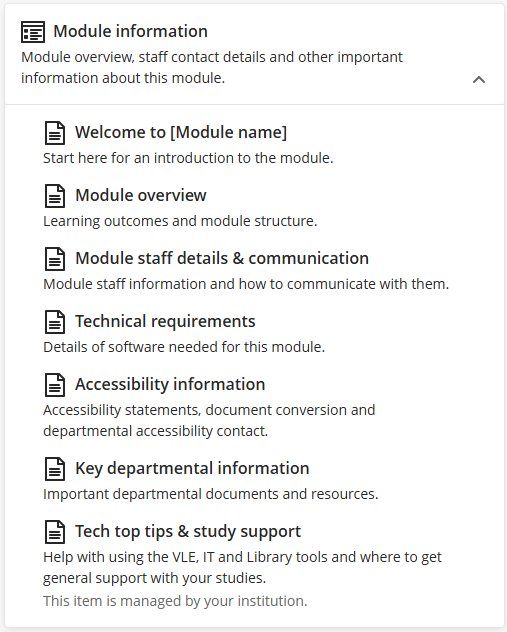
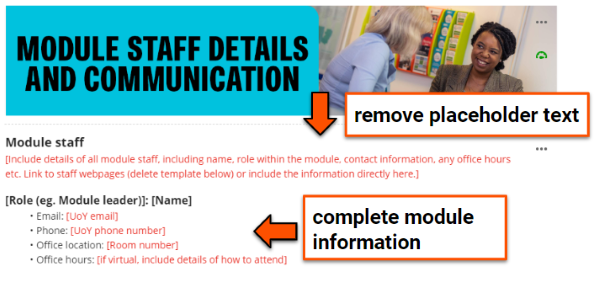
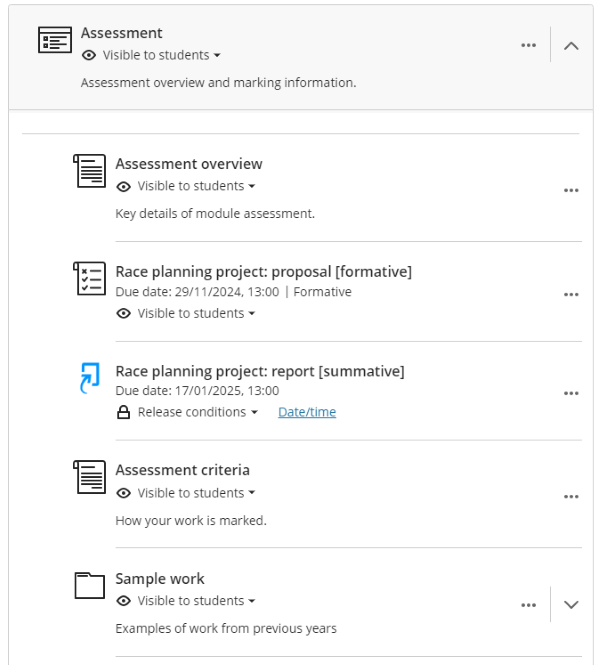
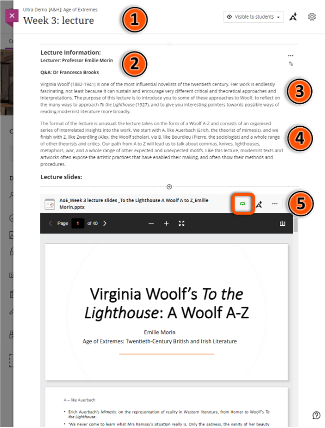
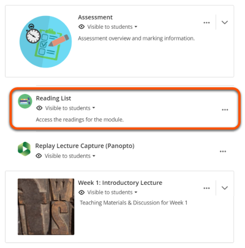
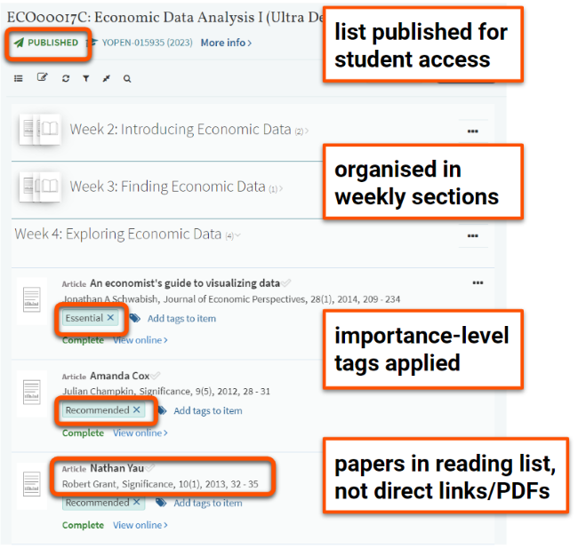
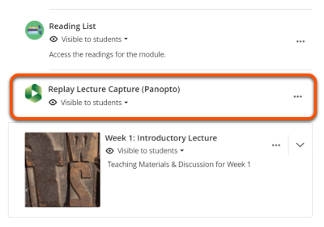
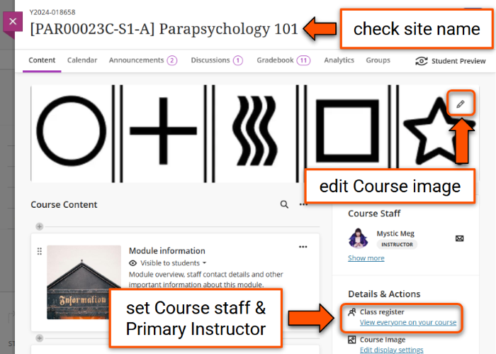

---
tags:
    - Key guide - teaching
    - Accessibility
    - Ultra
---

# Prepare sites for teaching

!!! Summary

    Use this guide to update an existing site after rollover or set up a new site from a departmental template. Work through in order or use the navigation on the right to jump to a specific section.

## Accessing your new site

New sites for the next academic year are are usually created in July or August. Sites are either **rolled over** as a copy of the previous year's site, or **set up from the departmental template** with placeholder structure and content.

New sites will appear in your [Courses list](../ultra/courses-list.md). You may need to clear any filters or search terms previously applied to see your new site listed. **Check the [site ID code (YCode)](https://vle-support.york.ac.uk/help/ycodes/)** to make sure you update the correct site. 

For an introduction to key parts of the site, see the [Navigation guide](../ultra/navigation.md).

## Rollover from a previous year's site

Before you start updating your new site, check some reports on your site from the previous year:

- **Templating compliance**: look up your module on the [templating usage report](https://datastudio.google.com/u/0/reporting/aeddd47e-f614-4a0f-aa48-1aa9dc1a3ab3/page/p_c972xie82d). Address any issues noted in the new site.
- **Accessibility**: within your new site, use the [**Ally accessibility report**](../ultra/ally-accessibility-report.md) to identify and address any accessibility issues in site content.

## Module information section

??? principle "Relevant [VLE site design principles](../ultra/site-design-principles.md)"

    - 1.1 Essential: Module orientation information and learning outcomes are easy to find.
    - 1.2 Essential: Provide details of specialist software or equipment required.
    - 1.3 Essential: Provide module staff details and communication expectations.
    - 1.5 Recommended: Provide links to relevant departmental or support information.
    - 2.1 Essential: Site structure includes sections for module information, assessment, Reading List, Replay Content and module materials.

This section contains important information about the module and department. Pages are provided by your departmental template with areas for you to add module information:

Module-level pages:

- **Welcome**: a brief introduction to the module
- **Module overview**: learning outcomes, module structure, weekly topics etc. (in some templates this may be split into a **Module planner** page).
- **Module staff details & communication**: email, office hours etc.
- **Technical requirements**: details of any software used in the module. Delete the page if not needed.

Department-level pages:

- **Accessibility information**: accessibility statement and contact details
- **Tech top tips & study support**: general help with the VLE, IT, Library etc.
- Your template may contain other departmental-level pages.

### Tasks: Module information section   

1. Check all required pages are present and visible. [Contact us](mailto:vle-support@york.ac.uk) to restore any missing pages from your departmental template.
2. Add/check information on module-specific pages: 
    - Update or remove all template placeholder text (usually coloured red).
    - Check and update links for specific year-based documents (eg. handbooks), or even better, use a stable ongoing link so you don't have to update it again in the future.
    - Check any introductory Panopto videos can be accessed by this year's students (see Panopto section below).
3. If rolled from last year's site, remove any content that is no longer needed.

<figure markdown="span">

<figcaption>Templated Module Information pages</figcaption>
</figure>

## Assessment section

??? principle "Relevant [VLE site design principles](../ultra/site-design-principles.md)"

    - 2.1 Essential: Site structure includes sections for module information, assessment, Reading List, Replay Content and module materials.
    - 4.1 Essential: The assessment section contains all information about module assessments.
    - 4.2 Essential: Assessment instructions are clearly labelled and explain the task and requirements.
    - 4.3 Essential: Provide marking criteria or other grading policies showing how work is marked.
    - 4.4 Essential: Signpost students to where they can get help with the assessment task or submission.
    - 4.5 Recommended: Provide exemplars of representative work and/or past exam papers.

!!! Tip

    Students tell us that well-organised assessment information is crucial to support their learning.

This section collates all assessment-related information in one place. Pages are provided by your departmental template with areas for you to add module information:

- **Assessment overview**: a summary of all assessment tasks in the module. Often also includes information on assessment policy and where to get help.
- **Assessment criteria**: details of how work is marked. Can be information added directly to page, an uploaded document or link to an external item (eg. programme handbook)
- **Sample work/past eam papers**: as appropriate, provide or link to assignment exemplars, past papers etc.

This section should also contain all **assessment briefs**, **submission points** and other formal assessments for the module.

<figure markdown="span">

<figcaption>Example Assessment section with submission points</figcaption>
</figure>

### Tasks: Assessment section

1. Check all required pages are present and visible. [Contact us](mailto:vle-support@york.ac.uk) to restore any missing pages from your departmental template.
2. Add/check information on module-specific pages: 
    - Update or remove all template placeholder text (usually coloured red).
    - Add/update assessment information.
3. Add/check assessment tasks:
    - Provide clearly labelled instructions for each task.
    - Add submission points, tests etc. (may be completed by departmental admin).
    - Include all formal assessment tasks (formative and summative) here, rather than elsewhere in the site.
4. If rolled from last year's site:
    - remove any content that is no longer needed.
    - [update any due dates](../assessment/update-due-dates.md) and release dates or hide items if the new due date is still to be confirmed (may be completed by departmental admin). Specific dates given in instruction text must be manually updated; consider using relative dates (eg. "Week 2, Friday 13:00").S

## Module materials & content

??? principle "Relevant [VLE site design principles](../ultra/site-design-principles.md)"

    - 2.1 Essential: Site structure includes sections for module information, assessment, Reading List, Replay Content and module materials.
    - 2.2 Essential: Materials within sections are clearly organised so content is easy to find.
    - 3.1 Essential: Organise module materials in sections that support student progress through the module.
    - 3.3 Essential: Provide up-to-date documents in an accepted file format.
    - 3.4 Essential: Site and materials content is accessible.

!!! Tip

    Students tell us that materials should be organised sequentially according to when they will be used, rather than by file type or other factors.

Templates include weekly sections for module materials. This may be a folder per week, or a Module Materials folder with sub-folders for each week. Placeholder pages may be provided for lecture slides, seminar questions etc.

Some departmental templates have a slightly different structure, but all content shoudl be organised sequentially.

Add your module content within these sections. Tools available include:

- [Document](../ultra/documents.md) (aka. VLE page): the main page type for adding VLE content 
- [Upload files](../ultra/files.md): eg. Word or Powerpoint files
- [Course groups](../ultra/course-groups.md): for facilitating collaboration and group work
- [Discussions](../ultra/discussions.md): Q&A forums, asynchronous discussion,  student-created content
- [Tests](../ultra/test.md): informal/practice quizzes
- [Journals](../ultra/journal.md): reflective practice
- [AI conversations](../ultra/ai-conversation.md): reflection, practice, exploration and more
- Other materials you can [embed in your Ultra site](../ultra/documents.md#block-html):
    - [interactive Xerte objects](../other-tools/xerte.md)
    - pre-recorded Panopto or YouTube videos
    - [Mentimeter surveys](../other-tools/mentimeter/asynchronous-use.md) and other interactions

<figure markdown="span">

<figcaption>Example: weekly materials section</figcaption>
</figure>

### Tasks: module materials

1. Check all content using the [**Ally accessibility report**](../ultra/ally-accessibility-report.md) and ensure materials follow [accessibility good practice](../ultra/accessible-sites.md).
2. Add/update weekly materials:
    - Use the tools above to add/update module content.
    - **Label items clearly and consitently** to describe the content without having to open it.
    - **Set item visibility** and **add any [Release conditions](../ultra/content-visibility.md)** (eg. show on a specific date). [Batch Edit](../ultra/batch-edit.md) may be useful to update settings for multiple items at once.
    - **Delete any old materials** (files, text content etc.) or unused template itemns.
    - **Do not upload video files** directly to the site or within slide decks; use Panopto instead.
3. If reusing content or materials from previous years:
    - Ensure all **content and files are up to date**. Don't add any old material.
    - **Check links and embedded content** are shared correctly for the new cohort. For example, update links to yearly handbook documents and check any re-used Panopto videos are shared correctly (see [Replay Lecture Capture (Panopto) section](#replay-lecture-capture-panopto) for details).
    - The [Copy Content tool](../ultra/copy-content.md#copy-content-tool) can be used to copy materials from other Ultra sites that you have Instructor access to.

The case studies below demonstrate how advanced tools and features have been applied in module sites across the University. You can also browse our [full set of case studies](../training/case-studies/index.md) for more examples.

??? case-study "Case study: Developing the ‘Structure of English’ module site (using Discussions and Tests)"

    Ellie Rye explains how they applied the Ultra template to present teaching content, and reflects on the use of Discussions and Tests for formative practice quizzes.

    Watch their presentation:<iframe src="https://york.cloud.panopto.eu/Panopto/Pages/Embed.aspx?id=affd8a23-7d50-4d21-87d0-b15600b04234&autoplay=false&offerviewer=true&showtitle=false&showbrand=false&captions=false&interactivity=all" height="405" width="720" style="border: 1px solid #464646;" allowfullscreen allow="autoplay" aria-label="Panopto Embedded Video Player" aria-description="Ellie Rye, LLS, Structure of English" ></iframe>

    [Structure of English (Panopto viewer)](https://york.cloud.panopto.eu/Panopto/Pages/Viewer.aspx?id=affd8a23-7d50-4d21-87d0-b15600b04234) (8 mins 21 secs, UoY log-in required)

    See the [full case study for more details and the transcript (Rye)](../training/case-studies/lls-rye.md).

??? case-study "Case study: Using interactive Xerte objects to enhance asynchronous learning"

    Phil Martin and Dawn Genner Lowson outline how they use Xerte to create interactive materials with built-in feedback to support asynchronous learning.

    Watch their presentation:
    <iframe src="https://york.cloud.panopto.eu/Panopto/Pages/Embed.aspx?id=d87fc4fc-b05a-4ee3-af92-aecc00cf2948&autoplay=false&offerviewer=true&showtitle=false&showbrand=false&captions=false&interactivity=all" height="405" width="720" style="border: 1px solid #464646;" allowfullscreen allow="autoplay" aria-label="Panopto Embedded Video Player" aria-description="Using Xerte to enhance asynchronous learning - Phil Martin and Dawn Genner Lowson" ></iframe>

    [Using Xerte to enhance asynchronous learning (Panopto viewer)](https://york.cloud.panopto.eu/Panopto/Pages/Viewer.aspx?id=d87fc4fc-b05a-4ee3-af92-aecc00cf2948) (2 mins 47 secs, UoY log-in required)

    See the [full case study for more details and the transcript (Martin & Genner)](../training/case-studies/ipc-martin-genner.md).

??? case-study "Case study: Use of discussion boards in the Popular Culture, Media and Society module"

    David Beer reflects on using discussion boards in a regular pattern of activities triggered by online videos posing a key question related to weekly lectures. This facilitated contributions from many students who were less likely to contribute to in-person / synchronous sessions and provided a useful entry point for approaching challenging key concepts within the module. 

    Watch their presentation:
    <iframe src="https://york.cloud.panopto.eu/Panopto/Pages/Embed.aspx?id=9e70e40b-1080-407a-bafa-ad4f0188ef82&autoplay=false&offerviewer=true&showtitle=false&showbrand=false&captions=false&interactivity=all" height="405" width="720" style="border: 1px solid #464646;" allowfullscreen allow="autoplay" aria-label="Panopto Embedded Video Player" aria-description="Use of discussion boards, David Beer, Sociology" ></iframe>

    [Use of discussion boards in the Popular Culture, Media and Society module (Panopto viewer)](https://york.cloud.panopto.eu/Panopto/Pages/Viewer.aspx?id=9e70e40b-1080-407a-bafa-ad4f0188ef82) (15 mins 05 secs, UoY log-in required)

    See the [full case study for more details and the transcript (Beer)](../training/case-studies/sociology-beer.md).

## Reading List (Leganto)

??? principle "Relevant [VLE site design principles](../ultra/site-design-principles.md)"

    - 2.1 Essential: Site structure includes sections for module information, assessment, Reading List, Replay Content and module materials.
    - 3.2 Essential: Provide module readings using the Reading List tool.
    - 3.4 Essential: Site and materials content is accessible.

!!! Warning

    Do not upload readings to your site, link directly to websites or provide files via Google Drive/DropBox etc. This causes accessibility issues and very likely violates copyright. You must add these to your Reading List instead.

From 2025/26, it is University policy that **all modules must use the Reading List** to provide all course readings. This is to:

- ensure consistent and equal access to reading materials for students.
- allow the Library to manage stock and access levels.
- help comply with copyright regulations.

The [Leganto Reading List tool](https://subjectguides.york.ac.uk/readinglists/home) is connected to your site by the **Reading List** LTI link item in the Course Content area. 

The Library Reading List team can help set up a brand new list or make major changes to an existing list via this [Reading List online submission form](https://forms.gle/q4JLKxwX39a4F8tr7). They also provide a [digitisation service](https://subjectguides.york.ac.uk/readinglists/digitisation) to appropriately scan physical reading items.

<figure markdown="span">

<figcaption>Reading List link in Course Content area</figcaption>
</figure>

### Tasks: Reading List

1. Check the Reading List is present and visible. If it is missing, add it by following the steps on the [Reading List guide](../other-tools/reading-list.md).
2. Create/update your Reading List:
    - **Structure your list to match materials sections** in your Ultra site (usually weekly sections)
    - **Tag** readings as Essential, Recommended or Background
    - **Include all module readings on the Reading List**. Do not upload readings, link directly to websites or use Google Drive/DropBox. A [digitisation service](https://subjectguides.york.ac.uk/readinglists/digitisation) is available if required.
    - **Publish** the Reading List so students can access it

    More advice and videos can be found on the [Reading List guide](https://subjectguides.york.ac.uk/readinglists).

<figure markdown="span">

<figcaption>Good practice in Reading List use</figcaption>
</figure>

## Replay Lecture Capture (Panopto)

??? principle "Relevant [VLE site design principles](../ultra/site-design-principles.md)"
    
    - 2.1 Essential: Site structure includes sections for module information, assessment, Reading List, Replay Content and module materials.
    - 3.5 Essential: Pre-recorded videos are hosted in a streaming service and captioned accurately.
    - 5.1 Recommended: Ensure that students can see and access module materials and content.

!!! Warning

    For accessibility reasons, all video content must be provided via Panopto or another streaming service (eg. YouTube) and captioned appropriately. You must not directly upload video files to the site or inside slide decks.

The [Panopto folder](https://www.york.ac.uk/it-services/tools/panopto/) is connected to your site by the **Replay Lecture Capture (Panopto)** LTI link item in the Course Content area.

This folder can contain:

- lecture capture recordings (automatically added) 
- any cohort-specific at-desk recordings (manually add)

Recordings that you plan to re-use in future years must be moved to an Ongoing Media folder (see section below).

<figure markdown="span">

<figcaption>Panopto link in Course Content area</figcaption>
</figure>

### Tasks: Panopto

1. In your site: check that the Replay Lecture Capture (Panopto) LTI link is present and visible to students. If it is missing, [contact us](mailto:vle-support@york.ac.uk) to set this up for you.
2. In the Timetable: check that sessions to be captured have the triangular "play" icon on the event. If missing, contact [Timetabling](https://www.york.ac.uk/about/departments/support-and-admin/estates-and-campus-services/room-bookings-timetabling/) to arrange lecture capture
3. If you are reusing Panopto content from previous years:
    - videos in multiple years: must be stored in an Ongoing Media folder. Any links or embeds of videos in this folder will not need updating each year in your VLE site. [Contact us](mailto:vle-support@york.ac.uk) to set this up for you if needed.
    - videos just fopr this cohort (eg. collective feedback on formative work): this should be stored in your module Panopto folder.
    - See our [guide to reusing module media](../panopto/reuse-module-media.md) for more information.

## Other settings

??? principle "Relevant [VLE site design principles](../ultra/site-design-principles.md)"

    - 1.3 Essential: Provide module staff details and communication expectations.

Check other factors relating to site settings and user access.

### Tasks: other settings

1. Check the **[site name](../ultra/site-name.md)** is in the format *[SITS CODE] Mdoule name*, eg. [PAR 00023C - S1-A] Parapsychology 101. **Do not rename your site**.
2. Check/update the **[Course image](../ultra/course-image.md)**.
3. Check **staff enrolments & Primary Instructors**:
    - click *Class Register* under the *Details & Actions* menu and check that all relevant staff (lecturers, demonstrators, GTAs etc.) are enroled on the site with the right access level (usually Instructor). 
    - if needed, [enrol](../ultra/user-management.md#enrol-individual-users) missing module staff or [unenrol](../ultra/user-management.md#unenrol-a-user) any GTAs or other staff members who don't need access to this year's site (you can also contact your departmental administrator or professional support team for help with this).
    - check/update [**Primary Instructor** settings](../ultra/course-staff.md) so that module staff appear at the top of the *Course Staff* list.
4. Check the **student enrolment**. This is managed automatically through a group enrolment linked to SITS, which is usually set up in late August. Check the Class Register for an [Autoenroller user with the module name](../ultra/user-management.md#enrol-via-module-code). If you need help with this, contact your departmental administration team.
5. Check/add any **[Course groups](../ultra/course-groups.md)** required. Note: assessment administrators will manage any assessment-related groups.

!!! Success "Final step"

    When you are happy that everything is ready, [**open the site for students**](../ultra/course-access.md). Congratulations!