---
tags:
    - Key guide - teaching
    - Accessibility
    - Ultra
---

# Prepare sites for teaching   (update after rollover or new site)

!!! Summary

    This checklist guides you through the steps to update an existing site after rollover or set up a new site from a departmental template. Work through the checklist in order or use the navigation on the right to jump to a specific section.

    Before each semester, we offer live training sessions and bookable 1:1 consultations to assist with preparing your site. See our [Training page](../training/index.md) for details and to book a session.

    Already prepared your content? See the [Site Readiness Checklist](../ultra/site-readiness-checklist.md) for final pre-teaching checks.

## Accessing your new site

New sites for the next academic year are are usually created in July or August. Sites are either **rolled over** as a copy of the previous year's site, or **set up from the departmental template** with placeholder structure and content.

New sites will appear in your [Courses list](../ultra/courses-list.md). You may need to clear any filters or search terms previously applied to see your new site listed.

!!! Warning 

    **Make sure you update the correct site**. Check the [site ID code (YCode)](https://vle-support.york.ac.uk/help/ycodes/) shows the upcoming academic year (eg, Y2025 for 2025/2026). The YCode is displayed on the Courses list item and at the top of the screen within the site.

    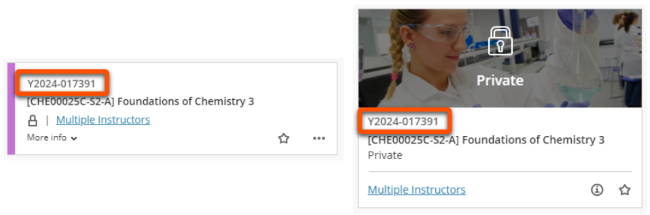

## General settings & structure

!!! principle "Relevant [VLE site design principles](../ultra/site-design-principles.md)"

    - 1.3 Essential: Provide module staff details and communication expectations.
    - 1.4 Essential: Site title contains the SITS code and official module name.
    - 2.1 Essential: Site structure includes sections for module information, assessment, Reading List, Replay Content and module materials.

For an introduction to key parts of the site, see [Getting started with Ultra: Site structure](../ultra/getting-started.md#ultra-site-structure-module-template).

!!! Tip

    Module sites must apply their departmental template. This provides broad consistency across students' module sites and ensures access to key information.
    
    If any of the sections or items listed in this guide are missing from your site or require updating, [contact us](mailto:vle-support@york.ac.uk) to restore them.

Key site settings include the site name, Course Image, Course staff list and Primary Instructor.

??? Abstract "General settings: update after rollover"

    !!! question "What is rolled over?"

        - **Site name**: automatically updated
        - **Course image**: copied
        - **Staff enrolments** and **Primary instructors**: copied, check and update
        - **Course Groups**: empty groups copied

    1. **Template sections**: check that all sections are present and visible to students.
    2. **[Site name](../ultra/site-name.md)**: check the SITS code and module name are correct. Site names have a standardised format needed for various systems to run. **Please do not rename your site**.
    3. **[Course image](../ultra/course-image.md)**: check and update if needed
    4. **Staff enrolments & Primary Instructors**:
        - click *Class Register* under the *Details & Actions* menu and check that all relevant staff (lecturers, demonstrators, GTAs etc.) are enroled on the site with the right access level (usually Instructor). 
        - if needed, [enrol](../ultra/user-management.md#enrol-individual-users) missing module staff or [unenrol](../ultra/user-management.md#unenrol-a-user) any GTAs or other staff members who don't need access to this year's site (you can also contact your departmental administrator or professional support team for help with this).
        - check/update [**Primary Instructor** settings](../ultra/course-staff.md) so that module staff appear at the top of the *Course Staff* list.
    5. **[Course groups](../ultra/course-groups.md)**: If used, check these are still appropriate and edit/delete settings. Note: assessment administrators will manage any assessment-related groups.

??? Abstract "General settings: set up site from template"

    1. **[Site name](../ultra/site-name.md)**: check the SITS code and module name are correct. Site names have a standardised format needed for various systems to run. **Please do not rename your site**.
    2. **[Course image](../ultra/course-image.md)**: add or update the template Course image to something relevant to your module.
    3. **Staff enrolments & Primary Instructors**:
        - click *Class Register* under the *Details & Actions* menu and check that all relevant staff (lecturers, demonstrators, GTAs etc.) are enroled on the site with the right access level (usually Instructor).
        - if needed, [enrol](../ultra/user-management.md#enrol-individual-users) missing module staff (you can also contact your departmental administrator or professional support team for help with this).
        - apply [**Primary Instructor** settings](../ultra/course-staff.md) so that module staff appear at the top of the *Course Staff* list.
    
## Module information section

!!! principle "Relevant [VLE site design principles](../ultra/site-design-principles.md)"

    - 1.1 Essential: Module orientation information and learning outcomes are easy to find.
    - 1.2 Essential: Provide details of specialist software or equipment required.
    - 1.3 Essential: Provide module staff details and communication expectations.
    - 1.5 Recommended: Provide links to relevant departmental or support information.

This **templated section** contains important information about the module and department:

- module-specific content: module overview, staff contact details etc.
- departmental support and accessibility details

Prepare this section by editing, updating or deleting content in the pre-built pages.

<figure markdown="span">
![Module specific pages: Welcome to [Module name], Module overview, Module staff details & communication, Technical requirements](images/prepare-site-module-specific-information.png)
<figcaption>Module-specific pages</figcaption>
</figure>

??? Abstract "Module information section: update after rollover"

    !!! question "What is rolled over?"

        - **Documents** (pages): exact copies
        - **Discussions**: a blank copy with the same prompt and settings
        - **Uploaded files** and **Link items**: copied

    If this section or any pages within it are missing, [contact us](mailto:vle-support@york.ac.uk) to restore them from your departmental template.

    

    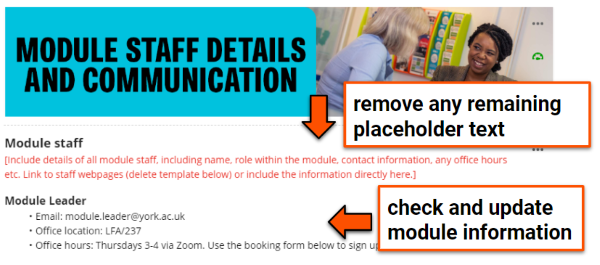
    

    Check and update content for the new academic year:

    1. *Welcome to [Module]*, *Module overview* and *Module staff* pages:

        - **check module information** is complete and up to date
        - **check any introductory Panopto videos** on these pages can be accessed by this year's students (see Panopto section below) 
        - **check and update contact details** for all teaching staff on the *Module staff details & communication* page
        - **delete any remaining placeholder content** from the template
        - **check links are up to date** and **update links** for specific year-based documents to the new version (or even better, use a stable ongoing link so you don't have to update it again in the future)
    2. *Technical Requirements* page

        If your module has:

        - **specific software/equipment needed**: check information on how to get the software/equipment. You can also link to the [IT Services page for that tool](https://www.york.ac.uk/it-services/tools). Make sure the page is visible to students.
        - **no technical requirements**: delete the page or hide from students.
    3. *Departmental pages*
     The remaining pages contain important departmental information; don't adapt, hide or delete these pages 

??? Abstract "Module information section: set up site from template"
    
    

    
    

    
    Complete the pages with your module information:

    1. *Welcome to [Module]*, *Module overview* and *Module staff* pages:

        - **update template placeholder text** with module information, or delete if not relevant.
        - **complete contact details** for all teaching staff on the *Module staff details & communication* page
        - **use stable, ongoing links** rather than links to year-based documents (eg. link to a page where current handbooks are hosted, not the specific document for this year). This will make your site easier to maintain.
    2. *Technical Requirements* page

        If your module has:

        - **specific software/equipment needed**: add information on how to get the software/equipment. You can also link to the [IT Services page for that tool](https://www.york.ac.uk/it-services/tools). Make sure the page is visible to students.
        - **no technical requirements**: delete the page or hide from students.
    3. *Departmental pages*
     The remaining pages contain departmental information; don't adapt, hide or delete these pages. 

??? Abstract "Module information section: good practice example"

    Explore your relevant Ultra demo site for examples of good practice in setting up the Module information section:

    - [Sciences Ultra demo site](https://vle.york.ac.uk/ultra/courses/_106340_1/outline)
    - [Social Sciences Ultra demo site](https://vle.york.ac.uk/ultra/courses/_106627_1/outline)
    - [Arts & Humanities Ultra demo site](https://vle.york.ac.uk/ultra/courses/_106233_1/outline)

    This Module Overview page from the Sciences Ultra demo site is a good example, giving clear information on:

    - **Module description**:
    - **Module aims & learning outcomes**:
    - **Module organisation**: details of the topics covered in the module and how they fit together.
    - **Module activities**: how the teaching sessions are organised over the module.

    

    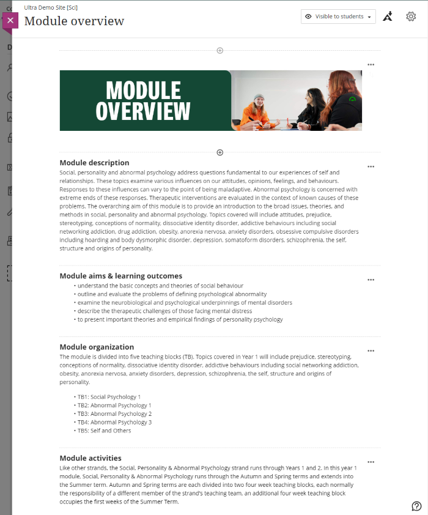
    

## Assessment section

!!! principle "Relevant [VLE site design principles](../ultra/site-design-principles.md)"

    - 4.1 Essential: The assessment section contains all information about module assessments.
    - 4.2 Essential: Assessment instructions are clearly labelled and explain the task and requirements.
    - 4.3 Essential: Provide marking criteria or other grading policies showing how work is marked.
    - 4.4 Essential: Signpost students to where they can get help with the assessment task or submission.
    - 4.5 Recommended: Provide exemplars of representative work and/or past exam papers.

This **templated section** collates all assessment-related information in one place, so that:
    
- students can easily locate assessment details across all their module sites
- assessment information is easier for staff to update and maintain

Prepare this section by:

- editing, updating or deleting content in the pre-built pages.
- adding materials for your specific assessment tasks (instruction, Tests, submission points etc.).

<figure markdown="span">

<figcaption>Sample Assessment section</figcaption>
</figure>

!!! Tip

    We have very strong feedback from students that clear and well organised assessment information is crucial to 
    support their learning.

??? Abstract "Assessment section: update after rollover"
    
    !!! question "What is rolled over?"

        - **Documents** (pages): exact copies
        - **Assignment**, **Test**, **Turnitin Feedback Studio**, **Gradescope** items: 
            - instructions and settings: copied, check and update as needed
            - due date: copied exactly, must be updated
            - submissions: not copied
        - **Release conditions** for any materials: copied exactly, must be checked and dates/conditions updated as needed.

    !!! Warning "Warning: action required"

        You must [update due dates](../assessment/update-due-dates.md) and release dates for the new academic year, or hide items if the new due date is still to be confirmed. If past due dates are visible once the site is opened students may receive notifications of missing or overdue work.

    If this section or any pages within it are missing, [contact us](mailto:vle-support@york.ac.uk) to restore them from your departmental template.

    

    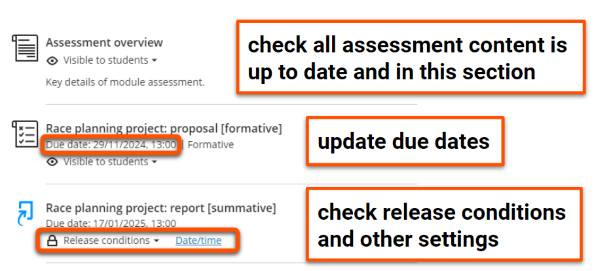
    

    Check all assessment information is up to date and appears in this section:

    1. ***Assessment overview***, ***Assessment criteria***, ***sample work***, ***past papers***: check and update as needed. If these weren't set up in the previous year, see the 'set up site from template' section for details.
    2. **Assessment tasks & submission points**:
        
        - check that all formative and summative assessment instructions, quizzes and submission points (as listed on the Module Catalogue) are up to date and included in this section.
        - move any assessment information previously added to a different area into this section. For students to also access an assessment item from a particular week's materials, use a [Course Link](../ultra/links.md#course-link) in the weekly section.
        - if instructions and quizzes/submission points are included as separate items, label these clearly.
        - your departmental assessment administrators may set up submission points for you - see your departmental information.
    3. **Due dates & release dates**: update for the new academic year. [Batch Edit](../ultra/batch-edit.md) may be useful to update multiple items. Specific dates given in instruction text must be manually updated; consider using relative dates instead (eg. "Week 2, Friday 13:00").

??? Abstract "Assessment section: set up site from template"

    

    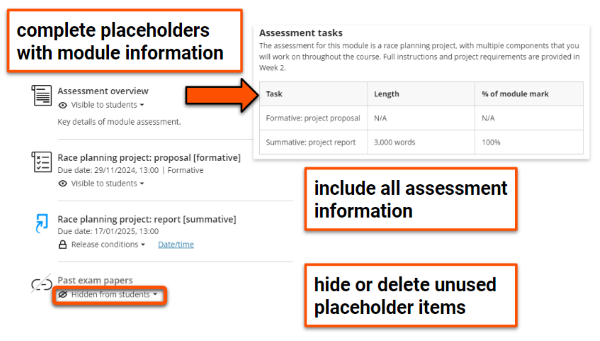
    

    Add all assessment-related content to this section:

    1. ***Assessment overview***: complete the summary table listing formative and summative assessment tasks, or link to the Module Catalogue page (don't include a year in the link, so it always goes to the current year). The rest of the page contains departmental-level information, so you usually won't need to change that.
    2. ***Assessment criteria***: for submission-based assessment, update with information on how work is marked. You could upload a document, or replace this item with a link to marking criteria in a course handbook. Delete or hide from students if not relevant.
    3. ***Sample work***: consider providing some examples of past work to help students understand task requirements and expectations for good submissions. Delete or hide from students if not relevant.
    4. ***Past papers***: check or update the link to online past paper repository, or consider replacing with a folder containing past papers. Delete or hide from students if not relevant.
    5. **Assessment tasks & submission points**:
        
        - include all formative and summative assessment instructions, quizzes and submission points (as listed on the Module Catalogue) in this section.
        - for students to also access an assessment item from a particular week's materials, use a [Course Link](../ultra/links.md#course-link) in the weekly section.
        - if instructions and quizzes/submission points are included as separate items, label these clearly.
        - your departmental assessment administrators may set up submission points for you - see your departmental information.
        - informal practice quizzes or tasks can be included in weekly materials sections.
    6. **Due dates & release dates**: to make instructions easier to update for later years, use relative dates (eg. "Week 2, Friday 13:00") instead of specific dates.

<!-- === "Good practice: examples"

    - clear instructions given (Psych?)
    - course link to weekly section (Maths?)
    - exemplar Y2023-017605 (HEA - midwifery) -->

## Reading List (Leganto)

!!! principle "Relevant [VLE site design principles](../ultra/site-design-principles.md)"

    - 3.2 Essential: Provide module readings using the Reading List tool.
    - 3.4 Essential: Site and materials content is accessible.

From 2025/26, it is University policy that **all modules must use the Reading List** to provide all course readings. This is to:

- ensure consistent and equal access to reading materials for students.
- allow the Library to manage stock and access levels.
- help comply with copyright regulations.

The [Leganto Reading List tool](https://subjectguides.york.ac.uk/readinglists/home) is connected to your site by the **Reading List** LTI link item in the Course Content area. 

<figure markdown="span">

<figcaption>Reading List link in Course Content area</figcaption>
</figure>

!!! Warning

    Do not upload readings to your site, link directly to websites or provide files via Google Drive/DropBox etc. This causes accessibility issues and very likely violates copyright. You must add these to your Reading List instead.

The Library Reading List team can help set up a brand new list or make major changes to an existing list via this [Reading List online submission form](https://forms.gle/q4JLKxwX39a4F8tr7). They also provide a [digitisation service](https://subjectguides.york.ac.uk/readinglists/digitisation) to appropriately scan physical reading items.

??? Abstract "Reading List: update after rollover"

    !!! question "What is rolled over?"

        - **Reading List LTI link** in Course Content: copied
        - **Reading List in Leganto**: copied
        
        Note: the LTI link in your site will not connect to the Reading List itself until manually attached by the Reading List Team over the summer holiday period.

    Check the **Reading List LTI link** in your Course Content area:
    
    - if it is missing, add it by following the steps on the [Reading List guide](../other-tools/reading-list.md)
    - make sure it is [visible to students](../ultra/content-visibility.md)
    
    Check and update your Reading List:

    - access your Reading List by clicking the Reading List item in the Course Content area
    - **check reading list items are up to date**, and delete any old materials that are no longer needed.
    - make sure it is **structured to match materials sections** in your Ultra site (usually weekly sections)
    - make sure readings are **tagged** as Essential, Recommended or Background
    - make sure **all assigned and recommended module readings are included** on the Reading List
    - **publish** the Reading List so students can access it
    - remove any readings previously provided as files or links from your site and make sure these are added to the Reading List.
    
    [Video guide: Managing and editing your Reading Lists [YouTube]](https://youtu.be/KzjyUZmDcrs)
    <iframe width="560" height="315" src="https://www.youtube.com/embed/KzjyUZmDcrs?si=56LTihtbrnO3znb4" title="YouTube video player" frameborder="0" allow="accelerometer; autoplay; clipboard-write; encrypted-media; gyroscope; picture-in-picture; web-share" referrerpolicy="strict-origin-when-cross-origin" allowfullscreen></iframe>

    More guidance and videos can be found on the [Reading List: edit and manage lists guide](https://subjectguides.york.ac.uk/readinglists/manage).

??? Abstract "Reading List: set up a new Reading List"
    
    Check the ***Reading List* item** in your Course Content area:
    
    - if it is missing, add it by following the steps on the [Reading List guide](../other-tools/reading-list.md)
    - make sure it is [visible to students](../ultra/content-visibility.md)

    Set up your Reading List:

    - create or access your Reading List by clicking the Reading List item in the Course Content area
    - **structure your list to match materials sections** in your Ultra site (usually weekly sections)
    - **tag** readings as Essential, Recommended or Background
    - **include all module readings on the Reading List**. Do not upload readings, link directly to websites or use Google Drive/DropBox. A [digitisation service](https://subjectguides.york.ac.uk/readinglists/digitisation) is available if required.
    - **publish** the Reading List so students can access it
    
    [Video guide: Creating a new Reading List [YouTube]](https://youtu.be/OBuh3W4-UWQ)
    <iframe width="560" height="315" src="https://www.youtube.com/embed/OBuh3W4-UWQ?si=gGtLT_aBfApgXlp_" title="YouTube video player" frameborder="0" allow="accelerometer; autoplay; clipboard-write; encrypted-media; gyroscope; picture-in-picture; web-share" referrerpolicy="strict-origin-when-cross-origin" allowfullscreen></iframe>

    More guidance and videos can be found on the [Reading List: getting started guide](https://subjectguides.york.ac.uk/readinglists/getting-started).

??? Abstract "Reading List: good practice example"

    This example demonstrates features of a well-set up Reading List:

    - **Published**: the list is open for students
    - Organised in **weekly sections** or other sections matching the module site structure
    - **Importance-level tags** are applied to each item: Essential, Recommended, Background
    - All items, including **papers are included in the Reading List**.
    - The site does not give direct links to online readings or upload reading files.

    

    
    

## Replay Lecture Capture (Panopto)

!!! principle "Relevant [VLE site design principles](../ultra/site-design-principles.md)"
    
    - 3.5 Essential: Pre-recorded videos are hosted in a streaming service and captioned accurately.
    - 5.1 Recommended: Ensure that students can see and access module materials and content.

The [Panopto folder](https://www.york.ac.uk/it-services/tools/panopto/) is connected to your site by the **Replay Lecture Capture (Panopto)** LTI link item in the Course Content area.

This folder can contain:

- lecture capture recordings (automatically added) 
- any cohort-specific at-desk recordings (manually add)

Recordings that you plan to re-use in future years must be moved to an Ongoing Media folder (see section below).

<figure markdown="span">

<figcaption>Panopto link in Course Content area</figcaption>
</figure>

!!! Warning

    For accessibility reasons, all video content must be provided via Panopto or another streaming service (eg. YouTube) and captioned appropriately. You must not directly upload video files to the site or inside slide decks.

The same guidance applies to rolled over sites and new sites set up from template:

??? Abstract "Replay lecture capture: general settings"

    !!! question "What is rolled over?"

        - **Replay Lecture Capture (Panopto) LTI link**: copied
        - **Panopto folder and videos**: not copied, a new empty folder is created 

    

    

    In your site, check that:
    
    - the ***Replay Lecture Capture (Panopto)* LTI link** appears in your Course Content area. If it is missing, [contact us](mailto:vle-support@york.ac.uk) to set this up for you.
    - the ***Replay Lecture Capture (Panopto)* LTI link** is visible to students.

    In the **UoY Timetable**, check that sessions to be captured have the triangular "play" icon on the event. If missing, contact [Timetabling](https://www.york.ac.uk/about/departments/support-and-admin/estates-and-campus-services/room-bookings-timetabling/) to arrange lecture capture.
    

    <figure markdown="span">
    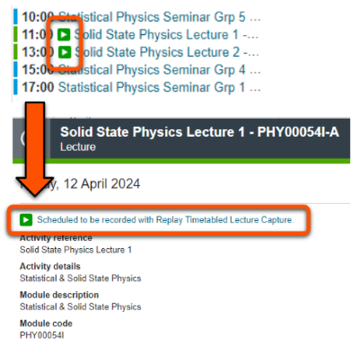
    <figcaption>Replay-enabled sessions in the Timetable</figcaption>
    </figure>
    

??? Abstract "Panopto: pre-recorded/reused videos"

    !!! question "What is rolled over?"

        - Links and video embeds: copied, but check that the new cohort can access the video.
        - Videos within Panopto folder: not copied.

    For students to access any pre-recorded [linked/embedded Panopto videos](../panopto/embed-panopto-ultra.md), these must be stored in an appropriate Panopto folder. Students can't access videos stored in the Panopto folder of a previous year's module.
    
    !!! Tip

        You likely have more Panopto access than your students, so **you being able to see a video doesn't necessarily mean they can**.

    If the pre-recorded videos will be used in multiple years, these must be stored in an Ongoing Media folder. Any links or embeds of videos in this folder will not need updating each year in your VLE site. [Contact us](mailto:vle-support@york.ac.uk) to set this up for you if needed.

    If the pre-recorded video is specific to this cohort (eg. collective feedback on formative work), this should be stored in your module Panopto folder.

    See our [guide to reusing module media](../panopto/reuse-module-media.md) for more information.

## Module materials & content

!!! principle "Relevant [VLE site design principles](../ultra/site-design-principles.md)"

    - 2.2 Essential: Materials within sections are clearly organised so content is easy to find.
    - 3.1 Essential: Organise module materials in sections that support student progress through the module.
    - 3.3 Essential: Provide up-to-date documents in an accepted file format.
    - 3.4 Essential: Site and materials content is accessible.

Templates include weekly sections for lecture slides, seminar questions, workshop preparation materials etc. In some cases, topic-based sections are included instead.

In most cases, you will add your content to a [Document](../ultra/documents.md) (aka. VLE page) or [upload files directly](../ultra/files.md).

You can update the pre-built template Documents, or delete them and create your own items.

<figure markdown="span">
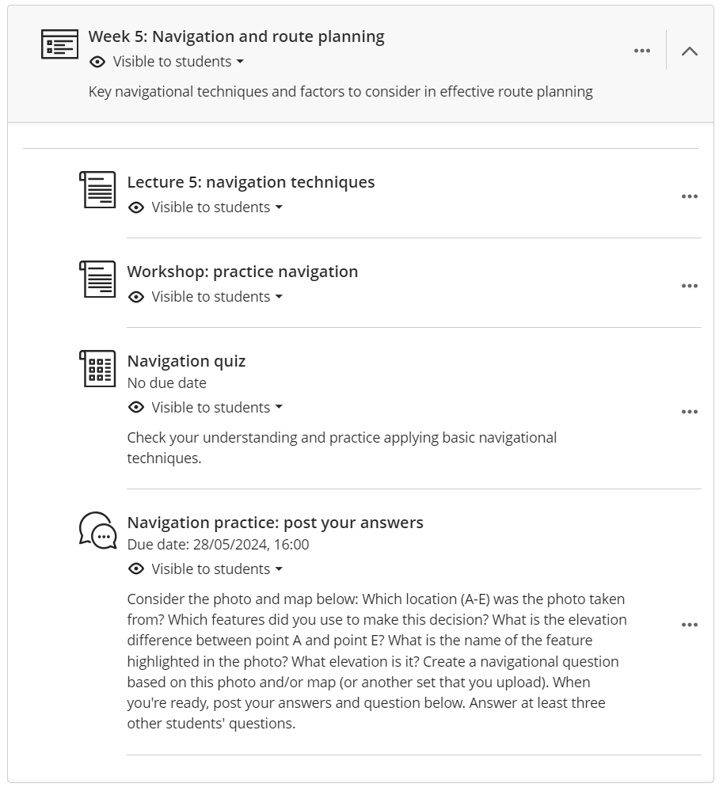
<figcaption>Sample weekly materials section</figcaption>
</figure>

!!! Tip

    Weekly sections are provided as we have very strong student feedback that materials should be organised according to when they will be used, rather than by file type or other factors.

??? Abstract "Module materials: update after rollover"

    !!! question "What is rolled over?"

        - **Documents** (pages), **uploaded files**, **external links**: copied exactly
        - **Course links**: copied and updated to link to the relevant item in this year's site
        - **Discussions**, **Journals**, **Forms**, practice quizzes using **Test**: copied as blank items with same settings and due dates, check and update as necessary
        - **Embedded content**: copied exactly, check student access and update as necessary
        - **Release conditions** for any materials: copied, must be checked and dates/conditions updated as needed.
        - **SCORM objects**: may need to be redeployed using the original package

    

    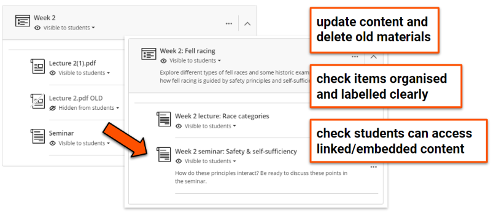
    

    
    - Use the [**Ally accessibility report**](../ultra/ally-accessibility-report.md) and check materials follow [accessibility good practice](../ultra/accessible-sites.md).
    - Check and update **weekly section titles** and descriptions as needed.
    - **Update materials** as needed for the new year (eg. new lecture slides) and **delete** any old materials (files, text content etc.) or unused template Documents or content.
    - Check that **items are labelled clearly** to describe the content without having to open it.
    - **Organise items sequentially** to guide students through the materials.
    - **Check links and embedded content** are shared correctly for the new cohort. For example, update links to yearly handbook documents and check any re-used Panopto videos are shared correctly (see [Replay Lecture Capture (Panopto) section](#replay-lecture-capture-panopto) for details).
    - Make sure that **video files are not directly uploaded** to the site or within slide decks.
    - Check **item visibility** and [update **due dates**](../assessment/update-due-dates.md) or [**Release conditions**](../ultra/content-visibility.md)** (eg. show on a specific date). [Batch Edit](../ultra/batch-edit.md) may be useful to update settings for multiple items at once.

??? Abstract "Module materials: set up site from template"

    

    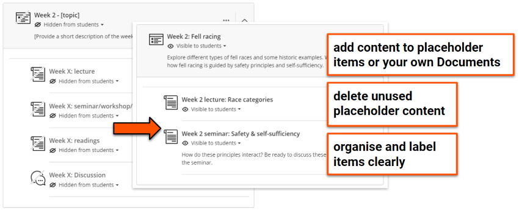
    

    - Use the [**Ally accessibility report**](../ultra/ally-accessibility-report.md) and ensure materials follow [accessibility good practice](../ultra/accessible-sites.md).
    - Update **weekly section titles** and add descriptions.
    - **Add your materials** to the template Documents included or delete these and add your own Documents and upload files as needed. 
    - **Label items and files clearly** to describe the content without having to open it.
    - **Organise items sequentially** to guide students through the materials.
    - **Do not upload video files** directly to the site or within slide decks.
    - **Set item visibility** and **add any [Release conditions](../ultra/content-visibility.md)** (eg. show on a specific date). [Batch Edit](../ultra/batch-edit.md) may be useful to update settings for multiple items at once.
    - If reusing content or materials from previous years:
        - ensure all **content and files are up to date**. Don't add any old material.
        - ensure any **re-used Panopto recordings** are shared correctly for the new year's cohort (see Panopto section below)
        - you can use the [Copy Content tool](../ultra/copy-content.md) to copy materials from other Ultra sites that you have Instructor access to. We don't recommend using this to migrate materials from Original (*old style*) sites due to structural differences.

??? Abstract "Module materials: going beyond Ultra basics"

    You can use Ultra and our other tools for a lot more than providing lecture slides and other file-based content, such as:

    - facilitating flipped learning, where students complete asynchronous tasks before an in-person session.
    - providing knowledge check and practice activities.
    - supporting collaboration and discussion.
    - sharing student-created content.
    
    Useful Ultra features include:

    - [Course groups](../ultra/course-groups.md): for facilitating collaboration and group work
    - [Discussions](../ultra/discussions.md): Q&A forums, asynchronous discussion,  student-created content
    - [Tests](../ultra/test.md) for informal/practice quizzes
    - [Journals](../ultra/journal.md) for reflective practice
    - [AI conversations](../ultra/ai-conversation.md) for practice, exploration and more
    - [Group Assignments](../ultra/assignment-set-up.md/#group-assessment) for collaborative formative or summative assessment

    Other materials you can [embed in your Ultra site](../ultra/documents.md#block-html):
    
    - [interactive Xerte objects](../other-tools/xerte.md)
    - pre-recorded Panopto or YouTube videos
    - [Mentimeter surveys](../other-tools/mentimeter/asynchronous-use.md) and other interactions

    The case studies below demonstrate how advanced tools and features have been applied in module sites across the University. You can also browse our [full set of case studies](../training/case-studies/index.md) for more examples.

    ??? case-study "Case study: Developing the ‘Structure of English’ module site (using Discussions and Tests)"

        Ellie Rye explains how they applied the Ultra template to present teaching content, and reflects on the use of Discussions and Tests for formative practice quizzes.

        Watch their presentation:<iframe src="https://york.cloud.panopto.eu/Panopto/Pages/Embed.aspx?id=affd8a23-7d50-4d21-87d0-b15600b04234&autoplay=false&offerviewer=true&showtitle=false&showbrand=false&captions=false&interactivity=all" height="405" width="720" style="border: 1px solid #464646;" allowfullscreen allow="autoplay" aria-label="Panopto Embedded Video Player" aria-description="Ellie Rye, LLS, Structure of English" ></iframe>

        [Structure of English (Panopto viewer)](https://york.cloud.panopto.eu/Panopto/Pages/Viewer.aspx?id=affd8a23-7d50-4d21-87d0-b15600b04234) (8 mins 21 secs, UoY log-in required)

        See the [full case study for more details and the transcript (Rye)](../training/case-studies/lls-rye.md).
    
    ??? case-study "Case study: Using interactive Xerte objects to enhance asynchronous learning"

        Phil Martin and Dawn Genner Lowson outline how they use Xerte to create interactive materials with built-in feedback to support asynchronous learning.

        Watch their presentation:
        <iframe src="https://york.cloud.panopto.eu/Panopto/Pages/Embed.aspx?id=d87fc4fc-b05a-4ee3-af92-aecc00cf2948&autoplay=false&offerviewer=true&showtitle=false&showbrand=false&captions=false&interactivity=all" height="405" width="720" style="border: 1px solid #464646;" allowfullscreen allow="autoplay" aria-label="Panopto Embedded Video Player" aria-description="Using Xerte to enhance asynchronous learning - Phil Martin and Dawn Genner Lowson" ></iframe>

        [Using Xerte to enhance asynchronous learning (Panopto viewer)](https://york.cloud.panopto.eu/Panopto/Pages/Viewer.aspx?id=d87fc4fc-b05a-4ee3-af92-aecc00cf2948) (2 mins 47 secs, UoY log-in required)

        See the [full case study for more details and the transcript (Martin & Genner)](../training/case-studies/ipc-martin-genner.md).

    ??? case-study "Case study: Use of discussion boards in the Popular Culture, Media and Society module"

        David Beer reflects on using discussion boards in a regular pattern of activities triggered by online videos posing a key question related to weekly lectures. This facilitated contributions from many students who were less likely to contribute to in-person / synchronous sessions and provided a useful entry point for approaching challenging key concepts within the module. 

        Watch their presentation:
        <iframe src="https://york.cloud.panopto.eu/Panopto/Pages/Embed.aspx?id=9e70e40b-1080-407a-bafa-ad4f0188ef82&autoplay=false&offerviewer=true&showtitle=false&showbrand=false&captions=false&interactivity=all" height="405" width="720" style="border: 1px solid #464646;" allowfullscreen allow="autoplay" aria-label="Panopto Embedded Video Player" aria-description="Use of discussion boards, David Beer, Sociology" ></iframe>

        [Use of discussion boards in the Popular Culture, Media and Society module (Panopto viewer)](https://york.cloud.panopto.eu/Panopto/Pages/Viewer.aspx?id=9e70e40b-1080-407a-bafa-ad4f0188ef82) (15 mins 05 secs, UoY log-in required)

        See the [full case study for more details and the transcript (Beer)](../training/case-studies/sociology-beer.md).

??? Abstract "Module materials: good practice examples"

    These examples are from the [Arts & Humanities Ultra demo site](https://vle.york.ac.uk/ultra/courses/_106233_1/outline) (based on a module in the Department of English and Related Literature). 

    **Clear and consistent structure**

    - Consistent weekly materials sections: each week contains (roughly) the same items in (roughly) the same order. 
    - Items named with week number and content type (core reading, lecture, seminar): easy to know what the item is without having to open it, and helps identify items using a site search.
    - Structure logically mirrors teaching activities: students are guided from core reading information to lecture content and finally seminar preparation.
    - Old or unused items removed: no clutter, less opportunity for confusion or errors, easier to maintain.
    
    !!! note

        *Core reading* pages give details and context for that week's reading tasks. The actual reading items are provided through the Reading List.

    

    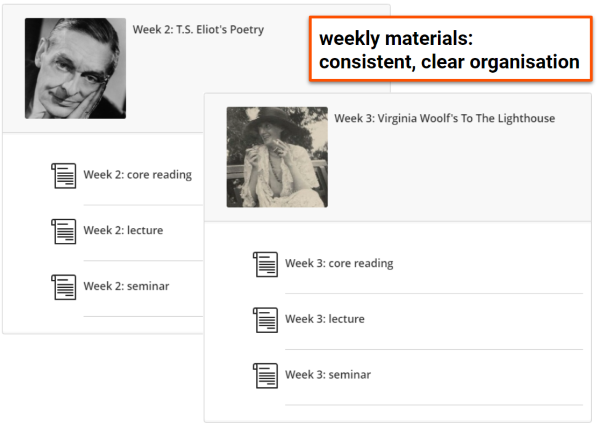
    

    **Well-presented materials**

    1. Accessible structure: consistent headings used throughout (using heading styles). This aids navigation and is very important for users of assistive technologies.
    2. Relevant staff details given for this particular lecture: this is especially helpful on a module with multiple lecturers.
    3. Brief introduction to the topic and lecture outcomes: gives context to the lecture topic and expectations.
    4. Other useful information about lecture content, delivery or format: in this case an unusual A-Z format.
    5. Lecture slides
        - Flexible use: students can preview the slides directly within the Document, download the original file or download in an alternative format. This allows students to use the slides in a way that meets their needs. 
        - File clearly named with module, week and topic: very helpful for organising and locating content if students download the file.
        - Accessibility checker used to make sure the file meets key accessibility features.

    

    
    

## Student access

**Student enrolment** is managed automatically through a group enrolment linked to SITS, which is usually set up in late August. To check this is added correctly:

1. Search the Class Register for 'group'.
2. Click on the item(s) 'Students enroled in'.
3. Check the group's SITS module code is correct, the Role is set to *AutoEnroller* and 'Allow access to course' is ticked.

<!-- **UPDATE IMAGE** -->

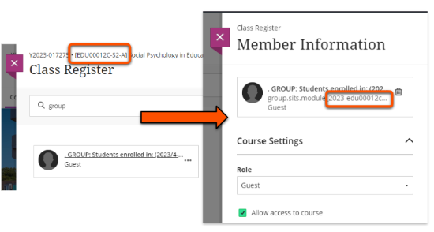

For help with student enrolments, contact your departmental administration team.

!!! Success "Final step"

    When you are happy that everything is ready, [**open the site for students**](../ultra/course-access.md). Congratulations!