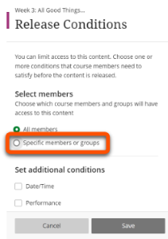
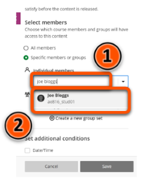
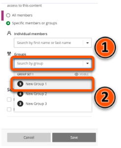
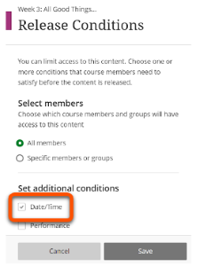
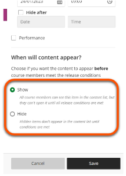
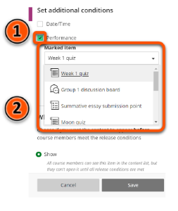
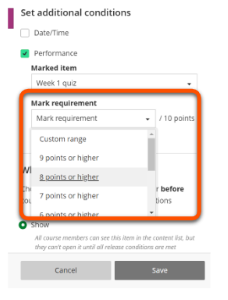

---
tags:
    - Key guide - admins
    - Ultra
---

# Release conditions

!!! Summary

    Manage whether content items are visible to or hidden from students based on certain conditions.

!!! principle "Relevant [VLE site design principles](../ultra/site-design-principles.md)"

    - 5.1 Recommended: Ensure that students can see and access module materials and content.

## Overview

Items in the Course Content area can be set to **Visible to students** or **Hidden from students**. By default, all new items are automatically hidden from students.

You can set items to be visible or hidden based on certain conditions:

- for specifc students or groups
- on a specific date/time
- based on performance on a marked item

This was previous called **conditional availability**.

To show or hide items without conditions, see our [Content visibility guide](../ultra/content-visibility.md).

##  Release to specific ustudents users or groups

1. Click the current visibility status (e.g. Visible to students) of the content item to open the drop-down options and select **Release conditions**.
   
2. Under **Select members**, click **Specific members or groups**.
  
3. Specific student(s): click **Individual members**, type the name of the student, then click the student's name.
  
4. Specific Group(s): click **Groups** then and select the desired group(s) from the drop down menu.
  
5. Click **Save**.

For more information on setting up groups in Ultra, see our [Course Groups guide](../ultra/course-groups.md/) guide.

## Release based on date and time

1. Click the current visibility status (e.g. Visible to students) of the content item to open the drop-down options and select **Release conditions**.
   
2. Under **Set additional conditions**, click **Date/Time**.
  
3. Set the date and time to show the content. You can hide items at a certain date or time, but this is not recommended. 
  
4. Under **When will content appear**, select whether to show (students can't open) or hide the item in the Course Content areas before the set date and time.
  
5. Click **Save**.

### Release dates and accessibility

A key accessibility requirement is that students have sufficient time to use materials to prepare for a session, particularly if they use any assistive tools. For example, a dyslexic student may need to read lecture slides in advance to help them follow the session.

To support this, make sure that module materials are available in advance - we recommend **at least one week before the session**.

## Release based on performance

Release content based on performance in another marked item. For example, lab worksheets are only released after a student passes a pre-lab safety check quiz.

1. Click the current visibility status (e.g. Visible to students) of the content item to open the drop-down options and select **Release conditions**.
   
2. Under **Set additional conditions**, click **Performance**, then select the relevant performance-based item from the **Marked item** list
  
3. Set the performance criteria from the **Mark requirement** list.
  
4. Click **Save**.

## Video demonstration

You can watch a demonstration o setting the different release conditions:
<iframe width="560" height="315" src="https://www.youtube.com/embed/D8AMqszCkms" title="Conditional availability in Ultra" frameborder="0" allow="accelerometer; autoplay; clipboard-write; encrypted-media; gyroscope; picture-in-picture" allowfullscreen></iframe>

[Release conditions [YouTube]](https://youtu.be/D8AMqszCkms)
