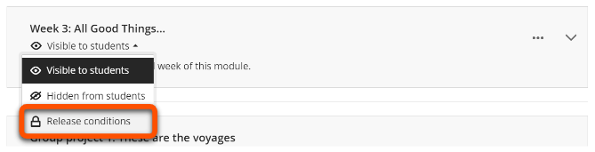
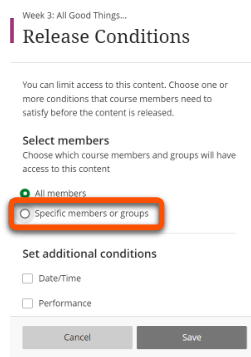
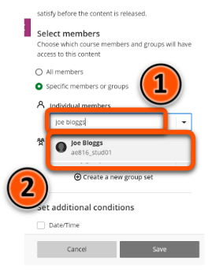
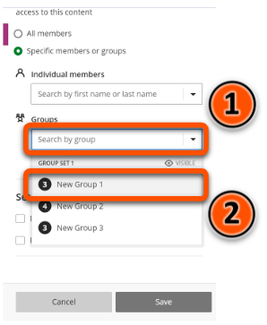
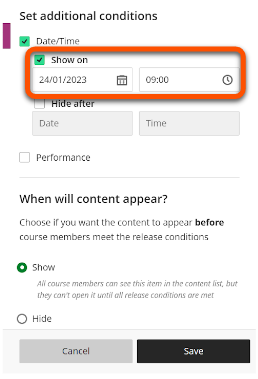
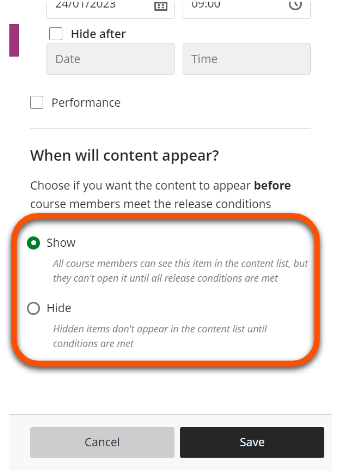
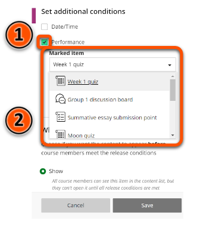
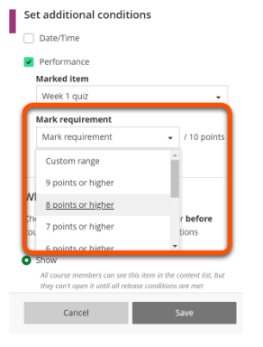

---
tags:
# Delete to leave only relevant tags
    - Advanced
    - Administration
    - Ultra
---

# Content availability - conditional availability

!!! Summary

    Items in your Ultra site can be set to become **Visible to students** or **Hidden from students** based on certain conditions; to specified students or groups, on a particular date, or according to individual student performance.

!!! principle "Relevant [VLE site design principles](https://vle-support.york.ac.uk/ultra/site-design-principles)"

    - 5.1 Recommended: Ensure that students can see and access module materials and content.

## Quick Start Guide

### Video Steps

<!-- PASTE YOUTUBE EMBED (should look like this:) -->
<iframe width="560" height="315" src="https://www.youtube.com/embed/D8AMqszCkms" title="Conditional availability in Ultra" frameborder="0" allow="accelerometer; autoplay; clipboard-write; encrypted-media; gyroscope; picture-in-picture" allowfullscreen></iframe>

Video: [Conditional availability in Ultra](https://youtu.be/D8AMqszCkms)

### Text Steps

<!-- Clear and concise: Click **Submit**, not Click on the **Submit button** -->
<!-- Use **bold** to highight key tasks and features -->

#### Specific users or groups

1. Hover over the current visibility status (e.g. **Hidden from students**) of the content item whose visibility you want to change, click the arrow, then click **Release conditions**.    
2. Under **Select members**, click **Specific members or groups**.  

3. To make the content item available to a particular student, click **Individual members**, type the name of the student, then click the student's name.  

4. To make the content item available to a particular group, click **Groups** and select the desired group from the drop down menu.  

5. Click **Save**.

#### Date and time

1. Hover over the current visibility status (e.g. **Hidden from students**) of the content item whose visibility you want to change, click the arrow, then click **Release conditions**.   
2. Under **Set additional conditions**, click **Date/Time**.   
3. To set a content item to only be visible after a certain date/time, click **Show on**, then select the date and time.   
4. If you want students to be able to see the item in the content list prior to the time defined in step 3 without being able to open it, under **When will content appear?** click **Show**. Otherwise, if you want the item to be invisible until the time defined in step 3, leave this set to **Hide**.   
5. Click **Save**.

!!! Warning

    It is best practice not to restrict content week by week. Once made available, content should always remain available.

#### Student performance

1. Hover over the current visibility status (e.g. **Hidden from students**) of the content item whose visibility you want to change, click the arrow, then click **Release conditions**.   
2. Click **Performance** under **Set additional conditions**.
3. From the **Marked item** drop down menu, select the marked item (e.g. a quiz) that will qualify a student to view this content item.   
4. Select the mark requirement from the **Mark requirement** drop down menu.   
5. Click **Save**.

!!! Warning

    It is important to check that all the correct content items are visible or hidden before students are enrolled on the course. To check, click on Student Preview in the top right corner of the page.

## More Details

To adjust item visibility without conditions please refer to the [Content visibility](https://pdlt-university-of-york.github.io/vle-help/ultra/content-visibility/) guide.

For more information on setting up groups in Ultra, please refer to the [Groups](https://vle-support.york.ac.uk/ultra/groups/) guide.

It is not possible to set up conditional availability for multiple items simultaneously.