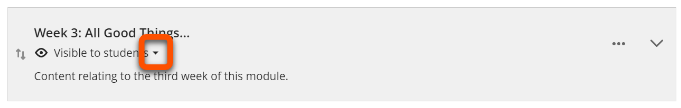

---
tags:
# Delete to leave only relevant tags
    - Advanced
    - Administration
    - Ultra
---

# Release conditions (conditional availability)

!!! Summary

    Items can be made visible based on certain conditions; to specified students or groups, on a particular date, or according to individual student performance.

!!! principle "Relevant [VLE site design principles](https://vle-support.york.ac.uk/ultra/site-design-principles)"

    - 5.1 Recommended: Ensure that students can see and access module materials and content.

## Quick Start Guide

### Video Steps

Below is an embedded video detailing how to set up conditional availability in Ultra. Alternatively, you can [open the video in a new browser tab](https://youtu.be/D8AMqszCkms).

<!-- PASTE YOUTUBE EMBED (should look like this:) -->
<iframe width="560" height="315" src="https://www.youtube.com/embed/D8AMqszCkms" title="YouTube video player" frameborder="0" allow="accelerometer; autoplay; clipboard-write; encrypted-media; gyroscope; picture-in-picture" allowfullscreen></iframe>

### Text Steps

<!-- Clear and concise: Click **Submit**, not Click on the **Submit button** -->
<!-- Use **bold** to highight key tasks and features -->

#### Conditional release for specific users or groups

1. Mouse over the current visibility status (e.g. **Hidden from students**) of the content item whose visibility you want to modify, then click the down arrow.

2. Click on **Release conditions**.

3. Under **Select members**, click the button labelled **Specific members or groups**.

4. To make the content item available to a particular student, click the box labelled **Individual members**, type name of the student, then click the student's name. 

5. To make the content item available to a particular group, click the box labelled **Groups** and select the desired group from the drop down menu.

6. Click **Save**.

#### Conditional release based on date/time

1. Mouse over the current visibility status (e.g. **Hidden from students**) of the content item whose visibility you want to modify, then click the down arrow.

2. Click on **Release conditions**.

3. Under **Set additional conditions**, click the checkbox labelled **Date/Time**.

4. To set a content item to only be visible after a certain date/time, click the checkbox labelled **Show on**, then select the date and time.

5. If you want students to be able to see the item in the content list, prior to the time defined in step 4, without being able to open it, under **When will content appear?** click the button labelled **Show**. Otherwise, if you want the item to be invisible until the time defined in step 4, leave this set to **Hide**.

6. Click **Save**.

!!! Warning

    It is best practice not to restrict content week by week. Once made available, content should always remain available.

#### Conditional release based on student performance

1. Mouse over the current visibility status (e.g. **Hidden from students**) of the content item whose visibility you want to modify, then click the down arrow.

2. Click on **Release conditions**.

3. Click the checkbox labelled **Performance** under **Set additional conditions**.
4. From the drop down menu labelled **Marked item**, select the marked item (e.g. a quiz) that will qualify a student to view this content item.

5. Select the mark requirement from the drop down menu labelled **Mark requirement**.

6. Click **Save**.

!!! Warning

    It is important to check that all the correct content items are visible or hidden before students are enrolled on the course. To check, click on Student Preview in the top right corner of the page.

## More Details and Troubleshooting 

To adjust item visibility without conditions please refer to the [Content Availability](https://pdlt-university-of-york.github.io/vle-help/ultra/content-availability/) guide.

For more information on setting up groups in Ultra, please refer to the [Groups - Setup](https://vle-support.york.ac.uk/ultra/groups-setup/) guide.

It is not possible to set up conditional availability for multiple items simultaneously.