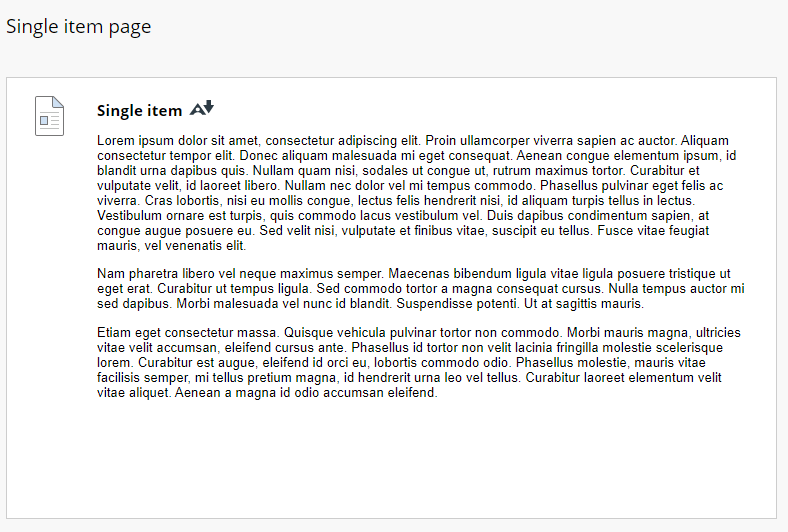
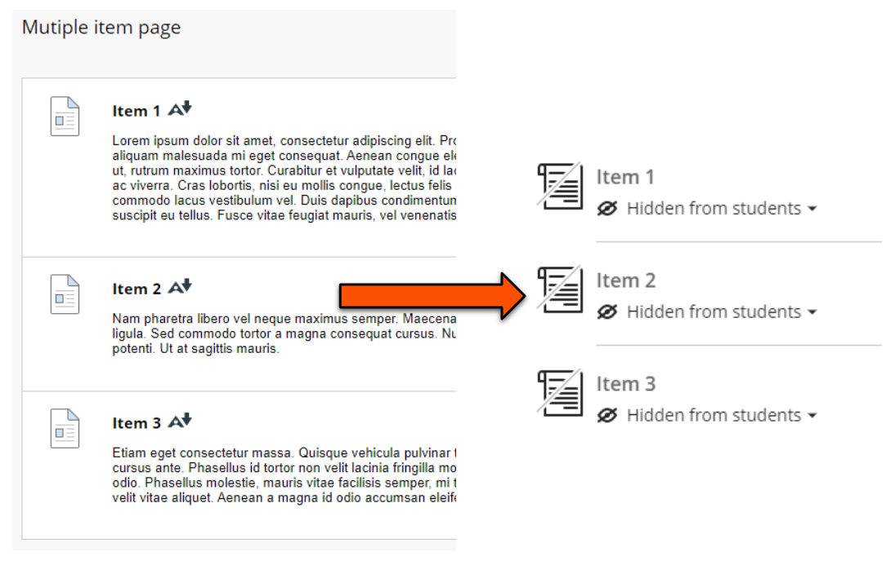

---
tags:
# Delete to leave only relevant tags
    - Foundation
    - Advanced
    - Teaching
    - Ultra
---

# Reusing content from Original sites

!!! Summary

    **Bulk copying from Original to Ultra sites is strongly not recommended**. However, with a little planning you can reuse most Original content in your new Ultra site.
    This guide explains how to prepare and select the best method to reuse your content.

## Considerations for reusing content

Some differences between Original (‘old’) and Ultra (‘new’) sites have implications for reusing content between the site types. These are summarised here; for more detail, see our [guide to key differences between Original and Ultra](https://vle-support.york.ac.uk/ultra/differences-original-ultra). 

- **Unavailable content types**: Some rarely-used Original content types aren't available in Ultra; Blogs, some Test question types (Jumbled sentence, Either/Or, File Response, Opinion Scale, Likert, Ordering, Quiz Bowl, Short Answer), Wikis, Surveys. To reuse this content, alternatives are required.
- **Nesting**: Original allowed unlimited nesting, but Ultra is restricted to two levels of nesting. To reuse nested  Orginal content, you’ll need to restructure this to fit the new Ultra structure. The new Ultra template will help you do this.
- **Content display**: Original displays simple site content like text, images, uploaded files and embedded items directly on the same page with folders and more complex content. Ultra displays this simple content in separate Document items that users must open to view the content. To reuse content, Original content may need restructuring to display appropriately in Ultra.
- **Ultra module site templates**: 23/24 sites will use new departmental Ultra module site templates based on [VLE site design principles](https://vle-support.york.ac.uk/ultra/site-design-principles/). These have a pre-built overall structure ready for staff to populate with module content. To reuse content, you should retain the overall template structure, but can adapt the structure within sections to meet your module’s needs.

## Bulk copying from Original to Ultra: NOT recommended

These considerations mean that while it is technically possible to copy content in bulk from Original to Ultra sites, it usually creates quite a mess.

Each individual content item on an Original page is copied into Ultra as separate Documents, nesting differences can spread content across the site, and you’ll also copy over any old content that isn’t needed anymore. Bulk copied content will also appear outside of the template structure.

This means copying content in bulk requires a lot of restructuring and ‘fixing’ to make the site usable, which can be extremely time-consuming and fiddly. We've tried it, it's painful.

!!! Warning

    Copying content in bulk from Original to Ultra is **very strongly NOT recommended**. Particularly, do not export/import or copy whole modules.

## How to reuse content
With a bit of planning, you can reuse most content from an Original site in an Ultra site.

1. **Prepare Original content**
     Identify the Original content to reuse and download files and images that aren't already on your computer. Make sure this content is all up to date, accessible and relevant to the 23/24 module. 
     If your Original site has more than two levels of nesting, plan how this will fit in the new Ultra site structure.
2. **Set up your Ultra site structure**
     Reusing Original content is much easier if the Ultra structure is ready. The ready-built template structure will work well for most modules, but if you need to adapt it or [add more Folders or Learning Modules](https://vle-support.york.ac.uk/ultra/folder-learning-module/) to hold content items do that at this point.
3. **Select the best method to reuse content**
     To control where content appears, work through the Ultra site section by section at the lowest level of nesting. This will mostly be within a Document, or sometimes you might add content to a container. 
     Within the Ultra section, identify the specific content from the Original site to put here. Consider the particular content type and choose the best method to reuse it; build it directly in Ultra or use the Copy Content tool. If the content type isn't available in Ultra, choose an alternative method to replicate it (see Summary table below).

!!! Tip

    Always work within the specific Ultra section where individual content items should appear. Copy only individual items; don't copy whole folders or nested content from Original.

### Build content in Ultra

For most simple site content we recommend building content directly in a Document in the relevant Ultra site location. We recognise this *sounds* like more work than using the Copy Content tool, but we've compared the methods generally find it quicker and easier to build this content directly in Ultra.

Building content directly in Ultra is particularly recommended for:

- **Original pages with a single content item**: it's likely quicker to copy/paste text than use the Copy Content tool.
 

- **Original pages with multiple content items**: each item would be copied as a separate Document which then needs restructuring (ie. copy/pasting) back into a single Document, so it's quicker to build directly.
 

- **Learning Modules**: the functionality is very different to in Original, so we recommend building the content in Ultra.
- **Discussions**: can copy strangely and are very easy to set up in Ultra, so it's generally quicker to [create a new Discussion](https://vle-support.york.ac.uk/ultra/discussions/) in the right location and copy/paste the thread starter text.

The most useful tasks for building content are:

- [creating Documents](https://vle-support.york.ac.uk/ultra/documents/) to hold site content, or edit exising placeholder Documents in the template.
- [adding text](https://vle-support.york.ac.uk/ultra/text/) by copy/pasting from Original. Headings and formatting are preserved.
- [uploading files](https://vle-support.york.ac.uk/ultra/files/) from your computer (eg. lecture slides). You can now choose where in the text the file appears, and most file formats will display directly in the Document instead of requiring download.
- [uploading images](https://vle-support.york.ac.uk/ultra/images/) from your computer. Make sure to add ALT text or mark as decorative.
- [embedding external items](https://vle-support.york.ac.uk/ultra/embedded-content/) (eg. Padlet, Xerte). Make sure to also include a direct link to open the item.

### Copy Content tool

For more complex Original content items, you can quickly reuse these with the Copy Content tool in the relevant Ultra site location. 

Using the Copy Content tool is particularly recommended for:

- **Tests**: most question types and question banks copy well.
- **Journals**: copies with the Journal prompt.
- **Rubrics**: note, no-points rubrics are not (yet) available in Ultra

After copying, check that the content is as you expected and address any issues. Copied content is also hidden from students by default, so you will need to [make this content visible](https://vle-support.york.ac.uk/ultra/content-visibility).