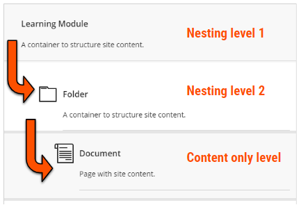
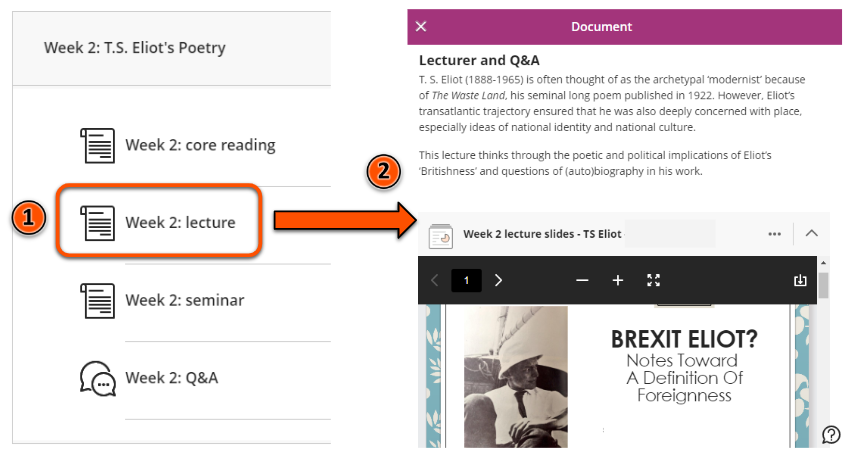

---
tags:
# Delete to leave only relevant tags
    - Foundation
    - Advanced
    - Teaching
    - Ultra
---

# Reusing content from Original sites

!!! Summary

    Bulk copying from Original to Ultra doesn't work well. However, with a little planning you can reuse most Original content in your new Ultra site.
    This guide explains how to prepare and select the best method to reuse your content.

## Considerations for reusing Original content

There are some structural differences between Original (‘old’) and Ultra (‘new’) sites that have implications for how content can be reused between the site types.

### Nesting

Original sites could contain unlimited levels of content nesting (folder within folder within folder within folder…). This often made it difficult for students to navigate sites and find the content they needed.

Ultra sites have a maximum of two levels of nesting (folder within folder), so it’s a lot easier for users to find their way around a site.

To reuse content, if your Original site used more than two levels of nesting you’ll need to restructure this to fit the new Ultra structure. The new Ultra template will help you do this.

### Displaying site content

Original pages could display site content like text, images, uploaded files and embedded items mixed together with folders and links to other items (eg. Discussions, Tests). This could get quite cluttered, again making it hard to navigate the site. 

Ultra displays site content in separate Document items. These are similar to Original pages, but only contain text, images, files, embedded items and similar site content. Documents can be organised in containers with other items, but users won’t see the actual content until they open it. This improves navigation and makes it easier to view content, particularly on a small screen or mobile device. However, it's now not possible to display contextual text on the Course Content area or directly within a container.

To reuse content, you may need adapt Original pages so that the information displays appropriately in Ultra.

### New Ultra module site templates
New departmental Ultra module site templates have a ready-built structure with sections for module information, assessment and weekly/topic materials. 23/24 sites will be a copy of this template ready for staff to populate with module content.

To reuse content, think about how your Original content fits into the Ultra template structure. Within template sections, you can adapt the structure to meet your module’s needs. However, sites should maintain the overall structure to give students a consistent experience across modules.

### Content that can't be reused

Some Original content types aren't available in Ultra or work differently. These are generally features that were not commonly used, so most content will be unaffected. 

To reuse affected content in Ultra, you will need to use an alternative method. PDLT can offer advice on this if needed.

Original content types/features that aren't available in Ultra:

- **Blog**: alternatives include Padlet (for shared and/or collaborative work) or the Ultra Journal (for private work).
- certain **Test questions**: other question types may be a good alternative
- **Wiki**: depending on the purpose of the Wiki, alternatives coudl include Padlet, Google Docs or a Google Site.

## Bulk copying from Original to Ultra: NOT recommended

These structural differences mean that while it is technically possible to copy content in bulk from Original to Ultra sites, it generally creates quite a mess.

Each individual item on an Original page is copied into Ultra as separate pages, nesting can be very disrupted, and you’ll also copy over any old content that isn’t needed anymore. Bulk copied content will also appear outside of the template structure.

This means copying content in bulk requires a lot of restructuring and ‘fixing’ to make the site usable, which can be extremely time-consuming and fiddly.

!!! Warning

    Copying content in bulk from Original to Ultra is **very strongly NOT recommended**.
    We’ve tested it out, believe us, it’s painful!

## How to reuse content
With a bit of planning, you can reuse most content from an Original site in an Ultra site.

1. **Step 1: prepare content in the Original site**
     Identify the Original content to reuse. Make sure it's all up to date, accessible and relevant to the 23/24 module. It may be helpful to download files and images that you don't already have on your computer.
     If your Original site has more than two levels of nesting, think about how to fit this in new Ultra site structure.
2. **Step 2: set up your Ultra site structure**
     Reusing Original content is much easier if the Ultra structure is ready. The ready-built template structure will work well for most modules, but if you need to adapt it or [add more Folders or Learning Modules](https://vle-support.york.ac.uk/ultra/folder-learning-module/) to hold content items do that as the first step.
3. **Step 3: use the best method to reuse content**
     You're now ready to start reusing content. To control where content appears, work through the Ultra site section by section at the lowest level of nesting. This could be within a Document, or choosing other content to add to a folder. 
     Within the Ultra section, identify the specific content from the Original site to put here. Consider the particular content type and choose the best method to reuse it; build it directly in Ultra or use the Copy Content tool (see below).
     If the content type isn't available in Ultra, choose an alternative method to replicate it.

!!! Tip

    When reusing content, always work within the specific Ultra section where individual content items should appear. Don't copy whole folders or pages with sub-items or nested content from Original.

### Build content in Ultra

For simple Original pages, it’s generally quickest and easiest to build this content directly in a Document in the relevant Ultra site location. This is particularly useful to:

- [add text](https://vle-support.york.ac.uk/ultra/text/) by copy/pasting from Original
- [upload images](https://vle-support.york.ac.uk/ultra/images/) from your computer
- [upload files](https://vle-support.york.ac.uk/ultra/files/) from your computer
- [embed items](https://vle-support.york.ac.uk/ultra/embedded-content/) (eg. Padlet, Xerte)

Building content directly avoids copying Original page content into Ultra as lots of separate Documents/items that you have to restructure (ie, still copy/paste text, just within Ultra), and gives you complete control over which content goes where. We've tested methods and found it quicker and less stressful to build these simple pages directly in Ultra rather than using the Copy Content tool.

(Add example image)

### Copy Content tool

For more complex content items, use the Copy Content tool in the relevant Ultra site location to quickly reuse content. 

The Copy Content tool is especially useful to reuse:

- Tests: most question types and question banks copy well
- Journals
- Discussions

Make sure to check after copying that the content is as you expected and address any issues. Copied content is also hidden from students by default, so you will need to [make it visible](https://vle-support.york.ac.uk/ultra/content-visibility).

(Add example image)
(link to guide for using Copy Content tool)