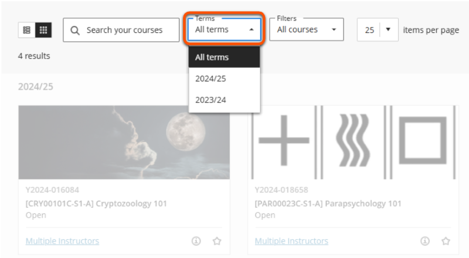

---
tags:
    - Key guide - admin
    - Ultra
---

# Rollover

!!! Summary

    Rollover is the annual process of creating new VLE sites for the next academic year.

## What is rollover?

Rollover is the annual bulk creation of VLE sites for the next academic year. This process is managed by the Digital Education Team in liaison with departmental teams and occurs on a department-by-department basis over the summer.

For each module, the new site for the next academic year can be copied from either:

- the **current year's site**: to rework existing materials for the new year in sites that apply the template well
- the **departmental template**: to reset existing module sites to the template or to create sites for new modules

## Rollover process

This is a general indication of the timeline for the rollover process. Particular dates may vary slightly each year.

1. **June/early July**: rollover data collation
    - DET send rollover data sheets to departments
    - Departments complete and return rollover data sheets to DET
2. **From early July**: DET roll module sites on a dept-by-dept basis as rollover data sheets are received.
    - New sites are available for instructors immediately and staff can begin to update content (see [Preparing new sites for teaching](#preparing-new-sites-for-teaching) below).
    - New site names are prefaced with the next academic year date to aid identification, eg. [ABC00024C-S1-A] **24/25:** Introduction to typesetting
3. **Early August** (specific date depends on the SITS data update): DET team enroll the relevant SITS group user(s) on the site.
    - Student enrolments will appear, but they cannot access the site while it is set as *Closed*
    - Staff can now [set up Course Groups](../ultra/course-groups.md) if needed.
4. **Early September**: DET remove the next academic year prefix from site names
5. **Before teaching begins**: when ready for students to access the content, module staff must make the site *Available* for students (see [Student access](#student-access) below).

## Accessing new sites

### Staff access

Relevant staff are enrolled on new sites when they are created, so the will appear in enrolled users' [Course list](../ultra/courses-list.md) immediately after rollover. To easily locate the new sites, use the **Terms** filter and select the upcoming academic year.

### Student access

Sites are created without student enrollments; these are added after the SITS data updates for the new academic year. Once enrolled, the site will appear in students' Course List but they won't be able to access it until an enrolled staff member [makes the site *Open* to students](../ultra/course-access.md).

## Preparing new sites for teaching

!!! Tip

    All new sites require checking and updating for the new academic year, whether copied from the previous year or from template.

To prepare for the next academic year, various settings need to be updated in sites copied from a previous year along with clearing out old content. In sites copied from the template, module-specific information needs to be entered into template placeholder pages and module materials added.

See our step-by-step guide to [prepare new sites for teaching](../ultra/prepare-site.md) for more details on efficiently completing these tasks.

## Purge: the anti-rollover

The complement to rollover is the Purge, where module sites older than five academic years are deleted from the VLE.

Staff will be contacted by email with more detail if one of their sites is scheduled to be deleted, along with options to retain the site if a valid reason is given.

For sites that are due to be deleted, staff may wish to download (aka “export”) a copy of their site for storage or future reference. See our guide to the [Export Course Package tool](../ultra/export-course-package.md) for details.