---
tags:
    - Key guide - admin
    - Assessment
    - Ultra
---

# Marking Rubrics

!!! Summary

    A rubric is a grid of criteria aligned to different attainment levels, used to promote consistency and streamline marking and feedback.

    This guide covers how to set up a Rubric within Ultra, and is aimed at **Administrators** and **Teaching staff**.

!!! Tip

    The built-in Ultra rubrics on this page can only be applied to [Ultra Assignments](../ultra/assignment-set-up.md). If used a rubric and the scores cannot be hidden from students.

## How Rubrics work

A Rubric is a grid used to support criterion-based marking. Using one can:

- make the marking process simpler and quicker.
- increase consistency between markers and across submissions.
- help students understand their grade and feedback better.

A rubric has three main components:

- **Criteria** (rows): the factor being marked, eg. *Critical analysis*, *Presentation structure*
- **Attainment bands** (columns): how good the work is, eg. *Excellent*, *Good*
- **Descriptors** (cells): a description of what is expected for that criterion and attainment band

The marker selects the relevant descriptor for each criteria and if needed inputs a mark, and the overall rubric score is calculated automatically.

There are various rubric types available, which differ in terms of how the mark is calculated. If the work is marked out of 100, it doesn't matter if you choose a *percentage* or *points* rubric.

=== "Percentage"

    Each attainment band awards a specific percentage value, eg:
   
    - Excellent = 100%
    - Satisfactory = 75%
    - Unsatisfactory = 50%
    - Poor = 25%

    By default the same values are used for each criteria, but you can manually adjust these if needed. This doesn't affect the criteria weighting (eg. 25% of total mark).

    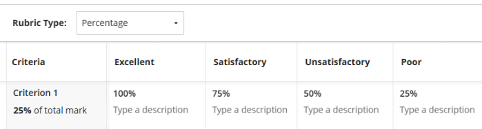

=== "Percentage range"

    Each attainment band can award a percentage value within the given range, eg:
    
    - Excellent = 75 - 100%
    - Satisfactory = 50 - 75%
    - Unsatisfactory = 25 - 50%
    - Poor = 0 - 25%

    By default the same value ranges are used for each criteria, but you can manually adjust these if needed. This doesn't affect the criteria weighting (eg. 25% of total mark).

    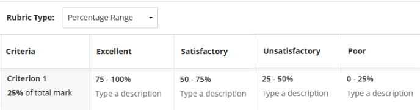

=== "Points"

    Each attainment band awards a specific points value, eg:
    
    - Excellent = 12 points
    - Satisfactory = 9 points
    - Unsatisfactory = 6 points
    - Poor = 3 points

    Points-based rubrics are weighted using the maximum points for each criterion. So to equally weight criteria, set each to have the same maximum points values. 

    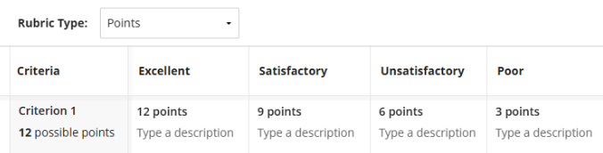

=== "Points range"

    Each attainment band can award a points value within the given range, eg:
    
    - Excellent = 10 - 12 points
    - Satisfactory = 7 - 9 points
    - Unsatisfactory = 4 - 6 points
    - Poor = 0 - 3 points

    Points-based rubrics are weighted using the maximum points for each criterion. So to equally weight criteria, set each to have the same maximum points values.

    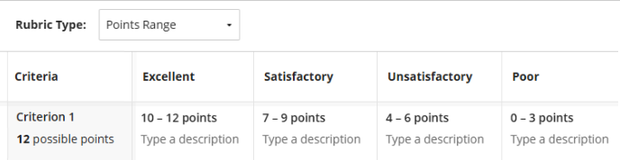

=== "No points"

    Each attainment band can be selected to provide feedback, but no points are awarded.

    - Excellent = no points
    - Satisfactory = no points
    - Unsatisfactory = no points
    - Poor = no points

    This is useful for purely formative or ungraded work, or to use the rubric only for feedback and manually enter a grade.

    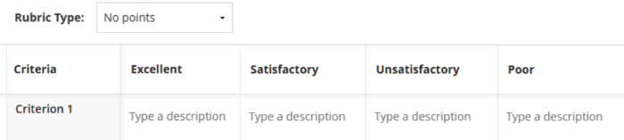

## Create and manage Rubrics

The simplest way to access rubrics is through the Gradebook.

1. In the **Gradebook**, click the **cog icon** on the right of the navigation bar to open site-wide *Gradebook Settings panel*.
 
2. Scroll down to the *Course Rubrics* section.
3. To create a new rubric:
    - click **Create** to [manually build a rubric](#build-manually)
    - click **Generate** to use the [AI Design Assistant](#generate-using-ai) as a starting point for building the rubric.
4. To manage an existing rubric:
    - to view or edit: click the **rubric name** to open it and edit content
    - to duplicate or delete: click the **three dots icon** next to the name and choose the relevant option
 

!!! Tip
    

    

    A rubric can't be edited once it has been used to mark a submission.

    To make changes for future assignments, first make a copy and edit as needed.
    

    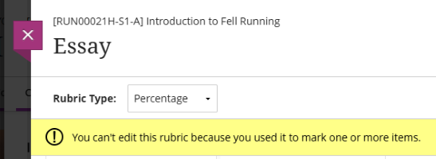
    

### Build manually

1. Click **Create** in the *Course Rubrics* menu. This is accessed through Gradebook or Assignment settings.
 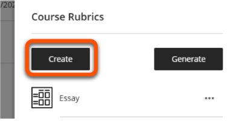
2. This opens a blank *percentage* rubric with four equally weighted criteria (rows) and four evenly stepped mark bands (columns).
3. Enter a descriptive rubric title at the top, eg. *Summative presentation*.
4. Leave the rubric type as the default *percentage* or click to select another type.
5. To add a new column or row, hover in the header where you would like it to appear and click the purple plus icon. Repeat as needed. Don't worry if the values are strange at this point.
 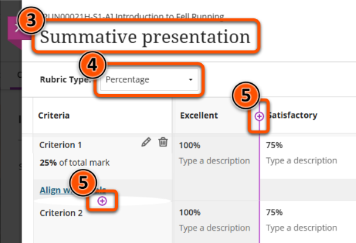
6. To edit criteria names, hover over any of the criteria row headers and click the **Pen icon**. Enter the criterion name in the box and update the criterion weighting if needed. Ignore *Align with goals*; this feature is not used at UoY.
 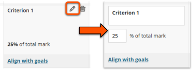
7. To edit attainment band names, hover over an attainment band column header and enter the updated name in the box.
 
8. To enter descriptors and marks available, hover over the cell and click the **Pen icon**. Enter the descriptor into the box and update the marks value(s) if needed.
 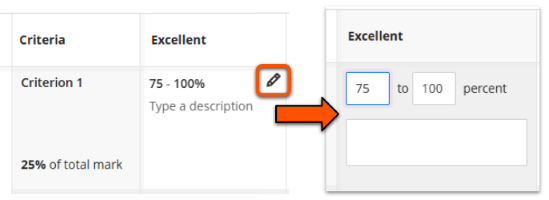
9. When the rubric is complete, click **Save**.
 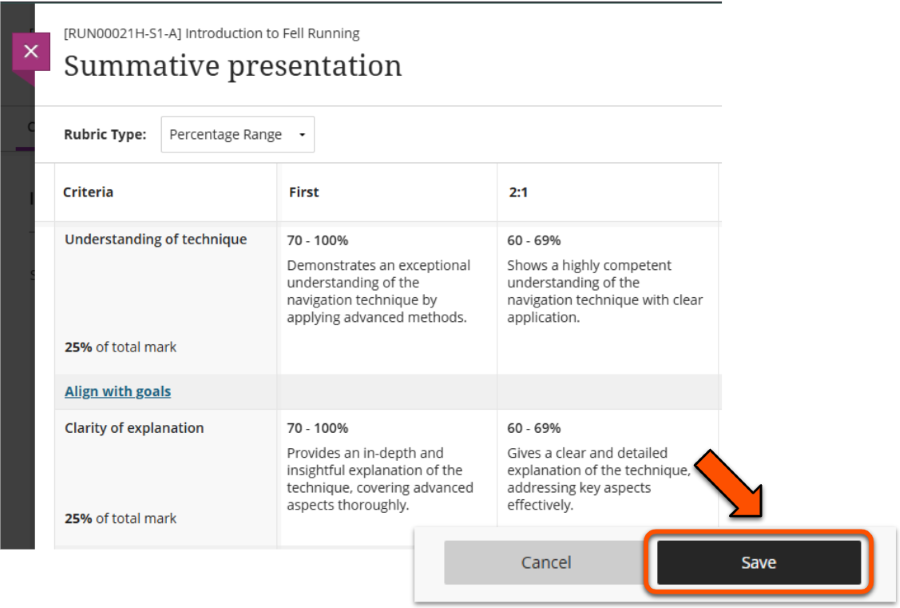

??? Abstract "Marking rubrics: example of manually built content"

    Only some of the rubric is visible on this screen, but the user can scroll to review the rest of the content.

    - Criteria: *Understanding of technique*. 25% of total mark.
        - First (70-100%): Demonstrates an exceptional understanding of the navigation technique by applying advanced methods.
        - 2:1 (60-69%): Shows a highly competent understanding of the navigation technique with clear application.
        - *other attainment levels not visible*
    - Criteria: *Quality of explanation*. 25% of total mark.
        - First (70-100%): Provides an in-depth and insightful explanation of the technique, covering advanced aspects thoroughly.
        - 2:1 (60-69%): Gives a clear and detailed explanation of the technique, addressing key aspects effectively.
        - *other attainment levels not visible*
    - *other criteria not visible*

### Generate using AI

The [AI Design Assistant](../ultra/ai-da.md) can generate a rubric as a starting point or to speed up your rubric development.

!!! ai "Using the Marking Rubric generator effectively"

    This tool is best used to generate broadly the content you need, which you can tweak manually in the rubric editor. The more detailed the description provided, the less manual editing will be needed.

1. Click **Generate** in the *Course Rubrics* menu. This is accessed through Gradebook or Assignment settings.
 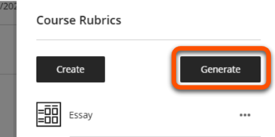
2. Define the rubric:
    - Enter a suitable **Description**, eg. which assessment type and the criteria to include. You can't select course items for this feature.
    - Select a suitable **Rubric type** (usually *Percentage range* is most appropriate)
    - Set the **Complexity** level and adjust the number of **Columns** and **Rows** as needed (default is 4x4).
3. Click **Generate**.
4. Review the generated rubric content. If needed, repeat steps 4-7 to refine the output.
5. Click **Continue**.
6. Check and manually edit content or settings as necessary (eg. rubric title, criteria weighting, attainment level labels and cutoffs, descriptor wording) and click **Save**.

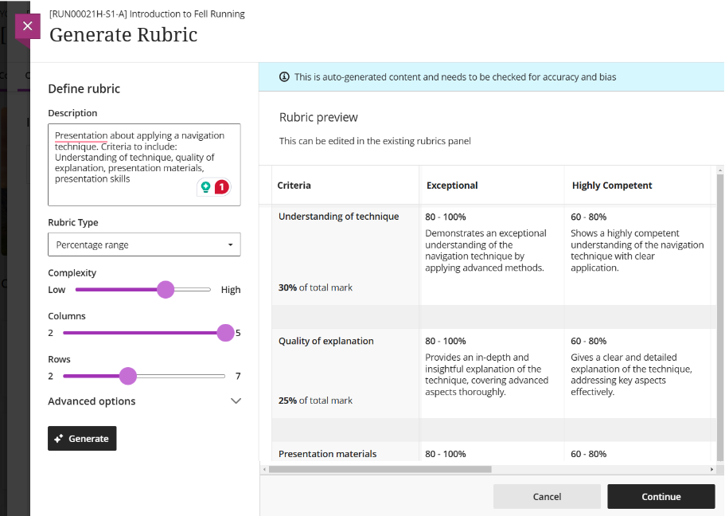

??? Abstract "Marking rubrics: interface and examples of AI generated content"

    **Description**: Presentation about applying a navigation technique. Criteria to include: Understanding of technique, quality of explanation, presentation materials, presentation skills

    **Rubric type**: Percentage range

    **Complexity**: level 7/10

    **Columns**: 5 (possible range: 2-5)

    **Rows**: 4 (possible range: 2-7)

    **Content generated:**

    Only some of the rubric is visible on this screen, but the user can scroll to review the rest of the content.

    - Criteria: *Understanding of technique*. 30% of total mark.
        - Exceptional (80-100%): Demonstrates an exceptional understanding of the navigation technique by applying advanced methods.
        - Highly Competent (60-80%): Shows a highly competent understanding of the navigation technique with clear application.
        - *other levels not visible*
    - Criteria: *Quality of explanation*. 25% of total mark.
        - Exceptional (80-100%): Provides an in-depth and insightful explanation of the technique, covering advanced aspects thoroughly.
        - Highly Competent (60-80%): Gives a clear and detailed explanation of the technique, addressing key aspects effectively.
        - *other levels not visible*
    - Criteria: *Presentation materials*. % of total mark not visible
        - Exceptional (80-100%): *description not visible*
        - Highly Competent (60-80%): *description not visible*
        - *other levels not visible*

You can also combine the AI-DA rubric generator with an iterative GenAI tool such as [Google Gemini](https://www.york.ac.uk/it-services/tools/google-gemini/) to further streamline rubric development. For example, in this webinar exert, guest speaker Anne-Gaelle Colom from the University of Westminster describes how she combined the rubric generator and ChatGPT to efficiently produce a bespoke rubric for a specialised assessment task.

<iframe src="https://york.cloud.panopto.eu/Panopto/Pages/Embed.aspx?id=c8188a53-8557-46b8-9072-b22501139f90&autoplay=false&offerviewer=true&showtitle=true&showbrand=true&captions=false&interactivity=all" height="405" width="720" style="border: 1px solid #464646;" allowfullscreen allow="autoplay" aria-label="Panopto Embedded Video Player" aria-description="Webinar: The Bb AI Design Assistant - ChatCPT &amp; Marking Rubric generator, Anne-Gaelle Colom" ></iframe>
[Webinar extract: Streamlining rubric creation with AI, Anne-Gaelle Colom](https://york.cloud.panopto.eu/Panopto/Pages/Viewer.aspx?id=c8188a53-8557-46b8-9072-b22501139f90) (11 mins 12 secs, UoY log-in required)

## Add to an Ultra Assignment

1. Open the **Assignment** then click the **Settings (cog) icon** in the top right. If you accessed the Assignment from the Gradebook, select the *Content and Settings* tab to see the icon.
2. In the Assignment Settings menu, scroll down to the **Additional Tools** section and click **Add marking rubric**.
 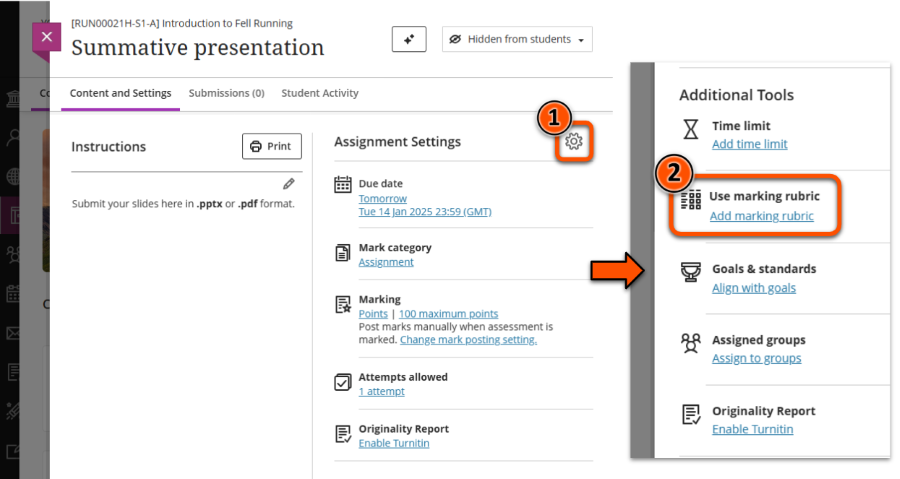
3. The *Course Rubrics* menu lists the rubrics already associated with the site.
    - to use an existing rubric: click **Add** next to its name.
    - click **Create** to manually create a new rubric.
    - click **Generate** to use AI to build a rubric.
 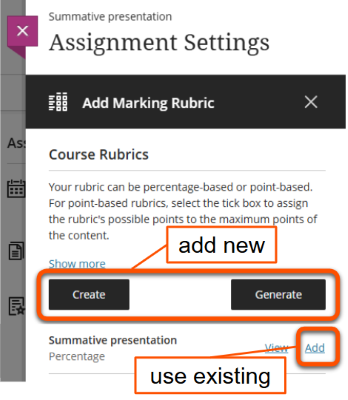
4. The Additional Tools settings section will show the selected rubric name. To remove a rubric, hover over it and click the **dustbin icon**.
 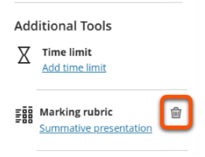
5. Click **Save**.

Students can view the rubric with the Assignment instructions before submission.

## Mark using a Rubric

This section only covers the specific details of marking with a rubric. See our [guide to marking Ultra Assignments](../ultra/assignment-marking.md) for more general advice, such as how to open submissions.

1. Open a submission and make sure that the feedback panel on the right is open to show the Marking Rubric.
2. There are some display options while marking:
    - pop out the rubric to view as a grid in a new panel (not available on small screens)
    - show or hide the descriptor for each attainment level
    - expand or collapse a criterion's attainment levels
 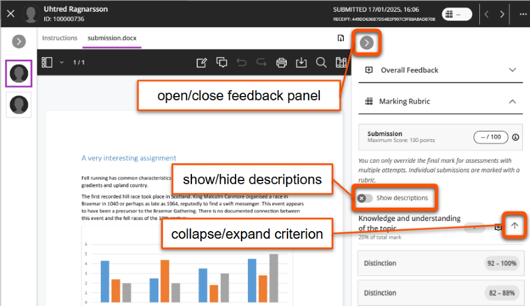
3. Select the appropriate attainment level for each criterion. For a percentage or points range, also enter the specific mark within the range.
4. For points or percentage rubric types, as you enter raw marks, these are converted to a weighted criterion mark and added to the calculated rubric mark for the submission.
 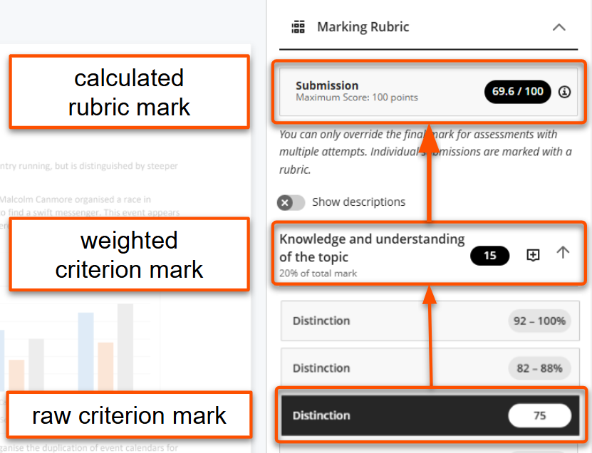
5. For no points rubrics, add the final grade manually in the mark pill in the top right.
 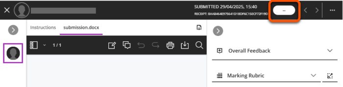
6. You can also add written feedback:

    - *Criterion-specific feedback*: click the **speech bubble icon** next to the criterion title. Note: It is not possible to open this feedback box if you have overridden the rubric mark.
     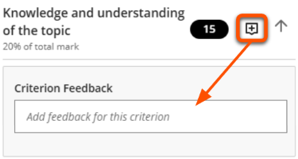
    - *Overall feedback*: open the Overall Feedback section above the marking rubric.
     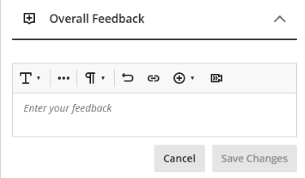
    - *Group assignments*: You can give separate feedback to the whole group and individual students in the Overall Feedback section. Criterion-specific feedback is shown to the whole group.

Once marks are posted, students can see all the rubric information within the submission:

- the overall rubric mark and criterion marks (not for no-points rubrics)
- the final mark (if mark is manually entered or a mark schema used)
- relevant criterion descriptors
- any additional feedback given

### Using a Rubric with a Mark Schema 

A mark schema converts a raw numeric score within a range to a single mapped mark. You could use this with a rubric to automatically apply stepped marking, or to convert a numerical score to a qualitative label (eg. Excellent, Good etc.). 

The marking schema is automatically applied to the original rubric mark or a manually overridden mark. Note that **students can always see the original rubric score** if they open the submission. 

For more information, see our [guide to Mark Schemas](../ultra/mark-schema.md).

### Manually override rubric mark

You can also manually override numeric rubric marks, for example to round the final score or manually apply a stepped mark. Note that **students can always see the original rubric score** if they open the submission.

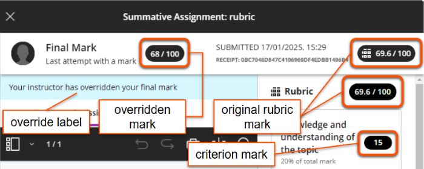

There are different methods to override rubric marks, with slightly different visibility:

=== "Marking interface"

    **Override visibility**
    
    - Staff: mark **not** labelled as an override in the Gradebook Grid View, but **is labelled** within the submission
    - Students: mark **labelled** as an override within the submission
    - All: original rubric mark and criterion marks are always visible within the submission

    ---

    This method is useful if the override is applied while marking the submission.

    

    

    If the submission point allows multiple attempts (which is our recommended setting), you must override the overall mark, not the individual attempt.
    
    This is based on the assignment settings, so it isn't affected by how many attempts the student actually made.
    

    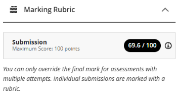
    

    1. Click the three dots in the top right of the marking interface and select **Override final mark**.
     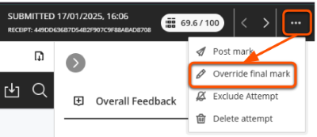
    2. In the *OVERRIDE* mark pill that appears, delete the rubric mark and enter the new mark.
     
    3. If you need to remove the override, click the three dots again and select **Remove Override**. Deleting the mark just in the override mark pill will still show as an Override.
     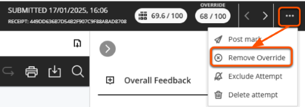

=== "Gradebook Grid View"

    **Override visibility**
    
    - Staff: mark **not** labelled as an override in the Gradebook Grid View, but **is labelled** within the submission
    - Students: mark **labelled** as an override within the submission
    - All: original rubric mark and criterion marks are always visible within the submission

    ---

    This method is useful when the work has already been marked using the rubric and is being adjusted afterwards.

    1. Open the **Gradebook Grid View**. This is the default view, but can be selected specifically using the **Grid View icon** (small squares in a 2x2 block).
    2. Hover at the bottom on the relevant assessment column's header cell. Click on the **purple pen icon** that appears and make changes as needed in the student cells. When you are finished, click the **purple tick icon** to save the edits.
    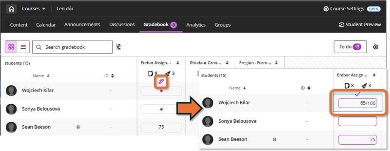
    3. If you need to remove the override, manually re-enter the original rubric mark. This can be seen within the submission if needed.

=== "Assignment Submissions tab"

    **Override visibility**
    
    - Staff: mark **not** labelled as an override within the submission or the Gradebook
    - Students: mark **not** labelled as an override within the submission
    - All: original rubric mark and criterion marks are always visible within the submission

    ---

    This method is useful when the work has already been marked using the rubric and is being adjusted afterwards.

    1. Open the Assignment and select the Submissions tab. This shows a list of students and marks.
    2. Click the mark pill for the relevant student. Delete the mark shown and enter the new mark.
     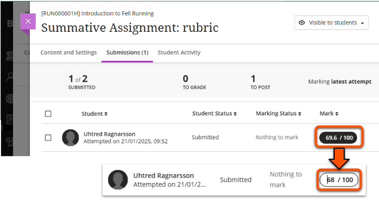
    3. If you need to remove the override, manually re-enter the original rubric mark. This can be seen within the submission if needed.