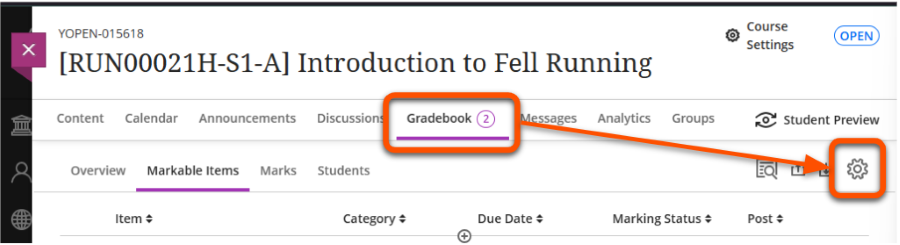
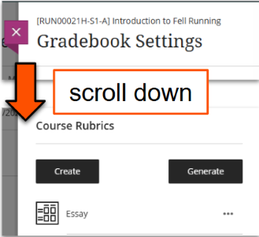
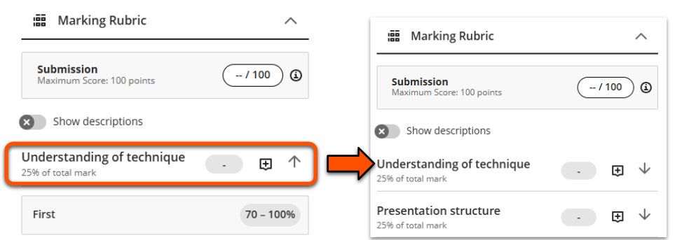
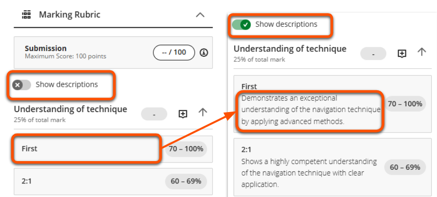
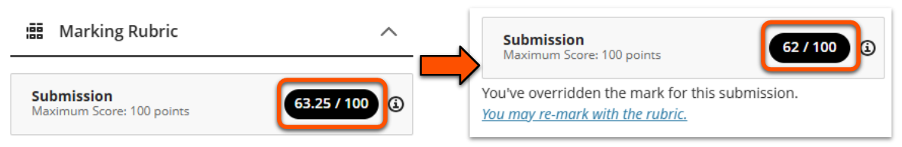
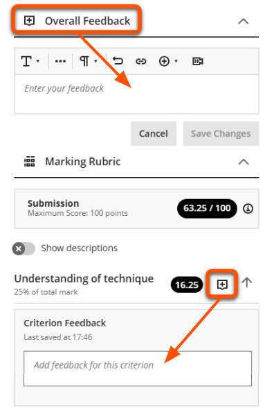

---
tags:
    - Key guide - admin
    - Assessment
    - Ultra
---

# Marking Rubrics

!!! Summary

    A rubric is a grid of criteria aligned to different attainment levels, used to promote consistency and streamline marking and feedback.

    This guide covers how to set up a Rubric within Ultra, and is aimed at **Administrators** and **Teaching staff**.

This guide is under construction. For general information, see [Blackboard Help's guide to Rubrics](https://help.blackboard.com/Learn/Instructor/Ultra/Grade/Rubrics).

- View, edit (if not yet used for marking), duplicate or delete all marking rubrics associated with the site.
- Option to create a new rubric or generate one with AI to later deploy in an assessment.
- Only applies to in-built Ultra assessment types (ie. not TurnItIn or Gradescope).
- Find out more on our [guide to Marking Rubrics](../ultra/rubric.md)

## When to use a rubric

!!! Tip

    The built-in rubrics on this page can only be applied to [Ultra Assignments](../ultra/assignment-set-up.md). They cannot be applied to Turnitin Feedback Studio or Gradescope assessments BUT OTHER ONES CAN?.

Using a rubric to mark assignments can:

- make the marking process simpler and quicker.
- support consistency between markers and across submissions.
- help students understand their grade and feedback better.

## How Rubrics work

A Rubric is a grid used to support criterion-based marking. They have three main components:

- **Criteria** (rows): the factor being marked, eg. *Critical analysis*, *Presentation structure*
- **Attainment band** (columns): how good the work is, eg. *Excellent*, *Good*
- **Descriptor** (cells): a description of what is expected for that criterion and attainment band

The marker selects the relevant descriptor for each criteria and if needed inputs a mark, and the final score is calculated automatically.

There are various rubric types available. These differ in terms of how the mark is calculated.

=== "Percentage"

    Each attainment band awards a specific percentage value, eg:
   
    - Excellent = 100%
    - Satisfactory = 75%
    - Unsatisfactory = 50%
    - Poor = 25%

    By default the same values are used for each criteria, but you can manually adjust these if needed. This doesn't affect the criteria weighting (eg. 25% of total mark).

    

=== "Percentage range"

    Each attainment band can award a percentage value within the given range, eg:
    
    - Excellent = 75 - 100%
    - Satisfactory = 50 - 75%
    - Unsatisfactory = 25 - 50%
    - Poor = 0 - 25%

    By default the same value ranges are used for each criteria, but you can manually adjust these if needed. This doesn't affect the criteria weighting (eg. 25% of total mark).

    

=== "Points"

    Each attainment band awards a specific points value, eg:
    
    - Excellent = 12 points
    - Satisfactory = 9 points
    - Unsatisfactory = 6 points
    - Poor = 3 points

    Points-based rubrics are weighted using the maximum points for each criterion. So to equally weight criteria, set each to have the same maximum points values. 

    

=== "Points range"

    Each attainment band can award a points value within the given range, eg:
    
    - Excellent = 10 - 12 points
    - Satisfactory = 7 - 9 points
    - Unsatisfactory = 4 - 6 points
    - Poor = 0 - 3 points

    Points-based rubrics are weighted using the maximum points for each criterion. So to equally weight criteria, set each to have the same maximum points values

    

If the work is marked out of 100, it doesn't matter if you choose *percentage* or *points* rubric.

## Create and manage Rubrics

The simplest way to access rubrics is through the Gradebook.

1. Open the **Gradebook** then click the **Settings (cog) icon** in the top right.
 
2. In the Gradebook Settings menu, scroll down to the *Course Rubrics* section. Here you can add new rubrics and manage existing ones.
 
3. To create a new rubric:
    - click **Create** to [manually build a rubric](#build-a-rubric-manually)
    - click **Generate** to use the [AI Design Assistant](#generate-a-rubric-using-ai) as a starting point for building the rubric.
4. To manage an existing rubric:
    - to view or edit: click the **rubric name** to open it and edit content
    - to duplicate or delete: click the **three dots icon** next to the name and choose the relevant option

!!! Tip
    

    

    You can't edit a rubric once it has been used to mark a submission.

    To make changes for future assignments, first make a copy and edit as needed.
    

    
    

### Build manually

1. Click **Create** in the *Course Rubrics* menu. This is accessed through Gradebook or Assignment settings
 
2. This opens a blank *percentage* rubric with four equally weighted criteria (rows) and four evenly stepped mark bands (columns).
3. Enter a descriptive rubric title at the top, eg. *Summative presentation*
4. Leave the rubric type as the default *percentage* or click to select another type.
5. To add a new column or row, hover in the header where you would like it to appear and click the purple plus icon. Repeat as needed. Don't worry if the values are strange at this point.
 
6. To edit criteria names, hover over any of the criteria row headers and click the **Pen icon**. Enter the criterion name in the box and update the criterion weighting if needed. Ignore *Align with goals*; this feature is not used at UoY.
 
7. To edit attainment band names, hover over an attainment band column header and enter the updated name in the box.
 
8. To enter descriptors and marks available, hover over the cell and click the **Pen icon**. Enter the descriptor into the box and update the marks value(s) if needed.
 
9. When the rubric is complete, click **Save**.
 

??? Abstract "Marking rubrics: example of manually built content"

    Only some of the rubric is visible on this screen, but the user can scroll to review the rest of the content.

    - Criteria: *Understanding of technique*. 25% of total mark.
        - First (70-100%): Demonstrates an exceptional understanding of the navigation technique by applying advanced methods.
        - 2:1 (60-69%): Shows a highly competent understanding of the navigation technique with clear application.
        - *other attainment levels not visible*
    - Criteria: *Quality of explanation*. 25% of total mark.
        - First (70-100%): Provides an in-depth and insightful explanation of the technique, covering advanced aspects thoroughly.
        - 2:1 (60-69%): Gives a clear and detailed explanation of the technique, addressing key aspects effectively.
        - *other attainment levels not visible*
    - *other criteria not visible*

### Generate using AI

The [AI Design Assistant](../ultra/ai-da.md) can generate a rubric as a starting point or to speed up your rubric development.

!!! ai "Using the Marking Rubric generator effectively"

    This tool is best used to generate broadly the content you need, which you can tweak manually in the rubric editor. The more detailed the description provided, the less manual editing will be needed.

1. Click **Generate** in the *Course Rubrics* menu. This is accessed through Gradebook or Assignment settings.
 
2. Define the rubric:
    - Enter a suitable **Description**, eg. which assessment type and the criteria to include. You can't select course items for this feature.
    - Select a suitable **Rubric type** (usually *Percentage range* is most appropriate)
    - Set the **Complexity** level and adjust the number of **Columns** and **Rows** as needed (default is 4x4).
3. Click **Generate**.
4. Review the generated rubric content. If needed, repeat steps 4-7 to refine the output.
5. Click **Continue**.
6. Check and manually edit content or settings as necessary (eg. rubric title, criteria weighting, attainment level labels and cutoffs, descriptor wording) and click **Save**.

??? Abstract "Marking rubrics: interface and examples of AI generated content"

    **Description**: Presentation about applying a navigation technique. Criteria to include: Understanding of technique, quality of explanation, presentation materials, presentation skills

    **Rubric type**: Percentage range

    **Complexity**: level 7/10

    **Columns**: 5 (possible range: 2-5)

    **Rows**: 4 (possible range: 2-7)

    **Content generated:**

    Only some of the rubric is visible on this screen, but the user can scroll to review the rest of the content.

    - Criteria: *Understanding of technique*. 30% of total mark.
        - Exceptional (80-100%): Demonstrates an exceptional understanding of the navigation technique by applying advanced methods.
        - Highly Competent (60-80%): Shows a highly competent understanding of the navigation technique with clear application.
        - *other levels not visible*
    - Criteria: *Quality of explanation*. 25% of total mark.
        - Exceptional (80-100%): Provides an in-depth and insightful explanation of the technique, covering advanced aspects thoroughly.
        - Highly Competent (60-80%): Gives a clear and detailed explanation of the technique, addressing key aspects effectively.
        - *other levels not visible*
    - Criteria: *Presentation materials*. % of total mark not visible
        - Exceptional (80-100%): *description not visible*
        - Highly Competent (60-80%): *description not visible*
        - *other levels not visible*

You can also combine the AI-DA rubric generator with an iterative GenAI tool such as [Google Gemini](https://www.york.ac.uk/it-services/tools/google-gemini/) to further streamline rubric development. For example, in this webinar exert, guest speaker Anne-Gaelle Colom from the University of Westminster describes how she combined the rubric generator and ChatGPT to efficiently produce a bespoke rubric for a specialised assessment task.

<iframe src="https://york.cloud.panopto.eu/Panopto/Pages/Embed.aspx?id=c8188a53-8557-46b8-9072-b22501139f90&autoplay=false&offerviewer=true&showtitle=true&showbrand=true&captions=false&interactivity=all" height="405" width="720" style="border: 1px solid #464646;" allowfullscreen allow="autoplay" aria-label="Panopto Embedded Video Player" aria-description="Webinar: The Bb AI Design Assistant - ChatCPT &amp; Marking Rubric generator, Anne-Gaelle Colom" ></iframe>
[Webinar extract: Streamlining rubric creation with AI, Anne-Gaelle Colom](https://york.cloud.panopto.eu/Panopto/Pages/Viewer.aspx?id=c8188a53-8557-46b8-9072-b22501139f90) (11 mins 12 secs, UoY log-in required)

## Associate a Rubric with an Ultra Assignment

1. Open the **Assignment** then click the **Settings (cog) icon** in the top right. If you accessed the Assignment from the Gradebook, select the *Content and Settings* tab to see the icon.
2. In the Assignment Settings menu, scroll down to the **Additional Tools** section and click **Add marking rubric**.
 
3. The *Course Rubrics* menu lists the rubrics already associated with the site.
    - to use an existing rubric: click **Add** next to its name.
    - click **Create** to manually create a new rubric.
    - click **Generate** to use AI to build a rubric.
 
4. The Additional Tools settings section will show the selected rubric name. To remove a rubric, hover over it and click the **dustbin icon**.
 
5. Click **Save**.

## Mark using a Rubric

This section only covers the specific details of marking with a rubric. See our [guide to marking Ultra Assignments](../ultra/assignment-marking.md) for more general advice, such as how to open submissions.

1. Open a submission and make sure that the feedback panel on the right is open to show the Marking Rubric.
2. There are some display options while marking:
    - Each criterion is expanded by default. Click the criterion title to collapse or expand.
     
    - The **Show descriptions toggle** shows or hides the descriptor for each attainment level.
     
3. To mark the work, select the appropriate attainment level for each criterion. If your rubric uses a percentage or points range, also enter the specific mark in the mark pill.
 Each criterion mark is displayed along with the calculated total submission score. Percentage criterion marks are  converted to the weighted mark.
 
4. You can override the overall mark by typing in the Submission mark pill (eg. converting for stepped marking), but note that students can still see the original rubric score within the submission.
 
5. 

    

    You can also add written feedback.

    - *Criterion-specific feedback*: 
     Click the **speech bubble icon** next to the criterion title. 
     Note: It is not possible to open this feedback box if you have overriden the rubric mark.
    - *Overall feedback*:
     Open the Overall Feedback section above the marking rubric.
    

    

### Using a Rubric with a Mark Schema

## How students view rubric & scores

see the relevant descriptor
criterion score and calculated overall score
overriden/mark schema mark

