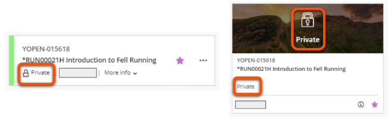
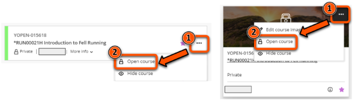
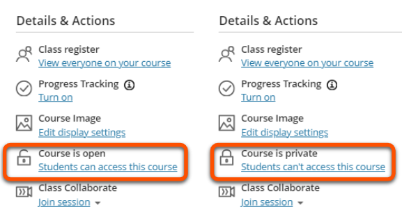

---
tags:
# Delete to leave only relevant tags
    - Key guide - teaching
    - Key guide - admin
    - Ultra
---

# Site Availability

!!! Summary
    Prevent or allow students to access your Ultra VLE sites.
 
## Quick Start Guide

You can set your site availabilty to control student access:

- **Private**: students can see the site in their Course list, but can't enter it.
- **Open**: students can see and enter the site.

!!! Warning

    Sites are not automatically made available each semester, so you must make the site 'Open' when it is ready for students.

You can view and change availability status in two locations:

### View & change site availability: Course list

In the Course list entry, site availability is shown under the site name as Open or Private.

For private sites, a padlock icon is also shown next to the status (List view) or over the thumbnail image(Grid view).

To change availability status:

1. Click the **three dots icon** (in Grid view, hover over the course to show the icon)
2. Click **Open course** or **Complete or Make course private** as required.
3. Confirm in the pop-up.

### View & change site availability: within a site

Within an Ultra site, site availability is shown in the "Details & Actions" pane on the left of the screen as either:

- **Course is open** with open padlock icon and "Students can access this course"
- **Course is private** with closed padlock icon and "Students can't access this course".

To change availability status:

1. Click the **Students can/can't access this course link**.
2. Confirm in the pop-up.

## More Details and Troubleshooting 

### Who can access private sites?
Users with the following roles can access private VLE sites:

- Instructors
- Markers (aka Graders)
- Course Builders
- Teaching Assistants
 
### What do students see?
Private sites appear on an students' Course list, but they are labelled as "Private" and cannot be entered.

This means that students will see their upcoming sites as soon as they’re enrolled, but can't enter them until they are changed to "Open".

### Are students notified when a site is made available?
If students have chosen to recieve Ultra notifications, they will receive a message in their Activity Stream and also by email when a site is made available.

However, note that students can:

- opt out of receiving Ultra notifications
- choose to receive immediate emails or a daily digest (sent around 09:15)

### What is "Make site complete"?
When changing status from Open, you are given the option to "Complete or Make course private". Marking a course as Complete means that students can enter the course and view resources, but can't make contributions (to Discussions, submission points etc.). This is not a feature that we use at UoY, so you do not have to set this status after the semester end.

