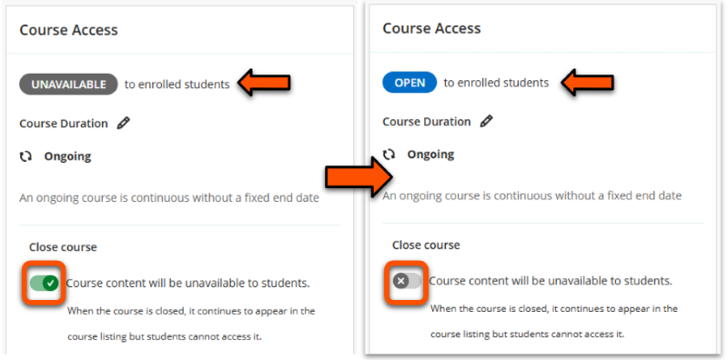

---
tags:
    - Key guide - teaching
    - Key guide - admin
    - Ultra
---

# Site Availability (Course Access)

!!! Summary

    Control Student access to your Ultra VLE sites.
 
Set the site availability to control student access:

- **Closed**: students can see the site in their Course list, but can't enter it. Instructors,
Course Builders and Teaching Assistants can access the site.
- **Open**: students can see and enter the site.

!!! Warning

    Sites are not automatically made available each semester, so you must make the site *Open* when it is ready for students.

## View & change site availability

!!! Tip

    If you don't see changes to availability in your site immediately, refresh your browser to update the display.

You can view and change availability status in two locations:

### Course list

In the Course list entry, site availability is shown under the site name as *Open* or *Closed*.

For Closed sites, a padlock icon is also shown next to the status (List view) or over the thumbnail image (Grid view).

To change availability status:

1. Click the **three dots icon** (in Grid view, hover over the course to show the icon)
2. Click **Course Settings**.
 
3. In the *Course Access* section, toggle the **Close Course** setting off (to open the site) or on (to close the site).
4. Check the site status at the top of the section shows *Unavailable* (ie. closed) or *Open* as expected.
 
5. **Close the page**, the changes will save automatically.

### Within a site

Within an Ultra site, site availability used to be shown in the "Details & Actions" pane on the right of the screen as either, but this has changed in January 2025. Whether your site is Open or Closed is displayed in the top right hand corner of your site.

1. Enter your VLE site
2. Click **Course Settings** in the top right hand corner of your screen
3. Change the **Close Course** toggle to off (it will go from green with a tick when closed, to grey with a cross when open)
3. **Close the page**, the changes will save automatically.

 
## What do students see?
Closed sites appear on an students' Course list, but they are labelled as "Closed" and cannot be entered.

This means that students will see their upcoming sites as soon as they’re enrolled, but can't enter them until they are changed to "Open".

Depending on their notification settings, students may receive a message in their Activity Stream and also by email when a site is made available.

## Other similar-sounding settings

### Complete the site

!!! Warning

    Do **not** mark sites as *Complete*. This causes issues for students on LoA who may need to contribute to the site later.

The Course Settings also has the option to marking your site as *Complete*. 

This means that users can enter the course and view resources, but can't make contributions (to Discussions, submission points etc.). This is **not** a feature that we use at UoY, so you do not have to set this status after the semester end.

### Hide Course in your own Courses List

Staff can hide sites from their own view of the Courses list and any search or filter results. This **does not** close the course to students; if the site is open, they will still be able to access it.

See our [Hide sites in your Courses List guide](../ultra/courses-list.md#hide-sites-from-your-own-view) for more details.