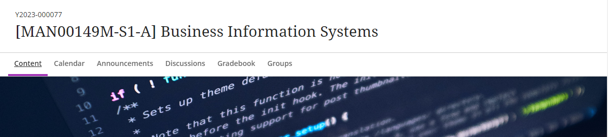

---
tags:
    - Ultra
---

# Standardised Ultra site names

!!! Summary

    Ultra VLE sites have a standardised naming format which is required for various systems to run. **Do not rename Ultra VLE sites**.

!!! principle "Relevant [VLE site design principles](../ultra/site-design-principles.md)"

    - 1.4 Essential: Site title contains the SITS code and official module name.

## Standard naming format

Ultra VLE sites have a standardised naming format which includes:

- SITS module code
- Semester and occurrence code
- Official module name (for professional programmes and other non-module sites, the site name must accurately describe the programme, course element or site purpose.)

For example, **[MAN00149M-S1-A] Business Information Systems** 

## Why a standard name is required

A standardised naming format is **required for various automated processes to function**. For example, the lecture capture system uses the standard site name format to link timetabled captures to the correct module site.

Consistency in naming format also **helps students find their module sites**, particularly where modules have similar names.

## Need to rename an Ultra site?

If you need to change an Ultra site name, please [contact us](mailto:vle-support@york.ac.uk) to discuss this. Do not change it yourself within the site as this will cause issues with linked processes.